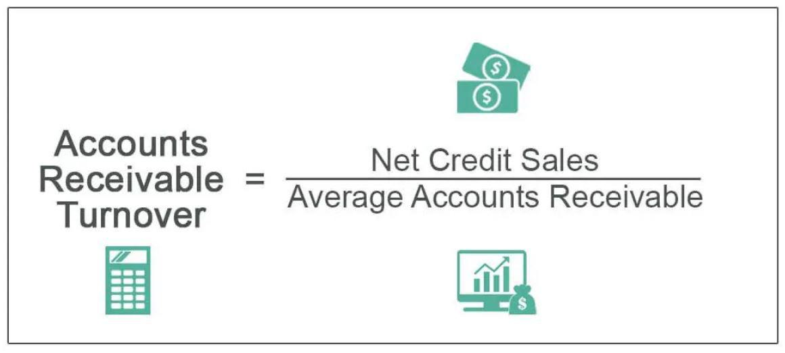

In the intricate world of finance, understanding different financial metrics, such as inventory turnover and accounts receivable turnover, is crucial. These metrics provide essential insights into a company's operational efficiency and financial health. Inventory turnover measures how frequently a company sells and replaces its inventory over a specific period. It is calculated using the formula:

$$
\text{Inventory Turnover} = \frac{\text{Cost of Goods Sold (COGS)}}{\text{Average Inventory}}
$$

A high inventory turnover ratio suggests efficient inventory management and strong sales performance, while a low ratio may indicate overstocking or slower sales.

On the other hand, the accounts receivable turnover ratio evaluates how effectively a company collects revenues from its customers on credit. It is determined by dividing net credit sales by the average accounts receivable:

$$
\text{Accounts Receivable Turnover} = \frac{\text{Net Credit Sales}}{\text{Average Accounts Receivable}}
$$

This ratio highlights the efficiency of a company's credit collection processes and cash flow management.

In the context of algorithmic trading, these financial metrics hold strategic importance. Algorithmic trading involves using algorithms to make trading decisions based on various financial inputs, including turnover ratios. These metrics aid in evaluating market liquidity and trends, which can improve the timing and execution of trades. By incorporating inventory turnover and accounts receivable turnover into algorithmic models, traders can enhance decision-making and potentially increase profitability while mitigating risks.

The interplay between these financial ratios and modern trading technologies underscores the importance of a comprehensive financial management approach. In an increasingly competitive market, sustaining advantages depends on integrating traditional financial analysis with advanced technological tools. This synthesis enables businesses to respond dynamically to market opportunities and challenges, ensuring long-term growth and competitiveness.

## Table of Contents

## Understanding Inventory Turnover

Inventory turnover is a fundamental metric used to assess a company's efficiency in managing its stock of goods. This financial ratio is determined by dividing the cost of goods sold (COGS) by the average inventory over a designated time frame. The formula is as follows:

$$
\text{Inventory Turnover} = \frac{\text{Cost of Goods Sold}}{\text{Average Inventory}}
$$

Where:

- **Cost of Goods Sold (COGS)** is the total cost of manufacturing or purchasing the products that a company has sold during a period.
- **Average Inventory** is typically calculated as the sum of the beginning and ending inventory for a period, divided by two.

A high inventory turnover ratio is indicative of efficient inventory management, suggesting that a company is effective in selling its goods and minimizing overstock situations. This efficiency can lead to lower holding costs and reduced risk of inventory obsolescence.

Conversely, a low inventory turnover ratio may signal potential issues such as overstocking, accumulating unsold products, or inefficiencies in sales operations. Such a scenario can result in increased holding costs and decreased [liquidity](/wiki/liquidity-risk-premium) as capital is tied up in unsold inventory.

Managing inventory turnover is essential for companies aiming to optimize resource allocation. Companies strive for an optimal turnover rate that reflects effective inventory management practices without jeopardizing stock availability for customer demand. An ideal ratio varies by industry; hence, businesses often benchmark their turnover against industry averages.

Overall, this metric aids in understanding a company’s operational efficiency and its ability to adapt inventory levels to meet market demands without incurring unnecessary costs.

## Significance of Accounts Receivable Turnover

Accounts receivable turnover is an important metric that evaluates how efficiently a company collects payments from its credit sales. It is quantified by dividing a firm's net credit sales by its average accounts receivable. Mathematically, this can be expressed as:

$$
\text{Accounts Receivable Turnover} = \frac{\text{Net Credit Sales}}{\text{Average Accounts Receivable}}
$$

A higher accounts receivable turnover ratio indicates that a company has effective credit collection processes and is promptly converting its receivables into cash. This efficiency in collecting debts helps enhance the company's cash flow, which is vital for sustaining everyday operations and investing in growth opportunities. 

To assess the effectiveness of a company’s receivables management, it is crucial to compare its accounts receivable turnover ratio with those of its industry peers. Such benchmarking helps ensure that the company maintains a competitive edge in its credit collection practices. A lower ratio, when compared with competitors, might indicate that the company is experiencing difficulties in collecting its receivables, potentially due to either loose credit policies or inefficient collection practices.

Efficient management of accounts receivables is essential not only for enhancing liquidity but also for minimizing bad debts. By ensuring timely collections, companies can reduce the risk associated with uncollected receivables, thereby safeguarding their revenues. Moreover, optimizing operational cash flows through effective receivable management allows businesses to allocate resources more strategically and avoid the ripple effects of cash shortfalls.

## Integration of Financial Metrics in Algo Trading

Algorithmic trading utilizes sophisticated algorithms and financial metrics, such as turnover ratios, to enhance trading decisions. These metrics, particularly inventory turnover and accounts receivable turnover, play a crucial role in recognizing liquidity and market trends, thereby refining trading strategies. 

Inventory turnover, calculated by dividing the cost of goods sold (COGS) by the average inventory during a specific period, helps traders identify how quickly inventory is being converted into sales. A high ratio indicates robust demand and efficient inventory management, which is crucial for predicting market movements and adjusting trading algorithms accordingly to maximize returns.

Similarly, accounts receivable turnover, computed by dividing net credit sales by average accounts receivable, measures the effectiveness of credit collection processes. A high accounts receivable turnover suggests efficient revenue collection from credit sales, which is pivotal for maintaining optimal cash flow and liquidity in trading strategies.

In the context of [algorithmic trading](/wiki/algorithmic-trading) models, these turnover ratios provide valuable insights that help ensure the timely execution of buy and sell orders. This capability is particularly significant in high-frequency trading ([HFT](/wiki/high-frequency-trading-strategies)), a subset of algorithmic trading. HFT often relies on substantial turnover ratios to swiftly capitalize on fleeting market opportunities, thereby optimizing performance.

The integration of these financial metrics into algorithmic trading systems can substantially enhance trading profitability. Efficient use of turnover ratios assists in quantifying market liquidity and anticipating price fluctuations, which are imperative for reducing risks associated with volatile markets. By embedding these metrics into the core of trading algorithms, traders can execute more informed and timely decisions, ultimately achieving a competitive edge in the fast-paced financial markets. 

In summary, the strategic application of inventory and accounts receivable turnover ratios within algorithmic trading frameworks boosts decision-making processes, enhances profitability, and mitigates risks, thereby underscoring their importance in contemporary financial management.

## Challenges and Implications

Despite their utility, turnover metrics such as inventory turnover and accounts receivable turnover face several challenges when applied in business and trading contexts.

High transaction costs are a significant challenge. Frequent trades, which are often necessary to maintain high turnover ratios, can accumulatively lead to substantial costs. These costs can erode profit margins, especially in environments where trading happens at a [high frequency](/wiki/high-frequency-trading). Therefore, businesses and traders need to optimize their trading strategies to balance between achieving desirable turnover ratios and minimizing transaction-related expenses.

Additionally, the interpretation of financial ratios must be carefully aligned with industry standards and seasonal variations. A company's turnover metrics can be misleading if analyzed in isolation or without considering industry-specific benchmarks. For example, industries with seasonal sales patterns, like retail, may naturally experience fluctuations in turnover ratios that do not necessarily indicate operational inefficiency. Analysts must account for these variations to extract meaningful insights and avoid misinformed decisions.

In algorithmic trading, maintaining profitability involves managing the delicate balance between achieving high turnover ratios and the associated transaction costs. Algorithmic models are designed to optimize trading outcomes, but they must be calibrated to ensure that the frequency of trades does not overshadow the profitability gained from high turnover ratios. Implementing effective algorithms that consider these factors is crucial for success in automated trading systems.

Regulatory limitations also pose challenges. Regulatory bodies impose constraints on the speed and [volume](/wiki/volume-trading-strategy) of trades, affecting how turnover metrics can be utilized in algorithmic trading. These constraints are put in place to ensure market stability and prevent practices that could lead to market manipulation or systemic risks. Businesses and traders must stay informed of regulatory changes and adapt their strategies accordingly to comply with these requirements while maximizing trading efficiency.

Addressing these challenges requires a nuanced understanding of financial metrics and strategic agility. Companies must maintain an up-to-date knowledge of industry standards, seasonal patterns, and regulatory environments. Furthermore, developing sophisticated algorithms that can dynamically adjust trading strategies in response to these variables is vital. This strategic agility includes not only adapting to immediate market or regulatory conditions but also anticipating and preparing for potential future changes.

In summary, while turnover metrics provide valuable insights into a company's efficiency and market strategy, they also present challenges that require careful management. Through strategic planning and technology-driven solutions, these challenges can be effectively addressed, allowing businesses to leverage turnover metrics to their advantage in competitive and regulated markets.

## Conclusion

Inventory turnover and accounts receivable turnover are essential metrics for evaluating a company's operational efficiency. By analyzing how swiftly inventory is converted into sales and how effectively credit sales are being collected, these ratios provide a clear picture of business performance. Their integration into algorithmic trading strategies has emerged as a significant enhancement to decision-making processes. In algorithmic trading, real-time data from these financial metrics can improve the timing and execution of trades, leading to increased profitability and risk mitigation. For example, high inventory turnover might signal strong sales performance, prompting algorithms to favor stock positions in such companies.

Businesses are encouraged to continuously analyze these turnover metrics to maintain operational efficiency and pursue sustainable growth. In a rapidly evolving financial environment, staying updated with such metrics is crucial for competitive positioning. Companies must adapt their strategies to leverage turnover data effectively, ensuring they remain agile and responsive to market changes.

An integrated approach to financial management, which includes the consistent monitoring and application of turnover ratios, is indispensable for navigating the complexities of modern finance and trading. By marrying traditional financial analysis with advanced algorithmic models, businesses can better anticipate market trends and sustain a competitive edge. This comprehensive strategy not only aids in optimizing resource allocation but also supports long-term growth objectives.

## References & Further Reading

[1]: Bergstra, J., Bardenet, R., Bengio, Y., & Kégl, B. (2011). ["Algorithms for Hyper-Parameter Optimization."](https://dl.acm.org/doi/10.5555/2986459.2986743) Advances in Neural Information Processing Systems 24.

[2]: ["Advances in Financial Machine Learning"](https://www.amazon.com/Advances-Financial-Machine-Learning-Marcos/dp/1119482089) by Marcos Lopez de Prado

[3]: ["Evidence-Based Technical Analysis: Applying the Scientific Method and Statistical Inference to Trading Signals"](https://www.amazon.com/Evidence-Based-Technical-Analysis-Scientific-Statistical/dp/0470008741) by David Aronson

[4]: ["Machine Learning for Algorithmic Trading"](https://github.com/stefan-jansen/machine-learning-for-trading) by Stefan Jansen

[5]: ["Quantitative Trading: How to Build Your Own Algorithmic Trading Business"](https://www.amazon.com/Quantitative-Trading-Build-Algorithmic-Business/dp/1119800064) by Ernest P. Chan