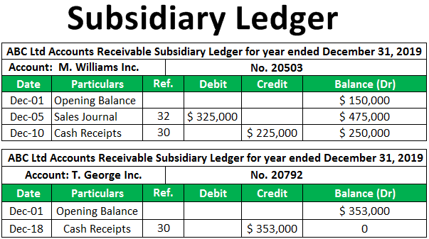

## Table of Contents

## What is an accounts receivable subsidiary ledger?

An accounts receivable subsidiary ledger is a detailed record that keeps track of what each customer owes a business. It's like a big notebook where each page is dedicated to a single customer. Every time a customer buys something on credit or makes a payment, the business writes it down in this ledger. This way, the business can easily see how much each customer owes at any time.

The subsidiary ledger is important because it helps the business manage its money better. Instead of just having one total amount for all customers in the main accounts receivable account, the subsidiary ledger breaks it down by each customer. This makes it easier to follow up on late payments and to make sure the total in the main account matches the total of all the individual customer accounts. It's a useful tool for keeping the business's financial records accurate and up to date.

## Why is an accounts receivable subsidiary ledger important for a business?

An accounts receivable subsidiary ledger is important for a business because it helps keep track of how much money each customer owes. It's like having a separate account for each customer, which makes it easy to see who owes what at any time. This is really helpful for making sure the business gets paid on time. If a customer is late with their payment, the business can quickly see this and follow up with them.

It also helps the business make sure its main accounts receivable total is correct. The total of all the amounts in the subsidiary ledger should match the total in the main accounts receivable account. This helps catch any mistakes and keeps the business's financial records accurate. By using a subsidiary ledger, the business can manage its money better and make sure it stays on top of its finances.

## How does an accounts receivable subsidiary ledger differ from the general ledger?

An accounts receivable subsidiary ledger and the general ledger are both important for keeping track of a business's money, but they do different things. The general ledger is like a big summary of all the money coming in and going out of the business. It has accounts for things like cash, sales, and accounts receivable, but it only shows the total amount for each of these accounts. For example, the accounts receivable account in the general ledger just shows the total amount of money customers owe the business, not who owes what.

On the other hand, the accounts receivable subsidiary ledger is like a detailed list that breaks down the total in the general ledger's accounts receivable account. It has a separate page or record for each customer, showing how much each one owes. This makes it easier to see who hasn't paid yet and to follow up with them. The total of all the amounts in the subsidiary ledger should match the total in the accounts receivable account in the general ledger, which helps the business make sure its records are correct.

## What types of transactions are recorded in an accounts receivable subsidiary ledger?

An accounts receivable subsidiary ledger records all the transactions that happen between a business and its customers when they buy things on credit. This means every time a customer gets something from the business but doesn't pay right away, the business writes down the sale in the customer's account in the subsidiary ledger. For example, if a customer buys a product on credit for $100, the business adds $100 to that customer's account in the ledger.

The ledger also keeps track of when customers make payments. If the same customer later pays $50 of their $100 bill, the business subtracts $50 from the customer's account in the subsidiary ledger. This way, the business can always see how much each customer still owes. These records help the business make sure it gets paid and keep its financial records up to date.

## How do you set up an accounts receivable subsidiary ledger?

Setting up an accounts receivable subsidiary ledger starts with creating a separate account for each customer who buys things on credit. You'll need a way to keep these accounts organized, like using a notebook, a spreadsheet, or accounting software. Each customer's account should have their name and contact information at the top. You'll also need columns to record the date of each transaction, a description of what was bought or paid for, the amount of the sale, the amount of any payments, and the current balance that the customer owes.

Once you have the accounts set up, you can start recording transactions. Every time a customer buys something on credit, you write down the date, what they bought, and the amount they owe in their account. When they make a payment, you record the date, note that it's a payment, and subtract the amount from their balance. It's important to keep these records up to date so you always know how much each customer owes. This helps you make sure the total of all the customer balances matches the total in your main accounts receivable account in the general ledger.

## What are the steps to record a sale in the accounts receivable subsidiary ledger?

When a customer buys something on credit, you need to write it down in their account in the accounts receivable subsidiary ledger. First, find the customer's account in the ledger. Then, write down the date of the sale. Next, write a short note about what the customer bought. After that, write down the amount of money they owe for the sale in the "amount" column. Finally, add this amount to the customer's current balance in the "balance" column. This way, you can see how much the customer owes after the sale.

For example, if a customer named Jane buys a product for $50 on credit on March 1st, you would go to Jane's account in the ledger. You would write "March 1st" for the date, "Product purchase" for the description, and "$50" in the amount column. If Jane's balance before this sale was $0, you would write "$50" in the balance column too. Now, Jane's account shows she owes $50, and you have a clear record of the sale.

## How do you handle customer payments in the accounts receivable subsidiary ledger?

When a customer pays what they owe, you need to write it down in their account in the accounts receivable subsidiary ledger. First, find the customer's account in the ledger. Then, write down the date they made the payment. Next, write a short note saying it's a payment. After that, write down the amount they paid in the "amount" column, but this time, you'll write it as a negative number or subtract it from their balance. Finally, subtract this amount from the customer's current balance in the "balance" column. This way, you can see how much the customer still owes after the payment.

For example, if a customer named John pays $30 on April 15th, you would go to John's account in the ledger. If John's balance before this payment was $100, you would write "April 15th" for the date, "Payment received" for the description, and "-$30" or "$30" as a subtraction in the amount column. Then, you would subtract $30 from John's balance, leaving a new balance of $70. Now, John's account shows he still owes $70, and you have a clear record of his payment.

## What are common errors to watch out for when managing an accounts receivable subsidiary ledger?

When managing an accounts receivable subsidiary ledger, it's easy to make mistakes if you're not careful. One common error is recording the wrong amount for a sale or payment. For example, if you accidentally write down $50 instead of $500, it can mess up how much a customer owes. Another mistake is putting a transaction in the wrong customer's account. If you write a sale or payment in John's account instead of Jane's, it will show the wrong balances for both customers.

Another thing to watch out for is not updating the ledger right away. If you wait to record sales or payments, you might forget some of them or mix up the amounts. It's also important to make sure the total of all the customer balances in the subsidiary ledger matches the total in the main accounts receivable account in the general ledger. If these numbers don't match, it could mean there's a mistake somewhere in your records. Keeping an eye out for these errors can help keep your business's financial records accurate and up to date.

## How can automation improve the management of an accounts receivable subsidiary ledger?

Automation can make managing an accounts receivable subsidiary ledger a lot easier and less likely to have mistakes. When you use software to keep track of sales and payments, it does the math for you and puts each transaction in the right customer's account automatically. This means you don't have to worry about writing down the wrong amount or putting a sale in the wrong place. It also saves time because you don't have to do everything by hand.

Another good thing about automation is that it can remind you when payments are late. The software can send out reminders to customers who haven't paid yet, which helps you get your money faster. Plus, it can check to make sure the total in the subsidiary ledger matches the total in the general ledger, which helps keep your records correct. Using automation means you can focus on other parts of your business while the software takes care of keeping track of what customers owe.

## What are the best practices for reconciling the accounts receivable subsidiary ledger with the general ledger?

Reconciling the accounts receivable subsidiary ledger with the general ledger is important to make sure your business's money records are correct. The best way to do this is to compare the total of all the customer balances in the subsidiary ledger with the total in the accounts receivable account in the general ledger. If these two numbers match, then your records are probably right. But if they don't match, you need to find out why. Start by checking each customer's account in the subsidiary ledger for any mistakes, like wrong amounts or payments that were missed. Also, make sure all the sales and payments were recorded in the right place.

Another good practice is to do the reconciliation often, like every month. This helps you catch any mistakes early and fix them before they cause bigger problems. Using accounting software can make this easier because it can do the math for you and show you where the numbers might not match. It's also a good idea to have someone else check your work to make sure you didn't miss anything. By keeping up with these practices, you can keep your business's financial records accurate and trustworthy.

## How do you analyze the data from an accounts receivable subsidiary ledger to improve business operations?

You can learn a lot from the accounts receivable subsidiary ledger to make your business better. By looking at how long it takes for customers to pay, you can see if some are taking too long. If you find that a lot of customers are slow to pay, you might need to change your payment terms or remind them more often. You can also see which customers owe the most money. This helps you focus on getting paid by the ones who owe the biggest amounts first. It's like knowing where to spend your time to get the most money back quickly.

Another way to use the ledger is to spot patterns or problems. If you see that certain customers always pay late, you might decide not to sell to them on credit anymore or ask for payment upfront. You can also check if there are times of the year when more customers don't pay on time. This could help you plan better for those times, like having more money saved up or sending out reminders earlier. By using the information in the ledger, you can make smarter choices about who to sell to and how to manage your money, which can help your business run smoother and make more profit.

## What advanced reporting techniques can be used to gain deeper insights from an accounts receivable subsidiary ledger?

You can use special reports to learn more from your accounts receivable subsidiary ledger. One good way is to make an aging report. This report shows how long customers have owed you money, like how much is overdue by 30 days, 60 days, or more. It helps you see which customers are slow to pay and if there's a pattern, like if more people don't pay on time during certain months. By looking at this, you can decide to chase late payments more quickly or change your payment terms to get paid faster.

Another useful report is a customer payment history report. This shows all the sales and payments for each customer over time. It can help you spot customers who often pay late or don't pay at all. You might decide to stop selling to them on credit or ask for payment upfront. You can also use this report to see if certain products or services lead to more late payments. By understanding these patterns, you can make better choices about who to sell to and how to manage your money, which can help your business run better and make more profit.

## References & Further Reading

[1]: Bergstra, J., Bardenet, R., Bengio, Y., & Kégl, B. (2011). ["Algorithms for Hyper-Parameter Optimization."](https://dl.acm.org/doi/10.5555/2986459.2986743) Advances in Neural Information Processing Systems 24.

[2]: ["Advances in Financial Machine Learning"](https://www.amazon.com/Advances-Financial-Machine-Learning-Marcos/dp/1119482089) by Marcos Lopez de Prado

[3]: ["Evidence-Based Technical Analysis: Applying the Scientific Method and Statistical Inference to Trading Signals"](https://www.amazon.com/Evidence-Based-Technical-Analysis-Scientific-Statistical/dp/0470008741) by David Aronson

[4]: ["Machine Learning for Algorithmic Trading"](https://github.com/stefan-jansen/machine-learning-for-trading) by Stefan Jansen

[5]: ["Quantitative Trading: How to Build Your Own Algorithmic Trading Business"](https://www.amazon.com/Quantitative-Trading-Build-Algorithmic-Business/dp/1119800064) by Ernest P. Chan