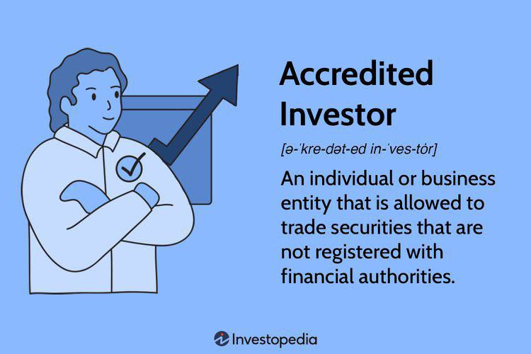

In the world of investment, accredited investors often possess unique opportunities unavailable to the general public, which can significantly enhance their portfolios' potential for growth. This article focuses on the intricacies involved in becoming an accredited investor, examining the essential investment requirements, key investor qualifications, and the role of algorithmic trading in modern financial markets.

The concept of an accredited investor holds significant importance in financial markets, as it permits individuals to invest in unregistered securities that offer potentially higher returns and exclusive opportunities not accessible to standard investors. Understanding the eligibility criteria is crucial for individuals seeking to expand their investment strategies beyond conventional markets. Accredited investors meet specific financial thresholds, allowing them to engage with investment vehicles such as private equity, hedge funds, and venture capital, traditionally reserved for this select group.



Beyond traditional investment methods, algorithmic trading can provide accredited investors with a distinct advantage. By utilizing sophisticated algorithms, investors can efficiently manage trades, improve decision-making, and minimize the emotional biases that often affect investment outcomes. Algorithmic trading, often requiring advanced technological infrastructure, equips investors with the tools to navigate complex financial instruments like options and futures, thereby optimizing their portfolios for higher returns.

This guide aims to equip prospective and current accredited investors with insights on leveraging algorithmic trading to enhance their investment portfolios. Understanding how to effectively incorporate these strategies can help accredited investors capitalize on their unique position within the investment world, navigating a landscape ripe with opportunities for substantial financial growth.

## Table of Contents

## Understanding Accredited Investor Requirements

An accredited investor is an individual or entity that meets specific financial criteria established by the United States Securities and Exchange Commission (SEC). To qualify as an accredited investor, an individual must have an income exceeding $200,000 for the last two consecutive years, or $300,000 when combined with a spouse's income, with the expectation of maintaining the same level of income in the current year. Alternatively, an individual can qualify if they possess a net worth exceeding $1 million, excluding the value of their primary residence.

These criteria are designed to identify individuals who are financially savvy and equipped to handle the inherent risks associated with investments in unregistered securities. The rationale behind these requirements rests on the assumption that individuals or entities possessing significant financial resources have greater capacity to take on complex and high-risk investments without the protection of regulatory oversight typically provided for public offerings.

Recent amendments by the SEC have broadened the definition of an accredited investor. Under the revised rules, individuals holding certain professional certifications or credentials, such as a Series 7, 65, or 82 license, can qualify as accredited investors. This change acknowledges that financial acumen and industry expertise can be as indicative of an investor's ability to assess and manage investment risks as traditional measures of income or net worth.

The adjustments to the definition of an accredited investor illustrate a move towards a more inclusive approach, recognizing that investment knowledge and professional experience can serve as significant factors in an individual's ability to invest judiciously in complex financial instruments. By expanding the pool of eligible investors, these changes potentially enhance market participation while maintaining investor protection.

## Qualifying as an Accredited Investor

To qualify as an accredited investor, individuals must meet specific financial criteria, which primarily focus on income, net worth, or appropriate financial licenses. The qualification process, stipulated by entities like the U.S. Securities and Exchange Commission (SEC), aims to ensure that individuals possess the financial sophistication required to navigate the complexities and risks associated with certain investment opportunities.

### Income and Net Worth Criteria

The primary avenue for achieving accredited investor status is through meeting income or net worth thresholds. Individuals must have an annual income exceeding $200,000 (or $300,000 when combined with a spouse) for the most recent two years, alongside the reasonable expectation of maintaining such income levels in the current year. Alternatively, a net worth exceeding $1 million, excluding the primary residence, is also acceptable. This criterion aims to certify that individuals have the financial capacity to absorb potential losses from high-risk investments.

### Financial Licenses for Qualification

In addition to financial thresholds, holding specific financial licenses can qualify individuals as accredited investors. These licenses include the Series 7 (General Securities Representative), Series 65 (Uniform Investment Adviser Law Examination), and Series 82 (Private Securities Offerings Representative). These licenses are recognized for ensuring that individuals possess the requisite understanding and expertise required in investment activities.

### Documentation and Verification Process

The process of qualifying as an accredited investor, while straightforward in principle, necessitates comprehensive documentation to substantiate one's financial status. This includes income tax returns, financial statements, or brokerage account statements to verify net worth or income. Financial institutions and investment managers play a crucial role in this context, often tasked with verifying an individual's accredited status before allowing access to certain investment products. This verification helps maintain the integrity of the financial market, ensuring that only qualified individuals engage in investments that entail significant risk.

## The Role of Algorithmic Trading

Algorithmic trading is a method that uses computer algorithms to execute trades with precision and speed unattainable by human traders. For accredited investors, this approach offers a competitive edge in the financial markets by automating trading processes according to predefined rules and strategies. This systematization reduces the influence of human emotions on trading decisions, leading to more disciplined and consistent investment outcomes.

Algorithms can process vast amounts of market data in real-time, analyzing patterns and trends to execute trades under optimal conditions. This capability is particularly beneficial for managing large investment portfolios, where timing and accuracy are critical. Algorithms can make instantaneous decisions based on criteria set by the investor, such as price, timing, quantity, or any mathematical model, ensuring the execution of a strategy with minimal delay and maximum efficiency.

For accredited investors, [algorithmic trading](/wiki/algorithmic-trading) opens up complex investment opportunities in securities like options, futures, and other derivatives. These financial instruments require precise timing and conditions for trades, which algorithms can seamlessly manage. By leveraging sophisticated mathematical models and data analysis techniques, investors can develop strategies that exploit small market inefficiencies or trends, potentially leading to significant financial gains.

Moreover, algorithmic trading facilitates high-frequency trading ([HFT](/wiki/high-frequency-trading-strategies)), a subset of algorithmic trading characterized by high turnover rates and the execution of numerous orders within seconds. While this is not a suitable strategy for all investors due to its complexity and risks, accredited investors with substantial resources and risk tolerance can access a strategy that capitalizes on minimal market movements.

Algorithmic trading also provides [backtesting](/wiki/backtesting) capabilities, allowing investors to test their trading strategies against historical data to assess potential risks and returns before deploying them in live markets. This helps in refining strategies to improve performance, reducing the potential for unexpected losses.

In summary, algorithmic trading empowers accredited investors by providing a tool to enhance the efficiency and effectiveness of their investment strategies. By automating trading decisions, investors can potentially maximize returns while minimizing risks associated with market [volatility](/wiki/volatility-trading-strategies) and emotional decision-making.

## Investment Opportunities for Accredited Investors

Accredited investors have unique access to a range of investment options that are typically unavailable to the general public. These include private equity, hedge funds, and venture capital, each offering the potential for higher returns compared to traditional investments. However, these opportunities inherently come with a greater degree of risk, necessitating thorough due diligence.

Private equity involves investing directly in private companies or buying out public companies to delist them from stock exchanges, aiming to improve their financial performance. This form of investment can yield substantial returns, often realized during the [exit](/wiki/exit-strategy) phase, when the investment is sold or the company is made public again.

Hedge funds, on the other hand, utilize diverse strategies, including leverage and derivatives, to generate high returns. These funds are known for their aggressive tactics and the ability to profit in both up and down markets, though they present a high-risk profile and demand a comprehensive understanding of their operations and strategies.

Venture capital investments provide funding to startups and small businesses with high growth potential. While these ventures can offer significant returns if the businesses succeed and expand, they also [carry](/wiki/carry-trading) a high risk of failure, requiring investors to exercise careful selection and management of their investment portfolio.

Diversification is a critical strategy for accredited investors when engaging in these high-risk investments. By spreading investments across various asset classes, sectors, or geographies, investors can mitigate risks and enhance potential returns. The following Python code demonstrates a simple model of calculating expected portfolio returns and risk based on diversification:

```python
import numpy as np

# Define expected returns and standard deviations of assets
expected_returns = np.array([0.12, 0.20, 0.15]) # Example returns for private equity, hedge funds, venture capital
cov_matrix = np.array([[0.1, 0.02, 0.04], 
                       [0.02, 0.15, 0.06],
                       [0.04, 0.06, 0.2]]) # Example covariances

# Define weights for diversification
weights = np.array([0.4, 0.3, 0.3]) # Portfolio weights

# Calculate expected portfolio return
portfolio_return = np.dot(weights, expected_returns)

# Calculate portfolio volatility
portfolio_volatility = np.sqrt(np.dot(weights.T, np.dot(cov_matrix, weights)))

print(f"Expected Portfolio Return: {portfolio_return:.2f}")
print(f"Portfolio Volatility: {portfolio_volatility:.2f}")
```

This code calculates the expected portfolio return and volatility based on predefined weights and the covariance matrix of asset returns. Through such quantitative models, accredited investors can carefully evaluate different combinations of investments to optimize their portfolio outcomes.

Engaging in these opportunities demands a robust understanding of market trends, sound analytical skills, and strategic risk management. For investors willing to embrace these challenges, the potential rewards can be substantial in terms of wealth growth and portfolio diversification.

## Pros and Cons of Being an Accredited Investor

Accredited investors enjoy unique advantages in the investment landscape, primarily due to their access to exclusive investment opportunities that are often limited to this select group. These opportunities include private equity, hedge funds, venture capital, and certain structured products, which are typically off-limits for non-accredited investors. Such investments are often characterized by the potential for higher returns, enabling accredited investors to diversify their portfolios beyond traditional asset classes like stocks and bonds.

One of the key benefits of being an accredited investor is the ability to achieve diversification in investment strategies and asset types. Diversification can mitigate overall portfolio risk and, potentially, lead to wealth growth over time. Access to alternative investments allows accredited investors to spread their risk across various markets and sectors, which can be particularly advantageous during periods of market volatility.

Despite the significant advantages, there are substantial drawbacks associated with accredited investing. The entry barriers to becoming an accredited investor are high, often requiring an income exceeding $200,000 for individuals, or a net worth over $1 million, excluding the primary residence. These financial thresholds can limit participation to a small segment of the population.

Investments available to accredited investors tend to carry significant risk. While they offer the potential for substantial returns, these opportunities can also result in considerable losses. The nature of these investments often involves complex structures and strategies, which demand thorough understanding and careful management.

Moreover, the illiquidity of many accredited investments poses a challenge. Private equity and venture capital, for instance, typically require long-term commitments, sometimes spanning several years, during which the invested capital may not be easily accessible. This lack of [liquidity](/wiki/liquidity-risk-premium) can be a significant drawback for investors who may need to access their funds on short notice.

In summary, evaluating the pros and cons of being an accredited investor is crucial for each individual. While the potential for high returns and portfolio diversification is enticing, the associated risks, high barriers to entry, and potential for illiquidity must be carefully considered. Understanding these factors can assist investors in determining if accredited investments align with their financial goals and risk tolerance.

## Navigating Global Accredited Investor Standards

Different countries have established distinct criteria for defining accredited investors, often referred to as "qualified" or "sophisticated" investors in certain jurisdictions. These criteria generally include assessments of income, net worth, professional experience, and knowledge of financial markets. Understanding these international standards can significantly enhance the scope of opportunities available to accredited investors, allowing them to tap into diverse and potentially lucrative markets across the globe.

### Criteria Across Key Markets

In the United States, the Securities and Exchange Commission (SEC) defines an accredited investor primarily based on financial metrics, such as an individual income exceeding $200,000 or $300,000 jointly with a spouse, or a net worth over $1 million, excluding the primary residence. The SEC has also extended the definition to include individuals holding specific financial licenses, such as Series 7, 65, or 82, indicating a certain level of financial sophistication.

The European Union, under the Markets in Financial Instruments Directive (MiFID II), categorizes sophisticated investors as "professional clients." These investors must have a substantial portfolio value, experience in financial markets, and the ability to make informed investment decisions. Moreover, certain European countries may impose additional criteria tailored to their regulatory frameworks.

In Australia, the Corporations Act 2001 defines a "sophisticated investor" as someone with a gross income of at least AUD 250,000 per year or net assets of AUD 2.5 million. Investors may also demonstrate their sophistication by an accountant's certification, which remains valid for six months.

In Singapore, an accredited investor is defined by the Securities and Futures Act and must have personal net assets exceeding SGD 2 million or income not less than SGD 300,000 in the preceding 12 months. Alternatively, investors can qualify based on possessing financial expertise or experience.

### Benefits of Understanding Global Standards

Comprehending these varying international standards enables accredited investors to expand their investment portfolios beyond domestic markets. By meeting the specific criteria of different jurisdictions, investors can access a broader range of financial instruments, such as private equity, foreign venture capital, and hedge funds, which often offer higher risk-adjusted returns. However, this diversification strategy requires meticulous compliance to mitigate regulatory risks.

### Importance of Compliance

Navigating international investment opportunities necessitates a thorough understanding of and adherence to local regulations. Compliance is crucial, not only to avoid legal repercussions but also to ensure that investors are making well-informed decisions within the framework of local laws. This may involve engaging with local legal and financial advisors to assist in navigating complex regulations, such as tax implications and securities laws.

Therefore, as markets continue to globalize, the ability to meet and maintain accredited investor status across various jurisdictions remains an essential skill for investors seeking to capitalize on international opportunities.

## Conclusion

Accredited investors hold a distinctive position within the investment landscape, granting them access to a range of diverse and potentially lucrative investment opportunities. This privileged status allows them to invest in private equity, hedge funds, venture capital, and other unregistered securities that are typically out of reach for non-accredited individuals. Understanding the requirements and responsibilities associated with accredited investing is crucial for those seeking to leverage its benefits.

Meeting the eligibility criteria is paramount, as it not only signifies financial capacity but also reflects a level of investment experience and sophistication required to navigate the complexities of unregistered investments. This involves a thorough comprehension of one’s financial standing, including income and net worth thresholds, as defined by regulatory bodies like the U.S. Securities and Exchange Commission (SEC).

In tandem with these requirements, accredited investors must also be adept at managing the unique risks associated with these investments. These include high entry barriers and potential illiquidity, necessitating a strategic approach to portfolio management. Diversification within the accredited investment space is vital, as it can mitigate risks while maximizing returns.

As financial markets continue to evolve, accredited investors are in a prime position to embrace innovative strategies and technologies to enhance their portfolios. Algorithmic trading, for instance, offers a systematic method to execute trades based on predefined rules, enhancing efficiency and reducing the emotional biases that can impair decision-making. By leveraging algorithmic trading, accredited investors can explore complex investment opportunities with greater precision and control.

In summary, accredited investors possess the potential to capitalize on exclusive investment opportunities that can lead to substantial wealth growth. However, to fully exploit these advantages, they must possess a deep understanding of both the obligations that accompany their status and the dynamic environment of accredited investing, empowering them to manage their portfolios with efficacy amid an evolving financial landscape.

## References & Further Reading

[1]: U.S. Securities and Exchange Commission. ["Accredited Investors - Updated Investor Bulletin."](https://www.investor.gov/introduction-investing/general-resources/news-alerts/alerts-bulletins/investor-bulletins/updated-3)

[2]: Chuen, D. L. K. (2015). ["Handbook of Digital Currency: Bitcoin, Innovation, Financial Instruments, and Big Data."](https://www.sciencedirect.com/book/9780128021170/handbook-of-digital-currency) Academic Press.

[3]: Treleaven, P., Galas, M., & Vidhi, G. (2013). ["Algorithmic trading review."](https://dl.acm.org/doi/10.1145/2500117) Quantitative Finance, 13(3), 367-384.

[4]: Baker, H. K., & Filbeck, G. (2017). ["Hedge Funds: Structure, Strategies, and Performance."](https://academic.oup.com/book/25365) Oxford University Press.

[5]: Durbin, M. (2010). ["All About High-Frequency Trading."](https://www.mhebooklibrary.com/doi/book/10.1036/9780071743457) McGraw Hill Professional.

[6]: Moyer, L. (2020). ["SEC Expands Definition of ‘Accredited Investor’ in Move Expected to Expand Access to Private Markets."](https://www.sec.gov/newsroom/press-releases/2020-191) CNBC.

[7]: Pardo, R. (1992). ["Design, Testing, and Optimization of Trading Systems."](https://archive.org/details/designtestingopt0000pard) John Wiley & Sons.