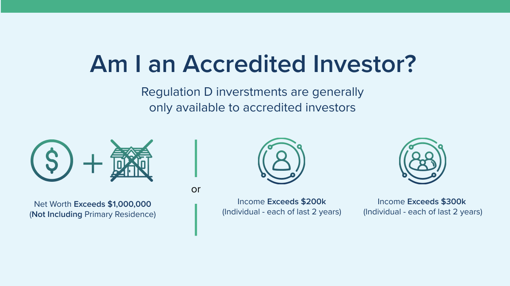

## Table of Contents

## What is an accredited investor?

An accredited investor is a person or entity that is allowed to invest in certain types of investments that are not available to the general public. These investments are often riskier and are not regulated as strictly as others. The idea behind this is that accredited investors have enough money and knowledge to handle these risks.

To be an accredited investor, a person usually needs to meet certain financial requirements set by the government. For example, they might need to have a high income or a lot of money in investments. This is to make sure that only people who can afford to lose money are allowed to invest in these riskier opportunities.

## Why is the concept of an accredited investor important?

The concept of an accredited investor is important because it helps protect people from risky investments. Some investments can be very complicated and risky. Not everyone knows how to handle these risks. By having the accredited investor rule, the government makes sure that only people who can afford to lose money and who understand these investments can take part in them. This helps keep regular people safe from losing all their money on something they don't fully understand.

It also helps companies raise money in a different way. When companies want to grow, they need money. Some companies might not want to go through all the rules and paperwork that come with selling to everyone. By selling to accredited investors, they can get the money they need faster and with less hassle. This can help new and small companies grow and try new things, which is good for the economy.

## What are the basic requirements to qualify as an accredited investor?

To qualify as an accredited investor, a person needs to meet certain financial requirements set by the government. One way to qualify is by having a high income. This means [earning](/wiki/earning-announcement) more than $200,000 a year as an individual, or more than $300,000 a year if married and filing jointly. Another way is by having a lot of money in investments, which means having a net worth of more than $1 million, either alone or together with a spouse, not including the value of their primary home.

There are also other ways to qualify as an accredited investor. For example, some professionals like brokers or investment advisers can be considered accredited investors because of their knowledge and experience in the financial world. Certain organizations, like banks, insurance companies, and registered investment companies, can also be accredited investors. These requirements help make sure that only people and organizations that can handle the risks of these investments are allowed to participate.

## How does income affect accreditation status?

Income plays a big role in deciding if someone can be an accredited investor. To qualify, a person needs to earn a lot of money each year. If someone makes more than $200,000 a year by themselves, they can be an accredited investor. If they are married and file taxes together, they need to make more than $300,000 a year. This high income shows that they can handle the risks that come with certain investments.

Having a high income is just one way to become an accredited investor. There are other ways too, like having a lot of money in investments. But income is important because it shows that a person has the money to lose if the investment goes bad. This helps protect people who don't make as much money from getting into risky investments they might not understand.

## What role does net worth play in becoming an accredited investor?

Net worth is another important [factor](/wiki/factor-investing) in becoming an accredited investor. It means the total value of everything you own, like your savings, investments, and other assets, minus any money you owe, like loans or debts. To be an accredited investor, your net worth needs to be more than $1 million. This can include the money you own with your spouse, but it does not count the value of your main home.

Having a high net worth shows that you have a lot of money and can handle the risks of certain investments. If an investment goes bad, you won't lose everything because you still have other money and assets. This is why the government uses net worth as a way to make sure only people who can afford to lose money are allowed to invest in these riskier opportunities.

## Can someone with professional certifications or licenses qualify as an accredited investor?

Yes, someone with certain professional certifications or licenses can qualify as an accredited investor. These professionals are seen as having the knowledge and experience needed to understand the risks of certain investments. For example, if you are a licensed broker or an investment adviser, you can be considered an accredited investor. This is because your job involves working with investments and understanding how they work.

This rule helps make sure that people who know a lot about investments can take part in them, even if they don't meet the income or net worth requirements. It's a way to let knowledgeable people invest in opportunities that might be too risky for others. By allowing these professionals to be accredited investors, the government trusts that they can handle the risks and make smart choices about where to put their money.

## How do joint investments or spousal income affect accreditation?

When it comes to being an accredited investor, you can use your spouse's income to help meet the requirements. If you are married and file your taxes together, you and your spouse can add your incomes together. If your total income is more than $300,000 a year, then you can be an accredited investor. This rule helps couples who might not make enough money on their own but together have a high income.

You can also use your spouse's money when figuring out your net worth. If you and your spouse together have more than $1 million in net worth, not counting the value of your main home, then you can be an accredited investor. This means that even if one of you doesn't have a high net worth by themselves, together you can still meet the requirement. It's a way to make sure that couples can invest in opportunities that might be too risky for others.

## What documentation is required to prove accredited investor status?

To prove you are an accredited investor, you need to show documents that prove your income or net worth. If you want to use your income, you can show your tax returns from the last two years. These tax returns need to show that you made more than $200,000 a year by yourself, or more than $300,000 a year if you are married and file taxes together with your spouse. This helps show that you have enough money to handle the risks of certain investments.

If you want to use your net worth, you need to show a statement from a bank, broker, or investment adviser. This statement should show that you have more than $1 million in assets, not counting the value of your main home. You might also need to show documents that prove any debts you owe, so they can be subtracted from your total assets. This helps prove that you have enough money to lose if an investment goes bad.

## Are there different rules for accredited investors in different countries?

Yes, the rules for accredited investors can be different in different countries. Each country has its own laws and rules about who can be an accredited investor. For example, in the United States, you need to have a high income or a lot of money in investments to be an accredited investor. But in other countries, the rules might be different. Some countries might have different income levels or different ways to prove you can handle risky investments.

These differences happen because each country wants to protect its people from risky investments in its own way. Some countries might have stricter rules to make sure only very rich people can invest in certain opportunities. Other countries might have easier rules to help more people invest in new companies and help the economy grow. It's important to know the rules in your country if you want to be an accredited investor.

## How often must an individual reassess their accredited investor status?

An individual does not have to reassess their accredited investor status at set times, but it's a good idea to check it every year. This is because things like income and net worth can change. If your income goes down or you lose money in investments, you might not be an accredited investor anymore. It's important to keep an eye on these things to make sure you still meet the rules.

If you're investing in something new, the people you're investing with might ask you to prove your status again. They want to make sure you still have enough money to handle the risks. So, even if there's no official rule about how often to check, it's smart to look at your income and net worth each year and be ready to show proof if needed.

## What are the implications of misrepresenting oneself as an accredited investor?

Misrepresenting yourself as an accredited investor can get you into big trouble. If you say you have more money or a higher income than you really do, you could be breaking the law. The government and the people you're investing with can check your information. If they find out you lied, you might have to pay fines or even face criminal charges. It's a serious thing because it's about protecting people from risky investments they can't afford.

It's also bad for the companies you're investing in. They trust that accredited investors can handle the risks of their investments. If you can't really afford to lose money, the company might get in trouble if your investment goes bad. This can hurt the company and other investors. It's important to be honest about your money so everyone can trust the system and make smart choices about investing.

## How have recent changes in regulations affected the definition and requirements of an accredited investor?

Recent changes in regulations have made it easier for some people to become accredited investors. In the United States, the Securities and Exchange Commission (SEC) updated the rules in 2020. Now, people with certain professional certifications or licenses, like a Series 7, 65, or 82 license, can be accredited investors. Also, people who have worked in the finance industry for a long time can qualify. These changes help more people invest in opportunities that were only for very rich people before.

These new rules also let some organizations become accredited investors. For example, certain family offices and "knowledgeable employees" of private funds can now invest. The idea is to let more people and groups with enough knowledge and money take part in these investments. But the basic rules about income and net worth are still the same. You still need to make a lot of money or have a lot of money in investments to be an accredited investor.

## References & Further Reading

[1]: U.S. Securities and Exchange Commission. ["Accredited Investors - Updated Investor Bulletin."](https://www.investor.gov/introduction-investing/general-resources/news-alerts/alerts-bulletins/investor-bulletins/updated-3)

[2]: Chuen, D. L. K. (2015). ["Handbook of Digital Currency: Bitcoin, Innovation, Financial Instruments, and Big Data."](https://www.sciencedirect.com/book/9780128021170/handbook-of-digital-currency) Academic Press.

[3]: Treleaven, P., Galas, M., & Vidhi, G. (2013). ["Algorithmic trading review."](https://dl.acm.org/doi/10.1145/2500117) Quantitative Finance, 13(3), 367-384.

[4]: Baker, H. K., & Filbeck, G. (2017). ["Hedge Funds: Structure, Strategies, and Performance."](https://academic.oup.com/book/25365) Oxford University Press.

[5]: Durbin, M. (2010). ["All About High-Frequency Trading."](https://www.mhebooklibrary.com/doi/book/10.1036/9780071743457) McGraw Hill Professional.

[6]: Moyer, L. (2020). ["SEC Expands Definition of ‘Accredited Investor’ in Move Expected to Expand Access to Private Markets."](https://www.sec.gov/newsroom/press-releases/2020-191) CNBC.

[7]: Pardo, R. (1992). ["Design, Testing, and Optimization of Trading Systems."](https://archive.org/details/designtestingopt0000pard) John Wiley & Sons.