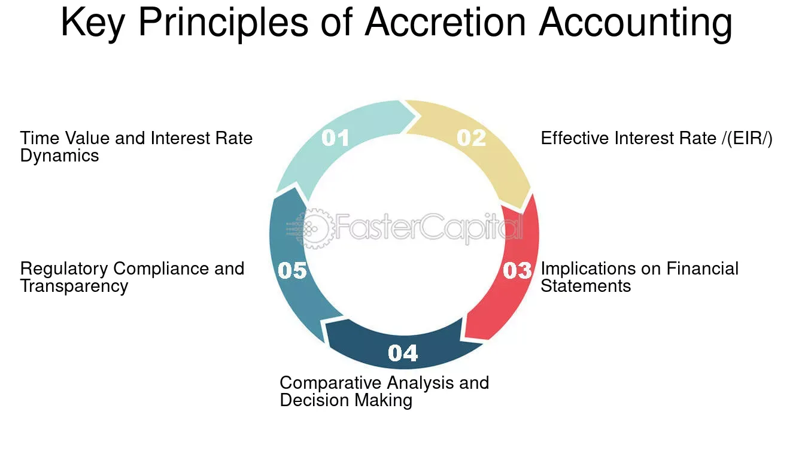

## Table of Contents

## What is accreted value?

Accreted value is the increase in the value of an investment over time. It's like watching a small plant grow into a bigger one. When you invest money, it can earn interest or grow in value, and the accreted value is the total growth you see from the start until now. This concept is often used with bonds, where the value of the bond increases as it gets closer to its maturity date.

For example, if you buy a bond for $1,000 that will be worth $1,200 when it matures in 10 years, the accreted value is how much the bond's value has grown each year until it reaches $1,200. It helps investors understand how their investment is doing and how much it has grown over time. This can be important for planning and making decisions about when to sell or hold onto an investment.

## How does accreted value differ from other financial metrics?

Accreted value is different from other financial metrics because it focuses on the growth of an investment over time. While metrics like the price-to-earnings ratio or return on investment look at how a company is doing right now or how much money it's making, accreted value shows how much an investment has grown from when you first bought it. It's like watching a seed grow into a plant, where you see the progress over time.

For example, if you compare accreted value to the current market value of a bond, the market value is what someone would pay for the bond today, which can go up and down based on many things like interest rates or the economy. But accreted value is more about the bond's journey from its starting price to its value at maturity. It helps investors see the steady growth of their investment, which can be useful for planning and understanding long-term gains.

## What are the basic mechanisms that drive accreted value?

The basic mechanisms that drive accreted value are mainly about how investments grow over time. For bonds, one key mechanism is the passage of time towards the bond's maturity date. When you buy a bond, it might be worth less than what it will be worth when it matures. As time goes by, the bond's value slowly increases until it reaches its full value at maturity. This increase in value over time is what we call accreted value.

Another mechanism is the interest that investments can earn. When you invest money, it can earn interest, which adds to the value of your investment. This interest can be reinvested, making your investment grow even more over time. For example, if you have a savings account, the interest you earn each year adds to your total savings, increasing the accreted value of your account.

These mechanisms work together to increase the value of your investment. Whether it's a bond getting closer to its maturity date or interest being added to your savings, both contribute to the accreted value. Understanding these mechanisms helps investors see how their money can grow over time and make better decisions about their investments.

## Can you explain the concept of accretion in the context of bonds?

Accretion in the context of bonds is like watching a seed grow into a plant. When you buy a bond, it might not be worth its full value right away. Instead, its value slowly increases over time until it reaches its full value when the bond matures. This slow increase in value is called accretion. It's like the bond is growing a little bit each day until it's fully grown at the end of its term.

For example, imagine you buy a bond for $900 that will be worth $1,000 when it matures in 5 years. Each year, the bond's value grows a bit more until it reaches $1,000. This growth is the accretion of the bond. It helps investors see how their bond is doing and how much it has grown over time. This can be important for planning when to sell the bond or hold onto it until it matures.

## How is accreted value calculated for zero-coupon bonds?

Accreted value for zero-coupon bonds is calculated by figuring out how much the bond's value has grown since you bought it. Zero-coupon bonds don't pay interest like regular bonds. Instead, they are sold at a discount and grow in value over time until they reach their full value at maturity. To find the accreted value, you start with the price you paid for the bond and then add the amount of growth that has happened so far. This growth is based on the bond's yield to maturity, which is the rate at which the bond's value increases each year.

For example, if you buy a zero-coupon bond for $800 that will be worth $1,000 in 10 years, the bond's value grows a little bit each year. If the yield to maturity is 2.25%, you can calculate the accreted value at any point in time. After 5 years, the bond's accreted value would be more than $800 but less than $1,000, reflecting the growth that has happened so far. This helps investors see how their bond is doing and how much it has grown over time.

## What role does time play in the accretion process?

Time is really important in the accretion process. It's like watching a plant grow. When you buy a bond, especially a zero-coupon bond, it starts at a lower price and slowly grows in value until it reaches its full value at the end of its term. The longer you hold onto the bond, the more its value grows. This growth happens bit by bit over time, and that's what we call accretion.

For example, if you buy a bond for $900 that will be worth $1,000 in 5 years, the bond's value increases a little each year. After 2 years, it might be worth $940, and after 4 years, it could be $980. The bond keeps growing until it reaches $1,000 at the end of 5 years. So, time is what makes the bond's value go up, and it's what drives the accretion process.

## How do interest rates affect accreted value?

Interest rates play a big role in how much a bond's value grows over time, which is called accreted value. When interest rates go up, the value of existing bonds usually goes down. This is because new bonds are issued with higher interest rates, making the older bonds less attractive. So, if you have a bond that's growing in value over time, higher interest rates can slow down that growth because the bond's value might not increase as much as it would if rates stayed the same.

On the other hand, when interest rates go down, the value of existing bonds usually goes up. This is because the older bonds with higher interest rates become more attractive compared to new bonds with lower rates. So, if you have a bond that's growing in value over time, lower interest rates can help that growth happen faster. The bond's accreted value will increase more quickly because its value is going up faster than it would if rates stayed the same.

## What are the tax implications of accreted value for investors?

When it comes to taxes, the accreted value of a bond can affect how much you owe. For zero-coupon bonds, you don't get interest payments each year, but the IRS still wants you to pay taxes on the interest that's building up, even though you haven't received it yet. This is called "imputed interest," and it's based on the bond's accreted value. So, even though your bond is growing in value over time, you might have to pay taxes on that growth each year.

This can be a bit tricky because you're paying taxes on money you haven't actually gotten yet. You'll need to keep track of the bond's accreted value each year and report it on your taxes. When the bond finally matures and you get the full amount, you won't have to pay taxes on the growth again because you've already paid taxes on it year by year. It's important to understand these tax rules so you can plan your investments and know what to expect when tax time comes around.

## How can accreted value be used in financial planning and analysis?

Accreted value is a helpful tool for financial planning and analysis because it shows how much an investment has grown over time. When you're planning for the future, knowing how much your investments are worth and how they're growing can help you make better decisions. For example, if you're saving for a big goal like buying a house or retiring, understanding the accreted value of your bonds can help you figure out when you'll have enough money. It's like watching a plant grow and knowing when it will be big enough to use.

In financial analysis, accreted value can help you compare different investments and see which ones are growing faster. If you're looking at a bunch of bonds, you can use accreted value to see which ones are doing better over time. This can help you decide which bonds to keep and which ones to sell. It's also useful for understanding how interest rates and time affect your investments, so you can plan for different scenarios and make smarter choices about your money.

## What are some advanced strategies for maximizing accreted value?

To maximize accreted value, one strategy is to carefully choose the right bonds based on their yield to maturity and time to maturity. If you pick bonds with higher yields, they will grow in value faster over time. Also, if you can hold onto the bonds until they mature, you'll get the full accreted value. It's like [picking](/wiki/asset-class-picking) the best seeds to plant and giving them enough time to grow into big plants. Another strategy is to keep an eye on interest rates. If you think interest rates will go down, buying bonds now can be a good idea because their value will grow faster as rates drop. It's like planting your seeds just before the rainy season starts.

Another advanced strategy is to use a bond ladder. This means you buy bonds that mature at different times, like having a series of plants at different stages of growth. This way, you can take advantage of different interest rates and have a steady stream of money coming in as each bond matures. It also helps you manage risk because you're not putting all your money into bonds that mature at the same time. By spreading out your investments, you can maximize the accreted value over time and have more control over your financial growth.

## How do market conditions influence the accreted value of securities?

Market conditions can really change how much a bond's value grows over time, which we call accreted value. When the economy is doing well and interest rates are low, bonds can grow in value faster. This is because people want to buy bonds, and the low interest rates make the bonds more valuable. It's like when the weather is perfect for plants to grow, they get bigger and stronger. But if the economy is not doing well or interest rates go up, the bond's value might not grow as much. Higher interest rates make new bonds more attractive, so the value of the bonds you already have might not increase as quickly.

Another thing that affects accreted value is how people feel about the market. If everyone thinks the market is going to do well, they might buy more bonds, which can make the bond's value grow faster. But if people are worried about the economy, they might sell their bonds, which can slow down the growth of the bond's value. It's like how people's confidence can affect how well a garden grows. If everyone believes the garden will do well, they'll take good care of it, and the plants will grow better. But if they're worried, they might not take as good care of it, and the plants won't grow as well.

## What are the potential risks associated with relying on accreted value in investment decisions?

Relying too much on accreted value can be risky because it doesn't tell the whole story about an investment. Accreted value shows how much a bond has grown over time, but it doesn't consider other important things like how the market is doing or if interest rates might change. If you only look at accreted value, you might miss out on other risks that could affect your investment. For example, if interest rates go up, the value of your bond might not grow as much as you expect, even though the accreted value looks good.

Another risk is that accreted value can be hard to predict. It's based on how much the bond's value is expected to grow over time, but things like economic changes or unexpected events can mess up those predictions. If you're planning your future based on the accreted value of your bonds, you might be disappointed if the actual growth is less than you expected. It's important to think about these risks and not just focus on the accreted value when making investment decisions.

## What is Understanding Accreted Value?

Accreted value is an essential financial metric, particularly when evaluating zero-coupon bonds and similar financial instruments. These bonds do not pay periodic interest; instead, they are issued at a discount to their face value and accrue interest over time, culminating in the payment of the full face value at maturity. The accreted value thus represents the bond's current theoretical valuation, incorporating accrued interest and initial principal, up to the potential sale before maturity.

The calculation of accreted value can be approached through various accounting methods, notably the straight-line and constant yield methods, each offering unique insights into how bond value appreciates over time.

The straight-line method calculates accretion by evenly spreading the difference between the purchase price and the face value over the bond's life. This method assumes a uniform growth rate:

$$
\text{Accreted Value}_{\text{straight-line}} = \text{Initial Value} + \left( \frac{\text{Face Value} - \text{Initial Value}}{\text{Number of Years}} \right) \times \text{Years Elapsed}
$$

In contrast, the constant yield method, also known as the effective interest method or yield-to-maturity approach, emphasizes a compounding interest effect. It involves applying the bond's internal rate of return to the accreted value, reflecting a more accurate representation of interest compounding over time:

$$
\text{Accreted Value}_{\text{constant yield}} = \text{Initial Value} \times (1 + r)^{t}
$$

where $r$ is the yield to maturity, and $t$ is the time in years.

A critical distinction must be made between accreted value and market value, as these figures may not always align. The accreted value represents a theoretical financial state based on accrued interests and the bond's intrinsic future payout. Conversely, market value is influenced by prevailing market conditions, such as [interest rate](/wiki/interest-rate-trading-strategies) fluctuations and investor sentiment, which can cause deviations from the bond's accreted value. Understanding these differences enables investors and analysts to better assess risk and potential returns when considering the sale or purchase of such financial instruments before maturity.

## What is Investment Analysis and Financial Valuation?

Investment analysis is a crucial process that involves assessing potential returns and risks associated with investment opportunities. This process relies on a variety of financial metrics and valuation models to ensure informed decision-making. Key financial metrics used in investment analysis include net present value (NPV) and internal rate of return (IRR), both of which help evaluate the profitability of investments.

1. **Net Present Value (NPV) and Internal Rate of Return (IRR)**:

   - **Net Present Value (NPV)** is calculated by discounting all cash inflows and outflows of an investment to their present values and summing them. It is represented as:
$$
     NPV = \sum_{t=0}^{n} \frac{C_t}{(1 + r)^t}

$$

     where $C_t$ is the cash flow at time $t$, $r$ is the discount rate, and $n$ is the duration of the investment.

   - **Internal Rate of Return (IRR)** is the discount rate that makes the NPV of all cash flows from an investment equal to zero. It is an important metric to determine the profitability of potential investments.

2. **Financial Valuation Techniques**:

   Various techniques exist for determining an asset's worth, which aids in investment analysis:

   - **Discounted Cash Flow (DCF) Analysis** calculates the value of an investment based on its expected future cash flows, which are adjusted for the time value of money. DCF is a powerful method to determine an asset's intrinsic value and involves forecasting future cash flows and discounting them to present value.

   - **Price-to-Earnings (P/E) Ratios** offer a relative valuation by comparing a company's current share price to its per-share earnings. This ratio is crucial for assessing how much investors are willing to pay for a dollar of earnings.

   - **Comparable Company Analysis (CCA)** involves evaluating similar companies to estimate the value of a company by comparing financial metrics. It relies on identifying peer companies that operate in the same industry with similar business models.

3. **Guidance for Investors**:

   These valuation techniques enable investors to make well-informed decisions by estimating both intrinsic and market values of assets. Recognizing the differences and similarities between these values allows investors to develop strategies that align with their financial goals.

4. **Investment Value vs. Fair Market Value**:

   Investment value is subjective and varies according to individual goals and risk tolerance. It reflects the value of an asset to a specific investor, considering personal investment criteria and expectations. On the other hand, fair market value is more objective, representing an asset's value in a competitive and open market where both buyers and sellers negotiate without undue pressure.

By understanding these concepts, investors can tailor investment strategies to suit their preferences, enhancing their ability to navigate various market conditions effectively.

## References & Further Reading

Investopedia offers comprehensive guides on various financial concepts, including accreted value, [algorithmic trading](/wiki/algorithmic-trading), and investment analysis. These guides provide foundational knowledge suitable for both novice and experienced investors, offering insights into the mechanics, benefits, and challenges of these concepts.

For advanced valuation techniques, consider exploring [books](/wiki/algo-trading-books) by financial experts such as Aswath Damodaran. Damodaran's works are well-regarded in the field of valuation for their practical insights and theoretical depth. His books cover a range of topics from equity valuation to risk assessment, providing valuable tools for financial analysis.

Journal articles and white papers are essential for understanding the impacts of algorithmic trading on market dynamics. Academic journals frequently publish studies analyzing how algorithmic trading influences market [liquidity](/wiki/liquidity-risk-premium), stability, and efficiency. These resources contribute to a nuanced understanding of the benefits and potential pitfalls associated with algorithmic trading.

Online resources from financial institutions and educational platforms provide practical applications in trading and investment. Websites of major financial institutions often feature insights and research reports that delve into current market trends and strategies. Additionally, educational platforms such as Coursera and edX offer courses and materials that teach investment strategies, financial modeling, and trading techniques, catering to various skill levels.

Incorporating a mix of these resources can provide a well-rounded perspective on accreted value, investment analysis, and algorithmic trading, enhancing one's ability to navigate and succeed in contemporary financial markets.

