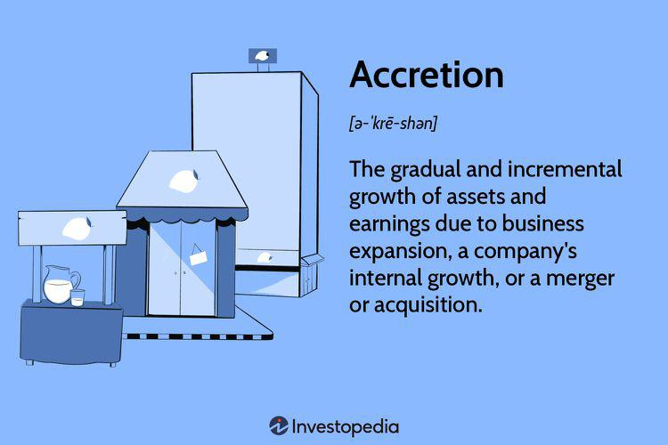

## Table of Contents

## What is accretion in finance and accounting?

Accretion in finance and accounting refers to the gradual increase in the value of an asset over time. This concept is often used when dealing with bonds, where the value of a bond purchased at a discount increases as it approaches its maturity date. The difference between the purchase price and the face value of the bond is accreted over the bond's life, reflecting the bond's increasing value until it reaches its full face value at maturity.

In accounting, accretion can also apply to other types of assets, such as those involved in asset retirement obligations. For example, if a company has to set aside money for the future dismantling of a facility, the estimated cost of this obligation increases over time due to the effects of inflation and other factors. This increase is recorded as accretion expense, which helps the company to more accurately reflect the rising cost of meeting its future obligations on its financial statements.

## How does accretion differ from amortization?

Accretion and amortization are two financial concepts that deal with changes in value over time, but they work in opposite ways. Accretion is about an asset's value growing over time. For example, if you buy a bond for less than its face value, its value will slowly increase until it reaches the face value when it matures. This increase in value is called accretion. It's like watching a savings account grow with interest.

On the other hand, amortization is about spreading out the cost of an asset over its useful life. It's often used for intangible assets like patents or for loans. When you amortize something, you're reducing its value on the [books](/wiki/algo-trading-books) over time. For instance, if you take out a loan, you pay it back in installments, and the balance of the loan decreases with each payment. This process of reducing the value is called amortization. So, while accretion is about an asset's value going up, amortization is about its value going down.

## Can you explain the process of accretion with an example?

Imagine you buy a bond for $900, but when it matures in 10 years, it will be worth $1,000. The difference between what you paid and what it will be worth is $100. This $100 is what we call accretion, and it happens slowly over the 10 years. Each year, the bond's value goes up a little bit until it reaches $1,000 at the end.

Let's say the bond's value increases by $10 every year. So, after the first year, the bond is worth $910. After the second year, it's worth $920, and so on. By the end of the 10th year, the bond has accreted all the way to its full value of $1,000. This gradual increase in value is what we mean by accretion.

## What types of financial instruments are subject to accretion?

Accretion happens with financial instruments like bonds bought at a discount. If you buy a bond for less than what it will be worth when it matures, its value slowly goes up over time until it reaches that final amount. This increase in value is called accretion. It's like watching your savings grow with interest, but it's specifically for bonds that you bought cheaper than their face value.

Another type of financial instrument that can be subject to accretion is an asset retirement obligation. This is when a company has to set aside money for things like dismantling a facility in the future. The cost of this obligation can go up over time because of inflation and other factors. The gradual increase in this cost is also called accretion. It helps the company keep track of how much more expensive it will be to meet this obligation as time goes on.

## How is accretion calculated and recorded in financial statements?

Accretion is calculated by figuring out how much an asset's value will increase over time and then spreading that increase evenly across the time until the asset matures or the obligation comes due. For a bond bought at a discount, you take the difference between what you paid and what it will be worth at maturity, and then divide that by the number of years until it matures. This gives you the amount of accretion to add to the bond's value each year. For example, if you bought a bond for $900 that will be worth $1,000 in 10 years, the accretion each year would be $10 ($100 difference divided by 10 years).

When it comes to recording accretion on financial statements, it's added to the value of the asset on the balance sheet. For the bond example, each year you would increase the bond's value by the accretion amount, so after the first year, the bond would be recorded at $910, then $920 the next year, and so on. On the income statement, the accretion is also recorded as interest income because it represents the gradual increase in the bond's value. For asset retirement obligations, the accretion expense is recorded on the income statement, increasing the liability on the balance sheet to reflect the rising cost of the future obligation.

## What are the tax implications of accretion?

When you have accretion, like with a bond you bought for less than its face value, it can affect your taxes. The increase in the bond's value each year, which is the accretion, is considered interest income. You have to report this interest income on your tax return every year, even though you don't actually get the money until the bond matures. This means you might have to pay taxes on this income each year, which could be a surprise if you're not expecting it.

For asset retirement obligations, the tax implications are a bit different. The accretion expense you record each year increases the liability on your balance sheet, but it's not something you can deduct from your taxes right away. You can only deduct the actual costs when you finally have to pay for the dismantling or cleanup. So, while you're recording the increasing cost on your financial statements, you won't see a tax benefit until you actually spend the money.

## How does accretion affect a company's financial ratios and performance metrics?

Accretion can change a company's financial ratios and performance metrics in important ways. When a company records accretion on a bond bought at a discount, it increases the value of the bond on the balance sheet. This increase in asset value can make the company's total assets look bigger, which can affect ratios like the debt-to-equity ratio. A higher asset value might make the company look less leveraged, which could be seen as a good thing by investors. Also, the accretion recorded as interest income on the income statement can make the company's earnings look better, which can improve metrics like return on assets (ROA) and earnings per share (EPS).

For asset retirement obligations, accretion works a bit differently. When a company records accretion expense, it increases the liability on the balance sheet, which can make the company's total liabilities look bigger. This can affect ratios like the debt-to-equity ratio in the opposite way, making the company look more leveraged. The accretion expense also reduces the company's net income on the income statement, which can lower metrics like ROA and EPS. So, while accretion on bonds can make a company's financials look better, accretion on asset retirement obligations can make them look worse.

## What are the regulatory requirements for reporting accretion?

When it comes to reporting accretion, companies have to follow rules set by accounting standards like Generally Accepted Accounting Principles (GAAP) in the U.S. or International Financial Reporting Standards (IFRS) globally. These rules say that companies need to show accretion on their financial statements in a clear way. For bonds bought at a discount, the increase in value each year needs to be recorded as interest income on the income statement and added to the bond's value on the balance sheet. For asset retirement obligations, the increasing cost needs to be shown as an accretion expense on the income statement and added to the liability on the balance sheet.

Regulators like the Securities and Exchange Commission (SEC) in the U.S. make sure companies follow these rules. They check the financial statements to see if the accretion is reported correctly. If a company doesn't follow the rules, it could get in trouble and might have to pay fines or face other penalties. So, it's important for companies to keep good records and report accretion the right way to stay out of trouble with the regulators.

## How do changes in interest rates impact accretion?

Changes in interest rates can affect how much a bond's value grows over time, which is called accretion. If interest rates go up after you buy a bond at a discount, the bond's value might not grow as fast as you expected. This is because new bonds being sold will have higher interest rates, making your bond less attractive to other investors. So, the accretion, or the increase in your bond's value, might be slower than you planned.

On the other hand, if interest rates go down after you buy a bond at a discount, your bond becomes more valuable. This is because new bonds being sold will have lower interest rates, making your bond more attractive to other investors. As a result, the accretion of your bond's value might happen faster than you expected. So, keeping an eye on interest rates is important if you want to understand how your bond's value will change over time.

## What are the best practices for managing accretion in a company's financial strategy?

Managing accretion well is important for a company's financial health. When a company buys bonds at a discount, it's smart to keep track of how much the bond's value grows each year. This growth, or accretion, should be recorded as interest income on the income statement and added to the bond's value on the balance sheet. By doing this, the company can show investors that its assets are growing, which can make the company look more financially stable. It's also a good idea to think about how changes in interest rates might affect the bond's value. If rates go up, the bond's value might not grow as fast, so the company should be ready for that.

For asset retirement obligations, managing accretion is a bit different. Companies need to set aside money for future costs like dismantling a facility, and the cost of this obligation can go up over time. This increase in cost, or accretion, should be recorded as an expense on the income statement and added to the liability on the balance sheet. It's important for the company to keep good records of this so that it can plan for the future and make sure it has enough money set aside. By managing accretion well, a company can make sure it's ready for these future costs and keep its financial statements accurate and clear.

## How can software tools assist in tracking and managing accretion?

Software tools can make it easier for companies to keep track of accretion. These tools can automatically calculate how much a bond's value grows each year, which is called accretion. They can also update the company's financial statements to show this growth as interest income on the income statement and add it to the bond's value on the balance sheet. This helps the company make sure its records are accurate and up-to-date without having to do all the math by hand.

For asset retirement obligations, software tools can also be very helpful. They can track how the cost of future obligations, like dismantling a facility, goes up over time due to inflation and other factors. This increase in cost is also called accretion, and the software can record it as an expense on the income statement and add it to the liability on the balance sheet. By using software, companies can manage these future costs better and make sure they have enough money set aside when the time comes.

## What advanced techniques can be used to optimize accretion in complex financial scenarios?

In complex financial scenarios, one advanced technique to optimize accretion is to use financial modeling. This involves creating detailed models that predict how the value of bonds bought at a discount will grow over time. By using these models, companies can see how changes in interest rates or other market conditions might affect the bond's accretion. This helps them make smarter decisions about when to buy or sell bonds to maximize their value growth. For example, if the model shows that interest rates are likely to go up, the company might decide to sell the bond before its value stops growing as fast.

Another technique is to use hedging strategies. Hedging can protect against changes in interest rates that might slow down the accretion of a bond's value. For instance, a company might use [interest rate](/wiki/interest-rate-trading-strategies) swaps or options to lock in current rates, ensuring that the bond's value keeps growing at a predictable rate. This can be especially useful for companies with large portfolios of bonds, as it helps them manage risk and keep their financial statements stable. By combining financial modeling with hedging, companies can better manage and optimize the accretion of their assets in complex financial environments.

## What is Understanding Accretion in Finance?

Accretion in finance refers to the gradual increase in the value of an asset or earnings over time. This concept is notably applicable to zero-coupon bonds and various debt instruments. Zero-coupon bonds are sold at a discount to their face value and do not pay periodic interest. Instead, they increase in value over time, ultimately reaching their face value at maturity. This gradual appreciation is a direct result of accretion, which reflects the bond's increasing value due to the passage of time and the predetermined interest implied in its discount price.

In a mathematical context, accretion can be represented through the accretion of bond discount formula. For a zero-coupon bond, the accreted value can be calculated using:

$$

A_t = P(1 + r)^t 
$$

where:
- $A_t$ is the accreted value at time $t$,
- $P$ is the purchase price of the bond,
- $r$ is the implied annual interest rate (yield),
- $t$ is the time in years until maturity.

This formula reflects how the value of the bond increases as it approaches maturity, accounting for the compounded interest over time.

Accretion is also a key [factor](/wiki/factor-investing) in mergers and acquisitions. During these corporate activities, accretion is used to assess the cumulative increase in a company's earnings post-acquisition. When an acquisition is "accretive," it means that the acquiring company’s earnings per share (EPS) will increase as a result of the purchase. This is a critical metric for corporate finance professionals as it influences decision-making processes concerning potential acquisitions.

In investments, understanding accretion is crucial for strategizing future payoffs and optimizing returns. For example, investors might incorporate accretive projections for assessing expected return rates and planning portfolios. This approach aids in gauging whether a potential investment will significantly contribute to future earnings growth.

Moreover, accretion is instrumental in analyzing debt instruments beyond zero-coupon bonds. It enables financial analysts to assess the expected increase in value which these instruments are presumed to generate. This growth is considered in accounting and financial reporting, providing a comprehensive view of a firm's potential financial health.

In summary, accretion enhances investment strategies by highlighting the gradual growth potential of various financial instruments. Its applicability in the financial domain provides a critical tool for investors and analysts to forecast returns and formulate effective investment strategies. Understanding and leveraging accretion contributes significantly to informed decision-making and optimized future financial outcomes.

## What are the synergies between accretion and algorithmic trading?

Accretion and [algorithmic trading](/wiki/algorithmic-trading) intersect to offer substantial opportunities for optimizing financial outcomes, particularly by leveraging price growth and timing strategies. Accretion, being the systematic growth of asset value over time, plays a crucial role in forming a forward-looking view of investment prospects. In algorithmic trading, this aspect can be utilized to identify and capitalize on inherent value enhancements seen in specific financial instruments like zero-coupon bonds.

Zero-coupon bonds, which accumulate value until they reach maturity, exhibit clear accretion characteristics. Their redemption value at maturity surpasses the initial purchase price, with the yield primarily arising from this accretion process. Algorithmic trading systems can be programmed to detect these accretion-driven price shifts, allowing traders to automate the purchase of such bonds when prices are favorable and to sell as the bonds near maturity for optimal returns.

Consider an algorithm that predicts the future value of a zero-coupon bond using its accretion rate. The formula to forecast the future price $P(t)$ at time $t$ can be expressed as:

$$
P(t) = P_0 \times (1 + r)^t
$$

Where:
- $P_0$ is the initial purchase price of the bond,
- $r$ is the annual accretion rate,
- $t$ is the time elapsed in years.

Algorithmic strategies exploiting accretion-related opportunities can be developed using Python. Below is a simplified example showcasing how to model accretion in zero-coupon bonds:

```python
# Python code to calculate potential future price with accretion
def calculate_price_with_accretion(initial_price, accretion_rate, years):
    return initial_price * (1 + accretion_rate) ** years

# Example parameters
initial_price = 1000  # Initial purchase price of the bond
accretion_rate = 0.05  # Annual accretion rate (5%)
years = 5  # Time in years

future_price = calculate_price_with_accretion(initial_price, accretion_rate, years)
print(f"The future price of the bond is: ${future_price:.2f}")
```

The elegance of integrating accretion insights into algorithmic trading lies in the ability to develop strategies that account for time-bound value increases, thereby optimizing the profit potential. Furthermore, by streamlining data analysis and execution with advanced computational tools, market practitioners can swiftly react to accretion-driven opportunities, ensuring that trades are executed at peak profitability under market shifts.

In conclusion, the synergy between accretion and algorithmic trading is vital in crafting sophisticated financial strategies that exploit temporal value gains, ultimately leading to enhanced growth potential and profit maximization in fast-moving financial markets.

## References & Further Reading

[1]: ["Advances in Financial Machine Learning"](https://www.amazon.com/Advances-Financial-Machine-Learning-Marcos/dp/1119482089) by Marcos Lopez de Prado

[2]: ["Algorithms for Hyper-Parameter Optimization"](https://dl.acm.org/doi/10.5555/2986459.2986743) by James Bergstra, Remi Bardenet, Yoshua Bengio, and Balázs Kégl, Advances in Neural Information Processing Systems 24.

[3]: ["Evidence-Based Technical Analysis: Applying the Scientific Method and Statistical Inference to Trading Signals"](https://www.amazon.com/Evidence-Based-Technical-Analysis-Scientific-Statistical/dp/0470008741) by David Aronson

[4]: ["Machine Learning for Algorithmic Trading"](https://github.com/stefan-jansen/machine-learning-for-trading) by Stefan Jansen

[5]: ["Quantitative Trading: How to Build Your Own Algorithmic Trading Business"](https://www.amazon.com/Quantitative-Trading-Build-Algorithmic-Business/dp/1119800064) by Ernest P. Chan