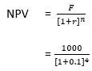

In the fast-paced world of finance, two key concepts—discount accretion and algorithmic trading—significantly influence the valuation and trading of securities. Discount accretion involves the process by which the value of a financial instrument, initially issued at a discount, increases as it approaches its maturity date. This accretion influences how bonds and other fixed-income securities are priced, taking into account factors such as interest rates and the time to maturity. On the other hand, algorithmic trading employs advanced mathematical models and automation to execute effective trading strategies, optimizing the timing and pricing of trades, including those that involve discounting mechanisms.

This article provides a comprehensive overview of discount accretion, exploring its foundational principles and calculation methods. Understanding how the value of a security changes over time through accretion is crucial for investors, as it directly affects investment decisions and portfolio management. Additionally, the interplay between discount accretion and algorithmic trading highlights the importance of integrating financial theory with modern technology to enhance market operations.



Algorithmic trading has transformed financial markets by leveraging real-time data and automated processes to improve trading efficiency. By incorporating discount accretion calculations into trading algorithms, traders can better anticipate price movements and strategize accordingly. This integration of techniques leads to more informed decision-making and potentially higher returns.

Overall, this article examines the relationship between discount accretion and algorithmic trading, underscoring their collective impact on the financial industry. From the basic mechanics of discount accretion to the sophisticated algorithms that drive trading strategies, a comprehensive understanding of these concepts is essential for navigating the complexities of modern finance.

## Table of Contents

## Understanding Discount Accretion

Discount accretion refers to the process by which the value of a discounted financial instrument increases over time as it approaches its maturity date. This increase in value is crucial for understanding how such instruments, particularly bonds and other fixed-income securities, are priced and valued.

In practice, financial instruments like zero-coupon bonds are issued at a discount to their face value and do not pay periodic interest payments. Instead, their return comes from the difference between the purchase price and the face value at maturity. As the maturity date approaches, the bond's price gradually accretes towards its face value. This intrinsic characteristic directly impacts how investors perceive and value these securities over time.

Interest rates play a significant role in determining the accretion rate of a discounted financial instrument. When interest rates rise, the present value of future cash flows decreases, leading to a slower accretion rate. Conversely, when interest rates fall, the present value of those cash flows increases, resulting in a faster accretion rate. Thus, the market interest rates at any given time significantly influence the discount accretion process.

Maturity is another critical [factor](/wiki/factor-investing) in the accretion process. The length of time until a bond matures affects the rate at which its discount accretes to its face value. Shorter-maturity instruments reach their face value quicker than those with longer maturities, which impacts investment strategies and pricing models. As the time remaining to maturity decreases, the accretion process accelerates, reflecting the decreasing risk and uncertainty associated with the bond’s cash flows.

To mathematically represent this process, the accretion of a discount can be modeled using the present value formula:

$$
PV = \frac{FV}{(1 + r)^n}
$$

where $PV$ is the present value of the bond (or its current market price), $FV$ is the face value at maturity, $r$ is the discount rate (or equivalent market interest rate), and $n$ is the number of years until maturity. As $n$ decreases over time, the present value $PV$ increases, illustrating the accretion process.

In conclusion, understanding the dynamics of discount accretion is vital for investors and financial professionals managing portfolios of discounted securities. This knowledge helps in making informed decisions that align with current [interest rate](/wiki/interest-rate-trading-strategies) environments and develop strategies that appropriately value and price fixed-income securities as they approach their maturity dates.

## Calculation Methods for Accretion

Accretion is a critical aspect in valuing discounted financial instruments, like bonds, as they approach maturity. Two main methods for calculating accretion are the straight-line method and the effective interest rate method. Each offers unique insights and complexities that affect investment management decisions.

### Straight-Line Method

The straight-line method is a simple, time-based approach to calculating accretion. It assumes a consistent increase in the value of the investment over time. The formula for the straight-line method is:

$$
\text{Accretion Amount} = \frac{\text{Discount}}{\text{Number of Periods}}
$$

**Example:** Suppose a bond with a face value of $1,000 is purchased for $950, maturing in 5 years. The discount is $50 ($1,000 - $950). Using the straight-line method, the annual accretion would be:

$$
\text{Annual Accretion} = \frac{\$50}{5} = \$10
$$

Each year, the bond's carrying amount increases by $10 until it reaches the face value at maturity.

### Effective Interest Rate Method

The effective interest rate method provides a more accurate representation of a security's increasing value because it accounts for the interest income generated. This method uses the market interest rate at the time of acquisition to calculate periodic accretion, aligning with the accrual of interest.

The formula for the effective interest rate method involves:

$$
\text{Accretion Amount} = \text{Current Book Value} \times \text{Effective Interest Rate} - \text{Coupon Payment}
$$

**Example:** Consider the same bond with a purchase price of $950, a face value of $1,000, a nominal coupon rate of 5%, and a market interest rate (effective interest rate) of 6%. The accretion for the first year would be:

1. **Calculate the initial interest income:**
$$
   \text{Interest Income} = \$950 \times 0.06 = \$57

$$

2. **Subtract the coupon payment (5% of face value):**
$$
   \text{Coupon Payment} = \$1,000 \times 0.05 = \$50

$$

3. **Determine the accretion amount:**
$$
   \text{Accretion Amount} = \$57 - \$50 = \$7

$$

In this scenario, the bond's carrying amount increases by $7 in the first year. This method requires recalculating for each period as the book value changes over time.

### Importance in Investment Management

Understanding these calculation methods is essential for investors and financial managers to manage portfolio returns and anticipate valuation changes accurately. The straight-line method offers simplicity and ease of application, suitable for straightforward bonds with minor discounts. Conversely, the effective interest rate method is more complex but provides better insights into the interest income's time value, essential for managing or predicting cash flows of more complex, large-discount financial instruments.

Accurately calculating accretion impacts decision-making processes regarding investment valuation, tax reporting, and profitability analysis. Mastery of these methods equips investors to more effectively strategize within their portfolios, especially in volatile interest rate environments where precision and foresight can significantly optimize returns.

## Accretion in Algorithmic Trading

Algorithmic trading utilizes advanced computational techniques to execute trading strategies with speed and precision. One key area where [algorithmic trading](/wiki/algorithmic-trading) exhibits significant potential is in the incorporation of accretion calculations, which optimize trades and enhance decision-making in the sphere of fixed-income securities. 

### Forecasting and Leveraging Accretion Trends

Accretion involves the gradual increase in the value of a discounted financial instrument as it nears maturity. This is particularly relevant for fixed-income securities, such as bonds, where the accretion process affects pricing and returns. By integrating accretion calculations, algorithms can forecast future price movements of these securities, allowing traders to position themselves advantageously. For instance, if an algorithm predicts that a bond is likely to accrete at a certain rate, it can recommend buying the bond if the expected accretion offers a good return relative to market expectations.

Algorithms achieve this by analyzing historical data and current market conditions to estimate the rate of accretion. They can be programmed to consider various factors such as interest rates, credit ratings, and macroeconomic indicators that influence the bond market. Machine learning models, particularly those employing time series analysis, are often deployed to refine these forecasts, learning from patterns in historical market data.

### Real-Time Data and Automation in Refining Strategies

The advent of real-time data and automated systems has revolutionized the way accretion strategies are refined in algorithmic trading. Real-time data allows algorithms to continuously update their forecasts based on the most recent market information. For example, if an unexpected change occurs in interest rates, algorithms can immediately recalibrate their strategies to account for the new conditions, thereby maintaining or even enhancing their predictive accuracy.

Automation plays a crucial role by executing trades based on these updated strategies without human intervention. This minimizes latency and enhances the efficiency of trading operations, enabling traders to capture opportunities that might be fleeting. An algorithm can be structured to trigger trades when accretion exceeds a certain threshold, thereby maximizing gains or minimizing losses automatically.

Here's a basic Python example to illustrate how an algorithm might be set up to incorporate accretion trends:

```python
import numpy as np
import pandas as pd

# Sample data: bond prices over time
bond_data = pd.DataFrame({
    'time': np.arange(1, 11),  # time in years
    'discount_factor': np.linspace(100, 105, 10)  # price accreting over years
})

# Calculating accretion rate
bond_data['accretion_rate'] = bond_data['discount_factor'].pct_change()

# Simple algorithm to execute buy/sell based on accretion trend
def trade_strategy(data):
    initial_position = 0  # 0 for no position, 1 for buy, -1 for sell
    accretion_threshold = 0.02  # example threshold for decision making

    for i in range(1, len(data)):
        if data['accretion_rate'].iloc[i] > accretion_threshold:
            if initial_position <= 0:
                print(f"Buy at time {data['time'].iloc[i]}")
                initial_position = 1
        elif data['accretion_rate'].iloc[i] < -accretion_threshold:
            if initial_position >= 0:
                print(f"Sell at time {data['time'].iloc[i]}")
                initial_position = -1

trade_strategy(bond_data)
```

This example illustrates a simple strategy where the algorithm decides to buy if the accretion rate exceeds a certain threshold and sell if it drops below a negative threshold. In practice, such algorithms would be more complex, integrating multiple data sources and employing advanced statistical models to continuously improve their predictions and trading decisions.

Algorithmic trading continues to advance with technology, facilitating more effective integration of accretion calculations and similar financial metrics to enhance investment strategies and maximize returns in the complex landscape of fixed-income securities.

## Real-World Applications of Accretion and Algo Trading

Investors and financial institutions leverage discount accretion and algorithmic trading to effectively maximize returns and manage risks in complex financial markets. These techniques are often crucial in fixed-income investments and trading strategies, providing pivotal insights and advantages.

Discount accretion plays a strategic role in maximizing returns, especially in bond markets. Consider a bond purchased at a discount to its face value, which appreciates as it nears maturity. The gradual increase in the bond's book value as it accretes towards its face value reflects an inherent yield, enhancing the investor's return potential. For example, suppose a bond with a face value of $1,000 is initially acquired at $900. By the time it reaches maturity, the investor captures a $100 gain purely from discount accretion. This process provides a quantifiable yield component, representing a return guaranteed over time, separate from market fluctuations.

Algorithmic trading platforms enhance the efficiency and decision-making by integrating sophisticated models that interpret accretion data alongside other market indicators. Algorithms can forecast accretion trends and adjust trading strategies dynamically to capitalize on these insights. For instance, if real-time data indicates a shift in interest rates, an algorithm can quickly recalibrate its assessments of future bond prices, optimizing buy or sell decisions to either capture opportunities or mitigate risks. This level of precision helps traders react promptly to market changes, maintaining a competitive edge.

In practical application, firms employing algorithmic trading for fixed-income securities can construct portfolios that strike a balance between high-yielding, low-maturity bonds and longer-term securities with attractive discount accretion. This ensures a steady stream of income while managing interest rate risks, achieved by algorithms that continuously analyze bond accretion patterns and market conditions in tandem.

A notable case study involves a [hedge fund](/wiki/hedge-fund-trading-strategies) utilizing an algorithm that combines accretion modeling with macroeconomic indicators to trade municipal bonds. By efficiently analyzing the yield curve and identifying which bonds were mispriced in terms of their accretion potential relative to market conditions, the hedge fund was able to significantly outperform traditional benchmarks. This application underscores how integrative approaches—melding financial theory with algorithmic precision—facilitate superior strategic decision-making.

Ultimately, financial institutions that effectively blend discount accretion strategies with advanced algorithmic trading platforms can better navigate the complexities of financial markets, driving both profitability and robust risk management. The integration of these techniques is not just about maximizing returns but also about building resilient, adaptable trading frameworks.

## Conclusion

Discount accretion and algorithmic trading represent critical elements that shape modern finance, each playing a pivotal role in the valuation and trading of securities. Discount accretion, the gradual increase in the value of a discounted financial instrument as it nears maturity, is fundamental in determining the pricing and valuation of bonds and fixed-income securities. The methodical rise in value, influenced by interest rates and the instrument's maturity, ensures that investments are accurately valued over time. On the other hand, algorithmic trading employs advanced computing techniques to automate trading strategies, increasingly incorporating accretion calculations to enhance trading efficiency and optimize returns.

The future potential and evolving trends of these concepts indicate a transformation in strategic financial management. With the ongoing sophistication of algorithmic trading, real-time data analytics and [machine learning](/wiki/machine-learning) are significantly impacting investment strategies. Algorithms are designed to not only incorporate accretion trends but also to analyze vast datasets, further refining trading decisions and boosting market efficiency. As technology progresses, the implementation of these advanced strategies will only become more ingrained within the fabric of financial markets.

In an ever-changing financial landscape, continuous learning and adaptation are imperative. Market conditions, regulatory environments, and technological advancements are consistently evolving, necessitating that investors, traders, and financial professionals remain vigilant and informed. The synergy between discount accretion and algorithmic trading highlights the necessity for robust education and ongoing skill development to navigate the complexities of modern finance effectively.

Overall, the integration of discount accretion and algorithmic trading underscores the dynamic nature of contemporary financial strategies. Their intertwined roles not only enhance the precision of investment approaches but also emphasize the importance of innovation and adaptability in achieving financial success. The future is poised for a further convergence of these concepts, shaping a more sophisticated, data-driven market.

## References & Further Reading

[1]: Bergstra, J., Bardenet, R., Bengio, Y., & Kégl, B. (2011). ["Algorithms for Hyper-Parameter Optimization."](https://dl.acm.org/doi/10.5555/2986459.2986743) Advances in Neural Information Processing Systems 24.

[2]: ["Advances in Financial Machine Learning"](https://www.amazon.com/Advances-Financial-Machine-Learning-Marcos/dp/1119482089) by Marcos Lopez de Prado

[3]: Hull, J. C. (2018). ["Options, Futures, and Other Derivatives"](https://www.semanticscholar.org/paper/Options%2C-Futures%2C-and-Other-Derivatives-Hull/89bdee500c8623864fc9eb7a471546aa713acc44)

[4]: ["Quantitative Trading: How to Build Your Own Algorithmic Trading Business"](https://www.amazon.com/Quantitative-Trading-Build-Algorithmic-Business/dp/1119800064) by Ernest P. Chan

[5]: ["Machine Learning for Algorithmic Trading"](https://github.com/stefan-jansen/machine-learning-for-trading) by Stefan Jansen

[6]: ["Bond Markets, Analysis, and Strategies"](https://mitpress.mit.edu/9780262046275/bond-markets-analysis-and-strategies/) by Frank J. Fabozzi

[7]: Aronson, D. (2007). ["Evidence-Based Technical Analysis: Applying the Scientific Method and Statistical Inference to Trading Signals"](https://www.amazon.com/Evidence-Based-Technical-Analysis-Scientific-Statistical/dp/0470008741)