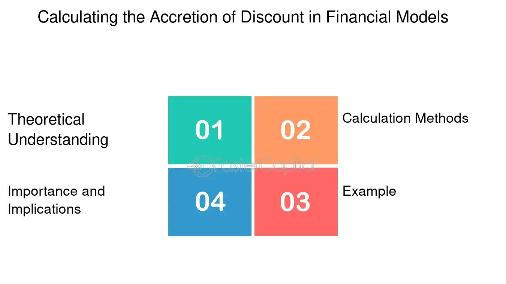

## Table of Contents

## What is accretion of discount?

Accretion of discount is a term used in finance and accounting. It refers to the gradual increase in the value of a bond or other financial instrument that was initially purchased at a price lower than its face value. This increase happens over time until the bond reaches its maturity date. The process of accretion helps to reflect the bond's true value more accurately as it gets closer to being paid back at its full face value.

For example, if you buy a bond for $900 that will be worth $1,000 when it matures, the $100 difference is the discount. Over the life of the bond, this discount is accreted, or added back, to the bond's value. This means that each year, a portion of that $100 is added to the bond's book value until it reaches $1,000. This process is important for investors and accountants because it helps them track the bond's value more accurately over time.

## Why is accretion of discount important in finance?

Accretion of discount is important in finance because it helps show the true value of a bond over time. When someone buys a bond for less than its face value, the difference is called a discount. As the bond gets closer to its maturity date, this discount is slowly added back to the bond's value. This process, called accretion, makes sure that the bond's value is shown correctly on financial statements. It helps investors and accountants keep track of how much the bond is really worth as time goes by.

This process is also important for calculating interest income. When a bond is bought at a discount, the buyer earns not just the interest payments but also the gain from the bond's value increasing to its face value. Accretion helps spread this gain evenly over the time the bond is held. This way, the income from the bond is reported more accurately each year, which is important for tax purposes and for understanding the true return on investment.

## How does accretion of discount affect bond valuation?

Accretion of discount affects bond valuation by gradually increasing the bond's book value over time. When someone buys a bond for less than its face value, the difference is called a discount. As the bond gets closer to its maturity date, this discount is slowly added back to the bond's value. This process, called accretion, makes sure that the bond's value is shown correctly on financial statements. It helps investors and accountants keep track of how much the bond is really worth as time goes by.

This process is also important for calculating interest income. When a bond is bought at a discount, the buyer earns not just the interest payments but also the gain from the bond's value increasing to its face value. Accretion helps spread this gain evenly over the time the bond is held. This way, the income from the bond is reported more accurately each year, which is important for tax purposes and for understanding the true return on investment. By reflecting the bond's true value more accurately, accretion of discount helps investors make better decisions about buying and selling bonds.

## What is the difference between accretion and amortization?

Accretion and amortization are two financial terms that deal with how the value of an asset or liability changes over time, but they work in opposite ways. Accretion is when the value of something goes up over time. For example, if you buy a bond for less than its face value, the difference is called a discount. As the bond gets closer to its maturity date, this discount is slowly added back to the bond's value. This process is called accretion. It helps show the bond's true value more accurately as time goes by.

On the other hand, amortization is when the value of something goes down over time. This often happens with loans or intangible assets like patents. For example, if you take out a loan, you pay it back over time. Each payment reduces the amount you owe, which is called amortization. It's also used for intangible assets, where the cost of the asset is spread out over its useful life. So, while accretion increases the value of an asset, amortization decreases it. Both processes help show the true value of financial items over time.

## Can you explain the concept of discount on a bond?

A discount on a bond happens when someone buys the bond for less than what it will be worth when it matures. For example, if a bond's face value is $1,000 but you can buy it for $950, the $50 difference is the discount. This can happen for a few reasons, like if the bond's interest rate is lower than what people can get from other investments, or if there's a lot of time left before the bond matures.

When you buy a bond at a discount, you get to keep the difference between what you paid and the bond's face value when it matures. This extra money is like a bonus on top of the interest payments you get while you own the bond. The discount makes the bond more attractive because it increases the total return you get from your investment.

## What are the steps to calculate accretion of discount?

To calculate accretion of discount, you first need to know the bond's face value, the price you paid for it, and how long until it matures. Let's say you bought a bond for $950 that will be worth $1,000 when it matures in 5 years. The discount is $50, which is the difference between the face value and the price you paid. To find out how much the bond's value should increase each year, you divide the discount by the number of years until maturity. In this case, $50 divided by 5 years gives you $10 per year.

Each year, you add this amount to the bond's book value. So, at the end of the first year, the bond's value would be $960. At the end of the second year, it would be $970, and so on. By the time the bond matures, its book value will have increased to match its face value of $1,000. This process of adding the discount back to the bond's value over time is called accretion of discount. It helps show the bond's true value more accurately as it gets closer to maturity.

## How is the effective interest method used in accretion of discount?

The effective interest method is a way to figure out how much the value of a bond bought at a discount should go up each year. When you use this method, you look at the bond's face value, the price you paid for it, and the interest rate it pays. Instead of just dividing the discount by the number of years until the bond matures, the effective interest method takes into account the bond's interest payments. Each year, you calculate the interest based on the bond's current book value and the interest rate. Then, you add this interest to the bond's book value, which slowly increases it until it reaches the face value at maturity.

This method makes sure that the bond's value goes up in a way that matches the interest it earns. For example, if you bought a bond for $950 with a face value of $1,000 and an annual interest rate of 5%, you would start with a book value of $950. In the first year, you would earn 5% interest on $950, which is $47.50. You add this interest to the book value, making it $997.50. The next year, you calculate the interest on the new book value of $997.50, and so on. This way, the bond's value increases more accurately over time, reflecting both the interest earned and the discount being accreted.

## What is the formula for calculating accretion of discount?

The formula for calculating accretion of discount is pretty straightforward. You take the difference between the bond's face value and the price you paid for it, which is the discount. Then, you divide this discount by the number of years until the bond matures. This gives you the amount to add to the bond's book value each year. For example, if you bought a bond for $950 that will be worth $1,000 when it matures in 5 years, the discount is $50. You divide $50 by 5 years, which means you add $10 to the bond's book value each year.

However, if you want to use the effective interest method, it's a bit more detailed. You start with the bond's initial book value, which is the price you paid. Each year, you calculate the interest based on this book value and the bond's interest rate. You add this interest to the book value, which increases it. For example, if you bought a bond for $950 with a face value of $1,000 and an annual interest rate of 5%, you would earn $47.50 in interest the first year (5% of $950). You add this to the book value, making it $997.50. The next year, you calculate the interest on the new book value of $997.50, and so on. This way, the bond's value increases more accurately over time, reflecting both the interest earned and the discount being accreted.

## How does the accretion of discount impact the yield to maturity of a bond?

The accretion of discount affects the yield to maturity (YTM) of a bond by changing how much money the bond is worth over time. When you buy a bond at a discount, you pay less than its face value. As the bond gets closer to its maturity date, its value goes up little by little until it reaches the face value. This increase in value is called accretion of discount. Because you're getting this extra value at the end, the total return on your investment goes up. This means the YTM, which is the total interest rate you earn if you hold the bond until it matures, will be higher than the bond's stated interest rate.

The way accretion of discount impacts YTM is important for investors to understand. When calculating YTM, you need to consider not just the interest payments you get each year, but also the gain from the bond's price increasing to its face value. This gain is spread out over the time you hold the bond, and it makes the bond more valuable. So, even if a bond has a low interest rate, buying it at a discount can still give you a good return because of the accretion of discount. This makes the bond's YTM higher, which can make it a more attractive investment.

## What are the tax implications of accretion of discount?

When you buy a bond at a discount and it gets closer to its maturity date, its value goes up little by little. This increase in value is called accretion of discount. For tax purposes, this increase in value is treated as interest income. So, each year, you have to report the amount of accretion as part of your taxable income. This means you might have to pay taxes on this income even though you don't actually get the money until the bond matures.

The way you report this income can depend on the type of bond you have. For example, if you have a bond that's considered an Original Issue Discount (OID) bond, the IRS has special rules for how to report the accretion of discount. You'll need to use Form 1099-OID to report this income. It's important to keep track of the accretion each year because it affects your taxes. If you're not sure how to report it, it's a good idea to talk to a tax professional to make sure you're doing it right.

## How do accounting standards (like GAAP or IFRS) treat accretion of discount?

Accounting standards like GAAP (Generally Accepted Accounting Principles) and IFRS (International Financial Reporting Standards) have rules for how to handle accretion of discount. Both sets of standards say that when you buy a bond for less than its face value, you need to slowly increase its value over time until it reaches the face value at maturity. This process is called accretion of discount. Under GAAP, you usually use the effective interest method to figure out how much the bond's value should go up each year. This method takes into account the bond's interest rate and the interest payments you get, making sure the bond's value increases in a way that matches the interest it earns.

IFRS also uses the effective interest method for accretion of discount. The main goal is to show the bond's true value more accurately over time. Both GAAP and IFRS want to make sure that the bond's value on the financial statements reflects the interest income you're earning, including the gain from the bond's price increasing to its face value. This helps investors and accountants understand the bond's value and the income it generates more clearly.

## What are some advanced strategies for managing accretion of discount in a bond portfolio?

Managing accretion of discount in a bond portfolio can be tricky, but there are some smart ways to do it. One way is to use a laddering strategy, where you buy bonds that mature at different times. This helps spread out the accretion of discount over time, so you don't have all your bonds reaching maturity at once. Another strategy is to focus on bonds with higher yields to maturity, which can help increase the total return on your investment. By choosing bonds with higher YTMs, you can make the most of the accretion of discount, as the gain from the bond's price increasing to its face value will be bigger.

Another advanced strategy is to use tax planning to manage the impact of accretion of discount on your taxes. Since the accretion is treated as interest income, it can affect your tax bill each year. You might want to consider holding bonds in tax-advantaged accounts like IRAs or 401(k)s, where the accretion of discount won't be taxed until you take the money out. Also, you can look into tax-exempt bonds, like municipal bonds, which can help reduce the tax impact of accretion. By thinking about taxes, you can keep more of the money you earn from the accretion of discount.

## What is Understanding Discount Accretion?

Discount accretion refers to the process by which the value of a discounted financial instrument increases over time as it approaches its maturity date. This increase in value is crucial for understanding how such instruments, particularly bonds and other fixed-income securities, are priced and valued.

In practice, financial instruments like zero-coupon bonds are issued at a discount to their face value and do not pay periodic interest payments. Instead, their return comes from the difference between the purchase price and the face value at maturity. As the maturity date approaches, the bond's price gradually accretes towards its face value. This intrinsic characteristic directly impacts how investors perceive and value these securities over time.

Interest rates play a significant role in determining the accretion rate of a discounted financial instrument. When interest rates rise, the present value of future cash flows decreases, leading to a slower accretion rate. Conversely, when interest rates fall, the present value of those cash flows increases, resulting in a faster accretion rate. Thus, the market interest rates at any given time significantly influence the discount accretion process.

Maturity is another critical [factor](/wiki/factor-investing) in the accretion process. The length of time until a bond matures affects the rate at which its discount accretes to its face value. Shorter-maturity instruments reach their face value quicker than those with longer maturities, which impacts investment strategies and pricing models. As the time remaining to maturity decreases, the accretion process accelerates, reflecting the decreasing risk and uncertainty associated with the bond’s cash flows.

To mathematically represent this process, the accretion of a discount can be modeled using the present value formula:

$$
PV = \frac{FV}{(1 + r)^n}
$$

where $PV$ is the present value of the bond (or its current market price), $FV$ is the face value at maturity, $r$ is the discount rate (or equivalent market interest rate), and $n$ is the number of years until maturity. As $n$ decreases over time, the present value $PV$ increases, illustrating the accretion process.

In conclusion, understanding the dynamics of discount accretion is vital for investors and financial professionals managing portfolios of discounted securities. This knowledge helps in making informed decisions that align with current [interest rate](/wiki/interest-rate-trading-strategies) environments and develop strategies that appropriately value and price fixed-income securities as they approach their maturity dates.

## What are the Calculation Methods for Accretion?

Accretion is a critical aspect in valuing discounted financial instruments, like bonds, as they approach maturity. Two main methods for calculating accretion are the straight-line method and the effective interest rate method. Each offers unique insights and complexities that affect investment management decisions.

### Straight-Line Method

The straight-line method is a simple, time-based approach to calculating accretion. It assumes a consistent increase in the value of the investment over time. The formula for the straight-line method is:

$$
\text{Accretion Amount} = \frac{\text{Discount}}{\text{Number of Periods}}
$$

**Example:** Suppose a bond with a face value of $1,000 is purchased for $950, maturing in 5 years. The discount is $50 ($1,000 - $950). Using the straight-line method, the annual accretion would be:

$$
\text{Annual Accretion} = \frac{\$50}{5} = \$10
$$

Each year, the bond's carrying amount increases by $10 until it reaches the face value at maturity.

### Effective Interest Rate Method

The effective interest rate method provides a more accurate representation of a security's increasing value because it accounts for the interest income generated. This method uses the market interest rate at the time of acquisition to calculate periodic accretion, aligning with the accrual of interest.

The formula for the effective interest rate method involves:

$$
\text{Accretion Amount} = \text{Current Book Value} \times \text{Effective Interest Rate} - \text{Coupon Payment}
$$

**Example:** Consider the same bond with a purchase price of $950, a face value of $1,000, a nominal coupon rate of 5%, and a market interest rate (effective interest rate) of 6%. The accretion for the first year would be:

1. **Calculate the initial interest income:**
$$
   \text{Interest Income} = \$950 \times 0.06 = \$57

$$

2. **Subtract the coupon payment (5% of face value):**
$$
   \text{Coupon Payment} = \$1,000 \times 0.05 = \$50

$$

3. **Determine the accretion amount:**
$$
   \text{Accretion Amount} = \$57 - \$50 = \$7

$$

In this scenario, the bond's carrying amount increases by $7 in the first year. This method requires recalculating for each period as the book value changes over time.

### Importance in Investment Management

Understanding these calculation methods is essential for investors and financial managers to manage portfolio returns and anticipate valuation changes accurately. The straight-line method offers simplicity and ease of application, suitable for straightforward bonds with minor discounts. Conversely, the effective interest rate method is more complex but provides better insights into the interest income's time value, essential for managing or predicting cash flows of more complex, large-discount financial instruments.

Accurately calculating accretion impacts decision-making processes regarding investment valuation, tax reporting, and profitability analysis. Mastery of these methods equips investors to more effectively strategize within their portfolios, especially in volatile interest rate environments where precision and foresight can significantly optimize returns.

## References & Further Reading

[1]: Bergstra, J., Bardenet, R., Bengio, Y., & Kégl, B. (2011). ["Algorithms for Hyper-Parameter Optimization."](https://dl.acm.org/doi/10.5555/2986459.2986743) Advances in Neural Information Processing Systems 24.

[2]: ["Advances in Financial Machine Learning"](https://www.amazon.com/Advances-Financial-Machine-Learning-Marcos/dp/1119482089) by Marcos Lopez de Prado

[3]: Hull, J. C. (2018). ["Options, Futures, and Other Derivatives"](https://www.semanticscholar.org/paper/Options%2C-Futures%2C-and-Other-Derivatives-Hull/89bdee500c8623864fc9eb7a471546aa713acc44)

[4]: ["Quantitative Trading: How to Build Your Own Algorithmic Trading Business"](https://www.amazon.com/Quantitative-Trading-Build-Algorithmic-Business/dp/1119800064) by Ernest P. Chan

[5]: ["Machine Learning for Algorithmic Trading"](https://github.com/stefan-jansen/machine-learning-for-trading) by Stefan Jansen

[6]: ["Bond Markets, Analysis, and Strategies"](https://mitpress.mit.edu/9780262046275/bond-markets-analysis-and-strategies/) by Frank J. Fabozzi

[7]: Aronson, D. (2007). ["Evidence-Based Technical Analysis: Applying the Scientific Method and Statistical Inference to Trading Signals"](https://www.amazon.com/Evidence-Based-Technical-Analysis-Scientific-Statistical/dp/0470008741)