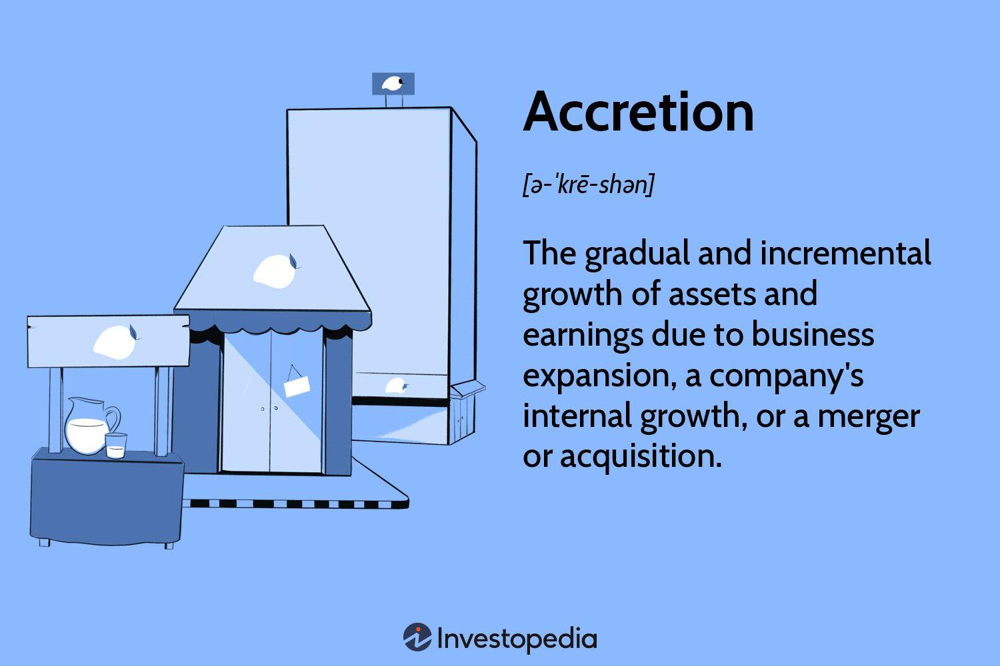

In today's competitive financial landscape, businesses are constantly seeking ways to achieve accretive growth. This article explores the intersection of business growth strategies, financial management, and algorithmic trading. The term 'accretive' in finance refers to any transaction that adds value to a company, often seen in mergers and acquisitions when they increase earnings per share (EPS). The formula used to determine if a transaction is accretive involves comparing the post-transaction EPS with the pre-transaction EPS:

$$
\text{Accretion} = \text{Post-Transaction EPS} - \text{Pre-Transaction EPS}
$$

When the accretion is positive, it indicates that the transaction has added value to the shareholders.

Algorithmic trading (algo trading) is another vital component of modern financial management, utilizing computer algorithms to execute trading strategies at high speed and precision. This approach has revolutionized financial markets by enabling traders to capitalize on market inefficiencies and execute trades far faster than human capabilities could allow. Algorithms can be programmed with a variety of strategies, such as mean reversion, momentum trading, or statistical arbitrage, to seek optimal trading outcomes based on quantitative data analysis.

Our goal is to understand how implementing a sound financial strategy paired with algo trading can drive accretive business growth. By leveraging the speed and precision of algorithmic trading, companies can enhance their financial performance, mitigate risks, and ensure that strategic financial decisions align with their long-term growth objectives.

By integrating concepts of accretion and algorithmic strategies, businesses can potentially optimize financial outcomes and maintain a competitive edge. Companies capable of aligning these methods effectively can not only enhance their market positioning but also ensure sustainable growth in a rapidly evolving financial environment. Understanding these dynamics is critical for developing robust financial strategies that support accretive growth and maximize shareholder value.

## Table of Contents

## Understanding Accretive Growth in Business

Accretive growth represents the enhancement of a company's earnings through deliberate and strategic business maneuvers. This concept is commonly linked with mergers and acquisitions, where the primary objective is ensuring that any acquired entity or asset enhances the company's earnings per share (EPS). To achieve accretive growth, companies must conduct thorough financial analyses and due diligence. This involves assessing whether the prospective assets or companies provide greater value than their acquisition costs.

The foundational principles behind effective accretive strategies lie in the intricate aspects of corporate finance. Companies must thoroughly evaluate various financial metrics and strategic alignments to ensure long-term sustainable growth. This assessment includes analyzing cash flows, potential synergies, and post-acquisition integration plans. The aim is to ensure that the accumulated growth not only boosts shareholder value but also fortifies the organization's market reputation and competitive position.

For instance, when Company A acquires Company B, the transaction is considered accretive if it leads to an increase in EPS. This can be mathematically represented as:

$$
\Delta \text{EPS} = \frac{(\text{Net Income} + \text{Net Income of Acquired Entity}) - (Cost of Acquisition)}{\text{New Total Shares Outstanding}}
$$

If $\Delta \text{EPS} > 0$, the acquisition is deemed accretive.

Moreover, accretive growth strategies necessitate a forward-looking perspective on economic, industry, and market trends to identify opportunities and potential threats. Businesses employing accretive strategies often gain a strategic advantage, as these approaches enable them to optimize their resource allocation and identify opportunities to enhance their market presence.

Overall, accretive growth is not just about immediate financial gains; it requires a comprehensive understanding of the market dynamics and strategic foresight to ensure that growth is both sustainable and value-generating for shareholders.

## Financial Strategies for Business Growth

A comprehensive financial strategy is fundamental for achieving accretive growth. Such a strategy involves key components including capital allocation, cash management, and investment plans that align with the overarching goals of business growth.

Capital allocation is a critical element, as it involves deciding how to best allocate financial resources across different areas of the business. This includes not only investing in profitable projects but also divesting from underperforming sectors to enhance overall returns. Effective capital allocation optimizes the use of funds to generate the highest possible return on investment (ROI).

Cash management is another significant aspect, focusing on maintaining adequate [liquidity](/wiki/liquidity-risk-premium) while ensuring operational efficiency. Efficient cash flow management allows a business to meet its short-term obligations and invest in growth opportunities without compromising financial stability. It involves projecting cash inflows and outflows accurately, managing working capital, and ensuring that surplus funds are invested wisely.

Investment strategies must be closely aligned with growth objectives. Such strategies should consider both organic growth opportunities, such as expanding into new markets or developing new products, and inorganic growth through mergers and acquisitions (M&A). Mergers and acquisitions are potent tools for accretive growth, as they allow companies to quickly gain access to new markets, technologies, and customer bases. However, achieving accretive growth through M&A requires meticulous evaluation of potential targets to ensure that they complement the existing business model and provide tangible financial benefits. Strategic integration is essential to realize the full potential of acquired entities, addressing challenges related to cultural alignment, systems integration, and management structures.

Proper financial planning is indispensable, ensuring that resources are allocated effectively, risks are mitigated, and investment returns are optimized. Effective risk management involves assessing both internal and external risks, developing strategies to minimize their impact, and implementing systems to monitor changing risk profiles. This may include diversifying investments to spread risk or employing financial instruments like derivatives to hedge against potential market fluctuations.

Furthermore, a well-defined financial strategy includes the continuous monitoring of macroeconomic trends, such as interest rates, inflation, and economic growth indicators. By staying informed about these trends, businesses can adjust their business models to better align with the economic environment, optimizing revenue generation and safeguarding against potential downturns.

Incorporating these components into a coherent financial strategy helps businesses to not only achieve accretive growth but also to maintain a competitive advantage in dynamic markets. The integration of financial and operational planning ensures that companies can respond swiftly to emerging opportunities and challenges, thus enhancing their long-term sustainability.

## Algorithmic Trading: A Tool for Financial Strategy

Algorithmic trading, commonly referred to as algo trading, involves the use of specialized computer systems to execute trading orders based on predefined criteria. This approach leverages computational algorithms to exploit market inefficiencies with remarkable precision and speed, dramatically changing the landscape of financial markets.

The incorporation of algo trading into financial strategies provides several advantages. One of the primary benefits is improved market liquidity, arising from the increased [volume](/wiki/volume-trading-strategy) and frequency of trades facilitated by algorithmic systems. Enhanced liquidity, in turn, helps stabilize markets and reduces bid-ask spreads, offering better pricing for traders.

Additionally, algo trading significantly cuts down transaction costs by minimizing the need for manual intervention and allowing for the execution of trades at optimal moments when market conditions are favorable. The speed of execution achieved through automation ensures that trading strategies are implemented instantaneously, thereby reducing delays that could lead to missed opportunities or adverse price movements.

Algorithmic trading encompasses a variety of strategies, each designed to capitalize on specific market behaviors and conditions. Trend-following strategies, for instance, detect and exploit existing market trends by buying or selling assets based on consistent upward or downward price movements. Mean reversion strategies operate on the assumption that asset prices will revert to their historical averages, thus identifying opportunities to buy undervalued assets and sell overvalued ones. Statistical [arbitrage](/wiki/arbitrage) involves the use of statistical models to discover price discrepancies between related financial instruments and execute trades that capitalize on these inefficiencies.

A significant advantage of algo trading is its capacity to mitigate human error and emotional biases that often plague discretionary trading. By executing trades according to predefined rules and logic, algorithmic systems produce more consistent and reliable outcomes, which can be crucial for long-term financial success.

Implementing algo trading successfully necessitates investment in robust technological infrastructure. This includes high-speed internet connections, low-latency trading platforms, and sophisticated computational systems capable of processing large datasets and running complex algorithms. Regulatory and compliance considerations are also pivotal. Firms must navigate legal frameworks and ensure adherence to market regulations, which may vary across different jurisdictions.

In summary, [algorithmic trading](/wiki/algorithmic-trading) has become an indispensable tool for modern financial strategy, offering benefits that enhance liquidity, reduce costs, and improve the efficiency of trade execution. Its successful implementation requires substantial technical resources and a keen awareness of regulatory environments.

## Integrating Accretion with Algorithmic Trading

Integrating accretive strategies with algorithmic trading offers substantial potential for enhancing financial growth within businesses. The combination of these approaches enables companies to better leverage market conditions and identify lucrative investment opportunities that contribute to accretive growth—characterized by an increase in earnings per share (EPS).

Algorithmic models provide a robust framework for assessing complex market environments. By processing large volumes of data at high speeds, these models deliver insights that can inform strategic decisions. For instance, algorithms can analyze historical and real-time data to identify trends and forecast future market behavior. This capability allows businesses to deploy capital more efficiently and exploit arbitrage opportunities that may otherwise be missed through traditional methods.

The utilization of algo trading in accretive strategies enables firms to adapt dynamically to market changes. Automated trading systems monitor financial markets continuously, making it possible to adjust asset allocation and capital deployment in real time. This continuous monitoring and adaptability ensure that resources are allocated where they are most likely to generate accretive returns, while also minimizing exposure to adverse market movements.

Effective integration of accretive strategies with algorithmic trading necessitates seamless collaboration between financial strategists and technology experts. Financial strategists must articulate clear objectives and risk parameters aligned with the company's growth ambitions, while technologists develop and fine-tune algorithms to execute these strategies. This interdisciplinary cooperation ensures that technological tools are aligned with a company's financial goals and operational needs, thus enhancing the overall efficacy of strategic initiatives.

Strategic alignment in this context offers businesses a proactive edge. By utilizing algorithmic systems, companies can react swiftly to emerging opportunities, deploying interventions in a manner that maximizes financial gain without extensive human intervention. This agility in decision-making not only enhances profitability but also reinforces a company's competitive positioning in volatile markets.

In summary, the integration of accretive strategies with algorithmic trading promises significant advancements in financial strategy execution. By capitalizing on the strengths of both disciplines, businesses can refine their approaches to market opportunities, optimize capital use, and enhance overall financial performance.

## Challenges and Considerations

Implementing algorithmic trading involves numerous challenges, primarily due to the complexity and speed at which these automated systems operate. One of the foremost challenges is the significant technology costs associated with developing and maintaining advanced trading algorithms. These costs encompass the need for high-performance computing resources, data storage solutions, and specialized software to execute and monitor trades efficiently. Companies must invest in cutting-edge technology to ensure that their trading systems can process large volumes of data and execute trades swiftly without bottlenecks.

Another critical consideration is algorithm reliability, as any flaw in the algorithm can lead to significant financial losses. Algorithms must be rigorously tested and validated under a variety of market conditions to ensure their robustness. This necessitates comprehensive [backtesting](/wiki/backtesting) and scenario analysis using historical data. Implementing regular algorithmic audits can help identify potential vulnerabilities and refine algorithmic models to align with evolving market dynamics.

Regulatory hurdles also pose a substantial challenge, as financial markets are subject to stringent regulatory oversight. Companies engaged in algorithmic trading must adhere to regulations designed to maintain market integrity and prevent systemic risks. This includes compliance with rules that govern trading activities, such as those related to market manipulation and high-frequency trading. Navigating these regulations requires a thorough understanding of the legal landscape and an ability to adapt promptly to regulatory changes.

Ensuring data integrity is crucial in algorithmic trading, as the success of trading algorithms depends heavily on the quality and accuracy of input data. Companies must establish robust data management practices, which include sourcing reliable data, ensuring data consistency, and safeguarding against data breaches. Advanced risk management systems are also necessary to monitor and control the trading risks inherent in using algorithms, such as market risk, credit risk, and operational risk.

The integration of algorithmic trading into existing business paradigms can be complex, requiring significant organizational change management. Stakeholder engagement is essential to align technology-driven trading strategies with the broader business goals and culture. Furthermore, there is a pressing need for continuous skill development among the workforce. Training employees to manage and optimize algorithmic trading systems is vital, as is fostering a culture of innovation and adaptability.

Ethical considerations must also be addressed to ensure compliance and corporate responsibility. Issues related to market manipulation, such as the potential for algorithms to engage in activities that distort market pricing, must be vigilantly monitored. Information asymmetry, where one party has more or better information than others, can lead to unfair trading advantages if not properly managed. Companies must develop ethical guidelines and oversight mechanisms to preempt these concerns, ensuring that algorithmic trading contributes positively to market fairness and competitiveness.

In conclusion, the successful implementation of algorithmic trading demands a comprehensive approach that addresses technological, regulatory, operational, and ethical challenges. By investing in robust systems, adhering to regulations, and fostering a skilled workforce, companies can harness the full potential of algorithmic trading while mitigating associated risks.

## Conclusion

By combining accretive growth strategies with algorithmic trading, businesses can achieve sustainable financial success. The integration of strategic financial planning and advanced trading algorithms allows companies to maximize their potential for growth by optimizing their resource allocation and capital deployment processes. A meticulous approach is necessary, involving careful financial planning, the seamless integration of technology, and ongoing strategic adjustments to adapt to the ever-changing market dynamics.

Understanding the synergy between accretive strategies and algorithmic trading provides businesses valuable insights into optimizing their growth trajectories. By leveraging algorithmic trading, companies can benefit from data-driven and precise decision-making processes, enhancing their ability to seize profitable opportunities and manage risks efficiently. This strategic alignment allows businesses to maintain a competitive edge by responding promptly to market opportunities and minimizing inefficiencies.

For organizations willing to invest in technology and strategic financial planning, the potential for accretive growth through algo trading is substantial. The introduction of robust algorithmic models and technological infrastructure requires significant commitment and resources. However, the returns can be profoundly positive, as evidenced by improved liquidity, reduced transaction costs, and enhanced market responsiveness.

Continued innovation and strategic foresight are crucial as market dynamics and technological capabilities evolve. Businesses must remain adaptive, regularly evaluate their strategies, and incorporate new technologies and analytical tools to ensure sustainable financial growth. The landscape of financial markets is dynamic, and companies that proactively embrace technological advancements can better navigate challenges and capitalize on emerging opportunities. As such, a progressive mindset in embracing change and innovation is paramount for achieving long-term accretive growth.

## References & Further Reading

[1]: Bergstra, J., Bardenet, R., Bengio, Y., & Kégl, B. (2011). ["Algorithms for Hyper-Parameter Optimization."](https://dl.acm.org/doi/10.5555/2986459.2986743) Advances in Neural Information Processing Systems 24.

[2]: ["Advances in Financial Machine Learning"](https://www.amazon.com/Advances-Financial-Machine-Learning-Marcos/dp/1119482089) by Marcos Lopez de Prado

[3]: ["Evidence-Based Technical Analysis: Applying the Scientific Method and Statistical Inference to Trading Signals"](https://www.amazon.com/Evidence-Based-Technical-Analysis-Scientific-Statistical/dp/0470008741) by David Aronson

[4]: ["Machine Learning for Algorithmic Trading"](https://github.com/stefan-jansen/machine-learning-for-trading) by Stefan Jansen

[5]: ["Quantitative Trading: How to Build Your Own Algorithmic Trading Business"](https://github.com/LucindaYa/quant-resources/blob/master/Quantitative%20Trading%20How%20to%20Build%20Your%20Own%20Algorithmic%20Trading%20Business.pdf) by Ernest P. Chan