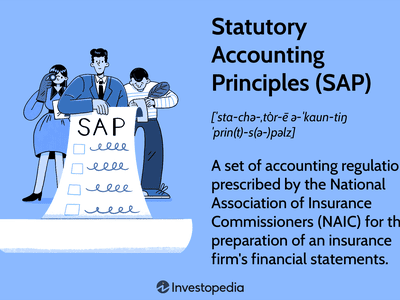

In today's rapidly evolving financial landscape, harnessing technological solutions is crucial for sustaining both efficiency and competitiveness. Among the pivotal areas transforming the financial sector are financial management, SAP accrual accounting, and algorithmic trading. Each of these domains contributes uniquely to the optimization of financial processes, enhancing strategic decision-making and operational prowess.

Financial management serves as the backbone of any organization's financial operations, encompassing strategic planning, capital budgeting, and precise financial reporting. The introduction of advanced digital tools has streamlined these processes, allowing for more instantaneous and informed decisions. In particular, solutions like SAP (Systems, Applications, and Products in Data Processing) have revolutionized financial management by providing a robust framework for organizing and analyzing financial data in real time.



SAP accrual accounting plays a vital role in maintaining an accurate and timely representation of an organization's financial health. Unlike cash accounting, accrual accounting records financial transactions when they are incurred, offering a more comprehensive view of financial performance and obligations. SAP's innovative tools for accrual accounting help businesses customize their accounting processes, ensuring compliance and enhanced financial precision.

Algorithmic trading, another critical component of modern financial operations, involves the utilization of algorithms to execute trades at speeds and frequencies far beyond human capabilities. This approach not only maximizes trade efficiency but also reduces transaction costs. By processing vast amounts of financial data quickly and accurately, algorithmic trading systems can respond to market changes almost instantaneously, creating a competitive edge for financial institutions.

This article investigates into the intersection of these three domains, exploring their individual capabilities and the synergistic potential when integrated. By examining the fusion of financial management, SAP systems, and algorithmic trading, we uncover new pathways to achieving operational excellence and strategic financial growth. This synergy not only enhances an organization's technological adoption but also establishes a foundation for future innovations in the financial sector.

## Table of Contents

## Understanding Financial Management

Financial management is a crucial component of organizational success, focusing on the strategic planning, organizing, directing, and controlling of financial resources. Its primary goals are to ensure the efficient acquisition and allocation of resources, maximize shareholder value, and maintain financial sustainability. Central to financial management are three core areas: capital budgeting, risk management, and financial reporting.

Capital budgeting involves evaluating potential major investments or expenditures. It is a process that enables organizations to determine the best investment options through the assessment of cash flows and potential returns. Techniques like Net Present Value (NPV), Internal Rate of Return (IRR), and Payback Period are commonly used to evaluate projects. These calculations help in forecasting the profitability of investment opportunities:

$$
\text{NPV} = \sum \left(\frac{R_t}{(1+i)^t}\right) - C_0
$$

Where $R_t$ is net cash inflow, $i$ is the discount rate, $t$ is the time period, and $C_0$ is the initial investment.

Risk management is another fundamental aspect, focusing on identifying, assessing, and controlling threats to an organization's capital and earnings. These risks can stem from various sources including financial uncertainties, legal liabilities, and strategic management errors. Effective risk management ensures that the organization mitigates adverse effects while maximizing opportunities.

Financial reporting refers to the structured presentation of financial data, providing insights into an organization's financial performance and position. It includes crafting financial statements like the balance sheet, income statement, and cash flow statement, which are critical for stakeholders' decision-making processes. Transparency and accuracy in reporting are paramount to maintaining stakeholder trust and complying with legal and regulatory standards.

The integration of SAP (Systems, Applications, and Products in Data Processing) solutions has significantly streamlined financial management processes. SAP offers comprehensive tools that enhance the precision and efficiency of financial operations, notably in reporting and real-time data analysis. The platform supports data centralization, facilitating immediate access to financial insights, which enhances strategic decision-making capabilities.

SAP's powerful analytics and reporting functions provide organizations with the ability to generate reports automatically and conduct sophisticated data analyses swiftly. This capability reduces manual errors and accelerates the reporting cycle, allowing financial managers to work more efficiently and focus on strategic initiatives.

In summary, financial management's strategic role encompasses both maintaining operational efficiency and achieving long-term business objectives. Through the integration of SAP solutions, organizations can enhance capital investment decisions, mitigate risks effectively, and produce accurate financial reports, ultimately leading to improved economic performance.

## The Role of SAP in Accrual Accounting

SAP, widely recognized as a comprehensive enterprise software solution, provides essential functionalities that streamline accrual accounting, a critical aspect of modern financial operations. Accrual accounting is a method that records financial transactions at the moment they occur, rather than when cash is exchanged. This practice ensures that financial statements present a more accurate and timely reflection of a company's financial position. The SAP system is instrumental in managing these processes efficiently.

One of the key offerings of SAP is its robust accrual engine. This engine is designed to accommodate the customization of accounting processes, aligning them with specific organizational requirements. Such customization enhances both compliance with regulatory standards and the precision of financial data recording. The flexibility provided by the SAP accrual engine is beneficial for companies that deal with complex financial environments where transactions often require nuanced reporting approaches.

SAP's capability to automate many aspects of accrual accounting significantly reduces the scope for human error. Automation ensures consistent application of accounting rules and principles across the organization's financial transactions, which is crucial for maintaining the integrity of financial reports. As a result, businesses can achieve a higher level of accuracy in their financial statements, which is vital for strategic decision-making and establishing stakeholder trust.

Moreover, SAP's integration capabilities allow for seamless interaction with other financial and operational systems within an organization. This integration facilitates real-time data sharing and analytics, which are indispensable for timely financial reporting and analysis. By enabling businesses to have up-to-date insights into their financial standing, SAP supports more agile financial management and strategic foresight.

The adoption of SAP for accrual accounting extends beyond mere compliance and reporting. It provides a scalable platform that supports the growth and diversification of businesses by allowing them to adapt their financial processes in line with evolving market demands. This adaptability positions SAP as a crucial tool for enterprises aiming to enhance their financial management practices and achieve comprehensive operational efficiency.

## Integration of SAP with Algorithmic Trading

Algorithmic trading involves the use of sophisticated algorithms to automate trading decisions, maximizing efficiency, and minimizing human intervention in financial markets. These algorithms analyze vast amounts of financial data to execute trades at a speed and accuracy that surpass human capabilities. The integration of SAP systems with [algorithmic trading](/wiki/algorithmic-trading) can significantly enhance this process by providing detailed financial data and real-time analytics.

SAP systems, renowned for their robust data processing capabilities, enable organizations to manage and analyze financial data efficiently. When integrated with algorithmic trading systems, SAP can provide a comprehensive data backbone that informs and refines trading algorithms. This interaction allows traders to access a richer dataset, enhancing the accuracy and reliability of their trading strategies. 

For instance, SAP's advanced analytics tools can process real-time market data and historical trends, delivering actionable insights that help in the optimization of trading algorithms. The availability of such precise data aids algorithms in predicting market trends and adjusting trading tactics accordingly. By leveraging SAP’s data management capabilities, traders can develop more predictive models, leading to more informed and strategic trading decisions.

Furthermore, SAP’s data processing features can facilitate a smoother integration by ensuring data consistency and integrity across the organization. This is critical for algorithmic trading, which relies heavily on precise and consistent data input. By reducing data discrepancies, SAP enhances the efficiency of the algorithms, contributing to better risk management and improved financial outcomes.

The combination of SAP's powerful data management systems and algorithmic trading can result in increased trading volumes, reduced transaction costs, and enhanced profitability. As financial markets continue to evolve, the role of integrated systems like SAP in optimizing algorithmic trading will likely become more prominent, driving innovation and efficiency in trading operations.

## Benefits and Challenges

The amalgamation of financial management, SAP accrual accounting, and algorithmic trading offers significant advantages to organizations seeking to enhance operational efficiency and financial insight. By integrating these advanced systems, businesses can achieve higher accuracy in their financial processes, resulting in improved decision-making capabilities.

One primary benefit is the increase in efficiency achieved through automation and the streamlined flow of financial information. SAP accrual accounting automates the recognition of financial transactions as they occur, providing real-time data that supports efficient capital budgeting and risk management. This real-time approach allows organizations to maintain a precise financial picture, crucial for strategic planning and resource allocation.

Algorithmic trading further enhances these benefits by leveraging sophisticated algorithms to automate trading decisions. This automation ensures trades are executed with speed and precision, capitalizing on market opportunities that human traders may not identify promptly. The integration of comprehensive data analytics from SAP systems fuels these algorithms, optimizing trading strategies and maximizing returns.

Despite these advantages, organizations face several challenges. Integration complexity is a major hurdle, requiring seamless connectivity between financial management systems, SAP accounting, and trading platforms. This complexity necessitates a robust IT infrastructure and vigilant coordination among teams to ensure successful implementation.

Cybersecurity presents another significant challenge as these technologies involve handling vast amounts of sensitive financial data. Protecting this data from cyber threats requires advanced security measures, continuous monitoring, and regular updates to security protocols.

The successful adoption of these technologies demands careful planning and strategic transition management. Organizations must invest in training programs to equip their staff with the skills needed to operate these advanced systems. Additionally, a phased implementation approach can mitigate potential disruptions, allowing organizations to adapt gradually and effectively to these technological changes. By addressing these challenges with a comprehensive strategy, businesses can harness the full potential of integrating financial management, SAP accrual accounting, and algorithmic trading systems.

## Case Studies and Real-World Applications

Many leading financial institutions have achieved notable success by integrating SAP solutions with algorithmic trading systems. This integration has led to enhanced performance metrics and more informed decision-making capabilities. The application of SAP in these areas provides robust data management, which is paramount for the efficiency and accuracy required in algorithmic trading.

One case study involves a multinational banking corporation that embraced SAP HANA, a high-performance analytics appliance, in conjunction with its existing trading algorithms. The integration enabled real-time data processing, significantly reducing latency in trade execution. With SAP HANA's in-memory computing capabilities, the bank could analyze vast amounts of market data instantaneously, leading to more strategic trading decisions. As a result, the institution reported a 30% increase in trading volumes and a 20% reduction in the operational costs associated with data processing.

In another instance, a prominent asset management firm implemented SAP's Business Technology Platform to integrate financial accounting with their trading systems. This integration facilitated seamless reporting and compliance checks, crucial for adhering to regulatory standards in different markets. The real-time synchronization between SAP's accrual accounting tools and the firm's algorithmic models allowed for an accurate assessment of financial positions, optimizing their portfolio management strategies. The firm realized an ROI improvement of approximately 25% within the first year of implementation, attributing the gains to more accurate pricing models and reduced risk exposure.

Furthermore, a global [hedge fund](/wiki/hedge-fund-trading-strategies), through SAP's AI-driven data analytics tools, optimized its trading algorithms by incorporating [machine learning](/wiki/machine-learning) techniques. These tools analyzed historical trade data to identify patterns and predict market movements, refining the algorithms for future trades. This technological advancement not only improved the fund's predictive accuracy but also resulted in a 15% increase in portfolio returns, demonstrating the substantial impact of integrating SAP with algorithmic approaches in trading.

These case studies underscore the transformative potential of SAP integration in algorithmic trading within financial operations. They illustrate a clear enhancement in performance metrics and decision-making capabilities, alongside efficient resource utilization and substantial return on investment. As more financial institutions explore these technological synergies, the landscape of financial trading continues to evolve, promising further advancements and competitive advantages.

## Future Trends and Developments

The future of financial management is becoming increasingly data-driven, with SAP and algorithmic trading playing pivotal roles in this transformation. As the financial industry continues to adopt advanced technologies, several trends and developments are shaping its future trajectory.

One significant trend is the integration of [artificial intelligence](/wiki/ai-artificial-intelligence) (AI) and machine learning (ML) within SAP and algorithmic trading systems. These technologies are expected to significantly enhance the capability of financial management tools by providing more sophisticated analysis and predictions. AI algorithms can process vast amounts of data, identifying patterns and trends that might be missed by traditional methods. This ability can lead to more accurate financial forecasts and better risk assessments.

Python, widely used for data analysis and machine learning, is an ideal tool for implementing AI-driven financial strategies. A simple example of a machine learning model using Python to predict stock prices might look like this:

```python
import numpy as np
import pandas as pd
from sklearn.model_selection import train_test_split
from sklearn.ensemble import RandomForestRegressor

# Load your dataset
data = pd.read_csv('financial_data.csv')

# Preprocess and split the data
features = data.drop('StockPrice', axis=1)
labels = data['StockPrice']
X_train, X_test, y_train, y_test = train_test_split(features, labels, test_size=0.2, random_state=42)

# Train the model
model = RandomForestRegressor(n_estimators=100, random_state=42)
model.fit(X_train, y_train)

# Make predictions
predictions = model.predict(X_test)

# Display results
print(predictions)
```

This code outlines a basic framework for a machine learning model that can be expanded and refined with more complex algorithms for increased predictive power.

Another aspect of the future of financial management is the exploration of novel ways to enhance the integration of SAP systems with algorithmic trading. These improvements focus on real-time data processing and the optimization of decision-making processes. By leveraging the extensive data processing and analytics capabilities of SAP, financial institutions can develop more efficient trading algorithms, allowing them to respond quickly to market changes and potential opportunities.

Furthermore, advancements in blockchain technology are expected to impact financial management and trading practices. The transparency and security of blockchain can improve transaction recording and verification, thereby enhancing trust and reducing fraud in financial markets.

To capitalize on these future trends, organizations need to adopt a proactive and strategic approach. This involves continuous learning and adaptation to new technologies, investing in skills development, and updating infrastructure to support these advanced tools. By doing so, businesses can harness the full potential of SAP and algorithmic trading, gaining valuable insights and achieving a competitive advantage in an increasingly complex financial landscape.

## Conclusion

The synergy between financial management, SAP accrual accounting, and algorithmic trading represents a significant evolution in the financial sector's technological landscape. This integration allows businesses to leverage the precision and reliability of SAP accrual accounting, ensuring that financial records present an accurate reflection of a company's financial health. By automating financial transactions and maintaining precise records, businesses can generate real-time insights, which enhance decision-making processes and strategic planning.

SAP accrual accounting contributes to this synergy by offering tools that help organizations track their financial performance meticulously, providing detailed analytics and compliance with regulatory standards. When combined with algorithmic trading, organizations can further benefit from accelerated trading execution and enhanced pricing strategies. Algorithmic trading systems analyze vast datasets to identify optimal trading opportunities, and the integration with SAP means these decisions are underpinned by robust financial data, providing a strategic edge.

Leveraging these technological advancements cultivates significant improvements in operational efficiency and agility. Businesses can automate labor-intensive processes, reduce the risk of human error, and respond swiftly to market changes. This capacity to pivot is increasingly crucial, given the rapid evolution of markets and technological infrastructures. 

However, as with any technological innovation, continuous monitoring and adaptation are necessary. Financial leaders must remain informed about developments in artificial intelligence, machine learning, and other emerging technologies that could enhance these existing systems. By staying updated on these advancements, financial institutions can maintain their competitive edge, ensuring compliance with evolving frameworks and maximizing their return on investment.

The ongoing transformation in financial management, facilitated by the confluence of SAP accrual accounting and algorithmic trading, underscores the importance of embracing technology. It equips businesses not only with enhanced financial insights but also with the agility required to navigate an increasingly complex financial landscape.

## References & Further Reading

[1]: Bergstra, J., Bardenet, R., Bengio, Y., & Kégl, B. (2011). ["Algorithms for Hyper-Parameter Optimization."](https://dl.acm.org/doi/10.5555/2986459.2986743) Advances in Neural Information Processing Systems 24.

[2]: ["Advances in Financial Machine Learning"](https://www.amazon.com/Advances-Financial-Machine-Learning-Marcos/dp/1119482089) by Marcos Lopez de Prado

[3]: ["Evidence-Based Technical Analysis: Applying the Scientific Method and Statistical Inference to Trading Signals"](https://www.amazon.com/Evidence-Based-Technical-Analysis-Scientific-Statistical/dp/0470008741) by David Aronson

[4]: ["Machine Learning for Algorithmic Trading"](https://github.com/stefan-jansen/machine-learning-for-trading) by Stefan Jansen

[5]: ["Quantitative Trading: How to Build Your Own Algorithmic Trading Business"](https://www.amazon.com/Quantitative-Trading-Build-Algorithmic-Business/dp/1119800064) by Ernest P. Chan