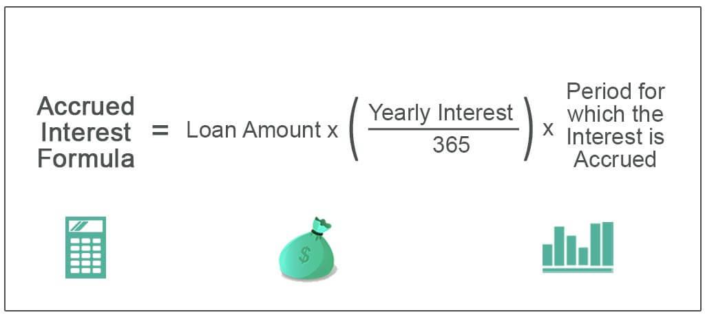

Accrual bonds, investment finance, and algorithmic trading constitute crucial elements of the financial markets, each contributing uniquely to the evolution of investment strategies. Accrual bonds, unlike traditional bonds, defer interest payments until maturity. This characteristic parallels zero-coupon bonds where interest is compounded and added to the principal, thereby enhancing its value over time. These bonds are sold at a discount and are advantageous for investors seeking long-term growth and reinvestment risk mitigation.

In contrast, algorithmic trading leverages advanced algorithms and automates trade execution with remarkable speed and precision. It has transformed financial markets by increasing efficiency, liquidity, and depth through data analytics. These algorithms allow traders to process vast data volumes rapidly, capitalizing on short-lived market opportunities.



The interplay between accrual bonds and algorithmic trading is significant for investors aiming to optimize their portfolios. The synergy lies in the potential of algorithmic models to integrate accrual bond data, refining trading strategies and enhancing performance. As these financial instruments and technologies continue to evolve, understanding their dynamics is essential for investors hoping to navigate the modern financial landscape effectively. This article will examine how these domains converge to shape current and future investment approaches.

## Table of Contents

## Understanding Accrual Bonds

Accrual bonds are a unique category of debt securities that defer interest payments until the bond's maturity, distinguishing them from traditional bonds, which typically pay interest at regular intervals. These bonds function similarly to zero-coupon bonds wherein the interest is not paid out periodically; rather, it is compounded and added to the bond's principal over time. This compounding effect results in the bond's value increasing until it matures, at which point the investor receives a lump sum that constitutes both the original principal and the accrued interest.

Often issued at a significant discount to their face value, accrual bonds provide a distinct advantage by mitigating reinvestment risk—a concern for fixed-income investors who speculate on the future rates at which they might reinvest interim cash flows. Unlike regular bonds that generate periodic cash flows subject to current market interest rates, accrual bonds allow holders to avoid the uncertainties of reinvesting these payments. Investors essentially lock in a yield determined at the bond's issuance, regardless of future interest rate fluctuations.

For taxation purposes, the imputed interest on accrual bonds, which represents the compounded amount that accrues annually, is often treated as taxable income by the Internal Revenue Service (IRS). This stipulation necessitates careful tax planning since investors are required to pay taxes on income they have not yet physically received, also referred to as "phantom income." A strategic approach to managing this tax liability is crucial to optimizing the bond's after-tax yield and investment outcomes.

Accrual bonds are particularly appealing to investors prioritizing long-term capital appreciation over generating immediate income. These investors—such as those planning for retirement or funding future liabilities—benefit from the bonds' inherent characteristics, allowing their investment to grow over time without the need for active income management. Essentially, the appeal of accrual bonds lies in their compound growth potential, a feature that matches the financial objectives of individuals or entities focused on the accumulation of wealth over prolonged horizons.

## Investment Finance Strategies with Accrual Bonds

Accrual bonds represent a strategic asset for diversifying a fixed-income portfolio. Unlike traditional bonds that offer periodic interest payments, accrual bonds defer these payments, leading to potential tax implications that investors must consider based on their unique financial circumstances. The tax treatment of these bonds requires investors to account for imputed interest annually, even though actual payments are deferred until maturity. This necessitates strategic tax planning, particularly for investors in higher tax brackets.

Furthermore, the risks associated with [interest rate](/wiki/interest-rate-trading-strategies) fluctuations are crucial when managing accrual bonds. As bond prices inversely correlate with interest rate movements, a rising rate environment can lead to declines in bond prices. Accrual bonds, sold at a discount, are particularly sensitive to such changes. Therefore, understanding duration—a measure of a bond’s sensitivity to interest rate changes—is critical in assessing potential risks. Duration can be calculated using the formula:

$$
\text{Modified Duration} = \frac{\text{Macaulay Duration}}{1 + \frac{YTM}{n}}
$$

where YTM is the yield to maturity and n is the number of compounding periods per year.

Accrual bonds are well-suited for investors focused on long-term financial goals. Their deferred interest payments minimize reinvestment risk, providing a stable income stream at maturity which can serve as a hedge against market [volatility](/wiki/volatility-trading-strategies). Investors with a long-term horizon often incorporate accrual bonds to achieve growth without the immediate need for periodic income.

To optimize investment strategies with accrual bonds, analyzing prevailing market conditions and interest rate forecasts is essential. Techniques such as the duration gap analysis can be employed to assess the difference between the durations of assets and liabilities, thereby managing interest rate risk. Additionally, sophisticated quantitative models and simulations can aid in predicting future rate movements and their impact on bond valuations.

Python, a powerful tool in financial analysis, can be employed to perform such simulations. For instance, the following Python code snippet illustrates the calculation of bond prices under varying interest rate scenarios:

```python
def bond_price(face_value, coupon_rate, market_rate, periods):
    coupon = face_value * coupon_rate
    price = sum([coupon / (1 + market_rate)**t for t in range(1, periods + 1)])
    price += face_value / (1 + market_rate)**periods
    return price

face_value = 1000
coupon_rate = 0.05
market_rates = [0.03, 0.04, 0.05, 0.06, 0.07]
periods = 10

prices = [bond_price(face_value, coupon_rate, r, periods) for r in market_rates]
print(prices)
```

This code calculates the price of a bond across different market rates, showcasing how interest rate variations impact bond values and thus portfolio strategies. Through a combination of financial understanding and computational analysis, investors can effectively harness accrual bonds within their investment portfolios.

## Algorithmic Trading and Its Impact on Bond Markets

Algorithmic trading employs sophisticated algorithms to execute trades at high speeds, fundamentally altering the landscape of bond markets. This technological integration facilitates enhanced [liquidity](/wiki/liquidity-risk-premium) and market depth by automating numerous aspects of trading that were traditionally manual and time-consuming. 

By leveraging data analytics, [algorithmic trading](/wiki/algorithmic-trading) allows for improved precision in both trade execution and risk management. Complex algorithms can analyze large datasets to identify trends, sentiments, and [arbitrage](/wiki/arbitrage) opportunities, enabling traders to act swiftly on market information. This capability is particularly beneficial in bond markets, where price movements can be subtle yet significant, and margins for error are minimal.

Algorithmic trading systems are capable of processing vast amounts of data, which enables traders to capitalize on fleeting market opportunities. For instance, these systems can scan multiple markets simultaneously, executing trades based on predefined criteria that incorporate real-time data analysis. This kind of rapid decision-making is crucial in exploiting temporary price inefficiencies across bond markets.

Traders can implement strategies such as [statistical arbitrage](/wiki/statistical-arbitrage) to exploit price inefficiencies in bond markets. Statistical arbitrage involves the use of mathematical models to identify and profit from temporary mispricings. The strategy typically requires extensive computation, making it particularly well-suited to algorithmic execution. Here is a simple Python example of how a statistical arbitrage strategy might be backtested:

```python
import numpy as np
import pandas as pd

# Assume bond_prices is a DataFrame containing historical price data for two bonds
def compute_spread(bond1, bond2):
    return bond1 - bond2

def backtest_strategy(bond_prices, threshold):
    spread = compute_spread(bond_prices['BondA'], bond_prices['BondB'])
    signals = np.where(spread > threshold, -1, np.where(spread < -threshold, 1, 0))
    returns = spread.shift(1) * signals
    return returns.sum()

# Example usage
bond_prices = pd.DataFrame({
    'BondA': np.random.randn(100),
    'BondB': np.random.randn(100)
})

total_returns = backtest_strategy(bond_prices, 0.5)
print(f"Total Returns: {total_returns}")
```

This script calculates the spread between two bond prices ('BondA' and 'BondB'), generates buy or sell signals based on a threshold, and computes the returns from these signals. Such strategies are contingent on speed and accuracy, underscoring the importance of algorithmic systems in modern financial markets.

Therefore, algorithmic trading represents a critical evolution in the bond markets, offering enhanced efficiency and the potential for substantial returns through advanced analytical and computational methods.

## The Intersection of Accrual Bonds and Algorithmic Trading

Algorithmic trading and accrual bonds represent two sophisticated components that, when combined, can significantly enhance trading strategies in the financial market. Algorithmic trading benefits from data that accrual bonds provide due to the specific characteristics inherent in these financial instruments.

Accrual bonds accrue interest over time, and this accumulated interest becomes part of the bond's principal. The distinct feature of these bonds, where interest is compounded and paid at maturity, necessitates a thorough understanding of its "dated date" and other characteristics. The dated date marks the commencement of interest accrual, which forms the basis for computing the compound interest over time.

Incorporating accrual bond data into algorithmic trading models improves the precision of these models. Sophisticated algorithms calculate not only the future cash flows but also their present value, allowing traders to price these bonds accurately. For instance, the present value $PV$ of an accrual bond can be expressed as:

$$
PV = \frac{F}{(1 + r)^n}
$$

where $F$ is the future value of the bond at maturity, $r$ is the discount rate, and $n$ is the number of compounding periods until maturity. Accurate cash flow calculations enhance trading decisions, allowing for more competitive pricing and better risk assessment.

Detailed bond issuance data, including the dated date, is crucial in algorithmic strategies as it impacts the yield and the return predictions for these bonds. By obtaining comprehensive data on bond issuances and the respective characteristics of accrual bonds, algorithms can simulate various market conditions, making them a powerful tool in volatile market environments.

The integration of identified elements like dated dates into trading systems optimizes both trading speed and accuracy. Application of [machine learning](/wiki/machine-learning) algorithms can sift through historical data and identify patterns that assist in predicting future market trends associated with accrual bonds. In essence, this synergy provides a competitive edge in identifying investment opportunities and executing trades before traditional market mechanisms can react.

As these financial technologies evolve, understanding and leveraging the unique attributes of accrual bonds within algorithmic frameworks continue to be a pioneering frontier that could shape future innovations in the financial markets.

## Conclusion

The integration of accrual bond investment and algorithmic trading underscores the complexity and dynamism evident in contemporary financial markets. Accrual bonds, with their unique structure of deferred interest payments, offer a compelling option for investors targeting long-term capital appreciation. Meanwhile, algorithmic trading has brought forth a paradigm shift in how financial transactions are executed, with enhanced precision and speed. This amalgamation of investment techniques demands that investors are well-versed in both domains to fully leverage the opportunities presented.

Investors who effectively combine the strategic deployment of accrual bonds with algorithmic trading can potentially enhance their portfolios' growth. The deferred interest nature of accrual bonds aligns well with algorithmic trading's capability to dissect large datasets and forecast market movements, thus optimizing decision-making. For instance, an algorithmic model might incorporate accrual bond characteristics to predict interest compounding or market fluctuations over a specific term, making it a vital tool for portfolio optimization.

The rapid pace of technological advancements in finance calls for persistent education and strategy recalibration. As fintech innovations continue to evolve, remaining informed and adaptable becomes crucial for sustaining competitive advantage and realizing strategic financial gains. Adopting and integrating cutting-edge technology, such as machine learning and advanced data analytics within trading systems, can further refine trading strategies and bolster an investor's tactical acumen.

Looking ahead, the synergy between accrual bonds and algorithmic trading is poised to become even more pronounced. As financial markets develop, this relationship will likely catalyze further innovations, leading to more sophisticated financial instruments and strategies. This ongoing evolution emphasizes the necessity for investors to maintain a forward-thinking approach, continuously integrating new insights and technologies to navigate the shifting financial landscape efficiently.

## References & Further Reading

[1]: Fabozzi, F. J. (1999). ["Bond Markets, Analysis, and Strategies."](https://books.google.com/books/about/Bond_Markets_Analysis_and_Strategies_ten.html?id=bQpNEAAAQBAJ) Prentice Hall.

[2]: Lopez de Prado, M. (2018). ["Advances in Financial Machine Learning."](https://www.amazon.com/Advances-Financial-Machine-Learning-Marcos/dp/1119482089) Wiley.

[3]: Chan, E. P. (2008). ["Quantitative Trading: How to Build Your Own Algorithmic Trading Business."](https://github.com/ftvision/quant_trading_echan_book) Wiley.

[4]: Aronson, D. R. (2006). ["Evidence-Based Technical Analysis: Applying the Scientific Method and Statistical Inference to Trading Signals."](https://www.amazon.com/Evidence-Based-Technical-Analysis-Scientific-Statistical/dp/0470008741) Wiley.

[5]: Jansen, S. (2020). ["Machine Learning for Algorithmic Trading: Predictive models to extract signals from market and alternative data for systematic trading strategies with Python."](https://www.amazon.com/Machine-Learning-Algorithmic-Trading-alternative/dp/1839217715) Packt Publishing.

[6]: Hull, J. (2012). ["Options, Futures, and Other Derivatives."](https://www.semanticscholar.org/paper/Options%2C-Futures%2C-and-Other-Derivatives-Hull/89bdee500c8623864fc9eb7a471546aa713acc44) Pearson.

[7]: Aitken, M. & Corb, H. (2009). ["Algorithmic Trading Practices in Fixed Income Markets."](https://www.researchgate.net/publication/286404103_Market_Fairness_The_Poor_Country_Cousin_of_Market_Efficiency) CFA Institute.

[8]: Carter, C. & Fabozzi, F. J. (2001). ["The Handbook of Fixed Income Securities."](https://www.mhebooklibrary.com/doi/book/10.1036/9781260473902) McGraw-Hill.