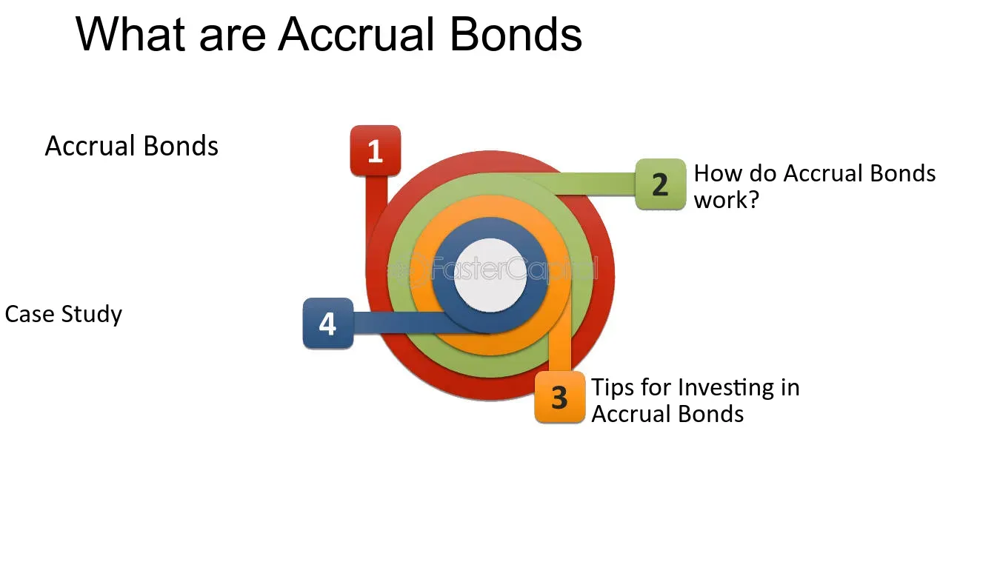

## Table of Contents

## What is an accrual bond?

An accrual bond is a type of bond where the interest earned is not paid out to the investor until the bond matures. Instead of receiving regular interest payments, like with most bonds, the interest accumulates over time and is added to the bond's value. This means that the investor gets a lump sum payment at the end of the bond's term, which includes both the original amount invested and all the interest that has been accruing.

These bonds are often used in structured finance and can be part of more complex financial products. They might appeal to investors who are looking for a larger payout at the end of the investment period rather than smaller, regular payments. However, because the interest is not paid out until maturity, accrual bonds can carry more risk, especially if the issuer faces financial difficulties before the bond matures.

## How does an accrual bond differ from other types of bonds?

An accrual bond is different from other types of bonds because it doesn't pay interest to the investor until the bond reaches its maturity date. With most bonds, like coupon bonds, investors get regular interest payments, usually every six months or a year. But with an accrual bond, the interest just builds up over time and is added to the bond's value. So, when the bond matures, the investor gets one big payment that includes the original amount they invested plus all the interest that has been added up.

This difference can affect how investors think about accrual bonds. Some people might like accrual bonds because they get a bigger payment at the end, which could be good for long-term savings goals. But, there's also more risk with accrual bonds. If the company or government that issued the bond runs into money problems before the bond matures, the investor might not get their interest or even their original investment back. So, while accrual bonds can offer a big payout at the end, they also come with more uncertainty than bonds that pay interest regularly.

## What are the key features of an accrual bond?

An accrual bond is a special kind of bond where you don't get paid interest until the bond reaches its end date. Instead of getting small payments every now and then, like with most bonds, the interest just keeps adding up over time. So, when the bond finally matures, you get one big payment that includes the money you originally put in plus all the interest that has been piling up.

This can be good if you're saving for something big in the future because you get a larger amount at the end. But, it also means there's more risk. If the company or government that issued the bond has money troubles before it matures, you might not get your interest or even your original money back. So, while accrual bonds can offer a big payout at the end, they also come with more uncertainty than bonds that pay interest regularly.

## How does the accrual mechanism work in an accrual bond?

In an accrual bond, the interest doesn't get paid to you bit by bit like with most bonds. Instead, it just keeps adding up over time. Imagine you put money into a piggy bank, but instead of taking out coins every now and then, you just keep adding more and more coins until the end. That's how the interest works in an accrual bond. It stays in the bond and grows until the bond reaches its maturity date.

When the bond finally matures, you get one big payment. This payment includes the money you originally invested, plus all the interest that has been adding up over the years. It's like getting a big reward at the end for waiting patiently. But, there's a catch. If the company or government that issued the bond runs into financial trouble before it matures, you might not get your interest or even your original money back. So, while accrual bonds can offer a big payout at the end, they also come with more risk than bonds that pay interest regularly.

## What are the benefits of investing in accrual bonds?

One big benefit of investing in accrual bonds is that you get a larger payment at the end. Instead of getting small interest payments every now and then, the interest just keeps adding up over time. So, when the bond matures, you get one big payment that includes all the interest that has been piling up. This can be really good if you're saving for something big in the future, like buying a house or paying for college, because you get a bigger amount at the end.

Another benefit is that accrual bonds can be a good choice if you want to keep your money invested without having to worry about what to do with small interest payments. With regular bonds, you might have to decide what to do with the interest every time you get it. But with an accrual bond, the interest stays in the bond and keeps growing until the end. This can make things simpler and help your money grow more over time.

## What are the risks associated with accrual bonds?

One big risk with accrual bonds is that you don't get any interest until the bond matures. If the company or government that issued the bond runs into money problems before that happens, you might not get your interest or even your original money back. This makes accrual bonds riskier than bonds that pay interest regularly because you have to wait longer to see if you'll get paid.

Another risk is that accrual bonds can be harder to sell before they mature. If you need your money back before the bond's end date, you might have a hard time finding someone to buy it from you. This can make it tricky if you need to get your money out quickly. So, while accrual bonds can offer a big payout at the end, they also come with more uncertainty and less flexibility than other types of bonds.

## How is interest calculated and paid on an accrual bond?

In an accrual bond, the interest is calculated just like with other bonds, usually based on a fixed rate. But instead of getting paid out regularly, the interest stays with the bond and keeps adding up over time. Imagine you're adding pennies to a piggy bank every day, but you don't take any out until the end of the year. That's how the interest works in an accrual bond. It keeps growing until the bond reaches its maturity date.

When the bond finally matures, you get one big payment. This payment includes the money you originally put into the bond, plus all the interest that has been adding up over the years. It's like getting a big reward at the end for waiting patiently. But, there's a risk. If the company or government that issued the bond has money troubles before it matures, you might not get your interest or even your original money back. So, while accrual bonds can offer a big payout at the end, they also come with more risk than bonds that pay interest regularly.

## Can you explain the role of accrual bonds in portfolio diversification?

Accrual bonds can play a special role in helping you spread out your investments, which is called diversification. When you have different kinds of investments, it can help lower your risk because if one type of investment does badly, the others might do well and balance things out. Accrual bonds are different from other bonds because they don't pay interest until the very end. This can be good if you're looking for a bigger payment at the end of your investment period, which can be useful for long-term goals like saving for retirement or a big purchase.

Adding accrual bonds to your portfolio can also help because they might not move up and down in value at the same time as other investments like stocks or regular bonds. This means that if the stock market is doing badly, your accrual bonds might still be doing okay, which can help keep your overall investments more stable. But, remember that accrual bonds come with more risk because you have to wait until the end to get your interest, and if the company that issued the bond has money problems, you might not get paid at all. So, while they can help diversify your portfolio, you need to think about the risks and how they fit with your overall investment plan.

## What are the tax implications of investing in accrual bonds?

When you invest in accrual bonds, you need to think about taxes. Even though you don't get the interest until the bond matures, you might still have to pay taxes on the interest every year. This is because the IRS considers the interest you earn each year as income, even if you don't actually get the money until later. So, you'll need to report this "accrued" interest on your taxes every year, which can be a bit tricky because you're paying taxes on money you haven't received yet.

This can affect your cash flow because you're paying taxes without getting the interest payments to help cover those taxes. It's important to keep good records of the interest that's accruing so you can report it correctly on your tax return. If you're not sure how to handle the taxes on your accrual bonds, it might be a good idea to talk to a tax professional who can help you figure it out and make sure you're doing everything right.

## How do market conditions affect the performance of accrual bonds?

Market conditions can have a big impact on how well accrual bonds do. If interest rates go up, the value of your accrual bond might go down because new bonds being issued will have higher interest rates, making your bond less attractive to other investors. On the other hand, if interest rates go down, the value of your accrual bond might go up because it's paying a higher rate than new bonds. Also, if the economy is doing well, the company or government that issued your bond is more likely to be able to pay you back when the bond matures. But if the economy is struggling, there's a bigger chance they might run into money problems and not be able to pay you.

Another thing to think about is how inflation affects accrual bonds. If inflation goes up a lot, the money you get at the end of the bond's term might not be worth as much as you thought it would be. This is because inflation makes the value of money go down over time. So, even though you're getting a big payment at the end, it might not buy as much as you hoped. Keeping an eye on these market conditions can help you understand how your accrual bonds might perform and whether they're a good fit for your investment goals.

## What are some real-world examples of accrual bonds?

Accrual bonds are used in real life, often in big financial deals. One example is in mortgage-backed securities. Imagine a bunch of home loans are put together into one big investment. Some parts of this investment might be accrual bonds, where the interest keeps adding up until the end. This can be good for investors who want a big payment at the end, but it's also riskier because if people can't pay their mortgages, the whole thing could fall apart.

Another example is in corporate bonds. Sometimes, a company might issue accrual bonds to raise money for a big project. They promise to pay back the money with interest at the end of the bond's term. This can be attractive to investors who are okay with waiting for a bigger payout, but it's also risky because if the company runs into financial trouble before the bond matures, the investors might not get their money back.

## How can investors evaluate the performance of an accrual bond over time?

Investors can evaluate the performance of an accrual bond by looking at how much interest is adding up over time. Since you don't get paid interest until the bond matures, you need to keep track of how much interest is being added to the bond's value each year. This is important because even though you're not getting the money yet, you might still have to pay taxes on it. You can also compare the interest rate of your accrual bond to other bonds to see if it's a good deal. If interest rates go up after you buy your bond, new bonds might offer better rates, which could make your bond less valuable if you wanted to sell it before it matures.

Another way to evaluate the performance is to look at the creditworthiness of the company or government that issued the bond. If they're doing well financially, it's more likely they'll be able to pay you back when the bond matures. But if they're struggling, there's a bigger risk they might not be able to pay. You can check their credit ratings from agencies like Moody's or Standard & Poor's to get an idea of how safe your investment is. Also, keeping an eye on economic conditions like inflation and interest rates can help you understand how your bond might perform over time. If inflation goes up a lot, the money you get at the end might not be worth as much as you hoped.

## What are Investment Finance Strategies with Accrual Bonds?

Accrual bonds represent a strategic asset for diversifying a fixed-income portfolio. Unlike traditional bonds that offer periodic interest payments, accrual bonds defer these payments, leading to potential tax implications that investors must consider based on their unique financial circumstances. The tax treatment of these bonds requires investors to account for imputed interest annually, even though actual payments are deferred until maturity. This necessitates strategic tax planning, particularly for investors in higher tax brackets.

Furthermore, the risks associated with [interest rate](/wiki/interest-rate-trading-strategies) fluctuations are crucial when managing accrual bonds. As bond prices inversely correlate with interest rate movements, a rising rate environment can lead to declines in bond prices. Accrual bonds, sold at a discount, are particularly sensitive to such changes. Therefore, understanding duration—a measure of a bond’s sensitivity to interest rate changes—is critical in assessing potential risks. Duration can be calculated using the formula:

$$
\text{Modified Duration} = \frac{\text{Macaulay Duration}}{1 + \frac{YTM}{n}}
$$

where YTM is the yield to maturity and n is the number of compounding periods per year.

Accrual bonds are well-suited for investors focused on long-term financial goals. Their deferred interest payments minimize reinvestment risk, providing a stable income stream at maturity which can serve as a hedge against market [volatility](/wiki/volatility-trading-strategies). Investors with a long-term horizon often incorporate accrual bonds to achieve growth without the immediate need for periodic income.

To optimize investment strategies with accrual bonds, analyzing prevailing market conditions and interest rate forecasts is essential. Techniques such as the duration gap analysis can be employed to assess the difference between the durations of assets and liabilities, thereby managing interest rate risk. Additionally, sophisticated quantitative models and simulations can aid in predicting future rate movements and their impact on bond valuations.

Python, a powerful tool in financial analysis, can be employed to perform such simulations. For instance, the following Python code snippet illustrates the calculation of bond prices under varying interest rate scenarios:

```python
def bond_price(face_value, coupon_rate, market_rate, periods):
    coupon = face_value * coupon_rate
    price = sum([coupon / (1 + market_rate)**t for t in range(1, periods + 1)])
    price += face_value / (1 + market_rate)**periods
    return price

face_value = 1000
coupon_rate = 0.05
market_rates = [0.03, 0.04, 0.05, 0.06, 0.07]
periods = 10

prices = [bond_price(face_value, coupon_rate, r, periods) for r in market_rates]
print(prices)
```

This code calculates the price of a bond across different market rates, showcasing how interest rate variations impact bond values and thus portfolio strategies. Through a combination of financial understanding and computational analysis, investors can effectively harness accrual bonds within their investment portfolios.

## What is the Intersection of Accrual Bonds and Algorithmic Trading?

Algorithmic trading and accrual bonds represent two sophisticated components that, when combined, can significantly enhance trading strategies in the financial market. Algorithmic trading benefits from data that accrual bonds provide due to the specific characteristics inherent in these financial instruments.

Accrual bonds accrue interest over time, and this accumulated interest becomes part of the bond's principal. The distinct feature of these bonds, where interest is compounded and paid at maturity, necessitates a thorough understanding of its "dated date" and other characteristics. The dated date marks the commencement of interest accrual, which forms the basis for computing the compound interest over time.

Incorporating accrual bond data into [algorithmic trading](/wiki/algorithmic-trading) models improves the precision of these models. Sophisticated algorithms calculate not only the future cash flows but also their present value, allowing traders to price these bonds accurately. For instance, the present value $PV$ of an accrual bond can be expressed as:

$$
PV = \frac{F}{(1 + r)^n}
$$

where $F$ is the future value of the bond at maturity, $r$ is the discount rate, and $n$ is the number of compounding periods until maturity. Accurate cash flow calculations enhance trading decisions, allowing for more competitive pricing and better risk assessment.

Detailed bond issuance data, including the dated date, is crucial in algorithmic strategies as it impacts the yield and the return predictions for these bonds. By obtaining comprehensive data on bond issuances and the respective characteristics of accrual bonds, algorithms can simulate various market conditions, making them a powerful tool in volatile market environments.

The integration of identified elements like dated dates into trading systems optimizes both trading speed and accuracy. Application of [machine learning](/wiki/machine-learning) algorithms can sift through historical data and identify patterns that assist in predicting future market trends associated with accrual bonds. In essence, this synergy provides a competitive edge in identifying investment opportunities and executing trades before traditional market mechanisms can react.

As these financial technologies evolve, understanding and leveraging the unique attributes of accrual bonds within algorithmic frameworks continue to be a pioneering frontier that could shape future innovations in the financial markets.

## References & Further Reading

[1]: Fabozzi, F. J. (1999). ["Bond Markets, Analysis, and Strategies."](https://books.google.com/books/about/Bond_Markets_Analysis_and_Strategies_ten.html?id=bQpNEAAAQBAJ) Prentice Hall.

[2]: Lopez de Prado, M. (2018). ["Advances in Financial Machine Learning."](https://www.amazon.com/Advances-Financial-Machine-Learning-Marcos/dp/1119482089) Wiley.

[3]: Chan, E. P. (2008). ["Quantitative Trading: How to Build Your Own Algorithmic Trading Business."](https://github.com/ftvision/quant_trading_echan_book) Wiley.

[4]: Aronson, D. R. (2006). ["Evidence-Based Technical Analysis: Applying the Scientific Method and Statistical Inference to Trading Signals."](https://www.amazon.com/Evidence-Based-Technical-Analysis-Scientific-Statistical/dp/0470008741) Wiley.

[5]: Jansen, S. (2020). ["Machine Learning for Algorithmic Trading: Predictive models to extract signals from market and alternative data for systematic trading strategies with Python."](https://www.amazon.com/Machine-Learning-Algorithmic-Trading-alternative/dp/1839217715) Packt Publishing.

[6]: Hull, J. (2012). ["Options, Futures, and Other Derivatives."](https://www.semanticscholar.org/paper/Options%2C-Futures%2C-and-Other-Derivatives-Hull/89bdee500c8623864fc9eb7a471546aa713acc44) Pearson.

[7]: Aitken, M. & Corb, H. (2009). ["Algorithmic Trading Practices in Fixed Income Markets."](https://www.researchgate.net/publication/286404103_Market_Fairness_The_Poor_Country_Cousin_of_Market_Efficiency) CFA Institute.

[8]: Carter, C. & Fabozzi, F. J. (2001). ["The Handbook of Fixed Income Securities."](https://www.mhebooklibrary.com/doi/book/10.1036/9781260473902) McGraw-Hill.