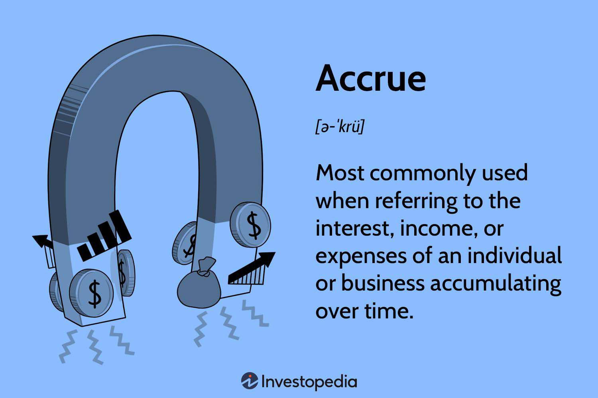

## Table of Contents

## What is the basic definition of an accrual rate?

An accrual rate is a way to measure how much interest or money is added to an account over time. It's often used for things like savings accounts, loans, or retirement funds. The rate tells you how quickly the money in the account grows or how much interest you have to pay on a loan.

For example, if you have a savings account with an accrual rate of 2% per year, that means the amount of money in your account will grow by 2% every year. This is important to know because it helps you understand how your money will change over time, whether you're saving up or paying off a debt.

## How does the accrual rate differ from other financial rates?

The accrual rate is different from other financial rates because it shows how much money is added to an account over time. It's like a speedometer for your savings or loan, telling you how fast your money is growing or how quickly interest is piling up. Other rates, like the interest rate, might tell you the cost of borrowing money or the return on an investment, but the accrual rate focuses on the actual increase in your account balance.

For example, the annual percentage rate (APR) on a loan tells you the yearly cost of borrowing money, including fees and other charges. It's a broader measure than the accrual rate, which only looks at the interest added to your account. On the other hand, the annual percentage yield (APY) on a savings account shows you the total interest you'll earn in a year, taking into account compound interest. The accrual rate might be part of how the APY is calculated, but it's more specific to the periodic increase in your account.

In simple terms, the accrual rate is about the growth of your money over time, while other rates might include additional factors like fees or compound interest. Understanding the difference helps you see how your money is working for you or against you in different financial products.

## What are the common applications of accrual rates in finance?

Accrual rates are often used in savings accounts. When you put money into a savings account, the bank pays you interest. The accrual rate tells you how much interest you earn over time. For example, if your savings account has an accrual rate of 1%, that means your money grows by 1% every year. This helps you understand how your savings will increase without adding more money.

Accrual rates are also important for loans. When you borrow money, you have to pay back the loan plus interest. The accrual rate shows how much interest is added to your loan over time. If you have a loan with an accrual rate of 5%, the amount you owe grows by 5% each year until you pay it off. Knowing the accrual rate helps you plan how much you need to pay each month to reduce your debt.

In retirement accounts, like a 401(k) or an IRA, accrual rates can show how your investments are growing. If your retirement account has an accrual rate of 3%, your investments increase by 3% each year. This helps you see how your savings for the future are doing and plan for when you retire. Understanding accrual rates in these different areas can help you make better financial decisions.

## How is the accrual rate calculated for different types of accounts?

For savings accounts, the accrual rate is usually calculated as a percentage of the money you have in the account. If your savings account has an accrual rate of 2% per year, that means every year, the bank adds 2% of your current balance to your account as interest. So, if you have $1,000 in your account, at the end of the year, you'll have $1,020. The bank might add this interest monthly, quarterly, or annually, depending on the terms of your account.

For loans, the accrual rate works a bit differently. It's the rate at which interest is added to the amount you borrowed. If you have a loan with an accrual rate of 5% per year, the interest you owe grows by 5% of the remaining loan balance each year. So, if you borrowed $10,000, at the end of the year, you'll owe $10,500 in total, including the interest. Just like with savings accounts, the interest might be added to your loan balance monthly, quarterly, or annually.

In retirement accounts, the accrual rate can be a bit more complex because it depends on the investments you choose. If your retirement account has an accrual rate of 3% per year, that means your investments are expected to grow by 3% each year. This rate can change based on how well your investments are doing. If you have $50,000 in your retirement account, a 3% accrual rate would mean your account grows by $1,500 in a year, making your total $51,500.

## Can you explain the mechanism behind how accrual rates work?

Accrual rates show how much money is added to an account over time. It's like a little machine that adds a bit of money to your account every now and then. For example, if you have a savings account with an accrual rate of 2% per year, that means every year, the bank adds 2% of your current balance to your account as interest. So, if you have $1,000 in your account, at the end of the year, you'll have $1,020. The bank might add this interest monthly, quarterly, or annually, depending on the terms of your account.

For loans, the accrual rate works in a similar way but in reverse. It's the rate at which interest is added to the amount you borrowed. If you have a loan with an accrual rate of 5% per year, the interest you owe grows by 5% of the remaining loan balance each year. So, if you borrowed $10,000, at the end of the year, you'll owe $10,500 in total, including the interest. Just like with savings accounts, the interest might be added to your loan balance monthly, quarterly, or annually.

## What factors influence the accrual rate in financial institutions?

Accrual rates in financial institutions are influenced by several factors. One big [factor](/wiki/factor-investing) is the overall economy. When the economy is doing well, banks might offer higher accrual rates on savings accounts because they can make more money from loans. But if the economy is struggling, banks might lower the accrual rates to be more cautious. Another factor is the interest rates set by the central bank, like the Federal Reserve in the U.S. If the central bank raises interest rates, banks usually follow suit and increase the accrual rates on loans and savings accounts.

Competition between banks also plays a role in setting accrual rates. If one bank offers a higher accrual rate on savings accounts, other banks might need to raise their rates to keep customers from switching. The type of account matters too. For example, a regular savings account might have a lower accrual rate than a certificate of deposit (CD) because the bank can use the money in a CD for a longer time. All these factors together help banks decide what accrual rates to offer on different accounts.

## How do accrual rates impact financial statements and reporting?

Accrual rates can have a big impact on financial statements and reporting. When a company uses accrual accounting, it records income and expenses when they happen, not when the money actually changes hands. This means that if a company has a loan with an accrual rate, the interest expense will show up on the income statement even before the company pays it. This can make the company's expenses look higher in the short term, which might affect how investors and analysts see the company's financial health.

On the other hand, if a company has money in a savings account with an accrual rate, the interest income will be recorded on the income statement as it accrues. This can make the company's income look higher, even if the money hasn't been received yet. This way of reporting can give a more accurate picture of the company's financial performance over time, but it can also make things a bit confusing because the numbers on the financial statements don't always match the cash flow.

## What are the differences between simple and compound accrual rates?

Simple accrual rates and compound accrual rates are two ways to figure out how much money grows over time. With a simple accrual rate, the interest is calculated only on the original amount of money you put in. For example, if you have $1,000 in a savings account with a simple accrual rate of 2% per year, you'll earn $20 in interest every year, no matter how much money is in the account. It's like getting the same amount of interest every time, without any changes.

Compound accrual rates work differently because they add interest to the original amount plus any interest that has already been added. This means the interest can grow faster over time. If you have $1,000 in a savings account with a compound accrual rate of 2% per year, the first year you'll earn $20 in interest, making your total $1,020. The next year, you'll earn 2% on $1,020, which is $20.40, so your total becomes $1,040.40. This keeps going, with the interest growing on a bigger and bigger amount each time.

## How do changes in accrual rates affect long-term financial planning?

Changes in accrual rates can really shake up your long-term financial plans. If the accrual rate on your savings account goes up, your money will grow faster over time. This means you might reach your savings goals sooner, like buying a house or retiring. But if the accrual rate goes down, your money won't grow as quickly, and you might need to save more or wait longer to reach those goals. It's important to keep an eye on these rates and adjust your plans if they change a lot.

On the other hand, if you have loans, changes in accrual rates can also affect your plans. If the accrual rate on your loan goes up, you'll have to pay more interest over time, which could mean you need to pay more each month or take longer to pay off the loan. If the rate goes down, you'll pay less interest, which can help you pay off the loan faster or have more money for other things. Keeping track of these changes and planning for them can help you stay on track with your long-term financial goals.

## What are the regulatory considerations for setting and adjusting accrual rates?

Banks and financial institutions have to follow rules when they set and change accrual rates. These rules come from government agencies like the Federal Reserve in the U.S. The main goal is to make sure that banks treat customers fairly and that the economy stays stable. For example, if the Federal Reserve raises interest rates, banks might have to raise their accrual rates on loans and savings accounts too. This helps control inflation and keeps the economy from growing too fast or too slow.

Another important rule is that banks need to be clear about how they set their accrual rates. They have to tell customers what the rates are and how they might change. This is called transparency, and it helps people make better choices about where to save their money or borrow from. If a bank doesn't follow these rules, it could get in trouble with regulators, which might mean fines or other penalties. So, banks have to be careful and follow the rules when they decide on accrual rates.

## How can businesses optimize their strategies based on accrual rate fluctuations?

Businesses can optimize their strategies by keeping a close eye on accrual rate changes. If the accrual rates on their savings or investments go up, businesses might decide to put more money into those accounts to earn more interest over time. This can help them grow their cash reserves faster, which is good for long-term planning. On the other hand, if the accrual rates on their loans go up, businesses might want to pay off their debts faster to avoid paying more interest. They could also look for loans with lower rates or try to renegotiate their current loans to save money.

Another way businesses can use accrual rate changes to their advantage is by adjusting their financial forecasts. If they see that accrual rates are going to go up, they might predict higher income from their savings and investments. This can help them plan for bigger projects or expansions. If rates are going down, they might need to be more careful with their spending and look for other ways to make money. By staying flexible and ready to change their plans based on accrual rate fluctuations, businesses can make the most of their financial situation and stay on track with their goals.

## What advanced techniques are used to model and predict accrual rate trends?

To predict how accrual rates might change in the future, experts use something called time series analysis. This is a fancy way of looking at past data to find patterns and use them to guess what might happen next. They look at things like how the economy is doing, what the central bank is doing with interest rates, and even what other countries are doing with their money. By putting all this information together, they can make a model that shows how accrual rates might go up or down over time. This helps businesses and people plan better for the future.

Another technique is called [machine learning](/wiki/machine-learning). This is when computers learn from a lot of data to find patterns that humans might miss. For example, a computer might look at tons of information about the economy, interest rates, and even news articles to predict how accrual rates will change. Machine learning can be really good at finding small changes that could affect accrual rates, like a new law or a big event in the world. By using these advanced techniques, businesses and financial experts can make smarter decisions about their money and be ready for whatever the future brings.

## How can one understand interest calculation and accrual rates?

Interest calculation is a vital component of finance significantly influencing both investment returns and debt obligations. The methodology for calculating interest fundamentally determines the financial outcome over an investment's or loan's lifetime. Two primary methods exist for interest calculation: simple interest and compound interest.

Simple interest is determined solely on the original principal amount throughout the entire period of the loan or investment. Its calculation follows the formula:

$$

\text{Simple Interest} = P \times r \times t 
$$

where $P$ is the principal amount, $r$ is the annual interest rate, and $t$ is the time in years. Simple interest is straightforward, presenting scenarios where the interest generated is consistently proportional to the original amount.

In contrast, compound interest accounts for accumulated interest over prior periods. This method recalculates interest on the new principal, including previously accrued interest, using the formula:

$$

A = P \left(1 + \frac{r}{n}\right)^{nt} 
$$

where $A$ is the future value of the investment/loan, $P$ is the principal, $r$ is the annual interest rate, $n$ is the number of times interest is compounded per year, and $t$ is the number of years. Compound interest is frequently favored for long-term investments due to its potential to increase the principal more significantly over time.

Accrual rates are pivotal in determining how interest builds up over time, crucial for precise financial reporting and asset valuation. Accrual accounting recognizes interest income and expenses when they are incurred, rather than when cash transactions occur. This method involves calculating interest on an accrual basis, where daily accrual rates adjust for precise financial matching and reporting.

Proper comprehension and application of these calculations allow investors to manage portfolios effectively, understanding both returns on investments and obligations on debts. Accurate daily accrual rate calculations are especially significant in financial instruments such as loans or bonds where the interest must be reported periodically. For instance, the daily accrual of interest can be calculated by dividing the annual [interest rate](/wiki/interest-rate-trading-strategies) by the number of days in a year:

$$

\text{Daily Accrual Rate} = \frac{\text{Annual Interest Rate}}{365} 
$$

Then, this rate can be applied to the principal to compute daily interest. This precision ensures financial statements reflect true economic interest obligations. For example, in bond markets, accurate daily accruals impact valuation from the last payment date to the sale date, which is crucial in trading strategies. Understanding these interest calculations thus enhances financial transparency and effective financial planning.

## What are some examples of accrual rate calculations?

Calculating the daily accrual rate is a critical component of managing financial instruments and requires a clear understanding of the underlying principles. The daily accrual rate is obtained by dividing the annual interest rate by the total number of days in the year and then multiplying the result by the outstanding principal. Mathematically, this can be represented as:

$$
\text{Daily Accrual Rate} = \left( \frac{\text{Annual Interest Rate}}{\text{Number of Days in a Year}} \right) \times \text{Outstanding Principal}
$$

In bond trading, the accurate calculation of accrued interest is fundamental. When a bond is sold between coupon payments, the seller is entitled to receive interest for the period they held the bond. This accrued interest is the amount of interest accumulated from the last payment date up to the sale date. This ensures fair compensation in the transaction and is calculated precisely to avoid valuation discrepancies.

For example, in mortgages, determining the payoff amount involves calculating the accrued interest that needs to be added to the principal balance. The accurate assessment of this interest is crucial for borrowers to understand their outstanding obligations and for lenders to maintain proper financial records.

Python is often used by financial professionals to automate and precisely calculate these accruals. A simple Python script for calculating daily accrual rates might look like this:

```python
def daily_accrual_rate(annual_interest_rate, principal, days_in_year=365):
    return (annual_interest_rate / days_in_year) * principal

annual_interest_rate = 0.05  # Example: 5% annual interest
principal = 1000  # Amount of outstanding principal
daily_rate = daily_accrual_rate(annual_interest_rate, principal)

print(f"Daily Accrual Rate: {daily_rate:.2f}")
```

Here, the `daily_accrual_rate` function computes the interest accrued each day on the principal based on an annual interest rate. Adjusting the `days_in_year` parameter accommodates leap years by setting it to 366 when necessary.

These calculations are indispensable across a broad spectrum of financial instruments, such as bonds, mortgages, and savings accounts. By ensuring the precise computation of accruals, financial professionals can maintain accurate financial obligations and reporting. This precision is vital to both individual investments and broader financial markets, where small errors can propagate into significant financial misjudgments.

## References & Further Reading

For those interested in expanding their knowledge of financial markets and sophisticated trading strategies, several resources can provide invaluable insights. One such foundational text is "Fixed Income Securities: Tools for Today's Markets" by Bruce Tuckman, which offers an in-depth look at bond markets and valuation methodologies crucial for understanding interest rate dynamics and accrual calculations in trading.

Incorporating AI into trading strategies is becoming increasingly significant, as discussed in "Advances in Financial Machine Learning" by Marcos Lopez de Prado. This book covers how machine learning techniques can be applied to financial contexts, providing strategies for developing data-driven trading algorithms that consider interest calculation and accrual rates.

Online learning platforms like Coursera offer courses on financial modeling, quantitative finance, and [algorithmic trading](/wiki/algorithmic-trading) that can be beneficial for both novices and experienced professionals looking to sharpen their skills. Courses often include practical applications and programming exercises in languages like Python, allowing learners to implement real-world financial models, including those involving interest accrual processes.

Regularly reviewing articles and papers from publications such as "The Journal of Fixed Income" is recommended for staying abreast of the latest trends and research in the fixed income markets. Such resources help maintain an understanding of evolving practices and innovative approaches to interest and accrual methodologies in algo-trading.

Lastly, understanding the regulatory frameworks and market standards is critical. Regulatory compliance ensures strategic trading decisions align with current legal and ethical standards. Familiarizing oneself with financial regulations helps prevent costly compliance errors and supports robust and legally sound trading strategies.

