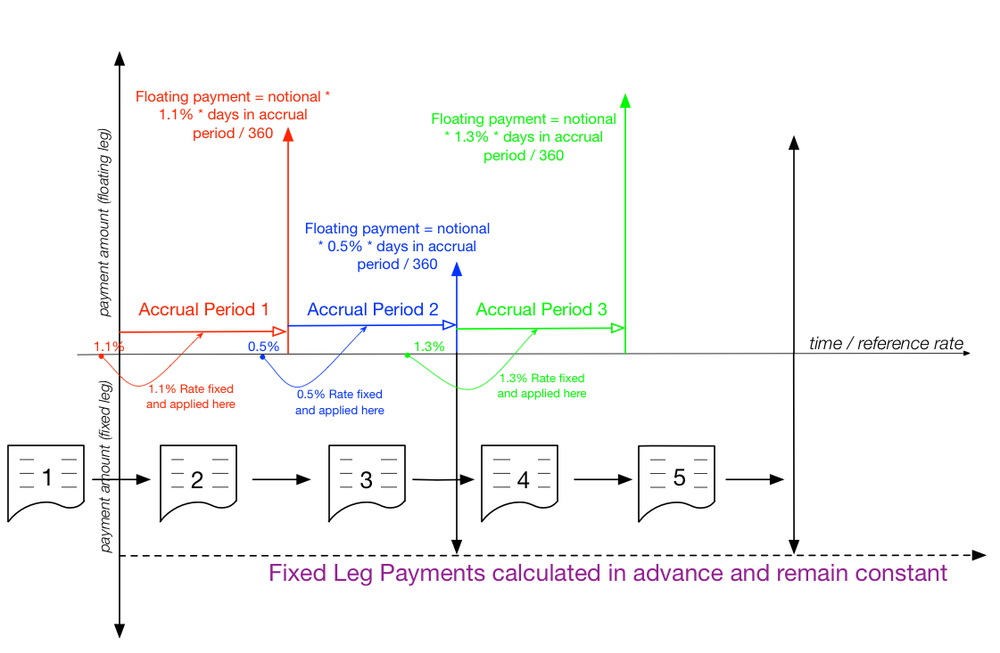

## Table of Contents

## What is an accrual swap?

An accrual swap is a type of financial agreement between two parties where one party pays a fixed interest rate and the other pays a floating interest rate, but with a twist. In an accrual swap, the floating rate payment is only made if a certain condition is met, usually related to a reference rate like LIBOR staying within a specific range. If the condition isn't met, the floating rate payment doesn't happen, and instead, the fixed rate payment might increase.

This type of swap can be useful for companies that want to manage their interest rate risk but also want to take advantage of potential favorable market conditions. For example, if a company expects interest rates to stay low, they might enter into an accrual swap to benefit from lower floating rate payments when rates are within the agreed range. However, if rates go outside this range, they might end up paying more on the fixed side, so it's a bit of a gamble but can be a strategic tool in financial planning.

## How does an accrual swap differ from a traditional swap?

An accrual swap is different from a traditional swap mainly because of how the payments work. In a traditional swap, one party pays a fixed interest rate and the other pays a floating interest rate, and these payments happen no matter what. But in an accrual swap, the floating rate payment only happens if a certain condition is met, like if a reference rate like LIBOR stays within a certain range. If that condition isn't met, the floating rate payment doesn't happen.

This difference makes accrual swaps a bit more complicated but also more flexible. They can be useful for companies that want to take advantage of certain market conditions. For example, if a company thinks interest rates will stay low, they might use an accrual swap to save money on floating rate payments when rates are low. But if rates go outside the expected range, they might end up paying more on the fixed side. So, accrual swaps can be a strategic tool, but they come with more risk and uncertainty than traditional swaps.

## What are the basic components of an accrual swap?

An accrual swap has a few main parts that make it work. First, there are two parties involved, and they agree to exchange interest payments. One party pays a fixed interest rate, and the other pays a floating interest rate. The fixed rate stays the same throughout the swap, but the floating rate can change based on a reference rate like LIBOR. The big difference with an accrual swap is that the floating rate payment only happens if a certain condition is met. This condition is usually about the reference rate staying within a specific range.

If the reference rate stays within the agreed range, the floating rate payment is made, and everything works like a normal swap. But if the reference rate goes outside that range, the floating rate payment doesn't happen. Instead, the fixed rate payment might increase. This makes accrual swaps a bit more complicated than traditional swaps, but it also gives companies a way to take advantage of certain market conditions. For example, if a company thinks interest rates will stay low, they might use an accrual swap to save money on floating rate payments when rates are low. But if rates go outside the expected range, they might end up paying more on the fixed side.

## How is the accrual period determined in an accrual swap?

The accrual period in an accrual swap is the time when the floating rate payment can happen. It's based on whether a certain condition is met, usually about a reference rate like LIBOR staying within a specific range. If the reference rate stays within that range during the accrual period, the floating rate payment is made. But if the reference rate goes outside that range, the floating rate payment doesn't happen.

The length of the accrual period can be set by the two parties when they make the swap agreement. It could be a day, a week, a month, or any other time period they agree on. The important thing is that during this time, they check if the reference rate is within the agreed range. If it is, the floating rate payment accrues, meaning it adds up over the period. If not, the payment doesn't accrue, and the fixed rate payment might go up instead.

## What are the common underlying assets used in accrual swaps?

In accrual swaps, the most common underlying assets are interest rates, like LIBOR or EURIBOR. These rates are used as the reference for the floating rate payments. If the interest rate stays within a certain range during the accrual period, the floating rate payment happens. If it goes outside that range, the payment doesn't happen, and the fixed rate payment might increase.

Sometimes, other financial indicators can be used as the underlying asset in accrual swaps. For example, inflation rates or commodity prices might be used. These swaps can be useful for companies that want to manage their risk related to these assets. If the company thinks the underlying asset will stay within a certain range, they might use an accrual swap to take advantage of that. But if the asset goes outside the expected range, they might end up paying more on the fixed side.

## How is the payoff calculated in an accrual swap?

In an accrual swap, the payoff depends on whether a certain condition is met during the accrual period. This condition is usually about a reference rate, like LIBOR, staying within a specific range. If the reference rate stays within that range, the floating rate payment is made. The amount of the floating rate payment is calculated by multiplying the floating rate by the notional amount of the swap and the length of the accrual period. If the reference rate goes outside the range, the floating rate payment doesn't happen.

If the floating rate payment doesn't happen because the reference rate is outside the range, the fixed rate payment might increase. The fixed rate payment is calculated by multiplying the fixed rate by the notional amount of the swap and the length of the accrual period. If the floating rate payment doesn't accrue, the fixed rate payment might be adjusted to a higher rate for that period. This makes the payoff of an accrual swap different from a traditional swap, where both payments happen no matter what.

## What are the risks associated with accrual swaps?

Accrual swaps come with some risks that you should know about. One big risk is that the floating rate payment might not happen if the reference rate, like LIBOR, goes outside the agreed range. This can be a problem if you were counting on that payment to balance out your costs. If the floating rate payment doesn't happen, you might end up paying more on the fixed side, which can mess up your budget.

Another risk is that accrual swaps can be hard to predict. Since the payments depend on whether the reference rate stays within a certain range, it's tough to know for sure what will happen. If the market changes in a way you didn't expect, you could end up losing money. This makes accrual swaps a bit more complicated and risky than traditional swaps, where the payments are more predictable.

Lastly, there's also the risk of counterparty default. This means that the other party in the swap might not be able to make their payments. If this happens, you could be left without the money you were expecting. So, it's important to choose a reliable partner when you enter into an accrual swap.

## What are some strategies for managing the risks of accrual swaps?

One way to manage the risks of accrual swaps is to carefully choose the range for the reference rate. If you think the rate will stay within a certain range, you can set the swap to take advantage of that. But if you're not sure, you might want to set a wider range to be safer. This can help make sure you get the floating rate payments more often, even if the rate moves around a bit.

Another strategy is to keep an eye on the market and be ready to adjust your swap if things change. If you see that the reference rate is starting to move outside the range you set, you might want to talk to your swap partner about changing the terms. This can help you avoid losing money if the rate goes too far outside the range. It's also a good idea to work with a reliable partner who can make their payments on time, so you don't have to worry about them defaulting.

Lastly, you can use other financial tools to balance out the risks of an accrual swap. For example, you might use options or other swaps to protect yourself if the reference rate goes outside the range. This can help you manage your costs and make sure you're not caught off guard by unexpected changes in the market. By combining different strategies, you can make accrual swaps a useful part of your financial planning without taking on too much risk.

## Can you explain the mechanics of aquanto accrual swap?

An aquanto accrual swap is a special kind of swap where the floating rate payment depends on how much time a reference rate, like LIBOR, stays within a certain range. If the reference rate stays within the range for the whole accrual period, the floating rate payment is made just like in a normal swap. But if the reference rate goes outside the range, the floating rate payment only happens for the part of the time when the rate was inside the range. This means if the rate is only in the range for half the time, you only get half the floating rate payment.

The fixed rate payment in an aquanto accrual swap works a bit differently too. If the reference rate goes outside the range, the fixed rate payment might go up. The increase depends on how much time the rate was outside the range. So, if the rate is outside the range for a long time, the fixed rate payment could go up a lot. This makes aquanto accrual swaps a bit more complicated than regular swaps, but they can be useful for companies that want to take advantage of certain market conditions while managing their risks.

## What are the different variants of accrual swaps and their specific features?

Accrual swaps come in different types, each with its own special features. One type is the standard accrual swap, where the floating rate payment only happens if a reference rate, like LIBOR, stays within a certain range during the accrual period. If the rate goes outside the range, the floating rate payment doesn't happen, and the fixed rate payment might go up. This type of swap is useful for companies that want to save money on floating rate payments when rates are low but might end up paying more if rates go outside the expected range.

Another type is the aquanto accrual swap, which is a bit more complicated. In an aquanto accrual swap, the floating rate payment depends on how much time the reference rate stays within the range. If the rate is in the range for the whole accrual period, the floating rate payment is made like in a normal swap. But if the rate goes outside the range, the floating rate payment only happens for the part of the time when the rate was inside the range. The fixed rate payment can also go up if the rate is outside the range, and the increase depends on how much time the rate was outside the range. This type of swap can be useful for companies that want to manage their risks more precisely.

There's also the quanto accrual swap, which adds another layer of complexity. In a quanto accrual swap, the floating rate payment is based on a reference rate in one currency, but the payment is made in another currency. The payment still depends on whether the reference rate stays within a certain range, but there's also the added risk of currency exchange rates. This type of swap can be useful for companies that want to take advantage of interest rate conditions in one market while managing their exposure to currency risk.

## How do market conditions affect the performance of accrual swaps?

Market conditions can really change how well accrual swaps work. If interest rates stay within the range you set for the swap, you'll get the floating rate payments, which can be good if rates are low. But if the rates go outside that range, you might not get those payments, and you could end up paying more on the fixed side. This means you need to keep a close eye on what's happening in the market and be ready to adjust your swap if things change a lot.

Another thing to think about is how the overall economy is doing. If the economy is doing well, interest rates might go up, which could make it harder to get the floating rate payments you were hoping for. On the other hand, if the economy is struggling, rates might stay low or even go down, which could be good for your swap. So, understanding the bigger picture in the market can help you use accrual swaps in a way that works best for you.

## What are the regulatory considerations for trading accrual swaps?

When you trade accrual swaps, you need to think about the rules that govern financial markets. These rules can come from different places, like the government or financial regulators. For example, in the United States, the Dodd-Frank Act has rules about how swaps need to be reported and cleared through special organizations. This is to make sure that trading is done in a fair and safe way. If you don't follow these rules, you could get into trouble, so it's important to know what they are and make sure you're following them.

Another thing to think about is that different countries might have different rules for trading accrual swaps. If you're trading with someone from another country, you need to make sure you're following the rules in both places. This can be tricky, but it's important to do it right. Also, sometimes the rules can change, so you need to stay up to date with any new regulations that might affect how you trade accrual swaps.

## What are financial derivatives and swaps?

Financial derivatives are financial contracts whose value is contingent on the performance of underlying entities such as assets, indices, interest rates, or other financial instruments. They serve as vital tools for hedging risks, speculating on market movements, and enhancing the returns of investment portfolios. The core premise of a derivative is that it derives its price from the underlying asset's market performance.

A swap is a specific type of financial derivative where two parties agree to exchange sequences of cash flows over a stipulated period. These cash flows are usually calculated on a notional principal amount, which remains unchanged throughout the swap contract's lifespan. Swaps are predominantly used to manage exposure to fluctuations in interest rates, currencies, or commodity prices, thereby providing a strategic mechanism for risk management in diverse financial scenarios.

The basic structure of a swap involves two legs: 

1. **Fixed Leg/Cash Flow:** One party pays a fixed rate, providing predictability in cash flow management.
2. **Floating Leg/Cash Flow:** The other party pays a floating rate, which is typically linked to a benchmark rate such as the London Interbank Offered Rate (LIBOR) or the Federal Funds Rate.

To illustrate, consider an [interest rate](/wiki/interest-rate-trading-strategies) swap where Party A agrees to pay Party B a fixed rate, whereas Party B pays Party A a floating rate determined at regular intervals. This arrangement allows parties to adjust their interest rate exposures according to their preferences or market conditions. The formula for the net cash flow in an interest rate swap can be expressed as:

$$
\text{Net Cash Flow} = (\text{Fixed Rate} - \text{Floating Rate}) \times \text{Notional Principal}
$$

Swaps play a crucial role in financial markets by providing flexibility and strategic options for businesses looking to manage financial risks effectively. Commonly traded swap types include interest rate swaps, currency swaps, and commodity swaps, each with distinct market functions and applications.

Interest rate swaps are widely used by institutions to swap fixed interest rate payments for floating rate payments, adjusting exposure to interest rate movements. Currency swaps involve the exchange of cash flows in different currencies, helping entities manage risks associated with foreign exchange fluctuations. Commodity swaps, on the other hand, allow parties to exchange cash flows related to the price of a commodity, offering protection against commodity price [volatility](/wiki/volatility-trading-strategies). 

The variety and adaptability of swaps make them integral components of the financial architecture, widely employed by banks, corporations, and investors to align financial strategies with market realities.

## What are the types of swaps in the financial market?

Swaps are a pivotal instrument in financial markets, offering a means to manage risk associated with currency, interest rate, and commodity price fluctuations. Distinct types of swaps cater to specific needs and financial strategies.

**Interest Rate Swaps** are one of the most prevalent forms of swaps utilized by financial institutions, corporations, and investors. They involve the exchange of cash flows based on a fixed interest rate for cash flows based on a floating interest rate. This mechanism allows parties to hedge against interest rate risk, stabilize cash flows, or capitalize on interest rate differentials. The typical structure involves two counterparties agreeing to exchange interest payments on a hypothetical principal amount, known as the notional principal, which is not exchanged. The cash flow exchange in an interest rate swap can be expressed as:

$$

\text{Cash Flow}_\text{Fixed} = \text{Notional Principal} \times \frac{\text{Fixed Rate} \times \Delta t}{360}
$$
$$

\text{Cash Flow}_\text{Floating} = \text{Notional Principal} \times \frac{\text{Floating Rate} \times \Delta t}{360}
$$

where $\Delta t$ represents the accrual period in days.

**Currency Swaps** facilitate the exchange of principal and interest payments in one currency for the same in another currency. These swaps are beneficial for entities participating in international ventures, enabling them to manage foreign exchange risk associated with cross-border investments. A currency swap usually involves an initial exchange of principal amounts denominated in different currencies, with periodic exchanges of interest payments over the life of the swap. At maturity, the principal amounts are exchanged back at the original terms agreed upon. The structure allows participants to lock in exchange rates and interest payments, offering a hedge against currency and interest rate volatility.

**Commodity Swaps** are designed to manage risk linked to commodity price fluctuations. In a commodity swap, parties agree to exchange cash flows that depend on the price of an underlying commodity, often swapped for fixed payments. This type of swap is particularly useful for producers and consumers of commodities who wish to hedge against price volatility. Commodity swaps typically involve a payer who agrees to pay a set price periodically in exchange for receiving payments linked to the market commodity price, thus providing price certainty in turbulent markets.

Each type of swap embodies a strategic tool to mitigate risks and optimize financial outcomes. By understanding and leveraging these instruments, participants can enhance their financial agility and stability in unpredictable economic environments.

## What are the pricing models for swaps and swaptions?

The pricing of swaps and swaptions is a fundamental aspect of financial derivatives markets. These instruments often rely on sophisticated models that capture the unique characteristics of interest rate dynamics. One of the key models employed for European swaptions is the Black model, which originates from the Black-Scholes framework, a cornerstone in option pricing theory.

The Black model calculates the price of European swaptions by treating the swap's fixed rate as an underlying asset. It assumes lognormal distribution for the forward swap rate. The swaption price is derived using the following formula:

$$
C = P \times \left( F \times N(d_1) - K \times N(d_2) \right)
$$

Where:
- $C$ is the price of the swaption.
- $P$ is the present value factor for the settlement date.
- $F$ is the forward swap rate.
- $K$ is the strike rate.
- $N(d)$ denotes the cumulative distribution function of the standard normal distribution.
- $d_1$ and $d_2$ are calculated as follows:

$$
d_1 = \frac{\ln(F/K) + 0.5 \times \sigma^2 \times T}{\sigma \times \sqrt{T}}
$$

$$
d_2 = d_1 - \sigma \times \sqrt{T}
$$

Here, $\sigma$ represents the volatility of the forward swap rate, and $T$ is the time to expiration.

For more nuanced and realistic modeling of interest rate movements, the Hull-White model is often employed. It extends the Vasicek model by adding a time-dependent parameter to capture the mean-reverting nature of interest rates. The Hull-White model is characterized by the following stochastic differential equation:

$$
dr(t) = \left[ \theta(t) - a \cdot r(t) \right] dt + \sigma \cdot dW(t)
$$

In this equation:
- $r(t)$ is the instantaneous interest rate at time $t$.
- $\theta(t)$ is a function of time that adjusts the mean reversion level.
- $a$ is the speed of mean reversion.
- $\sigma$ is the volatility of the interest rate.
- $dW(t)$ represents the Wiener process.

The Hull-White model's flexibility in accommodating changing market conditions makes it highly valuable for pricing a wide array of interest rate derivatives beyond swaptions, including zero-coupon bonds and interest rate caps.

Implementing these models in practice requires computational tools. Below is a simple Python example for the Black model:

```python
from scipy.stats import norm
import math

def black_model_price(P, F, K, sigma, T):
    d1 = (math.log(F / K) + 0.5 * sigma ** 2 * T) / (sigma * math.sqrt(T))
    d2 = d1 - sigma * math.sqrt(T)
    price = P * (F * norm.cdf(d1) - K * norm.cdf(d2))
    return price

# Example usage
P = 0.95  # Present value [factor](/wiki/factor-investing)
F = 0.03  # Forward swap rate
K = 0.02  # Strike rate
sigma = 0.15  # Volatility
T = 1.0  # Time to expiration

swaption_price = black_model_price(P, F, K, sigma, T)
print(f"Swaption Price: {swaption_price}")
```

This code calculates the swaption price using the Black model, illustrating how financial practitioners can integrate such models into their risk management and pricing strategies.

## References & Further Reading

[1]: ["Interest Rate Swaps and Other Derivatives"](http://students.aiu.edu/submissions/profiles/resources/onlineBook/N2D3C5_Interest_Rate_Swaps_and_Their_Derivatives.pdf) by Amir Sadr

[2]: ["Swaps and Other Derivatives"](https://www.wiley.com/en-us/Swaps+and+Other+Derivatives%2C+2nd+Edition-p-9780470661802) by Richard Flavell

[3]: Black, F., & Scholes, M. (1973). ["The Pricing of Options and Corporate Liabilities."](https://www.cs.princeton.edu/courses/archive/fall09/cos323/papers/black_scholes73.pdf) Journal of Political Economy, 81(3), 637-654.

[4]: Hull, J. C., & White, A. (1990). ["Pricing Interest-Rate-Derivative Securities."](https://www.researchgate.net/publication/5217241_Pricing_Interest-Rate-Derivative_Securities) The Review of Financial Studies, 3(4), 573-592.

[5]: ["Trading and Pricing Financial Derivatives: A Guide to Futures, Options, and Swaps"](https://books.google.com/books/about/Trading_and_Pricing_Financial_Derivative.html?id=uGSEDwAAQBAJ) by Patrick Boyle and Jesse McDougall