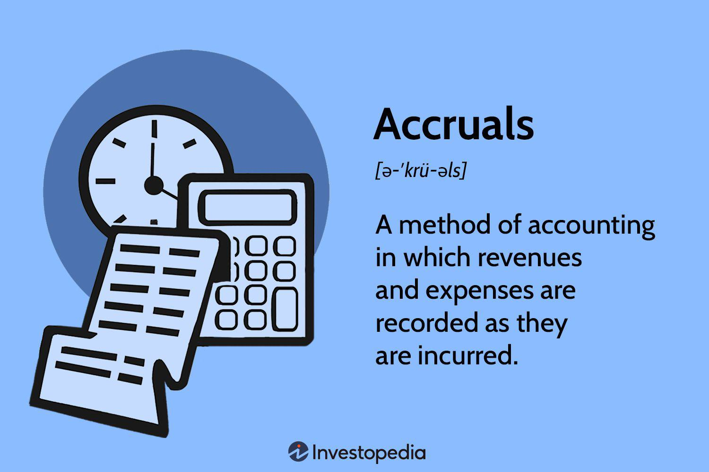

In today's complex financial landscape, understanding the nuances of accounting methods is crucial for businesses, particularly those engaged in algorithmic trading. This article explores the intersection of accrual accounting and algorithmic trading, shedding light on how accurate financial reporting can enhance trading strategies and business outcomes. Accrual accounting, a fundamental component of financial reporting, records revenues and expenses when they are earned or incurred, providing a more accurate picture of a company's financial status. This contrasts with cash accounting, where transactions are recorded only when cash changes hands.

In the trading sector, where precision and timely decisions are paramount, accrual accounting becomes indispensable. It ensures that the financial statements reflect the economic reality of transactions, allowing for better management and strategic planning. The benefits of accruing income and expenses are numerous: they help align financial practices with trading activities and offer insights into cash flow management, critical for traders operating in high-frequency environments.

However, the challenges associated with accrual accounting, such as the complexity of adjustments and potential for misstatements, cannot be overlooked. Algorithmic trading firms must navigate these challenges while also considering the implications of their accounting choices on tax liabilities and compliance standards. With various accounting methods available, each with unique tax implications, selecting the appropriate one requires careful consideration to ensure alignment with both business strategy and regulatory requirements.

This article will examine the mechanics of accrual accounting, its significance in the trading industry, and the strategic advantages it offers. We will also discuss potential challenges and provide insights into how accurate financial reporting can improve business outcomes in algorithmic trading. Join us as we unravel the intricacies of accrual accounting in the dynamic world of algorithmic trading, highlighting its role in fostering transparency and efficiency in financial reporting.

## Table of Contents

## What Are Accruals?

Accruals are a cornerstone of accrual accounting, representing financial transactions at the point they are earned or incurred, irrespective of the cash flow timing. This accounting principle facilitates the presentation of a company's financial statements in a manner that accurately represents its economic activities, thereby offering a comprehensive picture of its financial performance and standing. 

The essence of accrual accounting is to capture financial transactions in the period they occur, matching revenues with the expenses incurred to generate them, a concept known as the matching principle. For instance, if a business delivers services in January but receives payment in February, the revenue is recorded in January. This method ensures that financial statements reflect economic realities, enhancing the decision-making process for stakeholders by providing a realistic view of profitability and financial health.

Key components of accruals include:

1. **Accounts Receivable**: Represents the money owed to a company for goods or services delivered but not yet paid for by customers. Accrual accounting records this as revenue at the point of sale, not when payment is received.

2. **Accounts Payable**: Reflects the company's obligations to pay for goods or services that have been received but not yet paid for. It records these expenses when incurred, rather than when the payment is made.

3. **Accrued Tax Liabilities**: The amount of taxes a company owes but has not yet paid. This is recorded as a liability when the tax obligation arises, not when it is settled.

4. **Accrued Interest**: Interest expenses that have been incurred but not yet paid. An example is interest on a loan that accumulates over time but may not require immediate payment.

Incorporating accruals ensures that financial activities are aligned with the periods they affect, crucial for reflecting operational realities accurately. This alignment assists in analyzing financial performance by associating relevant revenues and expenses, providing a basis for strategic financial planning and informed decision-making.

The mathematical representation of accrual accounting can be outlined with basic financial equations. For example, the accounting equation:
$$
\text{Assets} = \text{Liabilities} + \text{Equity}
$$
Incorporates accrued items, reflecting their impact on both liabilities (such as accrued taxes) and assets (like accounts receivable).

Accrual accounting, through these mechanisms, portrays a dynamic and precise financial environment, necessary for comprehensive financial analysis and strategic business operations.

## The Accrual Method of Accounting

Accrual accounting is a fundamental principle within the sphere of financial reporting, aiming to record transactions when they occur rather than when cash changes hands. This approach is central to reflecting a company's true operational performance and aligns with Generally Accepted Accounting Principles (GAAP). Such alignment ensures consistency, reliability, and comparability of financial statements across different entities.

The key distinction between accrual accounting and the cash basis method lies in the timing of transaction recognition. While the cash basis recognizes revenue and expenses only upon actual cash receipt or payment, accrual accounting captures the economic events irrespective of cash flow. For instance, revenue is recognized when it is earned, and expenses are recorded when they are incurred, independent of any cash transactions.

Accrual accounting requires meticulous handling of two main components: accruals and deferrals. Accruals involve recognizing revenue or expenses that have been earned or incurred but not yet received or paid. Common examples include accounts receivable, where revenue is recorded even if the payment will be received in the future, and accounts payable, where expenses are recognized before they are paid.

Deferrals, on the other hand, involve postponing the recognition of revenue or expenses to future periods. A typical scenario is unearned revenue, where cash is received upfront for goods or services to be delivered later, necessitating the deferring of income recognition until the delivery occurs.

To ensure precise financial reporting, accrual accounting mandates the careful adjustment of journal entries. These adjustments rectify the discrepancies between actual cash flows and the recognized income or expenses, thus guaranteeing that financial statements portray an accurate financial position. For example, adjusting entries may include recording accrued interest, adjusting prepaid expenses, or deferring revenue.

In practice, the implementation of accrual accounting can involve the application of certain software tools and algorithms to automate the intricate processes of recording and adjusting entries, especially in large-scale businesses with a high [volume](/wiki/volume-trading-strategy) of transactions. This automation facilitates timely and accurate financial reporting, essential for effective decision-making.

In summary, the accrual method of accounting offers a comprehensive framework for recognizing economic events in alignment with GAAP, providing a realistic depiction of a company's financial health and aiding stakeholders in making informed decisions.

## Accrual Accounting in Algorithmic Trading

In [algorithmic trading](/wiki/algorithmic-trading), where speed, accuracy, and volume are the norms, accrual accounting plays a critical role in providing a truthful representation of a firm's financial status. Unlike cash accounting, which records transactions only when cash changes hands, accrual accounting records transactions as they occur, giving a comprehensive view of financial obligations and rights. This approach ensures that traders have the necessary data to perform precise portfolio evaluations, essential in a field where milliseconds can make a significant impact on profits.

Accrual accounting supports risk management by providing an accurate and detailed financial picture. It accounts for accrued expenses and revenues, ensuring that financial statements reflect all transactions that have been initiated, even if the cash flows have not yet been realized. For instance, an algorithmic trading firm might execute trades that will settle in the future; accrual accounting recognizes these pending settlements, allowing the firm to manage its risk exposure with greater precision. This is particularly pivotal when dealing with derivatives and other complex financial instruments commonly used in trading.

Moreover, this accounting method aids in compliance with regulatory standards, such as those mandated by the Securities and Exchange Commission (SEC) in the United States or the Financial Conduct Authority (FCA) in the UK. These regulations often require detailed disclosure of a firm’s position, including unrealized gains and losses. Accrual accounting satisfies these requirements by reflecting true financial obligations and rights, adhering to standards like the International Financial Reporting Standards (IFRS) or Generally Accepted Accounting Principles (GAAP).

Algorithmic trading firms must also consider specific accounting implications such as the handling of transaction costs, which are frequent and sometimes complex due to their volume and velocity. Proper accrual accounting ensures these costs are captured accurately, impacting net income and offering a more precise calculation of trading performance. Furthermore, algorithms used to make trading decisions can be fine-tuned based on thorough financial records, enhancing efficiency and decision-making.

In conclusion, the robustness of accrual accounting gives algorithmic traders a competitive edge by ensuring their financial reporting mirrors the high-frequency nature of their transactions. This enables effective risk management and helps algorithmic trading firms maintain regulatory compliance, ensuring the integrity of financial statements in a fast-paced environment. The integration of this accounting method is crucial for achieving operational success and strategic advantage in the trading industry.

## Advantages of Accrual Accounting in Trading

Accrual accounting offers several distinct advantages for trading firms, particularly those engaged in algorithmic trading, by providing a more precise financial picture and facilitating enhanced decision-making and tax planning. This method records revenues and expenses when they are earned or incurred, rather than when cash transactions occur, enabling traders to have a more comprehensive view of their financial performance.

One of the primary advantages of accrual accounting is its ability to provide accurate insights into cash flow forecasting and profitability. By recognizing revenues and expenses in the periods they pertain to, traders can anticipate future cash flows and make informed decisions about capital allocation. This predictive capability is crucial in rapidly changing markets, where strategic decisions must be made swiftly to capitalize on emerging opportunities. For example, accrual accounting allows traders to accurately match income from trades with associated costs, offering a clearer picture of net profitability.

In algorithmic trading environments, where transactions occur at [high frequency](/wiki/high-frequency-trading), the precision and foresight offered by accrual accounting are invaluable. It enables traders to assess profitability on a per-trade basis, even when settlement periods span multiple accounting cycles. This is particularly useful for evaluating the performance of various trading algorithms, allowing firms to optimize their strategies based on actual financial outcomes rather than mere cash flow positions.

Accrual accounting also improves tax planning by aligning recognized revenues and expenses with the relevant fiscal periods. This alignment may result in more favorable tax outcomes, as traders can strategically defer income or accelerate expenses to manage taxable income effectively. Furthermore, understanding the timing of revenue recognition can help firms optimize their tax strategies by taking advantage of differences in tax rates and regulations across jurisdictions.

In highly competitive trading environments, the ability to derive strategic advantages from financial reporting is critical. Accrual accounting empowers traders with the data needed to evaluate the effectiveness of their trading strategies, manage risk more effectively, and make sound financial decisions. By providing a detailed view of financial operations, this accounting method equips trading firms with the necessary information to navigate market [volatility](/wiki/volatility-trading-strategies) with greater confidence and precision.

## Challenges and Considerations

Accrual accounting, while offering a comprehensive view of financial performance, introduces certain complexities that businesses, particularly those engaged in algorithmic trading, need to navigate carefully. One major challenge is the increased complexity in financial reporting. Accrual accounting requires the recognition of revenues and expenses when they are earned or incurred, not when cash transactions occur. This necessity demands precise and often complicated adjustments to journal entries, making accurate financial reporting more labor-intensive and requiring a robust accounting infrastructure for timely and precise data entry.

Moreover, the accrual method is susceptible to financial statement manipulation. Businesses could misrepresent their financial health by manipulating the timing of expense recognition or revenue accruals. Such practices might mislead stakeholders by distorting the true economic condition of the business. It is crucial for companies, especially those dealing with rapid trades and large volumes, to adhere strictly to generally accepted accounting principles (GAAP) and ensure regular audits to maintain transparency and integrity in their reports.

Maintaining compliance involves not only adhering strictly to established accounting standards but also remaining aware of evolving regulatory requirements. The algorithmic trading landscape is heavily regulated, and discrepancies in financial reporting could lead to regulatory scrutiny, legal repercussions, and damage to reputation. Therefore, it is essential for firms to engage expert professional financial advisers who are well-versed in compliance issues and can provide guidance through the complexities of accrual accounting. This professional expertise is invaluable in creating systems and processes that ensure alignment with both local and international accounting standards.

To mitigate these challenges, traders can implement several strategies to maintain the integrity of their financial reports. First, employing automated accounting systems can help manage the complexity by ensuring more accurate and timely entry of financial transactions and facilitating real-time tracking and reporting. An automated system can reduce human error and provide a consistent framework for recording complex transactions, such as those encountered in algorithmic trading.

Additionally, regular audits and reviews by independent auditors can detect and correct instances of financial misstatement early. This practice builds trust with stakeholders and supports the organization’s commitment to transparency and accuracy. By regularly evaluating and updating their financial reporting systems, firms can also ensure they are equipped to handle the evolving complexities of algorithmic trading.

Continual professional development for internal financial staff is another key strategy. By keeping abreast of the latest accounting standards and regulatory changes, staff can better identify potential compliance issues before they become problematic.

In summary, while the accrual method of accounting presents certain challenges in algorithmic trading, these can be managed through a combination of advanced technology, professional expertise, and stringent compliance and auditing protocols. This multi-faceted approach not only safeguards the integrity of financial reporting but also enhances decision-making and strategic planning capabilities in the competitive trading environment.

## Conclusion

Accrual accounting remains a cornerstone of financial reporting, serving as a critical mechanism for algorithmic trading firms to accurately depict their financial health and performance. Recognizing accruals allows traders to synchronize their financial practices with operational realities, facilitating strategic planning and effective risk management. This alignment is particularly crucial in the fast-paced world of algorithmic trading, where decisions must be data-driven and timely.

Implementing accrual accounting methods provides traders with a comprehensive view of both revenues earned and expenses incurred within specific periods, regardless of when cash transactions occur. This not only enhances the accuracy of financial reporting but also aids in compliance with stringent regulatory standards that govern financial markets.

Furthermore, the ability to match revenues with related expenses ensures that financial statements reflect true operational performance, which is essential for informed decision-making. By adopting accrual accounting, trading firms can better anticipate cash flow needs, optimize tax planning, and enhance overall profitability.

In a competitive trading industry, where efficiency and compliance can be the difference between success and failure, understanding and effectively implementing accrual accounting practices is indispensable. This accounting approach equips traders with the necessary tools to navigate complex financial environments, ultimately fostering enhanced business outcomes and sustaining competitive advantages. As algorithmic trading continues to evolve, mastery of accrual accounting will remain a pivotal [factor](/wiki/factor-investing) in achieving long-term success.

## References & Further Reading

[1]: ["Advances in Financial Machine Learning"](https://www.amazon.com/Advances-Financial-Machine-Learning-Marcos/dp/1119482089) by Marcos Lopez de Prado

[2]: ["Quantitative Trading: How to Build Your Own Algorithmic Trading Business"](https://books.google.com/books/about/Quantitative_Trading.html?id=j70yEAAAQBAJ) by Ernest P. Chan

[3]: ["Machine Learning for Algorithmic Trading"](https://github.com/stefan-jansen/machine-learning-for-trading) by Stefan Jansen

[4]: ["Financial Reporting and Analysis"](https://www.investopedia.com/terms/f/financial-analysis.asp) by Charles H. Gibson

[5]: ["Intermediate Accounting"](https://www.wileyplus.com/accounting/kieso-intermediate-accounting-18e-eprof21639/) by Donald E. Kieso, Jerry J. Weygandt, and Terry D. Warfield