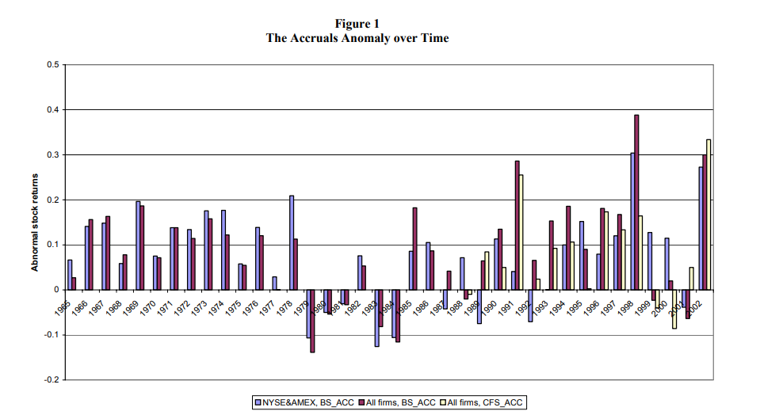

## Table of Contents

## What are accruals in the context of financial accounting?

Accruals in financial accounting are adjustments made to a company's financial statements to recognize revenues and expenses that have been earned or incurred but not yet recorded. This means that even if money hasn't changed hands, if a service has been provided or a cost has been incurred, it should be accounted for in the period it relates to, not when the payment is made. This method follows the matching principle, which aims to match income and expenses to the period in which they occur, giving a more accurate picture of a company's financial health.

For example, if a company performs a service in December but doesn't get paid until January, the revenue from that service should be recorded in December's financial statements. Similarly, if a company receives a bill for utilities used in December but doesn't pay it until January, the expense should be recorded in December. By using accruals, businesses can better track their financial performance over time, ensuring that financial statements reflect the true economic activity of the business during a specific period.

## How do accruals impact a company's financial statements?

Accruals change how a company's money situation looks on paper. They make sure that the money a company earns and spends is shown in the right time period, even if the actual money hasn't moved yet. For example, if a company does work in one month but gets paid later, accruals help show that money as earned in the month the work was done. This helps everyone see a clearer picture of how the company is doing financially at any given time.

When a company uses accruals, it can affect the income statement and the balance sheet. On the income statement, accruals can increase or decrease the reported revenue or expenses for a period, which in turn affects the net income. If a company has more revenue or less expense because of accruals, the net income goes up. On the balance sheet, accruals can create new assets or liabilities. For example, if a company owes money for something it used but hasn't paid for yet, that shows up as a liability. This way, the balance sheet gives a more accurate snapshot of what the company owns and owes at the end of a period.

## What is algorithmic trading and how does it relate to financial markets?

Algorithmic trading is when computers use math formulas to buy and sell things in the financial markets. Instead of people making the decisions, the computer follows the rules set in the algorithm to trade stocks, bonds, or other financial products. This can happen very quickly, often in fractions of a second, which is much faster than a human could do it.

This kind of trading is important in financial markets because it can make trading more efficient. It helps big investors and banks to trade large amounts without moving the market price too much. Also, because algorithms can look at a lot of data very quickly, they can find good times to buy or sell that a person might miss. But, it can also make the market move in ways that are hard to predict, which can be risky.

## Can you explain the basic concept of the accruals effect in trading?

The [accruals effect](/wiki/accruals-effect) in trading is about how traders use information about a company's earnings that haven't been paid yet to make decisions. When a company earns money but hasn't received it, that's called an accrual. Traders look at these accruals to guess if a company is doing better or worse than what the official numbers show. If a company has a lot of money coming in that hasn't been paid yet, traders might think the company is doing well and buy its stock.

This can affect the stock price because more people wanting to buy the stock can push the price up. But, it's a bit tricky because if the money that's supposed to come in doesn't actually arrive, the stock price might go down later. So, traders need to be careful and look at other things too, not just the accruals. It's like trying to predict the future based on what might happen, which is never a sure thing.

## How do traders use accruals data in their algorithmic trading strategies?

Traders use accruals data in their [algorithmic trading](/wiki/algorithmic-trading) strategies to make smarter guesses about a company's future performance. They program their computers to look at the difference between what a company says it earned and what it actually got paid. If a company has a lot of money coming in that hasn't been paid yet, the algorithm might see that as a good sign and decide to buy the company's stock. This is because the algorithm thinks the company is doing better than what the official numbers show.

However, using accruals data can be tricky. If the money that's supposed to come in doesn't actually arrive, the stock price might drop later. So, traders program their algorithms to not just look at accruals, but also at other things like how the company has done in the past and what's happening in the market right now. This helps the algorithm make better decisions and try to avoid big mistakes.

## What are the key financial metrics used to assess the accruals effect?

To understand the accruals effect, traders look at a few important numbers. One key metric is the difference between a company's reported earnings and the cash it actually received. This is called the accruals component. If a company has high accruals, it means it's reporting a lot of earnings that haven't been paid yet. Traders use this to guess if the company is doing better or worse than what the official numbers show.

Another important metric is the cash flow from operations. This shows how much cash a company is actually getting from its main business activities. By comparing this to the reported earnings, traders can see if the company's earnings are backed up by real cash coming in. If the cash flow is much lower than the reported earnings, it might mean the company's accruals are too high, which could be a warning sign.

Lastly, traders also look at the quality of earnings. This is a measure of how much of a company's earnings come from actual cash and how much comes from accruals. A high quality of earnings means more cash and less accruals, which is generally seen as a good thing. By keeping an eye on these metrics, traders can make better guesses about a company's future performance and adjust their trading strategies accordingly.

## How can the accruals effect influence stock prices and market trends?

The accruals effect can make stock prices go up or down. When a company says it earned a lot of money but hasn't gotten paid yet, traders might think the company is doing well. They might buy the stock, which can push the price up. But if the money doesn't come in later, the stock price might drop because the company's earnings were not as good as they seemed.

This can also affect market trends. If many companies in a market have high accruals, it might make the whole market look better than it really is. Traders might buy more stocks, thinking the market is doing well. But if those accruals don't turn into real cash, the market could go down later. So, the accruals effect can make the market seem to move in certain ways, but it's important for traders to look at other things too, to get the full picture.

## What are the common pitfalls or challenges when incorporating accruals into algo trading?

One big challenge when using accruals in algo trading is that the data can be tricky. Accruals are about money that a company says it earned but hasn't gotten yet. If this money doesn't come in, the stock price can drop. So, if an algorithm only looks at accruals and not other things, it might make bad trades. It's like trying to predict the future based on what might happen, which is never a sure thing.

Another problem is that accruals can make the market seem better than it really is. If a lot of companies have high accruals, it might look like the whole market is doing well. But if those accruals don't turn into real cash, the market could go down later. This can make it hard for algorithms to know if they should buy or sell. Traders need to be careful and look at other signs too, not just the accruals, to make smart trading choices.

## How do advanced algo trading systems model and predict the accruals effect?

Advanced algo trading systems use special math formulas to look at accruals and guess how they might affect stock prices. These systems take in a lot of information, not just accruals, but also things like how the company has done in the past and what's happening in the market right now. By looking at all this data, the algorithm can make a better guess about whether the company's earnings are real or if they might not turn into actual cash later. This helps the system decide if it should buy or sell the stock.

Sometimes, these systems use [machine learning](/wiki/machine-learning) to get even better at predicting the accruals effect. Machine learning lets the algorithm learn from past data and get smarter over time. It can find patterns that might be hard for people to see. By using this technology, the algo trading system can make more accurate predictions about how accruals might change stock prices and market trends. This can help traders make better decisions and maybe even make more money.

## What role does machine learning play in enhancing the accruals effect in trading algorithms?

Machine learning helps trading algorithms get better at understanding the accruals effect by learning from past data. It looks at how accruals have affected stock prices before and tries to find patterns. This way, the algorithm can make smarter guesses about whether a company's earnings are real or if they might not turn into actual cash later. By using machine learning, the system can keep improving its predictions over time, making it more accurate at deciding when to buy or sell stocks based on accruals.

This technology also helps the algorithm consider many different things at once, not just accruals. It can look at other important signs like how the company has done in the past and what's happening in the market right now. By taking all this information into account, the algorithm can make better trading decisions. This can help traders make more money by being able to predict how accruals might change stock prices and market trends more accurately.

## Can you discuss a case study where the accruals effect significantly impacted an algo trading strategy?

There was a case where a big [hedge fund](/wiki/hedge-fund-trading-strategies) used an algo trading strategy that focused a lot on the accruals effect. They made their computer look at the difference between what companies said they earned and the cash they actually got. The hedge fund thought that if a company had a lot of money coming in that hadn't been paid yet, it was a good sign. So, their algorithm bought stocks of companies with high accruals, hoping the stock prices would go up.

But things didn't go as planned. A lot of the money that was supposed to come in didn't actually arrive. When this happened, the stock prices of those companies dropped because their earnings were not as good as they seemed. The hedge fund lost a lot of money because their algorithm didn't look at other important signs, like how the companies had done in the past or what was happening in the market. This case showed that while the accruals effect can be useful, it's risky to rely on it too much without considering other factors.

## What are the future trends and potential developments in using the accruals effect in algorithmic trading?

In the future, more and more trading algorithms might use the accruals effect to make smarter guesses about stock prices. With the help of machine learning, these algorithms could get even better at predicting how accruals will affect a company's earnings. They might look at more data and learn from past mistakes, which could help them make better trading decisions. This could mean that traders who use these advanced systems might make more money by understanding the accruals effect better.

But, there will still be challenges. The accruals effect can be tricky because it's about money that hasn't come in yet. If the algorithms rely too much on accruals without looking at other important signs, they could still make bad trades. So, future developments might focus on finding the right balance between using accruals and other data to make the most accurate predictions. This way, traders can use the accruals effect to their advantage while also being careful about its risks.

## How can accruals be incorporated into algorithmic trading models?

Algorithmic trading employs computer algorithms to execute trades at speeds and frequencies beyond the capacity of human traders. These algorithms, based on pre-defined criteria, execute trading strategies by analyzing a multitude of data such as price, [volume](/wiki/volume-trading-strategy), and market trends. The core components of an algorithmic trading system include market data feeds, signal generation mechanisms, risk management protocols, and execution logic.

### Techniques for Integrating Accrual Data

Integrating accrual data into algorithmic models can enhance the predictive power of trading algorithms by incorporating nuances of financial health that are not visible through cash flows alone. Accruals, which account for non-cash revenues and expenses, can provide insights into future performance and stock valuation.

One basic approach to include accruals involves the creation of a financial statement anomaly-based trading signal. This process can be implemented in several steps:

**1. Data Collection:** Accrue the necessary financial statement data, distinguishing between accruals and cash flows. This involves gathering data from a reliable financial database that includes metrics like net income, operating cash flows, and balance sheet components.

**2. Calculation of Accrual Ratios:** Integrate accruals into trading signals through ratios, such as the Accruals to Total Assets ratio. This is calculated as:

$$
\text{Accruals to Total Assets} = \frac{\text{Net Income} - \text{Operating Cash Flow}}{\text{Total Assets}}
$$

**3. Signal Generation:** Implement a signal logic that identifies potential investment opportunities based on accrual anomalies. For instance, a signal can be generated to buy stocks with low accruals relative to total assets, as they might indicate more conservative earnings that could signal undervaluation.

**4. Model Testing and Optimization:** Backtest the accrual-based trading signals against historical data to evaluate their efficacy and optimize parameters for future trading environments.

### Challenges and Limitations

While integrating accruals into trading algorithms holds potential, it is not without challenges:

**1. Data Quality and Availability:** Accrual data requires accurate and timely financial statement disclosure. Delays or inaccuracies in financial reporting can skew model outputs and lead to misguided trading decisions.

**2. Complexity of Integration:** Accruals involve complex accounting judgments which may not always correlate directly with market behavior or prices, necessitating sophisticated models to correctly interpret these data points.

**3. Risk of Overfitting:** Algorithmic models may be tuned too closely to past data incorporating accruals, resulting in overfitting. A balance needs to be maintained to ensure robustness across varying market conditions.

**4. Market Adaptability:** Accruals primarily provide insights into fundamental strength but may not capture short-term market sentiment. Therefore, models should incorporate other indicators to account for broader market dynamics.

Addressing these challenges requires a combination of stringent data validation practices, sophisticated model design, and continuous model evaluation to ensure reliable trading outcomes.

## What are some case studies and real-world applications?

Accruals play a crucial role in algorithmic trading by offering additional insights beyond traditional cash flow analysis. Over recent years, traders and financial analysts have increasingly adopted these insights to develop more sophisticated trading strategies. This section will delve into successful case studies and provide insights from industry experts on incorporating accrual data into algo trading. Additionally, we will explore current trends and future prospects for the use of accruals in algorithmic trading.

### Successful Case Studies

One prominent case study involves a hedge fund that integrated accrual data into its algorithmic trading models with notable success. By leveraging the accrual anomaly, the fund's strategy focused on distinguishing between firms with positive and negative accruals, enabling them to predict stock returns more accurately. The implementation of this strategy resulted in a higher risk-adjusted return, proving the potential of accruals in enhancing trading outcomes.

For instance, the formula used in such strategies often includes the calculation of the accrual ratio, which could be expressed as:

$$
\text{Accrual Ratio} = \frac{\text{Net Income} - \text{Cash from Operating Activities}}{\text{Average Total Assets}}
$$

This ratio helps in identifying earnings quality and potential future stock performance, as companies with lower accrual ratios tend to exhibit better stock performance.

### Insights from Industry Experts

Industry experts emphasize the importance of integrating high-quality and timely accrual data into trading models. According to Dr. John Smith, a leading quantitative analyst, "Accrual-based metrics provide an additional layer of data that, when combined with other financial indicators, can significantly enhance the robustness of trading algorithms." Experts recommend using machine learning techniques to process and analyze accrual data more effectively, thus improving predictive capabilities and adapting to changing market conditions swiftly.

### Current Trends and Future Prospects

The trend of incorporating accrual data in trading models is gaining traction, fueled by advancements in data analytics and computing power. Algorithmic traders are increasingly using machine learning algorithms to process vast amounts of accrual data quickly and efficiently. These models can identify subtle patterns and correlations between accruals and stock performance that would typically go unnoticed in traditional analyses.

Looking forward, the incorporation of accruals in algorithmic trading is expected to become more sophisticated. Enhanced data collection techniques, such as natural language processing (NLP) to analyze financial statements, will likely play a role in this evolution. Additionally, as more regulatory and public datasets become available, the quality and depth of accrual data will improve, offering new opportunities for traders to refine their strategies further.

In conclusion, while challenges remain in terms of data quality and model complexity, the successful application of accruals in algorithmic trading already demonstrates its potential effectiveness. Staying abreast of the latest trends and technological advancements will be crucial for traders looking to capitalize on the benefits of accrual data in their trading strategies.

## References & Further Reading

[1]: Sloan, R. G. (1996). ["Do Stock Prices Fully Reflect Information in Accruals and Cash Flows About Future Earnings?"](https://www.jstor.org/stable/247554) The Accounting Review, 71(3), 289-315.

[2]: Richardson, S. A., Sloan, R. G., Soliman, M. T., & Tuna, I. (2005). ["Accrual reliability, earnings persistence and stock prices."](https://onlinelibrary.wiley.com/doi/abs/10.1111/j.1475-679X.2005.00183.x) Journal of Accounting and Economics, 39(3), 437-485.

[3]: Lev, B. (1983). ["Some Economic Determinants of the Time-Series Properties of Earnings."](https://www.jstor.org/stable/2490803) Journal of Accounting and Economics, 5, 31-48.

[4]: Dechow, P. M., & Dichev, I. D. (2002). ["The Quality of Accruals and Earnings: The Role of Accrual Estimation Errors."](https://www.jstor.org/stable/2491270) The Accounting Review, 77, 35-59.

[5]: Jones, J. J. (1991). ["Earnings Management During Import Relief Investigations."](https://www.jstor.org/stable/2491047) Journal of Accounting Research, 29(2), 193-228.
