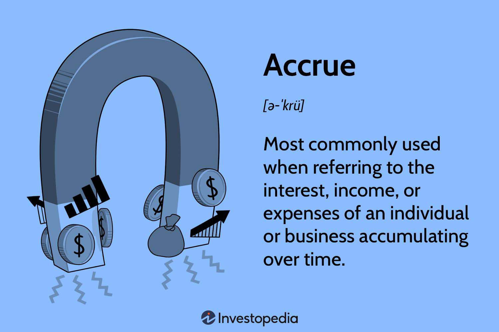

Accruals are integral to finance and accounting, providing a precise depiction of a company's financial health. In accrual accounting, revenues and expenses are recorded when incurred, irrespective of cash flow. This principle, mandated by both Generally Accepted Accounting Principles (GAAP) and International Financial Reporting Standards (IFRS), ensures that financial statements accurately reflect a company's current economic activities and obligations.

This article covers the types of accruals, their operational mechanics, and their significance in financial reporting. It also discusses how accruals intersect with algorithmic trading, examining their influence on financial strategies. Accruals contribute significantly to constructing a transparent financial record, aiding businesses in making informed decisions and formulating strategic plans. Understanding accrual accounting enables organizations to align expenses with generated revenues, facilitating enhanced financial analysis and management precision. This foundation is crucial as businesses navigate complex market environments and managerial challenges.



## Table of Contents

## What Are Accruals?

Accruals refer to an accounting concept where economic events are recorded at the time they occur, rather than when the cash transactions related to those events are completed. This method provides a more accurate representation of a company's financial situation by recognizing financial activities as they happen.

Accrual accounting is fundamental in business reporting because it aligns with the economic realities of transactions rather than merely tracking cash flows. For instance, if a company completes a service in December but receives payment in January, the revenue is recorded in December. This ensures that the financial records reflect the period in which revenue generation activities occurred, adhering to the matching principle.

Under Generally Accepted Accounting Principles (GAAP) and International Financial Reporting Standards (IFRS), the accrual basis of accounting is mandatory for many types of entities. This requirement ensures consistency and comparability in financial reporting across different organizations and jurisdictions, allowing stakeholders to make informed decisions based on reliable data.

Accruals can be primarily classified into two types: accrued revenues and accrued expenses. Accrued revenues are earnings that have been recognized but not yet received in cash. An example is interest earned on an investment that has not yet been paid. Conversely, accrued expenses are costs that have been recognized in the [books](/wiki/algo-trading-books) but have not yet been paid. These can include wages payable for work performed but not yet compensated, or interest on loans that has accumulated but has not been paid. By accurately recording these types of accruals, companies can ensure that their financial statements present a true depiction of their financial position during a reporting period.

## Types of Accruals

Accrued revenues and accrued expenses are fundamental components of accrual accounting, each serving distinct roles in providing a comprehensive view of a company's financial health. Accrued revenues represent earnings that have been realized but not yet received in cash. This occurs when a company delivers goods or services and is yet to receive payment. For instance, if a consultancy firm completes a project in December but is scheduled to receive payment in January, the revenue is recorded as accrued revenue in December. This practice aligns with the revenue recognition principle, which mandates that revenue be recorded in the period it is earned, irrespective of when the payment is actually received.

On the other hand, accrued expenses entail costs that have been incurred but remain unpaid. This category includes items such as wages payable, where employees have worked and earned wages that will be compensated in a future pay period, and interest expenses that accrue before an interest payment date arrives. For example, if a company incurs interest on a loan in December but pays it in January, the expense is recognized in December. Accurate recording of accrued expenses is critical for adhering to the matching principle, which ensures that expenses are logged in the same period as the related revenues they help generate. This principle is essential for accurately reflecting a company's profitability within a specific accounting period.

The practice of accurately recording both accrued revenues and expenses is vital to presenting a truthful representation of a company's financial obligations and resources. It also provides a basis for effective financial analysis, enabling stakeholders to make informed decisions based on the entity's true economic performance.

## How Accruals Operate

Accruals function through the implementation of adjusting journal entries, which are essential for accurately recording revenues and expenses in the financial accounts. This approach ensures that the financial statements reflect the company's true economic activity during a specific period. 

When recording accrued revenues, an asset account is debited while a revenue account is credited. This transaction acknowledges the income that has been earned but not yet received in cash. For instance, if a company provides a service in one fiscal period and the payment is due in a subsequent period, the revenue from this service is recorded as an accrued revenue. The journal entry would involve:

```
Debit: Accounts Receivable (Asset) 
Credit: Revenue (Income)
```

On the other hand, accrued expenses are recognized by debiting an expense account and crediting a liability account. This adjustment accounts for expenses that have been incurred but not yet paid. For example, wages that employees have earned by the end of a financial period, but which will be paid in the following period, are recorded as accrued expenses. The corresponding journal entry would be:

```
Debit: Wage Expense (Expense) 
Credit: Wages Payable (Liability)
```

This treatment of accruals is consistent with the matching principle in accounting, which stipulates that expenses must be recorded in the same period as the revenues they help generate. By adhering to this principle, companies can ensure the symmetry of their revenue and expense recognition, thereby providing a comprehensive view of their financial performance for each accounting period. Adjusting journal entries are typically completed at the end of an accounting period to update the accounts before financial statements are prepared.

## Accruals in Algorithmic Trading

Algorithmic trading systems can effectively leverage accrual data to enhance decision-making and strategy development by incorporating financial statements with accrual insights. Accrual data are integral to understanding the economic activities of a company, as they capture the revenues and expenses when they occur, irrespective of cash flow timings. This data allows the development of a more accurate model for predicting future cash flows and assessing company performance.

Accruals provide critical information that goes beyond simple cash transactions. For instance, accrued revenues and expenses reflect transactions that have been recognized but not yet received or paid in cash. This distinction enables [algorithmic trading](/wiki/algorithmic-trading) systems to assess the ongoing financial operations of companies, offering a clearer picture of their financial health. By integrating accrual data into algorithmic models, traders can adjust their strategies based on a deeper understanding of these financial nuances.

In algorithmic trading, the use of models that incorporate accrual information can be advantageous. For example, consider a simplified Python model that forecasts cash flow using accrued revenues:

```python
import numpy as np

# Function to simulate cash flow prediction
def predict_cash_flow(accrued_revenue, current_cash_flow, growth_rate):
    future_cash_flow = current_cash_flow + accrued_revenue * (1 + growth_rate)
    return future_cash_flow

# Sample data
accrued_revenues = np.array([10000, 12000, 11000])  # Example accrued revenues for 3 periods
current_cash_flows = np.array([8000, 8500, 9000])   # Example current cash flows for 3 periods
predicted_growth_rate = 0.05                        # Assumed growth rate

# Predict future cash flows
predicted_cash_flows = predict_cash_flow(accrued_revenues, current_cash_flows, predicted_growth_rate)
print(predicted_cash_flows)
```

This example illustrates how a straightforward model can help predict potential future cash flows by accounting for changes in accrued revenues. By doing so, algorithmic traders gain insights into the potential economic performance of their investments. Using accrual-based insights, algorithmic trading systems can develop strategies that anticipate not only cash flows but also aspects like balance sheet changes and income statement dynamics.

Accrual-based economic insights are valuable for traders who aim to build a robust foundation for investment strategies. By thoroughly analyzing a firm's accrual data, traders can make informed predictions about future performance, allowing them to navigate the market with a clearer perspective on a company's operational effectiveness. This understanding can significantly influence trading strategies, improving the accuracy of investment decisions and enhancing overall profitability.

## Advantages and Challenges of Accruals

Accrual accounting offers several significant advantages that enhance the quality and utility of financial reporting. One of its primary strengths is improved financial accuracy. By recognizing revenues and expenses when they are incurred, rather than when cash changes hands, accrual accounting provides a more precise representation of a company's financial activities. This method allows businesses to match expenses with the revenues they generate, adhering to the matching principle and ensuring that financial statements more accurately reflect a company's operational performance.

Enhanced comparability is another key advantage of accrual accounting. This accounting method facilitates standardized financial reporting, making it easier to compare financial statements across different periods and between various companies. As a result, investors and other stakeholders can more reliably assess and benchmark a company’s performance relative to its peers.

Accrual accounting also supports better management by providing comprehensive insights into a company's financial position. By capturing all economic events, businesses can perform more thorough financial analysis and long-term planning. This holistic view aids management in making informed decisions that support strategic growth objectives and operational improvements.

Despite these advantages, accrual accounting poses certain challenges. One significant challenge is the complexity of the system. Accruing revenues and expenses involves intricate processes that require detailed knowledge and understanding of accounting principles. This complexity can lead to errors if not properly managed, necessitating rigorous oversight and expertise.

Estimation risks also present challenges within accrual accounting. Often, accrued amounts are based on estimates, which can introduce uncertainty and potential inaccuracies into financial statements. For instance, estimating future warranty liabilities or uncollectible receivables requires subjective judgment, which can vary significantly among accountants.

Additionally, adherence to stringent compliance requirements is necessary for maintaining the integrity of accrual-based financial records. Compliance with accounting standards such as Generally Accepted Accounting Principles (GAAP) or International Financial Reporting Standards (IFRS) demands meticulous attention and can impose a significant administrative burden on businesses.

Managing these challenges is essential for ensuring the accuracy and reliability of financial disclosures. Businesses must implement robust accounting systems, cultivate skilled accounting personnel, and maintain comprehensive documentation practices to address the complexities and risks associated with accrual accounting effectively. By doing so, they can uphold the quality of their financial reporting and support continued stakeholder confidence.

## Best Practices for Managing Accruals

Implementing best practices for managing accruals can significantly enhance the accuracy and transparency of financial records. Utilizing robust accounting systems is crucial to automate the tracking and recording of accrued entries. Automation reduces human error and ensures consistency, allowing businesses to maintain accurate financial statements. Reliable accounting software can schedule regular journal entries and generate real-time reports that align with the company's financial activities.

It's important to consistently review and adjust accounts to reflect any changes in financial activities. This involves conducting regular reconciliations and closing procedures to ensure that all transactions have been captured accurately. Ensuring that accounts are current not only improves financial accuracy but also aids in financial forecasting and decision-making.

Equipping accounting personnel with ongoing training is vital to keeping them informed about the latest standards, such as the Generally Accepted Accounting Principles (GAAP) and International Financial Reporting Standards (IFRS). Keeping staff updated on evolving accounting standards and technologies increases the likelihood of compliance and accuracy in financial reporting.

Maintaining thorough documentation for all accrual entries is essential for transparency and future audits. Detailed records provide a clear audit trail that can be easily followed by internal and external auditors. Documentation should include the rationale for accruals, calculations, and any relevant correspondence or contracts that justify the entries. This practice not only reinforces compliance with regulatory requirements but also enhances the credibility of financial statements.

These strategies form the foundation for effective accrual management, ensuring accuracy, compliance, and informed decision-making in financial operations.

## Conclusion

Accruals are a fundamental component of modern financial accounting, essential for accurate and reliable reporting. By capturing revenues and expenses in the period they occur rather than when cash transactions happen, accruals provide a truthful depiction of a company's financial health. This method ensures that financial statements reflect the real economic activities of a business, offering deeper insight into financial performance and position.

For businesses, mastering accrual processes and integrating them into strategic operations can significantly enhance financial analysis and planning. Accurate accrual accounting allows for better financial forecasting and budgeting, facilitating informed decision-making. Companies can evaluate performance with greater precision and align their strategies with long-term financial goals by ensuring revenues and expenses are consistently recorded. Furthermore, adopting accrual accounting can improve comparability across reporting periods and different entities, providing stakeholders with consistent and reliable data. 

In summary, embracing accruals not only enhances financial transparency but also supports effective business strategy, positioning organizations for sustainable success in their economic endeavors.

## References & Further Reading

[1]: ["Accrual Accounting Concepts"](https://cleartax.in/s/accrual-concept-in-accounting) by International Financial Reporting Standards (IFRS)

[2]: ["Generally Accepted Accounting Principles (GAAP): Overview"](https://www.investopedia.com/terms/g/gaap.asp)

[3]: ["Financial Statement Analysis and Security Valuation"](https://www.amazon.com/Financial-Statement-Analysis-Security-Valuation/dp/0073379662) by Stephen H. Penman

[4]: ["Advances in Financial Machine Learning"](https://www.amazon.com/Advances-Financial-Machine-Learning-Marcos/dp/1119482089) by Marcos Lopez de Prado

[5]: ["Financial Accounting and Reporting"](https://www.investopedia.com/terms/f/financialaccounting.asp) by Barry Elliott and Jamie Elliott