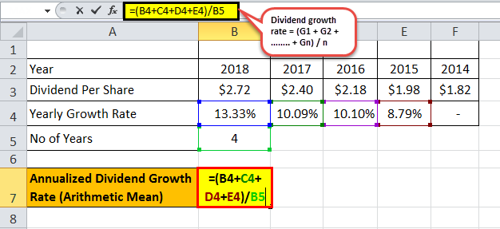

Financial accounting, accrued dividends, and algorithmic trading represent interconnected facets of modern investing. Understanding these elements is essential for investors seeking to maximize their returns while navigating the complexities of financial markets. This article explores the roles of financial accounting and accrued dividends in dividend calculation and highlights the integration of algorithmic trading into investment strategies, thus providing investors with innovative ways to optimize their portfolios.

Financial accounting is central to accurately tracking a company's financial health, influencing decisions about dividend payouts and investor relations. Accurate accounting ensures compliance with financial regulations and provides transparency, fostering trust between a company and its shareholders. In this context, accrued dividends—declared but unpaid dividends—are a crucial concept, indicating a company's financial obligations and influencing investment decisions.



Algorithmic trading has transformed market operations by enabling quicker and more effective trading decisions. In dividend investing, trading algorithms can enhance strategies by optimizing the timing of transactions around dividend events, thus balancing risks and returns. Investors interested in dividend stocks can benefit from using algorithmic models to identify optimal trade opportunities, ensuring their strategies remain competitive in a fast-paced, data-driven environment.

By investigating the concepts of financial accounting, accrued dividends, and algorithmic trading, investors can strengthen their knowledge and improve their decision-making. Leveraging these insights helps investors manage their portfolios more effectively, integrating traditional investment strategies with cutting-edge technology for sustainable growth. Embracing these developments offers a pathway to harnessing the full potential of financial assets, ensuring relevance in the evolving landscape of finance.

## Table of Contents

## Understanding Financial Accounting in Dividend Calculation

Financial accounting is crucial in tracking a company's financial health, directly influencing dividend distribution. Accrued dividends are a critical concept within this framework, representing liabilities on a company's balance sheet for declared but unpaid dividends. These dividends are a financial obligation the company owes to its shareholders and must be accounted for accurately.

Accrued dividends impact the company’s balance sheet by increasing liabilities until the dividend payment is made. Financial accounting principles ensure that these transactions are recorded transparently and accurately, facilitating compliance with financial regulations and maintaining shareholder confidence.

For investors, understanding the calculation of accrued dividends is essential. The calculation typically involves multiplying the number of shares outstanding by the dividend per share. Mathematically, this can be expressed as:

$$
\text{Accrued Dividends} = \text{Shares Outstanding} \times \text{Dividend per Share}
$$

Accurate accounting is vital for this process, as it provides insight into the company's ability to sustain dividend payments. It also informs investors about the potential future income from their investments. Proper accounting practices help ensure that companies meet their payout obligations, maintain investor trust, and comply with the disclosure requirements of regulatory bodies.

Investors must be adept at interpreting financial statements to assess dividend sustainability. This involves analyzing the balance sheet, income statement, and cash flow statement to evaluate whether a company has the financial strength to continue paying dividends. Key financial ratios, such as the dividend payout ratio and the return on equity, are integral in this assessment, offering quantitative measures of a company's dividend policy and financial performance.

In conclusion, a solid understanding of financial accounting principles in dividend calculation is vital for investors. It aids them in making informed decisions based on the company's financial statements and its ability to maintain or grow dividend payments sustainably.

## Accrued Dividends: Calculation and Impact

Accrued dividends are an important aspect of financial accounting, representing impending financial obligations a company has towards its shareholders. These dividends signify amounts that have been declared but not yet paid out, reflecting the company's commitment to its investors. For individuals focused on dividend income, understanding the calculation and implications of accrued dividends is vital to crafting a robust financial strategy.

The calculation of accrued dividends is straightforward yet crucial. It is determined by multiplying the number of shares outstanding by the dividend per share. For instance, if a company has declared a dividend of $2 per share and there are 10,000 shares outstanding, the accrued dividends would be calculated as follows:

$$
\text{Accrued Dividends} = \text{Dividend Per Share} \times \text{Shares Outstanding}
$$

In this example, the accrued dividends would amount to $20,000. This figure represents the company's obligation, which will remain on its balance sheet as a liability until the dividends are disbursed to shareholders.

Accrued dividends have varying impacts on different types of stockholders, namely common and preferred stockholders. Preferred stockholders typically have the advantage of receiving dividends before common stockholders. In scenarios where dividends are suspended, preferred shareholders might accumulate dividends, which must be paid out before any dividends can be distributed to common stockholders. This preferential treatment underscores the importance of understanding the specific terms and provisions associated with different classes of stock.

The financial statements of a company are impacted by accrued dividends, notably affecting the retained earnings section of the balance sheet. Until dividends are paid, accrued amounts are classified as liabilities, reducing the retained earnings available for reinvestment. This classification is crucial because it reflects the company's financial obligations and affects its ability to reinvest in other opportunities.

For investors who prioritize dividend income, comprehending accrued dividends is essential. It allows them to accurately project their expected cash flows and assess the sustainability of dividend payments. Meanwhile, evaluating a company's financial statements with a focus on accrued dividends can offer insights into its dividend policy, financial health, and its management's commitment to returning value to shareholders.

In conclusion, accrued dividends are not merely future income; they are an indicator of a company's fiscal responsibilities and its strategy in managing shareholder relations. By understanding their calculation and implications, investors can better position themselves to make informed decisions that align with their financial objectives.

## The Role of Algorithmic Trading in Dividend Investing

Algorithmic trading has significantly transformed dividend investing by providing investors with more precise and efficient methods to manage their portfolios. At its core, [algorithmic trading](/wiki/algorithmic-trading) utilizes advanced mathematical models and computational technology to execute trades based on defined criteria, reducing human error and increasing the speed of transactions. This approach is particularly beneficial in dividend investing, where timing can greatly impact potential returns.

In dividend investing, algorithms can be programmed to optimize entry and [exit](/wiki/exit-strategy) points relative to dividend distribution dates. These programs analyze vast datasets, including historical price movements, [volume](/wiki/volume-trading-strategy) trends, and dividend payment schedules, to predict the best times to buy or sell dividend stocks. By doing so, algorithms help investors capture dividend payments while potentially maximizing capital gains, thereby enhancing the overall income potential of the portfolio.

For example, an algorithm might be designed to detect patterns in stock price movements that suggest a stock is likely to increase in value just before the ex-dividend date—the cutoff date to be eligible for the next dividend payment. By purchasing at an optimal time and selling after the stock’s price typically drops post-dividend distribution, the investor can both receive the dividend and take advantage of favorable price changes. Such strategies are made feasible by the speed and accuracy of algorithmic trading.

Python is a popular language for implementing such strategies due to its extensive libraries for financial analysis. For instance, using a library like `pandas` to handle time series data, a basic algorithm could automate the process of identifying when stocks typically exhibit price increases before ex-dividend dates. Additionally, libraries such as `NumPy` and `SciPy` can be used to perform complex calculations and optimizations.

```python
import pandas as pd

# Load stock and dividend data
stock_data = pd.read_csv('stock_prices.csv')
dividend_data = pd.read_csv('dividend_dates.csv')

# Calculate moving averages or other indicators to identify buy signals
stock_data['moving_average'] = stock_data['Close'].rolling(window=20).mean()

# Generate buy/sell signals based on dividend dates and moving averages
def identify_trade_signals(stock_data, dividend_dates):
    trade_signals = []
    for index, row in dividend_dates.iterrows():
        ex_dividend_date = row['ex_date']
        if stock_data.loc[ex_dividend_date, 'Close'] > stock_data.loc[ex_dividend_date, 'moving_average']:
            trade_signals.append((ex_dividend_date, 'Buy'))
            # Include logic for post-dividend 'Sell' signals
            sell_date = stock_data.index.get_loc(ex_dividend_date) + 5  # Example: Sell after 5 days
            trade_signals.append((stock_data.index[sell_date], 'Sell'))
    return trade_signals

trade_signals = identify_trade_signals(stock_data, dividend_data)
```

By incorporating such algorithmic strategies, investors can better navigate market [volatility](/wiki/volatility-trading-strategies) and capitalize on time-sensitive opportunities in dividend investing. The use of algorithms does not only optimize financial outcomes but also embodies a shift towards a more data-driven approach in a field traditionally dominated by [fundamental analysis](/wiki/fundamental-analysis).

Integrating algorithmic trading into dividend strategies is crucial in an industry where rapid data processing and decision-making can confer significant advantages. As financial markets continue to evolve, investors who leverage technology to refine their strategies will be better equipped to achieve superior returns, maintain a competitive edge, and adapt to the increasing pace of financial transactions.

## Integrating Financial Strategies with Technology

Integrating technology into financial strategies, particularly for optimizing dividend-focused portfolios, offers considerable benefits by enhancing the precision and efficiency of investment decisions. By blending traditional financial insights with algorithmic models, investors can adjust dynamically to market variables, thereby improving overall investment outcomes.

**Algorithmic Models and Traditional Insights**

The fusion of established financial principles with algorithmic trading models enables automatic adjustments based on real-time data such as market trends, volatility indices, and historical dividend performance. These models can efficiently process large datasets to identify potential investment opportunities in dividend stocks. For instance, investors can employ algorithms to scan for stocks with a history of increasing dividend payouts, thus aligning selection strategies with dividend growth models.

**Backtesting Strategies**

Backtesting forms a cornerstone of integrating technology into financial strategies. It allows investors to test the viability of a strategy against historical market data, providing insight into potential future performance. Through [backtesting](/wiki/backtesting), investors can refine strategies to improve their accuracy in predicting dividend returns. Python libraries like `pandas` and `[backtrader](/wiki/backtrader)` are widely used for such purposes. An example of a simple backtest to determine the efficacy of a dividend investing strategy could be:

```python
import pandas as pd
import backtrader as bt

class DividendStrategy(bt.Strategy):
    def __init__(self):
        self.dataclose = self.datas[0].close

    def next(self):
        if self.dataclose[0] > self.dataclose[-1]:
            self.buy(size=1)

cerebro = bt.Cerebro()
data = bt.feeds.PandasData(dataname=pd.read_csv('historical_data.csv'))
cerebro.adddata(data)
cerebro.addstrategy(DividendStrategy)
cerebro.run()
cerebro.plot()
```

This script can be modified to incorporate specific dividend-related parameters and further analyze past performances to improve strategy design.

**Automated Reinvestment Plans**

Technology enhances automated reinvestment strategies, such as dividend reinvestment plans (DRIPs), by allowing for seamless reinvestment of dividends into additional shares, thus compounding returns over time. Automated systems reduce execution time, minimize transaction costs, and eliminate human errors, ensuring consistent reinvestment whenever dividends are issued.

**Balancing Traditional and Innovative Approaches**

For investors to capitalize effectively on dividends, understanding how to balance traditional strategies with technology-driven innovations is paramount. Traditional methods such as fundamental analysis provide a solid foundation for evaluating stock value and potential for dividends. Conversely, technological tools can optimize these bases by refining predictive analytics and executing trades at optimal moments based on algorithmic insights.

Embracing the integration of technology ensures that investors remain competitive in a rapidly transforming financial environment. By leveraging the strengths of both traditional financial strategies and cutting-edge technological advancements, investors can maximize their potential for long-term, sustainable growth in their dividend-focused portfolios.

## Conclusion

Navigating the complexities of financial accounting, accrued dividends, and algorithmic trading requires a strategic approach to maximize returns and ensure sustainable growth. Investors must stay informed about accounting principles to interpret financial statements and assess dividend sustainability accurately. This understanding is crucial for determining the health of their investments and making informed decisions. 

Accrued dividends, which represent declared but unpaid dividends, are an essential concept needing careful calculation. By understanding the formula: 

$$
\text{Accrued Dividends} = \text{Shares Outstanding} \times \text{Dividend Per Share}
$$

investors can precisely forecast their potential income, allowing for more accurate portfolio planning. 

The advent of algorithmic trading has reshaped investment strategies, enabling investors to leverage technology for enhanced decision-making. Algorithms can identify optimal entry and exit points, particularly around dividend dates, thereby maximizing returns while minimizing risks. Such technological integration can significantly improve dividend income strategies and overall portfolio performance.

The future of investing involves harmonizing traditional financial fundamentals with cutting-edge technologies. This blend facilitates a dynamic adjustment to market changes, enhancing long-term investment outcomes. By comprehending these concepts, investors are better equipped to harness the full potential of their financial assets, positioning themselves advantageously in a rapidly evolving financial landscape. This strategic integration ensures that investors not only remain current with market trends but also optimize their portfolios to achieve sustainable growth.

## References & Further Reading

[1]: Bergstra, J., Bardenet, R., Bengio, Y., & Kégl, B. (2011). ["Algorithms for Hyper-Parameter Optimization."](https://dl.acm.org/doi/10.5555/2986459.2986743) Advances in Neural Information Processing Systems 24.

[2]: ["Advances in Financial Machine Learning"](https://www.amazon.com/Advances-Financial-Machine-Learning-Marcos/dp/1119482089) by Marcos Lopez de Prado.

[3]: ["Evidence-Based Technical Analysis: Applying the Scientific Method and Statistical Inference to Trading Signals"](https://www.amazon.com/Evidence-Based-Technical-Analysis-Scientific-Statistical/dp/0470008741) by David Aronson.

[4]: ["Machine Learning for Algorithmic Trading"](https://github.com/stefan-jansen/machine-learning-for-trading) by Stefan Jansen.

[5]: ["Quantitative Trading: How to Build Your Own Algorithmic Trading Business"](https://www.amazon.com/Quantitative-Trading-Build-Algorithmic-Business/dp/1119800064) by Ernest P. Chan.