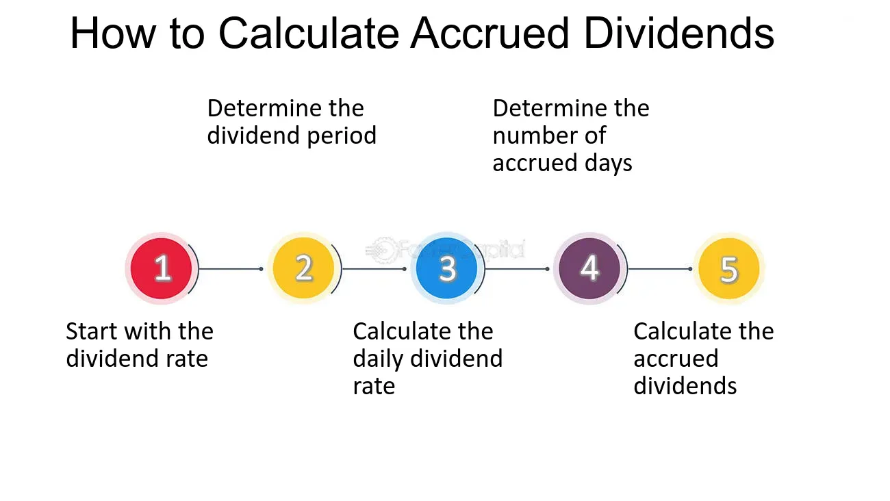

## Table of Contents

## What is an accrued dividend?

An accrued dividend is money that a company owes to its shareholders but hasn't paid yet. When a company decides to pay a dividend, it sets a date called the "record date." If you own the stock on that date, you get the dividend. But, if you sell the stock before the dividend is actually paid, the buyer of your stock gets the dividend money instead. The dividend is still owed, so it's called an accrued dividend until it's paid out.

This situation often happens around the time of the dividend payment. For example, if a company declares a dividend on January 1st, sets the record date for January 15th, and plans to pay the dividend on February 1st, anyone who sells the stock between January 15th and February 1st is selling it with an accrued dividend. The new owner of the stock will receive the dividend on February 1st, even though they didn't own the stock on the record date. This is important for investors to understand because it affects the timing and ownership of dividend payments.

## How do dividends work?

Dividends are payments that companies give to their shareholders. When a company makes a profit, it can choose to share some of that profit with the people who own its stock. The company's board of directors decides how much to pay and when to pay it. They announce a dividend, set a date called the "record date," and then pay the dividend on a later date called the "payment date." If you own the stock on the record date, you get the dividend.

Sometimes, companies pay dividends every three months, which is called a quarterly dividend. Other times, they might pay once a year or even less often. The amount of the dividend can change, too. If the company is doing well, it might increase the dividend. If it's not doing so well, it might decrease it or not pay one at all. Dividends are usually paid in cash, but sometimes they can be in the form of more stock, which is called a stock dividend.

## Why is it important to calculate accrued dividends?

Calculating accrued dividends is important because it helps investors and companies keep track of money that is owed but not yet paid. When a company declares a dividend, it sets a record date. If you own the stock on that record date, you are entitled to the dividend. But if you sell the stock before the dividend is actually paid, the buyer gets the dividend. Knowing the accrued dividend helps everyone understand who should get the money when the dividend is finally paid out.

This is also important for accounting and financial reporting. Companies need to show accrued dividends as a liability on their balance sheet until they are paid. This helps give a clear picture of the company's financial health. For investors, understanding accrued dividends can affect decisions about when to buy or sell stocks, especially around the time of dividend payments. It helps them plan their investments better and know what to expect in terms of income from their stocks.

## What is the formula for calculating accrued dividends?

The formula for calculating accrued dividends is simple. You take the dividend per share that the company announced and multiply it by the number of shares you own. If a company says it will pay $1 per share and you own 100 shares, your accrued dividend is $100.

This calculation is important because it helps you know how much money you are owed before the company actually pays it out. If you sell your shares before the dividend is paid, the buyer will get the money, but you still need to know how much the dividend was worth when you owned the stock. This way, you can keep track of your investment and plan your finances better.

## How do you determine the declaration date, record date, and payment date for dividends?

The declaration date is when a company's board of directors announces that they will pay a dividend. They tell everyone how much the dividend will be and when it will be paid. This date is important because it's when the company officially says, "We're going to give money to our shareholders."

The record date comes next. This is the date the company uses to figure out who gets the dividend. If you own the stock on the record date, you get the dividend. If you don't own it on that day, you don't get the money, even if you buy the stock right after the record date.

The payment date is when the company actually sends the money to the shareholders. This is usually a few weeks after the record date. On this day, the company pays out the dividend to everyone who owned the stock on the record date.

## Can you explain the difference between accrued dividends and regular dividends?

Accrued dividends and regular dividends are both ways companies share their profits with shareholders, but they happen at different times. A regular dividend is the money a company pays to its shareholders after announcing it. When a company says it will pay a dividend, it sets a date called the record date. If you own the stock on that date, you get the dividend when it's paid out. This is what most people think of when they hear the word "dividend."

An accrued dividend, on the other hand, is money that a company owes to its shareholders but hasn't paid yet. This happens if you own the stock on the record date but sell it before the company actually pays the dividend. The new owner of the stock gets the dividend, but you still had a right to it when you owned the stock. So, the dividend is "accrued" to you until it's paid out to the new owner. Understanding the difference helps investors know when they will get their money and how selling their stock might affect their dividend payments.

## How does the timing of dividend payments affect the calculation of accrued dividends?

The timing of dividend payments is really important when figuring out accrued dividends. When a company says it will pay a dividend, it sets a record date. If you own the stock on that record date, you are supposed to get the dividend. But if you sell the stock before the company actually pays the dividend, the person who buys your stock gets the money instead. So, the dividend is "accrued" to you until it's paid out to the new owner. This means you need to know the record date and the payment date to figure out if you have an accrued dividend.

The time between the record date and the payment date is when accrued dividends matter the most. If you own the stock on the record date but sell it before the payment date, you won't get the dividend, but you still had a right to it when you owned the stock. That's why the dividend is considered accrued to you. Knowing these dates helps you understand how much money you are owed and when you might get it, even if you don't end up getting it directly from the company.

## What are the tax implications of accrued dividends?

Accrued dividends can have tax implications for both the person who sells the stock and the person who buys it. If you own a stock on the record date but sell it before the dividend is paid, the dividend is still considered income to you for tax purposes, even though you won't actually get the money. You'll need to report this accrued dividend as income on your tax return. The person who buys your stock will get the dividend, but they won't have to pay taxes on it because it's already been taxed as income to you.

This can be a bit confusing, but it's important to understand because it affects how much tax you might owe. If you're not careful, you might forget to report the accrued dividend and end up in trouble with the tax authorities. It's always a good idea to keep track of your stock transactions and know the record dates and payment dates for any dividends so you can handle the tax side of things correctly.

## How do accrued dividends impact financial statements?

Accrued dividends show up on a company's financial statements as a liability. This means the company owes money to its shareholders but hasn't paid it out yet. On the balance sheet, you'll see accrued dividends listed under current liabilities because they need to be paid within a year. This helps everyone see that the company has promised to pay dividends and hasn't forgotten about it.

For investors, knowing about accrued dividends is important because it tells them how much money the company owes them. If you own a stock on the record date but sell it before the dividend is paid, the accrued dividend is still counted as income for you, even though you won't get the money. This can affect how much tax you owe, so it's good to keep track of these dividends and understand how they show up on financial statements.

## What are common mistakes to avoid when calculating accrued dividends?

One common mistake people make when calculating accrued dividends is forgetting to check the record date. The record date is when you need to own the stock to get the dividend. If you sell your stock before the payment date but after the record date, you won't get the money, but the dividend is still yours for tax purposes. So, always make sure you know the record date and the payment date to avoid missing out on dividends or making mistakes on your taxes.

Another mistake is not keeping track of how many shares you own. If you own 100 shares and the dividend is $1 per share, your accrued dividend is $100. But if you forget how many shares you have, you might calculate the wrong amount. It's important to keep good records of your stock transactions so you know exactly how much you're owed.

## How do different types of securities affect the calculation of accrued dividends?

Different types of securities can change how you calculate accrued dividends. For example, common stocks usually pay dividends based on the number of shares you own. If you own 100 shares of a company that pays a $1 dividend per share, your accrued dividend is $100. But preferred stocks might have different rules. Some preferred stocks pay a fixed dividend, so you need to know the specific terms of the stock to figure out your accrued dividend. If you own a preferred stock with a fixed dividend of $2 per share and you own 50 shares, your accrued dividend would be $100.

Another type of security that can affect accrued dividends is mutual funds. Mutual funds often pay dividends based on the fund's performance and the number of shares you own. If a mutual fund declares a dividend of $0.50 per share and you own 200 shares, your accrued dividend would be $100. But, mutual funds might also reinvest dividends automatically, which means you need to keep track of how many shares you have after reinvestment to calculate your accrued dividends correctly. Understanding the specific rules for each type of security helps you figure out how much money you are owed in dividends.

## What advanced strategies can investors use to optimize their returns based on accrued dividends?

Investors can use a strategy called dividend capture to try to get more money from accrued dividends. This means buying a stock just before the record date and then selling it after the record date but before the payment date. If you do this right, you can get the dividend even though you only owned the stock for a short time. But this strategy can be risky because stock prices might go down after the record date, and you might lose more money than you gain from the dividend. It's important to think about the risks and do a lot of research before trying this.

Another strategy is to use tax planning to make the most of accrued dividends. Since accrued dividends are counted as income for tax purposes, you might want to sell stocks that have accrued dividends in a year when your income is lower. This can help you pay less tax on the dividends. Also, if you have stocks in a tax-advantaged account like an IRA, you don't have to worry about taxes on dividends right away. This can help you keep more of your money and let it grow over time. Both of these strategies need careful planning and understanding of how taxes work with your investments.

## How does financial accounting help in understanding dividend calculation?

Financial accounting is crucial in tracking a company's financial health, directly influencing dividend distribution. Accrued dividends are a critical concept within this framework, representing liabilities on a company's balance sheet for declared but unpaid dividends. These dividends are a financial obligation the company owes to its shareholders and must be accounted for accurately.

Accrued dividends impact the company’s balance sheet by increasing liabilities until the dividend payment is made. Financial accounting principles ensure that these transactions are recorded transparently and accurately, facilitating compliance with financial regulations and maintaining shareholder confidence.

For investors, understanding the calculation of accrued dividends is essential. The calculation typically involves multiplying the number of shares outstanding by the dividend per share. Mathematically, this can be expressed as:

$$
\text{Accrued Dividends} = \text{Shares Outstanding} \times \text{Dividend per Share}
$$

Accurate accounting is vital for this process, as it provides insight into the company's ability to sustain dividend payments. It also informs investors about the potential future income from their investments. Proper accounting practices help ensure that companies meet their payout obligations, maintain investor trust, and comply with the disclosure requirements of regulatory bodies.

Investors must be adept at interpreting financial statements to assess dividend sustainability. This involves analyzing the balance sheet, income statement, and cash flow statement to evaluate whether a company has the financial strength to continue paying dividends. Key financial ratios, such as the dividend payout ratio and the return on equity, are integral in this assessment, offering quantitative measures of a company's dividend policy and financial performance.

In conclusion, a solid understanding of financial accounting principles in dividend calculation is vital for investors. It aids them in making informed decisions based on the company's financial statements and its ability to maintain or grow dividend payments sustainably.

## What are Accrued Dividends: How are they Calculated and What Impact do they Have?

Accrued dividends are an important aspect of financial accounting, representing impending financial obligations a company has towards its shareholders. These dividends signify amounts that have been declared but not yet paid out, reflecting the company's commitment to its investors. For individuals focused on dividend income, understanding the calculation and implications of accrued dividends is vital to crafting a robust financial strategy.

The calculation of accrued dividends is straightforward yet crucial. It is determined by multiplying the number of shares outstanding by the dividend per share. For instance, if a company has declared a dividend of $2 per share and there are 10,000 shares outstanding, the accrued dividends would be calculated as follows:

$$
\text{Accrued Dividends} = \text{Dividend Per Share} \times \text{Shares Outstanding}
$$

In this example, the accrued dividends would amount to $20,000. This figure represents the company's obligation, which will remain on its balance sheet as a liability until the dividends are disbursed to shareholders.

Accrued dividends have varying impacts on different types of stockholders, namely common and preferred stockholders. Preferred stockholders typically have the advantage of receiving dividends before common stockholders. In scenarios where dividends are suspended, preferred shareholders might accumulate dividends, which must be paid out before any dividends can be distributed to common stockholders. This preferential treatment underscores the importance of understanding the specific terms and provisions associated with different classes of stock.

The financial statements of a company are impacted by accrued dividends, notably affecting the retained earnings section of the balance sheet. Until dividends are paid, accrued amounts are classified as liabilities, reducing the retained earnings available for reinvestment. This classification is crucial because it reflects the company's financial obligations and affects its ability to reinvest in other opportunities.

For investors who prioritize dividend income, comprehending accrued dividends is essential. It allows them to accurately project their expected cash flows and assess the sustainability of dividend payments. Meanwhile, evaluating a company's financial statements with a focus on accrued dividends can offer insights into its dividend policy, financial health, and its management's commitment to returning value to shareholders.

In conclusion, accrued dividends are not merely future income; they are an indicator of a company's fiscal responsibilities and its strategy in managing shareholder relations. By understanding their calculation and implications, investors can better position themselves to make informed decisions that align with their financial objectives.

## What is the conclusion?

Navigating the complexities of financial accounting, accrued dividends, and algorithmic trading requires a strategic approach to maximize returns and ensure sustainable growth. Investors must stay informed about accounting principles to interpret financial statements and assess dividend sustainability accurately. This understanding is crucial for determining the health of their investments and making informed decisions. 

Accrued dividends, which represent declared but unpaid dividends, are an essential concept needing careful calculation. By understanding the formula: 

$$
\text{Accrued Dividends} = \text{Shares Outstanding} \times \text{Dividend Per Share}
$$

investors can precisely forecast their potential income, allowing for more accurate portfolio planning. 

The advent of algorithmic trading has reshaped investment strategies, enabling investors to leverage technology for enhanced decision-making. Algorithms can identify optimal entry and exit points, particularly around dividend dates, thereby maximizing returns while minimizing risks. Such technological integration can significantly improve dividend income strategies and overall portfolio performance.

The future of investing involves harmonizing traditional financial fundamentals with cutting-edge technologies. This blend facilitates a dynamic adjustment to market changes, enhancing long-term investment outcomes. By comprehending these concepts, investors are better equipped to harness the full potential of their financial assets, positioning themselves advantageously in a rapidly evolving financial landscape. This strategic integration ensures that investors not only remain current with market trends but also optimize their portfolios to achieve sustainable growth.

## References & Further Reading

[1]: Bergstra, J., Bardenet, R., Bengio, Y., & Kégl, B. (2011). ["Algorithms for Hyper-Parameter Optimization."](https://dl.acm.org/doi/10.5555/2986459.2986743) Advances in Neural Information Processing Systems 24.

[2]: ["Advances in Financial Machine Learning"](https://www.amazon.com/Advances-Financial-Machine-Learning-Marcos/dp/1119482089) by Marcos Lopez de Prado.

[3]: ["Evidence-Based Technical Analysis: Applying the Scientific Method and Statistical Inference to Trading Signals"](https://www.amazon.com/Evidence-Based-Technical-Analysis-Scientific-Statistical/dp/0470008741) by David Aronson.

[4]: ["Machine Learning for Algorithmic Trading"](https://github.com/stefan-jansen/machine-learning-for-trading) by Stefan Jansen.

[5]: ["Quantitative Trading: How to Build Your Own Algorithmic Trading Business"](https://www.amazon.com/Quantitative-Trading-Build-Algorithmic-Business/dp/1119800064) by Ernest P. Chan.