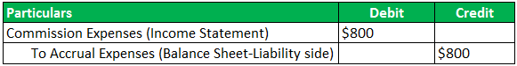

The intersection of accrued expenses, expense management, financial accounting, and algorithmic trading serves as a pivotal framework for organizations seeking enhanced fiscal efficiency and strategic growth. Each of these components plays an integral role in shaping an organization's financial landscape, allowing for a comprehensive approach to managing financial resources.

Accrued expenses represent financial obligations that a company acknowledges before the actual cash payments are made, appearing as liabilities on the balance sheet. This practice is crucial for accurate financial accounting, ensuring that all financial activities are reported within the specific accounting period in which they occur, rather than when cash is exchanged. This alignment of expenses with revenues enhances the accuracy of financial statements, providing a true reflection of a company's financial position.



Effective expense management involves implementing strategies that control and monitor expenditures, aligning them with the company's financial objectives. By understanding accrued expenses, organizations can gain significant insights into their future cash commitments and strategically plan for these outflows to maintain liquidity and operational efficiency. 

Integrating financial accounting principles, particularly the recognition and management of accrued expenses, within algorithmic trading frameworks can significantly augment financial performance. Algorithmic trading, which relies heavily on precise data analytics, benefits from accurate financial records. These records facilitate the development of informed trading strategies that enhance market forecasts and decision-making. By leveraging complex data sets, organizations can transform raw financial data into actionable insights that optimize trading operations and increase profitability.

Understanding how these elements interact is vital for improving financial reporting, adhering to regulatory compliance, and refining investment strategies. Organizations that effectively navigate this intersection can achieve a competitive advantage by not only enhancing the accuracy and transparency of their financial statements but also by refining their trading strategies through the integration of advanced financial accounting practices. 

As technology evolves and accounting standards continue to develop, the importance of understanding and managing accrued expenses within financial reporting and algorithmic trading frameworks is expected to grow, offering organizations new opportunities for strategic financial optimization.

## Table of Contents

## Understanding Accrued Expenses

Accrued expenses, often termed as accrued liabilities, represent financial obligations of a company for goods or services that have been received, with payment yet to be made. These expenses are integral to financial accounting, where they are recorded as current liabilities on the balance sheet. This accounting practice ensures that the financial statements reflect a company's true economic condition in a fiscal period.

In contrast, prepaid expenses represent assets, as they reflect payments made for goods or services to be received in the future. This distinction between accrued expenses and prepaid expenses highlights the dual nature of financial obligations and rights. While accrued expenses anticipate future cash outflows, prepaid expenses secure future benefits, underscoring a firm’s [liquidity](/wiki/liquidity-risk-premium) management strategy.

Accrued expenses play a pivotal role in expense management. By aligning costs with revenues within specific accounting periods, they facilitate the adherence to the accrual accounting principle. This principle, which is a cornerstone of Generally Accepted Accounting Principles (GAAP), mandates that expenses be recognized when incurred, irrespective of payment. This leads to more accurate financial reporting, aiding stakeholders in understanding the company's financial health.

Types of accrued expenses commonly encountered include interest payable, wages payable, and utilities payable. Each of these examples involves services being utilized during a period, for which the financial obligation is recognized, though the cash settlement occurs later. The impact of accrued expenses on corporate financial health is significant. They affect liquidity ratios and can influence a firm's creditworthiness. For example, a sudden increase in accrued expenses may signal impending cash flow challenges, alerting management to potential issues.

Overall, understanding the principles and impacts of accrued expenses is essential for accurate financial analysis and effective fiscal management. This understanding not only enhances the precision of financial statements but also offers a clearer insight into the company's operational efficiency and strategic planning capabilities.

## Importance of Accrued Expenses in Financial Accounting

Accrual accounting, governed by generally accepted accounting principles (GAAP), is instrumental in ensuring that financial statements accurately represent an organization's economic condition. This method mandates that income and expenses are documented in the periods they occur, irrespective of when cash transactions take place. This approach is key to maintaining the integrity and accuracy of financial reports.

Accrued expenses, as a core component of accrual accounting, are liabilities recognized at the time they are incurred rather than when they are paid. This ensures that companies account for costs in the appropriate period, preventing misstatements and enhancing the reliability of financial data. For example, if a firm receives a service in December but pays for it in January, the expense should be recorded in December's financial statements. This aligns the expense with the corresponding revenue, achieving a clear representation of the financial situation.

Incorporating accrued expenses into financial accounting has both advantages and drawbacks. On the positive side, this inclusion offers a holistic view of a company’s financial health. By accurately aligning expenses with the correct accounting periods, accrued expenses facilitate strategic planning and decision-making processes. Companies are better equipped to evaluate their financial performance, improve budgeting accuracy, and ensure compliance with regulatory standards.

However, the adoption of accrual accounting can introduce complexities. Recognizing expenses before payment can be challenging, as it requires precise estimation and judgment, increasing the risk of errors and potential manipulation of financial results. Organizations must adhere strictly to accounting standards and practices to mitigate these risks. Continuous evaluation of the accuracy of the accrued amounts is necessary, and professional oversight is crucial to prevent any form of misstatement.

In summary, an in-depth understanding and management of accrued expenses can significantly enhance the quality of financial reporting. This ensures that businesses are not only compliant with regulatory standards but are also equipped with accurate and comprehensive financial insights that support strategic growth and stability.

## Effective Expense Management Strategies

Expense management is a critical aspect of financial oversight, ensuring that a company maintains alignment with its budgetary constraints and financial objectives. A well-structured expense management system empowers organizations to track their spending, anticipate future cash outflows, and maintain fiscal discipline, supporting strategic growth and sustainability.

One of the primary elements in effective expense management is the understanding and management of accrued expenses. Accrued expenses represent obligations for goods or services received but not yet paid. By accurately tracking these financial commitments, companies gain insight into potential cash outflows and are better equipped to prepare for future liabilities. This proactive approach aids in maintaining accurate financial records and supports informed decision-making.

Automation plays a pivotal role in modern expense management strategies. Implementing automated systems for tracking expenses can significantly enhance accuracy and efficiency, reducing manual errors, and freeing up resources for more strategic activities. Automated systems also allow for real-time data analysis, providing immediate insights into spending patterns and aiding in the swift identification of cost-saving opportunities.

Incorporating advanced accounting software into expense management processes facilitates comprehensive data analytics and reporting capabilities. These systems enable companies to monitor expenses continuously, ensuring compliance with financial targets and supporting strategic planning. Real-time access to financial data allows for dynamic monitoring and adjustment of spending in response to changing economic conditions.

Regular financial audits are another cornerstone of effective expense management. Conducting periodic audits helps in verifying the accuracy of financial records and the integrity of the expense management process. Audits also serve as a safeguard against financial discrepancies and provide assurance to stakeholders regarding the company's financial health.

Cost control measures should be carefully tailored to the specific needs of the industry in which a company operates. This involves identifying key areas where expenses can be optimized without compromising the quality of goods or services. Strategies may include negotiating better terms with suppliers, reducing unnecessary overhead costs, and streamlining operations to improve overall efficiency.

In summary, effective expense management strategies are essential for supporting business growth and long-term sustainability. By leveraging automation, advanced accounting tools, regular audits, and tailored cost control measures, companies can manage their expenses more efficiently, align them with their financial goals, and lay the groundwork for strategic success.

## Integration of Financial Accounting with Algorithmic Trading

Algorithmic trading, characterized by executing orders using automated, pre-programmed trading instructions, relies heavily on sound financial accounting principles. These principles ensure that traders can make precise and informed decisions, ultimately increasing trade efficiency and profitability. Accurate financial records, including the meticulous tracking of accrued expenses, provide an essential foundation for algorithmic strategies, enhancing both the accuracy of market forecasts and the quality of trading decisions.

Accrued expenses, when correctly recognized and managed, reflect a company's various financial commitments that have yet to be discharged in cash terms. By closely monitoring these liabilities, traders have access to real-time insights into financial commitments, providing a detailed understanding of potential future cash outflows. This information is critical when devising [algorithmic trading](/wiki/algorithmic-trading) strategies, as it helps in assessing the financial health and resource availability of an organization, thus enabling optimized capital utilization.

Data analytics play a significant role in expense management within algorithmic trading. By applying analytical techniques, traders can uncover patterns in financial data, allowing them to understand how expenses correlate with various market factors. For instance, a Python script utilizing libraries such as `pandas` or `numpy` can process historical expense data to identify trends or anomalies that may influence trading performance. Below is a basic example of how Python code might be applied in this context:

```python
import pandas as pd

# Sample data: Historical expenses and revenues
data = {'Date': ['2023-01-01', '2023-02-01', '2023-03-01'],
        'Expenses': [20000, 25000, 22000],
        'Revenues': [30000, 32000, 31000]}

# Creating a DataFrame
df = pd.DataFrame(data)

# Calculating expense-to-revenue ratio
df['Expense_to_Revenue'] = df['Expenses'] / df['Revenues']

# Displaying results
print(df)
```

This analysis can help optimize resource allocation, crucial for improving trading performance. Algorithmic trading benefits from integrating financial accounting principles by ensuring such processes are data-driven and aligned with accurate, timely financial reporting.

Furthermore, integrating these financial principles within trading algorithms allows for improved performance metrics. By reflecting the true economic conditions of trades through accrued expense management, algorithms can be adjusted to enhance their decision-making frameworks. This alignment ensures capital is efficiently deployed, increasing profitability and providing a strategic advantage over competitors.

Overall, the integration of financial accounting—specifically accrued expense management—into algorithmic trading systems empowers organizations to capitalize on a structured, informed trading approach. As trading environments evolve, so too will the sophistication of these integrations, bolstering the dynamic relationship between financial accounting and trading technologies.

## Challenges and Considerations

Accrual accounting is integral to financial reporting but introduces several complexities, particularly concerning expense recognition and management. These complexities create potential challenges that organizations must navigate carefully. 

One significant challenge is the risk of financial misstatement or manipulation. Accrual accounting requires that expenses be recognized when they are incurred, not when they are paid. This requirement can lead to unintended discrepancies if not properly managed. For instance, if an organization's methods for estimating accrued expenses are flawed or overly subjective, this may result in inaccuracies in financial statements. Therefore, strict adherence to Generally Accepted Accounting Principles (GAAP) or International Financial Reporting Standards (IFRS) is essential to ensure the reliability of reported financial information. These standards provide guidelines for accurately recognizing and measuring accrued expenses, thereby minimizing risks of misstatement.

The integration of financial accounting principles into algorithmic trading environments further complicates matters, posing challenges in data management, accuracy, and compliance. Algorithmic trading relies on precise data and real-time calculations to optimize trading strategies. Thus, integrating financial data, including accrued expenses, requires robust data integration frameworks to ensure the accuracy and timeliness of the information utilized by trading algorithms. Discrepancies or lags in data can lead to suboptimal trading decisions and potentially significant financial losses, especially in high-frequency trading scenarios. Compliance with financial regulations and accounting standards must also be maintained, adding an additional layer of complexity to the integration process.

Continuous monitoring and auditing are essential processes in mitigating these risks. Regular audits help ensure that accrued expenses and other financial data are recorded accurately, thereby enhancing the quality of financial reporting. Auditing also provides an opportunity to assess the effectiveness of internal controls and identify potential weaknesses or areas for improvement. This continual oversight is crucial not only for maintaining the integrity of financial accounting systems but also for ensuring that algorithms operate effectively and within regulatory frameworks.

Ultimately, the challenges associated with managing accrued expenses and implementing financial accounting systems in algorithmic trading require a multifaceted approach. This includes strict compliance with accounting standards, strategic data integration, and robust monitoring mechanisms. By addressing these considerations, organizations can better navigate the complexities of accrual accounting and maximize their strategic and financial potential.

## Conclusion

Accrued expenses are a vital component of financial accounting and algorithmic trading, offering an in-depth understanding of an organization's financial health and strategic capabilities. Accurately accounting for accrued expenses ensures that liabilities are reflected as incurred, leading to more precise financial statements. This accuracy is crucial, as it lays the foundation for informed decision-making across various business operations.

The integration of financial accounting principles, including the management of accrued expenses, with algorithmic trading enhances the efficacy and profitability of trading strategies. By leveraging accurate financial data, algorithms can make better predictions and execute trades that align with financial goals and market conditions. This strategic advantage can significantly impact an organization's competitive positioning by fostering timely and well-informed trading actions.

Despite the complexities involved in managing accrued expenses and incorporating them into trading frameworks, the potential benefits are substantial. The intersection of comprehensive financial accounting practices and algorithmic trading provides a robust platform for achieving financial optimization. It requires diligence in maintaining accounting standards and implementing sophisticated algorithmic models to ensure data accuracy and regulatory compliance.

Future advancements in technology and shifts in accounting standards are expected to further revolutionize the management of accrued expenses. These developments will enhance the integration of accurate financial data into trading algorithms, facilitating more efficient and strategic financial operations. As organizations continue to refine these processes, they will likely gain significant competitive advantages and improved financial outcomes.

## References & Further Reading

[1]: Bergstra, J., Bardenet, R., Bengio, Y., & Kégl, B. (2011). ["Algorithms for Hyper-Parameter Optimization."](https://proceedings.neurips.cc/paper/2011/file/86e8f7ab32cfd12577bc2619bc635690-Paper.pdf) Advances in Neural Information Processing Systems 24.

[2]: ["Advances in Financial Machine Learning"](https://www.amazon.com/Advances-Financial-Machine-Learning-Marcos/dp/1119482089) by Marcos Lopez de Prado

[3]: ["Evidence-Based Technical Analysis: Applying the Scientific Method and Statistical Inference to Trading Signals"](https://www.amazon.com/Evidence-Based-Technical-Analysis-Scientific-Statistical/dp/0470008741) by David Aronson

[4]: ["Machine Learning for Algorithmic Trading"](https://github.com/stefan-jansen/machine-learning-for-trading) by Stefan Jansen

[5]: ["Quantitative Trading: How to Build Your Own Algorithmic Trading Business"](https://books.google.com/books/about/Quantitative_Trading.html?id=j70yEAAAQBAJ) by Ernest P. Chan