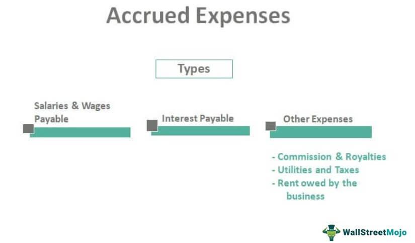

The financial sector represents a dynamic and intricate environment where understanding financial fundamentals is vital for both survival and success. Firms and individuals must skillfully manage their finances to maintain a competitive edge. A central aspect of financial management encompasses the areas of financial accounting, accrued expenses, provisions, and algorithmic trading—each playing a critical role in the ecosystem of finance.

Financial accounting acts as the backbone for businesses, enabling transparent, systematic recording and reporting of financial transactions. This transparency is crucial for stakeholders who rely on accurate financial statements to make informed decisions. In tandem, accrued expenses and provisions ensure that financial records accurately reflect a company's obligations and future liabilities, respectively, providing a snapshot of the organization’s financial health.



Moreover, as technology advances, algorithmic trading has emerged as a powerful tool in the financial market landscape. It leverages sophisticated algorithms to execute trades with precision and speed, offering significant advantages in optimizing returns and enhancing market efficiency.

Understanding these core components allows financial professionals to refine their decision-making processes and develop robust financial strategies. This knowledge is fundamental to balancing current financial challenges with future opportunities, as financial technology evolves. By analyzing these interconnected elements, professionals can gain a deeper insight into their functions and the impact they have on both traditional methods and contemporary trading practices, ultimately equipping themselves to navigate and excel in an ever-evolving financial environment.

## Table of Contents

## Understanding Financial Accounting in the Modern World

Financial accounting is fundamental to business infrastructure, providing a comprehensive framework for financial analysis and strategic planning. This discipline involves the meticulous process of recording, summarizing, and reporting a company’s financial transactions. The primary objective is to ensure transparency and compliance with regulatory standards, thereby fostering trust and reliability in the financial information presented to stakeholders.

The systematic approach to financial accounting begins with the accurate recording of transactions using double-entry bookkeeping. Each transaction affects at least two accounts, adhering to the accounting equation: 

$$
\text{Assets} = \text{Liabilities} + \text{Equity}
$$

This double-entry system ensures that the accounting equation remains balanced, maintaining the integrity of financial records.

A critical output of financial accounting is the generation of financial statements, including the income statement, balance sheet, and cash flow statement. These documents provide stakeholders with crucial insights into a company's profitability, financial position, and cash flow dynamics, respectively. Accurate financial statements are essential for investors, creditors, and management to make informed investment and operational decisions.

The advent of financial technology has significantly enhanced the efficiency of accounting processes. Automation tools and specialized software enable the real-time tracking of financial data, reducing the manual burden of data entry and minimizing errors. These technologies facilitate automated reporting, which improves the speed and accuracy of financial disclosures. For instance, software solutions can automatically compile income statements from recorded transactions, allowing for immediate analysis and decision-making.

In this era of digitization, the landscape of financial accounting continues to evolve. As businesses adopt more sophisticated financial systems, the role of accountants shifts towards strategic analysis and advisory. The integration of big data analytics and [machine learning](/wiki/machine-learning) in accounting software allows for more nuanced insights, forecasting, and anomaly detection. For example, predictive analytics can help identify trends in financial performance, enabling proactive strategy adjustments.

As financial reporting standards become increasingly stringent worldwide, maintaining compliance with frameworks such as the International Financial Reporting Standards (IFRS) or the Generally Accepted Accounting Principles (GAAP) is imperative. These standards ensure consistency, comparability, and transparency in financial statements, facilitating international business operations and investments.

In conclusion, financial accounting remains a vital element of modern business operations, supported by advancements in technology that enhance its processes and outputs. Accurate and transparent financial reporting equips stakeholders with the information necessary for effective decision-making, driving business success in a complex economic environment.

## Accrued Expenses: Definition and Importance

Accrued expenses are financial obligations that have been incurred by a company during a given accounting period but have not yet been paid. These expenses are critical in financial accounting as they ensure that a company’s financial statements present a true and fair view of its financial position by matching expenses to the period they relate to, rather than when they are paid. This accrual-based approach provides a more accurate picture of a company's performance and financial health.

On the balance sheet, accrued expenses are recorded as liabilities. Common examples include wages, interest, utilities, and taxes. By recognizing these expenses, companies can adhere to the matching principle, a fundamental accounting concept that ensures expenses are recognized in the same period as the revenues they help generate. This alignment is essential for stakeholders, such as investors and creditors, to assess the financial performance of a business accurately.

The process of recognizing accrued expenses involves the following steps: 

1. **Identification**: Determine the expenses that have been incurred but not yet paid by the end of the accounting period.
2. **Measurement**: Estimate the amount payable for the accrued expenses. 
3. **Recording**: Debit the appropriate expense account and credit the accrued liabilities account in the journal entry.

For example, if a company incurs $10,000 in utility expenses at the end of December but pays the bill in January, it should record the following journal entry on December 31:

```python
# Example journal entry for accrued utility expenses
accounts = {
    "Utility Expense": 0,
    "Accrued Liabilities": 0
}

# Record utility expense
accounts["Utility Expense"] += 10000
accounts["Accrued Liabilities"] += 10000

print(accounts)
```

This entry ensures that the expense is reflected in the December financial statements, providing a more accurate depiction of the company's financial activities for that period. 

Accurate recognition and management of accrued expenses are vital, not only for compliance with accounting standards but also for performing financial health assessments. They play a crucial role in the calculation of working capital and [liquidity](/wiki/liquidity-risk-premium) ratios, which are essential metrics used by analysts and investors to evaluate a company's operational efficiency and short-term financial stability.

As technology continues to evolve, many firms are leveraging software solutions to automate the tracking and reporting of accrued expenses. This automation aids in timely and accurate financial reporting, enhancing the overall reliability of the financial information produced. 

In conclusion, understanding and managing accrued expenses are fundamental to maintaining comprehensive and transparent financial records, which are indispensable for sound financial decision-making and strategic planning.

## Provisions: Future-proofing Financial Decisions

Provisions represent financial allocations set aside to address future liabilities or potential losses, often arising from uncertain predictions and outcomes. These financial reserves are critical for organizations as they provide a buffer against potential risks, enabling a proactive approach to managing financial obligations. By integrating provisions into the financial planning process, companies can anticipate future expenses more effectively, leading to more robust financial strategies and improved capital management.

Provisions are crucial in various sectors, serving as a safeguard against unforeseen financial burdens. For instance, in the banking industry, loan loss provisions are a key component. Banks set aside funds to cover potential loan defaults, ensuring that they remain solvent even when borrowers fail to meet their obligations. This allows banks to absorb the impact of bad debts without severely affecting their financial standing.

Similarly, warranty provisions in the manufacturing sector exemplify the role of provisions in managing future financial risks. Manufacturers often offer warranties on their products, promising to repair or replace defective items within a specified period. To fulfill these commitments, companies allocate funds to cover the potential costs of warranty services. By acknowledging these liabilities upfront, manufacturers can ensure they are financially prepared to uphold their warranty promises, thereby maintaining customer trust and satisfaction.

The strategic incorporation of provisions into financial management supports a company's ability to navigate uncertain futures. For example, accounting standards such as International Financial Reporting Standards (IFRS) mandate the recognition of provisions when a company has a present obligation resulting from past events, and it is probable that an outflow of resources will be required to settle this obligation. The amount of the provision is measured as the best estimate of the expenditure required to settle the present obligation.

In practical terms, provisions can be calculated using various methods depending on the nature of the liability. For predictable liabilities, such as annual maintenance costs or routine product recalls, historical data can inform the provision amount. Conversely, for less predictable liabilities, such as legal disputes, companies might need to rely on expert assessments or probabilistic models to estimate potential outflows.

Incorporating provisions not only fortifies an entity against future liabilities but also strengthens overall financial planning efforts. By setting aside financial resources preemptively, firms can ensure they maintain sufficient liquidity to meet obligations, thereby safeguarding against financial distress. This planned allocation enhances strategic capital management, as companies can prioritize investment opportunities without compromising their ability to address future liabilities.

Overall, provisions are essential tools for future-proofing financial decisions, ensuring that companies are well-equipped to sustain operations and capitalize on growth opportunities amidst uncertainties and potential risks.

## Algorithmic Trading: Leveraging Technology for Financial Advantage

Algorithmic trading, often known as algo trading, leverages computational power to conduct trading activities at rapid speeds, significantly surpassing human capabilities. This technique relies on computer algorithms to analyze vast datasets, optimize trading strategies, and execute orders with precision, consistency, and speed.

The core advantage of [algorithmic trading](/wiki/algorithmic-trading) lies in its ability to incorporate complex mathematical models and algorithms. These models are designed to analyze market conditions and identify trading opportunities that align with predefined criteria. For instance, traders might use algorithms to detect [arbitrage](/wiki/arbitrage) opportunities or react to small price discrepancies in real-time. The mathematical models can vary in complexity, from simple moving averages used in trend-following strategies to advanced machine learning algorithms that predict price movements based on historical data.

Algorithmic trading is prevalent across global financial markets, largely due to its efficiency in managing large volumes of transactions and mitigating human error. By processing information almost instantaneously, algorithms can react to market changes and execute trades without the delays inherent in human decision-making. This ability not only enhances market liquidity but also contributes to market efficiency by narrowing bid-ask spreads and improving price discovery.

Despite its benefits, the rapid pace and automated nature of algorithmic trading introduce potential risks that must be managed through robust risk management practices. The high speed of trade execution can contribute to market [volatility](/wiki/volatility-trading-strategies), particularly in the absence of liquidity. Moreover, algorithmic errors, often referred to as "algo glitches," can lead to significant financial losses. 

To safeguard against these risks, it is essential to implement comprehensive risk management protocols, including regular algorithm testing, setting circuit breakers (price limits), and maintaining oversight mechanisms. Moreover, regulatory compliance and monitoring are crucial to addressing the potential systemic implications of algo trading on financial stability. 

Python is frequently used for developing algorithmic trading strategies due to its versatility and robust libraries such as NumPy for numerical computing, pandas for data manipulation, and scikit-learn for machine learning. Below is a simple example of a moving average crossover strategy implemented in Python:

```python
import pandas as pd

# Load your historical data into a DataFrame
data = pd.read_csv('historical_data.csv')

# Calculate moving averages
data['short_rolling'] = data['Close'].rolling(window=40).mean()
data['long_rolling'] = data['Close'].rolling(window=100).mean()

# Generate trading signals
data['signal'] = 0
data.loc[data['short_rolling'] > data['long_rolling'], 'signal'] = 1
data.loc[data['short_rolling'] < data['long_rolling'], 'signal'] = -1

# Display signals
print(data[['Close', 'short_rolling', 'long_rolling', 'signal']])
```

This code calculates the short and long-term moving averages for a stock's closing price and generates buy or sell signals based on the crossover of these averages. Such simple strategies can be the starting point for developing more sophisticated algorithms and are fundamental in harnessing the full potential of algorithmic trading.

## Integrating Accrual Accounting with Algorithmic Trading

Accrual accounting is essential for delivering the precise financial information required to support advanced trading strategies, particularly in algorithmic trading. This accounting method records financial transactions when they are incurred rather than when cash is exchanged, ensuring that revenues and expenses are matched to the appropriate period. This alignment is critical for algorithmic traders who rely on accurate, real-time financial data to refine their strategies and respond promptly to market fluctuations.

In algorithmic trading, where decisions are executed at high speeds with minimal human intervention, the timing and accuracy of financial data are paramount. Precise accrual information enables traders to incorporate up-to-date revenue and expense data into their models, providing a more accurate picture of a firm's financial health. This, in turn, allows for strategic decision-making that aligns closely with fiscal realities and market conditions.

Moreover, algorithmic trading systems often integrate complex mathematical models and high-frequency trading algorithms that necessitate reliable financial inputs. By incorporating accurate accrual-based financial statements, traders can fine-tune their trading algorithms to optimize performance amidst dynamic market conditions. For instance, an algorithm might leverage accrual data to predict cash flow trends, adjusting its trading strategy to mitigate risk and capitalize on anticipated market movements.

The integration of accrual accounting into algorithmic trading supports the objective of achieving both financial efficiency and accuracy. By ensuring that all financial operations are recorded in real-time with high precision, traders can maintain a competitive edge, utilizing detailed financial insights to drive their algorithmic decisions. This integration ultimately fosters a more effective trading environment, where strategies are informed by accurate financial intelligence, leading to optimized trading outcomes.

## Conclusion

In the complex world of finance, grasping the intricacies of accrued expenses, provisions, and algorithmic trading is vital for achieving success in today’s dynamic economic environment. These elements are not isolated; rather, they form a cohesive framework that aids in developing a comprehensive financial strategy. Such a strategy is crucial as it balances the immediate needs of a business while anticipating and preparing for future uncertainties.

Accrued expenses and provisions allow organizations to account for financial obligations and potential liabilities, ensuring that financial statements accurately reflect a company's true performance. These practices help shield the company from unpredictable financial challenges by laying a groundwork for sound financial planning and risk management. The accurate recording and management of accrued expenses ensure firms maintain transparency and uphold stakeholder trust, which is fundamental for operational success and financial stability.

The rise of algorithmic trading underscores the importance of technology in modern finance. By utilizing algorithmic models, financial professionals can execute trades with unprecedented speed and precision, capitalizing on market opportunities that would otherwise be impossible to harness. This technological advancement also necessitates a strong foundation in financial accounting principles, including the judicious use of accrued expenses and provisions, to inform trading strategies and manage risk effectively.

As financial technology continues to progress, the interconnection between these financial components becomes increasingly critical. Algorithmic trading, coupled with robust financial accounting practices, such as efficient accrual and provision management, creates a synergy that enhances decision-making and strategic financial planning. Professionals who possess a deep understanding of these areas and can synthesize them into cohesive strategies will have a distinct advantage in navigating the evolving financial landscape.

Thus, a thorough comprehension of accrued expenses, provisions, and algorithmic trading not only equips finance professionals with the tools necessary for effective financial management but also positions them to thrive in an environment where technological and financial complexities are continuously evolving.

## References & Further Reading

[1]: Blume, L., & Friend, I. (1978). ["The changing role of the individual investor: A consumer durable approach."](https://archive.org/details/changingroleofin0000blum) Journal of Financial and Quantitative Analysis, 13(3), 421-434.

[2]: Graham, J. R., & Harvey, C. R. (2001). ["The theory and practice of corporate finance: Evidence from the field."](https://www.sciencedirect.com/science/article/pii/S0304405X01000447) Journal of Financial Economics, 60(2), 187-243.

[3]: ["Financial Accounting: An Introduction to Concepts, Methods, and Uses"](https://books.google.com/books/about/Financial_Accounting_An_Introduction_to.html?id=fYsWAAAAQBAJ) by Clyde P. Stickney, Roman L. Weil, Katherine Schipper, and Jennifer Francis

[4]: Acker, D., & Clarke, P. J. (1991). ["Provisions and contingent liabilities in financial statements."](https://www.ifrs.org/content/dam/ifrs/publications/html-standards/english/2024/issued/ias37.html) Accounting and Business Research, 21(81), 21-31.

[5]: Aldridge, I. (2009). ["High-Frequency Trading: A Practical Guide to Algorithmic Strategies and Trading Systems."](https://www.ahmetbeyefendi.com/wp-content/uploads/2020/07/High-Frequency-Trading-Irene-Aldridge.pdf) 

[6]: Huang, R. D., & Stoll, H. R. (1997). ["The components of the bid-ask spread: A general approach."](https://www.jstor.org/stable/2962337) Review of Financial Studies, 10(4), 995-1034.