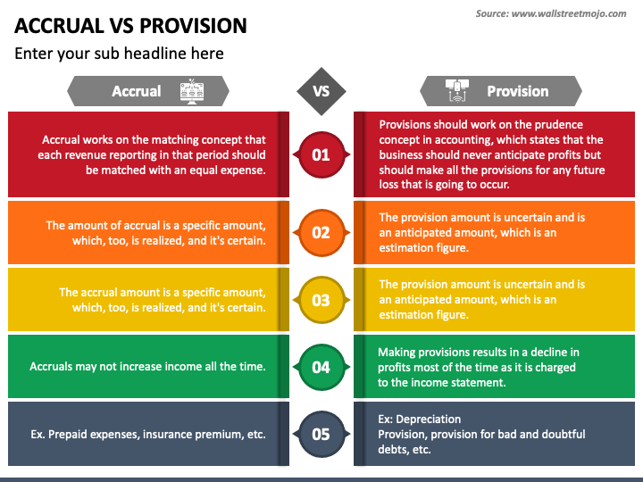

## Table of Contents

## What are accrued expenses?

Accrued expenses are costs that a business has incurred but hasn't paid yet. They are recorded on the company's books before the actual payment is made. This helps to match the expenses with the revenues they helped to generate, following the accounting principle of matching.

For example, if a company receives a utility service in December but doesn't get the bill until January, the expense for that service would be recorded in December as an accrued expense. This way, the financial statements for December will accurately reflect the costs associated with that month's operations, even though the payment happens later.

## What are provisions?

Provisions are amounts of money that a business sets aside to cover future expenses or losses that are likely to happen. They are like a safety net for the company. For example, if a business thinks it might have to pay for fixing a machine in the future, it can make a provision for that cost now. This helps the business to be ready for the expense and show a more accurate picture of its financial health.

Provisions are recorded in the company's financial statements as a liability. This means they are shown as something the company owes. When the actual expense happens, the money from the provision is used to pay for it. This way, the company's profits are not suddenly reduced by unexpected costs. Provisions help businesses plan better and keep their financial statements honest and clear.

## How do accrued expenses and provisions appear on financial statements?

Accrued expenses show up on the balance sheet as a current liability. This means they are debts the company needs to pay soon, usually within a year. They are also listed on the income statement as an expense for the period they relate to. For example, if a company uses electricity in December but gets the bill in January, the cost of that electricity will be an accrued expense on the December balance sheet and income statement. This helps match the expense with the income it helped to generate, making the financial statements more accurate.

Provisions also appear on the balance sheet as a liability. They are set aside for future costs that the company knows it will likely have to pay, like fixing a broken machine or dealing with a lawsuit. On the income statement, the cost of setting up the provision is shown as an expense in the period when the company decides to make the provision. This way, the company's financial statements reflect the expected future costs, helping to give a clearer picture of the company's financial health.

## What is the main difference between accrued expenses and provisions?

The main difference between accrued expenses and provisions is when and why they are recorded. Accrued expenses are costs that a business has already used but hasn't paid for yet. For example, if a company uses electricity in December but gets the bill in January, the cost of that electricity is an accrued expense. It's recorded to match the expense with the income it helped to generate in the same period.

Provisions, on the other hand, are set aside for future costs that the company knows it will likely have to pay. These are costs that haven't happened yet but are expected, like fixing a broken machine or dealing with a lawsuit. Provisions help the company plan for these future expenses and show a more accurate picture of its financial health by setting money aside now.

Both accrued expenses and provisions appear as liabilities on the balance sheet, but they serve different purposes. Accrued expenses ensure that the financial statements reflect the true costs of doing business in a specific period, while provisions help the company prepare for and account for future expenses that are likely to occur.

## Can you provide examples of accrued expenses?

Accrued expenses are costs that a business has used but hasn't paid for yet. A common example is employee salaries. If a company's pay period ends on the last day of the month, but the employees are paid on the 5th of the next month, the salaries for the last few days of the month are an accrued expense. The company records this expense in the month the work was done, even though the payment happens later.

Another example is utilities. If a business uses electricity, water, or gas in December but doesn't get the bill until January, the cost of those utilities is an accrued expense. The company records this expense in December to match it with the income earned during that month, even though the bill is paid in the following month. This helps the financial statements show a true picture of the costs for December.

## Can you provide examples of provisions?

A provision is money a business sets aside for costs it knows it will likely have to pay in the future. For example, if a company knows it will need to fix a machine that often breaks down, it can make a provision for the repair costs. This way, when the machine breaks and needs fixing, the money is already set aside, and the company's profits won't suddenly drop because of the unexpected expense.

Another example of a provision is for a lawsuit. If a company is involved in a legal case and thinks it might have to pay money if it loses, it can make a provision for the possible legal costs. This helps the company plan for the future and show a more accurate picture of its financial health on its financial statements. By setting aside money now, the company can better manage its finances and be ready for the costs when they come.

## How are accrued expenses recognized in accounting?

Accrued expenses are recognized in accounting when a business uses a service or product but hasn't paid for it yet. For example, if a company uses electricity in December but gets the bill in January, the cost of that electricity is an accrued expense. The company records this expense in December, even though the payment happens later. This is done to match the expense with the income it helped to generate in the same period, following the matching principle in accounting.

To record an accrued expense, the company makes a journal entry at the end of the accounting period. This entry increases the expense account on the income statement, showing the cost for that period. It also increases the accrued liabilities account on the balance sheet, showing that the company owes money for the expense. This way, the financial statements accurately reflect the costs and liabilities of the business for that period.

## How are provisions recognized in accounting?

Provisions are recognized in accounting when a business knows it will likely have to pay for something in the future. For example, if a company thinks it will need to fix a machine that often breaks down, it can set aside money now for those future repair costs. This is called making a provision. The company records this provision in its financial statements to show that it is ready for the future expense.

To record a provision, the company makes a journal entry. This entry increases the expense account on the income statement, showing the cost of setting up the provision. It also increases the provision account on the balance sheet, showing that the company has set aside money for future costs. This way, the financial statements give a clear picture of the company's financial health, including the money it has saved for future expenses.

## What are the criteria for recognizing a provision under IFRS?

Under the International Financial Reporting Standards (IFRS), a company can recognize a provision if it has a current obligation from a past event, it's likely that the company will need to pay money to settle the obligation, and the company can make a good guess about how much that will cost. This means the company must know it did something in the past that now means it has to pay for something, it thinks it's more likely than not that it will have to pay, and it can come up with a reasonable number for how much that payment will be.

For example, if a company knows it will need to fix a machine that often breaks down, it can set aside money now for those future repair costs. This is called making a provision. By doing this, the company shows in its financial statements that it is ready for the future expense, helping to give a clear picture of its financial health.

## How do changes in estimates affect accrued expenses and provisions?

When a company changes its estimates about how much it will have to pay for something, it can affect both accrued expenses and provisions. For accrued expenses, if the company finds out the cost of something it used but hasn't paid for yet is different from what it thought, it will change the amount recorded as an accrued expense. For example, if a company thought it would have to pay $100 for electricity but then finds out it's actually $120, it will increase the accrued expense by $20. This change is recorded in the financial statements to make sure they show the right amount of money the company owes.

For provisions, changes in estimates can also make a big difference. If a company set aside money for a future cost, like fixing a machine, and then finds out the cost will be different, it will adjust the provision. For example, if the company thought it would cost $500 to fix the machine but then learns it will cost $600, it will increase the provision by $100. This change helps the company's financial statements stay accurate and show the right amount of money set aside for future costs.

## What are the tax implications of accrued expenses versus provisions?

Accrued expenses and provisions can have different tax implications for a business. Accrued expenses are costs that a business has used but hasn't paid for yet. For tax purposes, these expenses can often be deducted in the year they are incurred, even if the payment happens later. This means if a company uses electricity in December but pays the bill in January, it can usually claim the cost of that electricity as a tax deduction in December. This can help lower the company's taxable income for that year.

Provisions, on the other hand, are amounts set aside for future costs that the company knows it will likely have to pay. The tax treatment of provisions can be more complicated. In many cases, tax authorities might not allow a company to deduct the full amount of a provision in the year it is set up. Instead, the company might only be able to claim the deduction when the actual expense happens. For example, if a company sets aside money for a future machine repair, it might not be able to deduct that amount until the repair is actually done. This means the company's taxable income might not be reduced right away, affecting its tax planning and cash flow.

## How do accrued expenses and provisions impact a company's financial ratios and performance metrics?

Accrued expenses and provisions can change a company's financial ratios and performance metrics in important ways. Accrued expenses, which are costs a company has used but not paid for yet, increase the company's liabilities on the balance sheet. This can make the company's debt-to-equity ratio go up, showing that the company has more debt compared to its equity. It can also lower the company's current ratio, which measures how well the company can pay its short-term debts. If the accrued expenses are big, they can make the company look less financially healthy, even if it's just because the bills haven't been paid yet.

Provisions, which are amounts set aside for future costs, also show up as liabilities on the balance sheet. This can affect the company's financial ratios in a similar way to accrued expenses. For example, a big provision can make the debt-to-equity ratio go up and the current ratio go down. But provisions can also affect the company's profit and loss statement right away, because setting up a provision is recorded as an expense. This can lower the company's net income for the period, which can then affect other performance metrics like return on assets or return on equity. So, both accrued expenses and provisions can make a company's financial health look different, depending on how they are used and reported.

## What is the understanding of financial accounting in the modern world?

Financial accounting is fundamental to business infrastructure, providing a comprehensive framework for financial analysis and strategic planning. This discipline involves the meticulous process of recording, summarizing, and reporting a company’s financial transactions. The primary objective is to ensure transparency and compliance with regulatory standards, thereby fostering trust and reliability in the financial information presented to stakeholders.

The systematic approach to financial accounting begins with the accurate recording of transactions using double-entry bookkeeping. Each transaction affects at least two accounts, adhering to the accounting equation: 

$$
\text{Assets} = \text{Liabilities} + \text{Equity}
$$

This double-entry system ensures that the accounting equation remains balanced, maintaining the integrity of financial records.

A critical output of financial accounting is the generation of financial statements, including the income statement, balance sheet, and cash flow statement. These documents provide stakeholders with crucial insights into a company's profitability, financial position, and cash flow dynamics, respectively. Accurate financial statements are essential for investors, creditors, and management to make informed investment and operational decisions.

The advent of financial technology has significantly enhanced the efficiency of accounting processes. Automation tools and specialized software enable the real-time tracking of financial data, reducing the manual burden of data entry and minimizing errors. These technologies facilitate automated reporting, which improves the speed and accuracy of financial disclosures. For instance, software solutions can automatically compile income statements from recorded transactions, allowing for immediate analysis and decision-making.

In this era of digitization, the landscape of financial accounting continues to evolve. As businesses adopt more sophisticated financial systems, the role of accountants shifts towards strategic analysis and advisory. The integration of big data analytics and [machine learning](/wiki/machine-learning) in accounting software allows for more nuanced insights, forecasting, and anomaly detection. For example, predictive analytics can help identify trends in financial performance, enabling proactive strategy adjustments.

As financial reporting standards become increasingly stringent worldwide, maintaining compliance with frameworks such as the International Financial Reporting Standards (IFRS) or the Generally Accepted Accounting Principles (GAAP) is imperative. These standards ensure consistency, comparability, and transparency in financial statements, facilitating international business operations and investments.

In conclusion, financial accounting remains a vital element of modern business operations, supported by advancements in technology that enhance its processes and outputs. Accurate and transparent financial reporting equips stakeholders with the information necessary for effective decision-making, driving business success in a complex economic environment.

## References & Further Reading

[1]: Blume, L., & Friend, I. (1978). ["The changing role of the individual investor: A consumer durable approach."](https://archive.org/details/changingroleofin0000blum) Journal of Financial and Quantitative Analysis, 13(3), 421-434.

[2]: Graham, J. R., & Harvey, C. R. (2001). ["The theory and practice of corporate finance: Evidence from the field."](https://www.sciencedirect.com/science/article/pii/S0304405X01000447) Journal of Financial Economics, 60(2), 187-243.

[3]: ["Financial Accounting: An Introduction to Concepts, Methods, and Uses"](https://books.google.com/books/about/Financial_Accounting_An_Introduction_to.html?id=fYsWAAAAQBAJ) by Clyde P. Stickney, Roman L. Weil, Katherine Schipper, and Jennifer Francis

[4]: Acker, D., & Clarke, P. J. (1991). ["Provisions and contingent liabilities in financial statements."](https://www.ifrs.org/content/dam/ifrs/publications/html-standards/english/2024/issued/ias37.html) Accounting and Business Research, 21(81), 21-31.

[5]: Aldridge, I. (2009). ["High-Frequency Trading: A Practical Guide to Algorithmic Strategies and Trading Systems."](https://www.ahmetbeyefendi.com/wp-content/uploads/2020/07/High-Frequency-Trading-Irene-Aldridge.pdf) 

[6]: Huang, R. D., & Stoll, H. R. (1997). ["The components of the bid-ask spread: A general approach."](https://www.jstor.org/stable/2962337) Review of Financial Studies, 10(4), 995-1034.