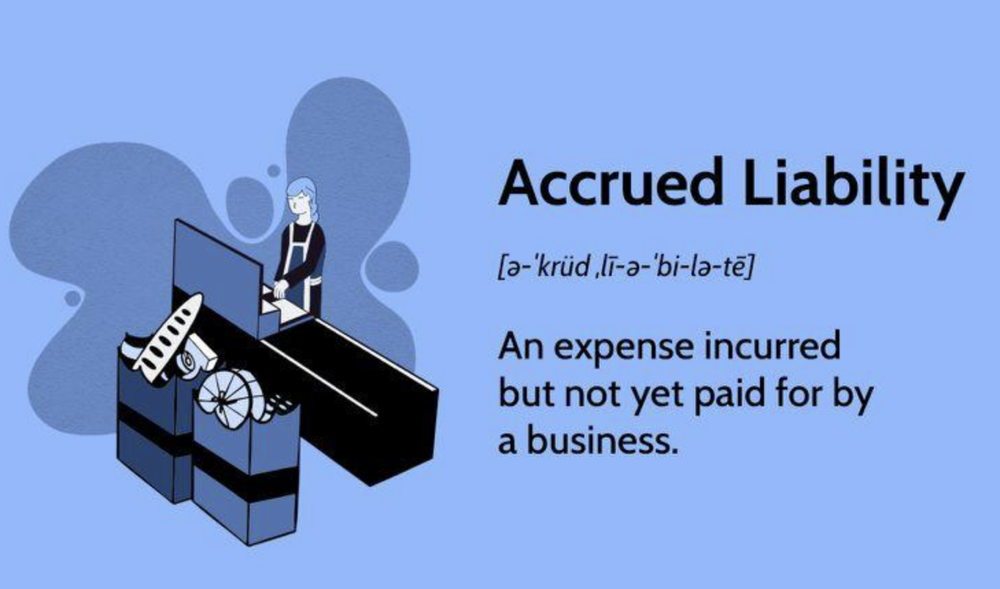

## Table of Contents

## What are accrued liabilities?

Accrued liabilities are expenses that a company has incurred but has not yet paid for. These are costs that have been recognized on the company's financial statements, even though the actual payment hasn't been made yet. Common examples include wages that employees have earned but haven't been paid, interest on loans that has accumulated but not yet due, and utilities used but not billed.

These liabilities are important because they help give a more accurate picture of a company's financial health. By recording these expenses, the company ensures that its financial statements reflect all the costs it has incurred during a period, not just the ones it has paid for. This practice follows the matching principle in accounting, which states that expenses should be recorded in the same period as the revenues they help generate.

## Why are accrued liabilities important in accounting?

Accrued liabilities are important in accounting because they help show the true financial situation of a company. They are expenses that the company has used up or earned but hasn't paid for yet. By including these in the financial statements, the company makes sure that everyone can see all the costs it has, not just the ones it has already paid. This is important for understanding how much money the company really has and how well it is doing.

This practice follows a key rule in accounting called the matching principle. This rule says that the costs of doing business should be recorded in the same time period as the money earned from those costs. So, if a company uses electricity in December but doesn't get the bill until January, the cost of that electricity should be shown in December's financial statements. This helps give a clearer picture of the company's profits and expenses for each period, making the financial reports more accurate and useful.

## How do accrued liabilities differ from accounts payable?

Accrued liabilities and accounts payable are both types of money a company owes, but they are a bit different. Accounts payable are bills that a company gets from its suppliers for things like materials or services that it has already received. These are usually due within a short time, like 30 or 60 days. When a company gets an invoice, it records it as an account payable.

On the other hand, accrued liabilities are expenses that a company has used up or earned but hasn't gotten a bill for yet. These could be things like employee salaries that are owed but not paid yet, or interest on a loan that is building up but not due until later. Accrued liabilities are recorded before the company gets an invoice, based on when the expense was actually used or earned.

So, the main difference is that accounts payable are for bills the company has already received, while accrued liabilities are for expenses the company knows it has but hasn't been billed for yet. Both are important for showing the full picture of what a company owes, but they show different kinds of debts.

## What are the common types of accrued liabilities?

Accrued liabilities are expenses that a company has used up or earned but hasn't paid for yet. Some common types of accrued liabilities include wages and salaries that employees have earned but haven't been paid yet. This happens when the pay period ends after the company's financial reporting period. Another type is interest on loans or credit that builds up over time but isn't due until later. Companies record this interest as an accrued liability so their financial statements show all the costs they have.

Other common types of accrued liabilities are utilities like electricity, water, or gas that the company has used but hasn't been billed for yet. The company knows it has used these services, so it records them as an expense even before getting the bill. Taxes can also be an accrued liability. For example, if a company owes taxes on its income but the payment isn't due until after the end of the financial period, it records those taxes as an accrued liability. This helps give a clear picture of all the costs the company has, even if it hasn't paid for them yet.

## Can you provide examples of accrued liabilities in a business?

A business might have accrued liabilities for employee wages. Let's say the company's pay period ends on the last day of the month, but the employees don't get paid until the 5th of the next month. If the company is preparing its financial statements at the end of the month, it needs to show the wages that employees earned but haven't been paid yet. This way, the financial statements will correctly show all the costs the company has for that month, even if the payment happens later.

Another example is interest on a loan. Imagine a business has a loan and the interest is supposed to be paid every three months. Even though the payment isn't due yet, the interest keeps building up every day. So, at the end of each month, the company records the interest that has accrued as a liability. This helps show the true cost of the loan on the company's financial statements, even before the interest payment is actually made.

## How are accrued liabilities recorded in the financial statements?

Accrued liabilities are recorded in the financial statements to show expenses that a company has but hasn't paid for yet. When the company prepares its financial statements at the end of an accounting period, it needs to include all the costs it has used up or earned during that time. So, if there are wages, interest, or other expenses that the company knows about but hasn't paid, it records these as accrued liabilities. This means the company adds these expenses to its income statement, showing that it has used up these costs during the period.

On the balance sheet, accrued liabilities are listed under current liabilities because they are expected to be paid within a year. This helps everyone see the full picture of what the company owes. For example, if employees have worked but haven't been paid yet, the company records the amount owed as an accrued liability. This way, the financial statements show all the money the company has to pay out, even if the actual payment hasn't happened yet.

## What is the process of adjusting entries for accrued liabilities?

When a company makes its financial statements, it needs to show all the expenses it has used up or earned, even if it hasn't paid for them yet. This is where adjusting entries come in. At the end of an accounting period, the company looks at all the expenses it knows about but hasn't been billed for yet. These could be things like employee wages that are owed but not paid, or interest on a loan that has built up but isn't due until later. The company then records these expenses as accrued liabilities by making an adjusting entry. This means the company adds these costs to its income statement, showing that it has used up these expenses during the period.

On the balance sheet, the company also records these accrued liabilities under current liabilities. This shows everyone that the company owes this money and will need to pay it soon. By making these adjusting entries, the company makes sure its financial statements are accurate and complete. It helps everyone see the true financial situation of the company, including all the costs it has, not just the ones it has already paid. This process follows the matching principle in accounting, which says that expenses should be recorded in the same period as the revenues they help generate.

## How does the accrual accounting method impact the recognition of accrued liabilities?

The accrual accounting method is important because it helps show all the money a company owes, even if it hasn't paid for it yet. With this method, a company records expenses when they happen, not just when they pay for them. So, if a company uses electricity in December but doesn't get the bill until January, it still records the cost of that electricity in December's financial statements. This means the company needs to record these costs as accrued liabilities, which are expenses that have been used up or earned but not paid for yet.

By using the accrual method, the company makes sure its financial statements show a true picture of its costs and profits. This is helpful for understanding how well the company is doing. For example, if employees have worked in December but won't get paid until January, the company records those wages as an accrued liability in December. This way, the financial statements for December will show all the costs the company has for that month, even if the actual payment happens later. This helps everyone see the full picture of the company's financial health.

## What are the implications of not properly managing accrued liabilities?

If a company does not properly manage its accrued liabilities, it can cause big problems. Accrued liabilities are costs that a company has used up or earned but hasn't paid for yet. If the company doesn't record these costs correctly, its financial statements will not show the true picture of its financial health. This can make the company look like it has more money than it really does, which can lead to bad decisions. For example, the company might think it can afford to spend more money or take on more debt, but it could actually be in a much worse financial situation.

Not managing accrued liabilities well can also lead to problems with the law and with trust. If a company doesn't show all its costs properly, it might break rules set by accounting standards or the government. This can lead to fines or other punishments. Plus, if people who invest in the company or do business with it find out that the company's financial statements are not accurate, they might lose trust in the company. This can hurt the company's reputation and make it harder to get money or do business in the future.

## How can a company estimate the amount of accrued liabilities?

A company can estimate the amount of accrued liabilities by looking at the expenses it knows it has used up or earned but hasn't paid for yet. For example, if the company knows its employees have worked a certain number of hours but won't get paid until the next month, it can calculate the total wages owed based on their hourly rates and hours worked. Similarly, if the company has a loan, it can figure out the interest that has built up since the last payment by using the [interest rate](/wiki/interest-rate-trading-strategies) and the time that has passed.

Another way to estimate accrued liabilities is by using past data and making educated guesses. For instance, if the company knows how much it usually spends on utilities like electricity each month, it can use that information to estimate the cost for the current month, even if it hasn't received the bill yet. By keeping good records and understanding its regular expenses, the company can make accurate estimates of its accrued liabilities, helping to keep its financial statements correct and up-to-date.

## What are the best practices for managing accrued liabilities?

To manage accrued liabilities well, a company needs to keep good records of all its expenses. This means knowing exactly when employees work and how much they should be paid, even if the payment happens later. The company should also keep track of interest on loans and other costs that build up over time. By recording these expenses as soon as they happen, the company can make sure its financial statements show all the costs it has, not just the ones it has paid for. This helps everyone see the true financial situation of the company.

Another important practice is to regularly review and update the estimates of accrued liabilities. This means checking the numbers every month or at the end of each accounting period to make sure they are still accurate. If the company finds out that its estimates were wrong, it should adjust them right away. This helps keep the financial statements correct and can prevent big surprises later. By being careful and thorough, the company can manage its accrued liabilities well and make better financial decisions.

## How do accrued liabilities affect a company's cash flow and financial planning?

Accrued liabilities can have a big impact on a company's cash flow and financial planning. These are costs that the company has but hasn't paid for yet, like wages for employees or interest on loans. When a company records these expenses, it shows that it owes money even if it hasn't spent it yet. This means the company needs to plan for these payments in the future, which can affect how much cash it has on hand. If the company doesn't keep track of these liabilities well, it might think it has more money than it really does, which can lead to spending too much or taking on too much debt.

Good management of accrued liabilities helps a company plan its finances better. By knowing exactly how much it owes and when it needs to pay, the company can make sure it has enough cash to cover these expenses. This can help the company avoid running out of money and make smarter decisions about where to spend or invest. Keeping a close eye on accrued liabilities also helps the company see its true financial health, which is important for planning and making sure the business stays stable and grows over time.

## References & Further Reading

[1]: Bergstra, J., Bardenet, R., Bengio, Y., & Kégl, B. (2011). ["Algorithms for Hyper-Parameter Optimization."](https://dl.acm.org/doi/10.5555/2986459.2986743) Advances in Neural Information Processing Systems 24.

[2]: ["Advances in Financial Machine Learning"](https://www.amazon.com/Advances-Financial-Machine-Learning-Marcos/dp/1119482089) by Marcos Lopez de Prado

[3]: ["Evidence-Based Technical Analysis: Applying the Scientific Method and Statistical Inference to Trading Signals"](https://www.amazon.com/Evidence-Based-Technical-Analysis-Scientific-Statistical/dp/0470008741) by David Aronson

[4]: ["Machine Learning for Algorithmic Trading"](https://github.com/stefan-jansen/machine-learning-for-trading) by Stefan Jansen

[5]: ["Quantitative Trading: How to Build Your Own Algorithmic Trading Business"](https://books.google.com/books/about/Quantitative_Trading.html?id=j70yEAAAQBAJ) by Ernest P. Chan