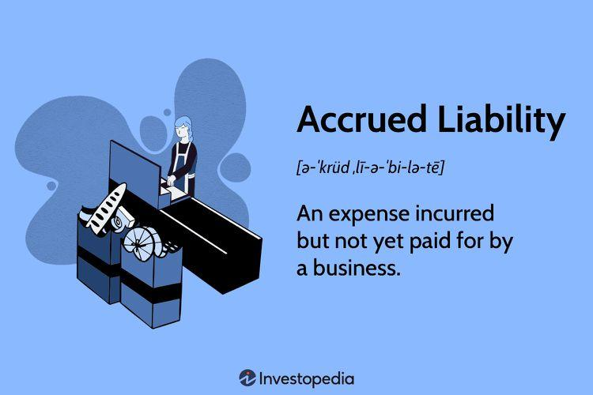

In the world of financial accounting, understanding liabilities is crucial for accurate financial reporting. Liabilities, representing a company's financial obligations, play a pivotal role in reflecting the true financial health of an organization. This article aims to shed light on various liability examples, with a particular focus on accrued liabilities—a category of liability that arises due to the accrual basis of accounting. Accrued liabilities are expenses recognized when they are incurred, regardless of whether payment has been made, making them essential for providing a precise depiction of financial performance.

Algorithmic trading, which relies on automated, data-driven decision-making processes, can benefit significantly from a solid understanding of financial accounting principles, especially those related to liabilities. By analyzing financial statements, traders can glean valuable insights into a company's operational efficiency and financial stability. The intersection of financial accounting and algorithmic trading fosters a nuanced approach to developing trading strategies that are informed by a company's liability profile.



In the fast-paced world of algo trading, financial decisions must be strategic and timely. Understanding how accrued liabilities affect financial statements can enhance decision-making processes and risk assessments. Traders who integrate knowledge of liabilities into their algorithms may uncover opportunities to optimize their trading portfolios and gain competitive advantages.

This article will explore the relevance of accrued liabilities to financial professionals and traders. By examining their implications in both financial reporting and algorithmic trading strategies, we aim to provide readers with an in-depth understanding that bridges the domains of accounting and quantitative trading.

## Table of Contents

## Understanding Liabilities in Financial Accounting

Liabilities are financial obligations that a company owes to external parties, making them an essential feature of the balance sheet. In financial accounting, liabilities are divided into two main categories: current liabilities and non-current liabilities. Current liabilities are obligations that are expected to be settled within one year, and they encompass items such as accounts payable, short-term loans, and accrued expenses. Non-current liabilities, on the other hand, are long-term financial obligations, such as bonds payable and long-term lease obligations, which are not due within the current year.

Understanding the implications of these liabilities is crucial for those involved in financial decision-making. Liabilities have a direct impact on a company's liquidity and financial stability. For instance, high levels of current liabilities might signal potential liquidity issues, as the company may struggle to meet its short-term obligations. Conversely, a manageable level of non-current liabilities might indicate stable long-term financial health.

A detailed breakdown of common liabilities includes:

1. **Loans**: These could be either short-term or long-term, depending on the duration for which the funds are borrowed. Interest mechanisms and repayment schedules are critical details that influence a company's financial statements.

2. **Bonds**: These represent long-term borrowings and involve paying periodic interest until the principal amount is repaid. Bonds are often used by companies to raise capital for large projects or expansions.

3. **Accounts Payable**: This is a short-term liability reflecting the amount owed to suppliers for goods and services received on credit. Effective management of accounts payable is crucial to maintain healthy cash flow.

4. **Accrued Liabilities**: These occur when expenses have been incurred but not yet paid. Common examples include accrued wages and interest. They reflect the company's obligation to pay for services or goods that have already been consumed or utilized.

The management of liabilities is not merely an accounting task but a strategic financial function. By efficiently managing liabilities, companies can secure better cash flows and stabilize their financial position. This enables them to invest in growth opportunities and weather economic downturns more effectively. Stakeholders, including investors, creditors, and management, analyze liabilities to assess the risk profile and potential profitability of a company. This analysis helps in determining whether to invest in, lend to, or manage the company differently based on its financial obligations.

## Deep Dive into Accrued Liabilities

Accrued liabilities are specific types of financial obligations that companies recognize under the accrual basis of accounting. This accounting method dictates that expenses must be reported during the period in which they are incurred, regardless of when the actual cash transaction occurs. This approach contrasts with the cash basis of accounting, which records expenses only when payments are made.

These liabilities typically arise from everyday business operations, creating financial obligations that must be fulfilled in the future. Common examples of accrued liabilities include accrued wages, where employees have performed work but have not yet received payment by the end of the reporting period. Interest expenses also fall into this category when interest on borrowed funds is accruing but has yet to be paid. Additionally, taxes that have been incurred but not yet paid by the reporting date are considered accrued liabilities.

The accurate reporting of accrued liabilities is crucial for financial statements, as they directly impact both the income statement and the balance sheet. In the income statement, these liabilities are matched with the revenues they help generate, enabling a more accurate picture of a company’s profitability during a specific period. On the balance sheet, accrued liabilities are usually listed under current liabilities due to their typically short-term nature, affecting a company’s [liquidity](/wiki/liquidity-risk-premium) ratios and financial health assessment.

Recording accrued liabilities involves creating journal entries that affect both the expense accounts on the income statement and the liability accounts on the balance sheet. For instance, the journal entry for recording accrued wages involves debiting the wages expense account and crediting the wages payable liability account, reflecting the obligation to pay employees.

The assessment of accrued liabilities requires careful estimation to ensure that the recorded amounts are as precise as possible. Errors or omissions in estimating these liabilities can lead to significant misstatements of a company's financial health. Companies may use historical data, contractual agreements, and current market rates (in the case of interest) to estimate the amounts accurately.

In essence, accrued liabilities provide crucial insights into a company's financial operations by highlighting obligations that have been incurred due to past transactions or events, thereby reflecting more accurately the company's financial position at any given point in time. Understanding these liabilities is paramount for stakeholders, as they directly inform strategic decisions related to financial planning and risk management.

## Impact of Liabilities on Algo Trading Strategies

Algorithmic trading, or algo trading, integrates complex mathematical models and algorithms to execute trades at speeds and frequencies that are beyond human capabilities. A critical component of these models is the financial data that informs the algorithms, including details from financial statements where liabilities are a pivotal element.

Liabilities, particularly accrued liabilities, offer key insights into a company's operational efficiency and financial stability. Accrued liabilities reflect the obligations a company has incurred that are not yet paid. They indicate transactions or expenses that have already impacted revenues but will be settled in future reporting periods. This can relate to accrued wages, interest, and taxes. By analyzing these liabilities, traders can gauge how efficiently a company manages its finances and predict potential cash flow issues that may affect its financial standing.

In algo trading, traders harness these insights by incorporating them into their algorithms to measure financial risk. For instance, an increase in accrued liabilities might signal growing financial commitments or operational inefficiencies, which could lead to liquidity constraints. By considering these factors, algorithms can adjust trading strategies, such as delaying investments in a company until its financial health improves or hedging against potential risks associated with increased liabilities.

The understanding of liabilities enhances prediction models used in [algorithmic trading](/wiki/algorithmic-trading). A sophisticated assessment of liabilities aids in the development of more precise predictive models. These models can integrate quantitative data analysis with [machine learning](/wiki/machine-learning) techniques to predict future stock prices or market trends. By weighing the liabilities alongside other financial metrics, these models provide a more comprehensive understanding of a company's financial position, which is crucial for making informed trading decisions.

Moreover, a nuanced perspective on liabilities, especially accrued liabilities, can unlock lucrative opportunities within the trading landscape. By analyzing trends and patterns in liabilities, traders can identify undervalued stocks or detect early signs of a company's financial distress, enabling them to strategize effectively. Advanced algorithms might use liability data as part of a larger set of variables to uncover latent financial patterns that could forecast significant market movements, offering traders a competitive edge.

In conclusion, integrated into trading algorithms, liabilities serve not only as a measure of financial risk but also as a potential unveiling tool for new trading opportunities. By accurately assessing liabilities, traders enhance their strategies and improve the precision of their market predictions. This intricate synergy between liability analysis and algorithmic trading continues to evolve, influencing the efficiency and success of trading strategies in ever-competitive financial markets.

## Examples of Liability in Financial Accounting for Algo Trading

In exploring how liabilities influence the outcomes in algorithmic trading, several real-world examples can highlight their significance in financial assessments. One notable case involves the impact of changes in accrued liabilities on trading outcomes. Accrued liabilities, which include expenses that have been incurred but not yet paid, can affect a company's short-term financial health. For instance, a substantial increase in accrued liabilities could indicate that a company is deferring payments, potentially signaling liquidity issues. Algorithmic traders may analyze these changes through financial indicators like the Current Ratio or the Quick Ratio, which assess a company's ability to meet short-term obligations. 

Python code could be used to parse financial statements and automatically calculate these ratios from changes in financial indicators:

```python
def calculate_ratios(current_assets, current_liabilities, inventory=None):
    current_ratio = current_assets / current_liabilities
    quick_ratio = (current_assets - inventory) / current_liabilities if inventory else None
    return current_ratio, quick_ratio

# Example: A company with $500,000 in current assets and $300,000 in current liabilities, with $100,000 in inventory
current_assets = 500000
current_liabilities = 300000
inventory = 100000

current_ratio, quick_ratio = calculate_ratios(current_assets, current_liabilities, inventory)
print(f"Current Ratio: {current_ratio}, Quick Ratio: {quick_ratio}")
```

This data-driven approach allows traders to quickly assess the risk linked to a company's liquidity level. Furthermore, traders have responded to liability-associated indicators by adjusting their portfolios or devising hedging strategies. If accrued liabilities rise sharply, algorithms might be programmed to reduce holdings in the company’s stocks due to perceived higher risk.

Another illustrative scenario involves the reclassification of liabilities, which can alter a company's balance sheet presentation and influence market perceptions. For example, a firm may reclassify a long-term liability as short-term due to upcoming payment schedules, prompting traders to reevaluate the company's risk profile. 

An incident where accrued liabilities significantly affected trading strategies is when a major retailer announced unexpectedly high accrued expenses, leading to a downgrade in stock valuation by algorithmic trading platforms. These platforms swiftly analyzed the financial data, adjusted risk parameters in their models, and reallocated investments based on revised risk assessments.

Through these examples, it becomes evident that timely and precise accounting for liabilities is crucial for designing responsive algorithmic trading strategies. It underscores the importance for traders to maintain robust systems for tracking financial changes, ensuring that updated assessments of liabilities are consistently integrated into predictive models and decision-making processes. These practices not only help in managing risks but also in identifying new opportunities for profit generation within the dynamic trading environment.

## Conclusion

Liabilities, particularly accrued ones, are fundamental to financial accounting and significantly influence algorithmic trading strategies. Recognizing how liabilities fit within financial statements allows analysts and traders to make well-informed decisions. This article has highlighted the essential integration of liabilities in algo trading, emphasizing the importance of understanding these financial obligations. By factoring in liabilities, traders can more accurately assess risks, adjust strategies proactively, and potentially identify new investment opportunities.

Algorithmic traders benefit greatly from a nuanced understanding of liabilities. They can use advanced computational tools to analyze financial data, effectively transforming liability management into a strategic advantage. For instance, by incorporating liabilities into algorithmic models, traders can anticipate moments of financial strain or capital availability, adjusting their investments to capitalize on these insights. 

Remaining informed and adaptable is critical in the dynamic intersection of accounting principles and algorithmic trading. The integration of liability analysis in trading strategies underscores the evolving nature of financial markets and the requisite analytical acumen needed by professionals navigating these waters. As accounting principles continue to shape trading methodologies, staying proactive in understanding liabilities will ensure that traders can minimize risks and optimize their financial outcomes.

## References & Further Reading

[1]: Bergstra, J., Bardenet, R., Bengio, Y., & Kégl, B. (2011). ["Algorithms for Hyper-Parameter Optimization."](https://dl.acm.org/doi/10.5555/2986459.2986743) Advances in Neural Information Processing Systems 24.

[2]: ["Advances in Financial Machine Learning"](https://www.amazon.com/Advances-Financial-Machine-Learning-Marcos/dp/1119482089) by Marcos Lopez de Prado

[3]: ["Evidence-Based Technical Analysis: Applying the Scientific Method and Statistical Inference to Trading Signals"](https://www.amazon.com/Evidence-Based-Technical-Analysis-Scientific-Statistical/dp/0470008741) by David Aronson

[4]: ["Machine Learning for Algorithmic Trading"](https://github.com/stefan-jansen/machine-learning-for-trading) by Stefan Jansen

[5]: ["Quantitative Trading: How to Build Your Own Algorithmic Trading Business"](https://books.google.com/books/about/Quantitative_Trading.html?id=j70yEAAAQBAJ) by Ernest P. Chan