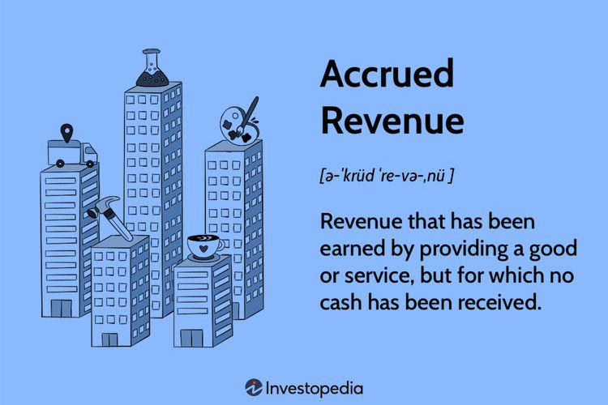

The integration of finance, accrued market functioning, and algorithmic trading has revolutionized the landscape of modern financial markets. Accrued market functioning, particularly in bond markets, plays a crucial role in understanding price adjustments related to interest income that accrues over time. Meanwhile, finance offers the analytical tools and frameworks needed to comprehend, model, and predict market behavior. Algorithmic trading, leveraging these tools, utilizes algorithms to drive trading decisions and executions, redefining the speed and efficiency of transactions.

The accrued market's concept becomes vital when discussing the valuation and trading of fixed-income securities. In bond markets, the accrued market discount refers to the accumulation of a bond's yield which does not pay periodic interest. This affects investor expectations and decisions, as the timing and recognition of these accruals can influence bond valuations and yields. Understanding these mechanics is essential as it impacts investor returns and market liquidity.



Algorithmic trading, evolved from simple automation processes in the late 20th century, now represents a significant shift towards data-driven, algorithmic decisions in markets. These algorithms are crafted using complex financial models and vast datasets, enabling high-frequency trading and reducing human-induced errors. The adoption of algorithmic trading has led to increased market efficiency and liquidity, though it also raises concerns about potential volatility and ethical implications.

This article aims to dissect the intricate nexus of algorithmic trading, accrued market functioning, and finance. It will examine how these elements interact to shape contemporary financial markets, highlighting algorithmic trading's transformative impact. Additionally, it will discuss the role of finance in designing algorithms and the broad market implications of accrued market concepts. Through this exploration, the article will provide insights into the dynamic interplay of technology, finance, and market operations, urging continuous learning and adaptation in this rapidly evolving field.

## Table of Contents

## Understanding Accrued Market Functioning

An accrued market primarily relates to the mechanisms within financial markets where interests or discounts accumulate over time until they are paid. In the context of the bond market, an accrued market discount is a crucial concept. It refers to the implicit or explicit discount accumulating on a bond purchased for less than its face value. When bonds are traded at a price below their par value, over time, as they approach maturity, this difference, known as the discount, accrues and contributes to the overall yield to the bondholder.

### Functional Mechanics of Accrued Market Discount

Accrued market discount is crucial for investors seeking to understand their returns from bond investments. When an investor purchases a bond at a discount, they effectively anticipate that the bond's market value will appreciate as it nears its maturity date. This appreciation is due to the reducing gap between the bond's purchase price and its par value. As time progresses, the accrued discount increases the bond's effective yield, a vital metric for investors assessing a bond's profitability.

The mechanics of the accrued market discount can be described mathematically. Suppose an investor purchases a bond with a face value (FV) of $1,000 at a market price (MP) of $950. The market discount (MD) is given as:

$$
MD = FV - MP = 1,000 - 950 = 50
$$

This discount will be realized as the bond approaches maturity, contributing to the bondholder's yield over the holding period. For instance, if the bond matures in 5 years, the annual accrual of the market discount can be calculated linearly or using a more intricate accretion method depending on whether the bond accrues interest in a simple or compound manner.

### Impact of Accrual Practices on Financial Markets

Accrual practices significantly affect financial markets, investor expectations, and returns. They provide a structured method for investors to understand and anticipate future cash flows. Accrued market discounts, by contributing to the bond's yield, impact investor expectations about potential returns and risks. Investors often [factor](/wiki/factor-investing) in these accrued amounts when assessing the overall profitability and attractiveness of bonds.

Moreover, these practices influence market behavior by determining how bond prices adjust over time relative to [interest rate](/wiki/interest-rate-trading-strategies) changes. As investors continually reassess the accrued value of discounts, bond pricing often reflects an embedded market consensus about future interest rates and economic conditions. This dynamic fosters [liquidity](/wiki/liquidity-risk-premium), as bonds with varying accrual structures offer different attractiveness levels to a diverse array of investors.

Accrual practices ensure that both issuers and investors have a transparent understanding of obligations and returns, which fortifies market integrity and efficiency. However, it also introduces complexities, especially for tax considerations, as the accrued discount might be subject to taxation under specific jurisdictions before actual gains are realized. Consequently, understanding accrued market functioning is pivotal for effective portfolio management and strategic investment planning in bond markets.

## The Role of Finance in Algorithmic Trading

Finance plays a crucial role in both sustaining and influencing the domain of [algorithmic trading](/wiki/algorithmic-trading) by providing the foundational principles, data, and frameworks necessary to develop sophisticated trading algorithms. At the core of this interplay are financial concepts and methodologies that underpin the design of algorithms used in trading systems.

One of the central financial concepts applied in algorithmic trading is the Efficient Market Hypothesis (EMH), which posits that asset prices fully reflect all available information. While the EMH suggests that it is difficult to achieve consistent excess returns, algorithmic traders often leverage discrepancies and inefficiencies in the market. These inefficiencies, though short-lived, can be exploited using quantitative strategies that incorporate statistical and mathematical modeling.

Quantitative finance provides the backbone for algorithmic trading, where mathematical models are used to identify trading opportunities based on historical and real-time data. Financial theories such as Modern Portfolio Theory (MPT) lay the groundwork for algorithms that assess risk versus return, enabling traders to construct efficient portfolios. Mathematical models like the Black-Scholes model for option pricing or the Capital Asset Pricing Model (CAPM) for estimating expected returns are often integrated into trading algorithms to enhance decision-making processes.

Moreover, financial markets serve as a vital data source for algorithmic trading strategies. The vast amounts of financial data generated within these markets encompass price movements, trading volumes, economic indicators, and corporate actions, which algorithms process to identify patterns and make informed decisions. The use of high-frequency data, in particular, exemplifies the need for robust data processing capabilities, as algorithms must quickly react to market micro-structures and changes.

Algorithmic trading systems frequently use time series analysis and [machine learning](/wiki/machine-learning) techniques on financial data to predict future price movements. Techniques such as autoregressive integrated moving average (ARIMA) models and more advanced [deep learning](/wiki/deep-learning) architectures are employed to model time-dependent price data. For instance, a simple moving average (SMA) or exponential moving average (EMA) might be implemented as a trading rule:

```python
def calculate_sma(prices, window):
    sma = []
    for i in range(len(prices) - window + 1):
        sma.append(sum(prices[i:i+window]) / window)
    return sma
```

In essence, finance is integral to algorithmic trading not only by providing the theoretical frameworks and methodologies but also by delivering the real-time market data that informs and drives algorithmic decision-making. As financial markets continue to evolve, the role of finance in algorithmic trading is likely to expand, integrating emerging data types and computational advancements to further enhance trading strategies.

## Algorithmic Trading: A Paradigm Shift

Algorithmic trading began to gain traction in the financial markets in the 1980s, coinciding with the advent of electronic trading platforms and the increased availability of computational resources. The initial phase of this paradigm shift was marked by the adoption of simple algorithms for executing large orders in equity markets, aimed at minimizing market impact and transaction costs. These early algorithms were primarily used by large institutional investors.

Key technologies and methodologies that have driven the evolution of algorithmic trading include the development of high-speed internet, sophisticated data analytics software, and advanced computing power. The exponential growth in processing capabilities has been complemented by the decreasing cost of data storage, allowing traders to analyze vast volumes of financial data in real time. Methodologies such as statistical [arbitrage](/wiki/arbitrage), machine learning, and the use of complex mathematical models have further pushed the boundaries of what algorithmic trading can achieve.

A pivotal technological development in algorithmic trading is the implementation of high-frequency trading ([HFT](/wiki/high-frequency-trading-strategies)), which emerged in the late 1990s. HFT utilizes algorithms to automatically execute a large number of orders at extremely high speeds, often within microseconds. This form of trading relies on cutting-edge technology, including high-performance computing and low-latency networks, to achieve competitive advantages in execution speed.

The impact of algorithmic trading on market efficiency and liquidity is significant. By automating the trading process, algorithms can react to market conditions far quicker than human traders, thus enhancing price discovery and reducing bid-ask spreads. This increased efficiency is evident in numerous markets, where algorithmic trading accounts for a substantial portion of total trading [volume](/wiki/volume-trading-strategy). For instance, it is estimated that algorithms are responsible for about 60-73% of all equity market trades in the United States.

Furthermore, algorithmic trading contributes to increased market liquidity by providing continuous buying and selling opportunities. Algorithmic liquidity providers, often engaged in market-making strategies, ensure that markets remain vibrant and that there is enough depth for large transactions to occur without significantly affecting prevailing prices.

However, the rapid execution and high volume of trades inherent to algorithmic trading can also pose risks. Events such as the 2010 Flash Crash highlighted potential vulnerabilities, where algorithms triggered drastic price fluctuations within a brief period. As a result, while algorithmic trading has made substantial contributions to market efficiency and liquidity, it also requires careful monitoring and regulatory oversight to mitigate systemic risks.

In summary, the evolution of algorithmic trading from its nascent models in the 1980s to the sophisticated, high-speed systems of today represents a significant paradigm shift in how financial markets operate. This transformation has been driven by technological advancements and innovative methodologies that continue to redefine market dynamics.

## How Algorithmic Trading Functions

Algorithmic trading involves the use of computer algorithms to automate trading decisions and the execution of trades. These algorithms can process vast amounts of market data, identify trading opportunities, and execute trades faster and more efficiently than human traders. The core function of algorithmic trading is to leverage speed, precision, and computational power to optimize trade execution.

### Overview of Algorithms and Trade Execution
Algorithms in trading are crafted to analyze a multitude of parameters, such as price, volume, and timing, to decide when and what trades to execute. The basic structure of a trading algorithm consists of data input, decision-making logic, risk management checks, and execution commands. The decision-making part employs rules or models, which can range from simple logical conditions to complex mathematical models.

#### Types of Trading Algorithms
1. **Execution Algorithms**: These algorithms aim to execute large orders with minimal market impact and cost. Types include:
   - **Volume Weighted Average Price (VWAP)**: This aims to execute a trade in line with the volume distribution of the market to get an average price over a set period.
   - **Time Weighted Average Price (TWAP)**: This algorithm spreads a large order over time to minimize market impact.

2. **Statistical Arbitrage Algorithms**: These take advantage of mean reversion or price inefficiencies between correlated instruments. For example:
   - Pairs trading involves two correlated stocks that diverge from their typical relative price movements, with the expectation that they will revert to their mean.

3. **High-Frequency Trading (HFT)**: These involve algorithms that operate at incredibly high speeds to capture small price discrepancies. HFT may use strategies like market-making, arbitrage, or event arbitrage (trading on news or economic data releases).

#### Real-World Examples
1. **Execution Example**: An asset management firm may use a VWAP algorithm to buy a large block of shares throughout the day. By splitting the trade into smaller segments and executing them in chunks that mimic the market's volume patterns, the firm can achieve an average execution price that is less susceptible to market impact.

2. **Statistical Arbitrage Example**: Consider a pairs trading algorithm monitoring Stock A and Stock B, historically correlated. If Stock A's price rises significantly while Stock B's price remains stable, the algorithm might short Stock A and go long on Stock B, assuming a reversion to the mean price relationship.

3. **High-Frequency Trading Example**: A firm might deploy market-making algorithms to provide liquidity on an exchange. The algorithm rapidly posts buy and sell orders at slightly adjusted prices to earn the bid-ask spread while also employing statistical models to manage inventory risk dynamically.

Below is a simplified Python example demonstrating the concept of a mean reversion strategy:

```python
import numpy as np

def mean_reversion_strategy(prices, window=20, threshold=1):
    rolling_mean = np.convolve(prices, np.ones(window)/window, mode='valid')
    spread = prices[window-1:] - rolling_mean
    signals = np.where(spread > threshold, -1, 0)  # Generate sell signals
    signals = np.where(spread < -threshold, 1, signals)  # Generate buy signals
    return signals

# Sample price data
prices = np.array([100, 102, 101, 104, 108, 107, 105, 107, 110, 113, 115, 116, 117])
signals = mean_reversion_strategy(prices)
print(signals)
```

In this example, the algorithm calculates the rolling mean price over a specified window and generates buy/sell signals whenever the current price deviates significantly from this mean. Such algorithms form the backbone of more sophisticated trading systems used in financial markets worldwide, constantly evolving with advancements in technology and computational techniques.

## Strategies in Algorithmic Trading

Algorithmic trading employs a range of strategies designed to automate trading decisions, capitalizing on market opportunities with precision and speed. Among the most prevalent strategies in algorithmic trading are trend-following, mean reversion, and arbitrage. Each strategy exploits different market conditions and utilizes mathematical models to enhance their effectiveness.

Trend-following strategies aim to capitalize on the [momentum](/wiki/momentum) and direction of asset prices. These algorithms rely on the hypothesis that assets which have shown a consistent movement in price will continue in the same direction, at least for a short period. Mathematical indicators such as moving averages, momentum oscillators, and [breakout](/wiki/breakout-trading) signals are common tools in trend-following models. While trend-following can result in significant profits in trending markets, its effectiveness diminishes in volatile or sideways markets where price movements lack a clear direction. One major risk is the potential for substantial losses if a trend reverses unexpectedly.

Mean reversion strategies are predicated on the assumption that prices and returns eventually move back to their historical averages. This strategy identifies price deviations from the average and executes trades anticipating a return to this mean level. Statistical tools such as Bollinger Bands and z-scores are often applied to identify these deviations. The challenge with mean reversion is determining the "true" average, especially in dynamic markets where averages can shift. Additionally, sharp market movements can lead to significant losses before reversion occurs.

Arbitrage exploits price differentials between markets or related instruments. For example, [statistical arbitrage](/wiki/statistical-arbitrage) analyzes historical correlations and uses mathematical models to detect temporary anomalies and price inefficiencies. Arbitrage strategies often require sophisticated algorithms capable of identifying and executing trades rapidly to capture small price discrepancies before they disappear. However, arbitrage opportunities are typically rare and fleeting, necessitating substantial investment in technology and data analysis tools.

Mathematical models play a crucial role in refining these strategies by optimizing parameters, assessing risks, and improving prediction accuracy. Techniques from [statistics](/wiki/bayesian-statistics), calculus, and computational finance are integrated into trading algorithms to enhance strategy performance. For instance, linear regression models can be employed to identify trends and predict future price movements. Machine learning techniques further augment traditional approaches by recognizing complex patterns and adapting to new market conditions.

Here's a simple Python example using the NumPy library to simulate a basic mean reversion strategy:

```python
import numpy as np

# Sample price data
prices = np.array([100, 102, 101, 98, 97, 99, 101, 103, 105, 104])
mean_price = np.mean(prices)

# Identify buy/sell signals based on mean reversion
buy_signals = []
sell_signals = []

for i, price in enumerate(prices):
    if price < mean_price:
        buy_signals.append(i)
    elif price > mean_price:
        sell_signals.append(i)

print("Buy signals at indices:", buy_signals)
print("Sell signals at indices:", sell_signals)
```

This code snippet identifies index positions where prices fall below or rise above the average price, signaling potential buy and sell opportunities, respectively.

In conclusion, while algorithmic trading strategies like trend-following, mean reversion, and arbitrage present lucrative opportunities, they also embody inherent risks and limitations. A deep understanding of mathematical models and their application in financial theories is crucial for optimizing strategy performance and managing market impact effectively.

## Tax and Regulatory Considerations

Accrued market discounts and algorithmic trading gains [carry](/wiki/carry-trading) specific tax implications that investors and traders must navigate. Accrued market discount typically refers to the increase in value of a bond purchased below its face value, reflecting interest that has not yet been paid. For tax purposes, the Internal Revenue Code in the United States mandates that this discount be recognized as income, typically allocated over the bond's remaining term. Thus, the investor must report a portion of the discount as taxable income annually, even if no payments are received until maturity or sale.

Algorithmic trading, characterized by rapid execution of trades, can lead to various short-term capital gains. These gains are taxed at ordinary income tax rates, as opposed to the preferential rates for long-term capital gains. Traders employing algorithmic strategies must maintain precise records to accurately report these transactions. Failure to do so can lead to issues with compliance and potential financial penalties.

Globally, the regulatory landscape impacting algorithmic trading is intricate and varies by jurisdiction. In the United States, the Securities and Exchange Commission (SEC) has implemented several measures to oversee algorithmic trading. Regulations focus on maintaining market integrity and preventing market abuse. One notable regulation is the requirement for firms to develop and maintain systems that are robust and account for the risks associated with high-frequency trading. Firms are also mandated to have controls in place to avoid erroneous trades and potential flash crashes.

The Commodity Futures Trading Commission (CFTC) also plays a role in regulating algorithmic trading, particularly concerning derivatives. It emphasizes the importance of risk controls and transparency in algorithmic strategies to protect market participants.

European regulations, such as the Markets in Financial Instruments Directive II (MiFID II), impose strict requirements on algorithmic trading, aiming for increased transparency and reduced systemic risk. These regulations necessitate that trading algorithms undergo rigorous testing to ensure they function as intended without disrupting market stability.

Japan's Financial Services Agency and other global regulatory bodies continue to shape the regulatory environment surrounding algorithmic trading. They strive to balance innovation with the need for safeguards that protect the integrity of financial markets and the interests of investors. 

Staying informed about tax and regulatory requirements is crucial for participants in markets involving accrued discounts and algorithmic trading. As markets evolve, adherence to these frameworks ensures compliance and contributes to the stability and efficiency of financial systems globally.

## Challenges and Concerns

Algorithmic trading, particularly high-frequency trading (HFT), presents a set of complex challenges and concerns that impact the financial market. These challenges are multifaceted, encompassing market [volatility](/wiki/volatility-trading-strategies), flash crashes, ethical issues, technical complexities, and the balancing act between innovation and regulation.

### Market Volatility and Flash Crashes

Algorithmic trading systems contribute significantly to market volatility. These systems, designed to execute trades at high speed, can amplify price movements, leading to increased market fluctuations. An example of this is the "Flash Crash" of May 6, 2010, when the Dow Jones Industrial Average dropped about 1,000 points in minutes before recovering equally fast. This incident highlighted the potential for algorithms to disrupt markets and created a debate on their role in exacerbating volatility ([Kirilenko et al., 2017](https://www.journals.uchicago.edu/doi/10.1093/rfs/hhw123)).

### Ethical Concerns

Algorithmic trading raises ethical questions, particularly regarding fairness and market manipulation. The use of sophisticated algorithms provides advantages to traders with the resources to develop them, potentially creating an uneven playing field. Moreover, there are concerns about manipulative practices such as "quote stuffing," where traders submit and quickly cancel a large number of orders to create confusion and delay competitors' trading activities ([Zhao et al., 2019](https://link.springer.com/article/10.1007/s11156-019-00826-5)).

### Technical Complexities and Risks

High-frequency trading poses significant technical challenges. Developers must account for low latency and ensure algorithm accuracy to avoid costly errors. The complexity of these systems makes them prone to bugs and errors, which can lead to unintended trading outcomes. Moreover, the interconnectedness of global markets implies that a malfunction in one system can have cascading effects on others, heightening systemic risks ([Biais and Wooley, 2011](https://www.nber.org/papers/w17121)).

Managing these risks requires robust system testing and fail-safes, such as circuit breakers that halt trading during abnormal market movements. Additionally, continuous monitoring and adjusting algorithms in real-time is crucial.

### Balancing Innovation and Regulation

Regulators face the challenging task of encouraging innovation while safeguarding market integrity. Regulatory bodies like the United States Securities and Exchange Commission (SEC) must frame policies that address the rapid technological advancements in financial markets. Regulations such as the SEC's Regulation National Market System (Reg NMS) aim to protect investors and maintain fair, orderly, and efficient markets.

Balancing these needs involves implementing measures such as enforced transparency, trading limits, and penalties for manipulative practices. It is also crucial to foster collaboration between industry participants and regulators to adapt to technological changes swiftly.

In conclusion, understanding and addressing the challenges of algorithmic trading requires ongoing efforts to align technological advancements with effective regulatory frameworks. This balance will help harness the benefits of algorithmic trading while mitigating its risks, ensuring healthier and more resilient financial markets.

## Future Trends

Algorithmic trading is poised for transformative advancements as [artificial intelligence](/wiki/ai-artificial-intelligence) (AI) and machine learning (ML) continue to evolve. These technologies offer powerful tools for analyzing vast amounts of data, identifying patterns, and making trading decisions with enhanced precision and speed. 

AI, particularly machine learning, enables algorithms to adapt and learn from new market data. This results in the development of more dynamic and robust trading strategies. Unlike traditional algorithms, which follow predefined rules, machine learning models can improve their performance over time by learning from past trades. Techniques such as [reinforcement learning](/wiki/reinforcement-learning) allow algorithms to optimize decision-making processes based on rewards and penalties from trading outcomes. 

The potential evolution of market functioning is significantly influenced by advancements in AI-driven trading approaches. For instance, deep learning models can process unstructured data, such as news articles and social media posts, providing insights that were previously inaccessible. This ability to incorporate diverse data sources into trading strategies allows for more informed predictions about market movements. 

The integration of finance theory with computational power presents opportunities to refine existing models and develop new algorithms that better capture market dynamics. For example, quantitative models that incorporate principles from behavioral finance can be improved using machine learning algorithms to identify and exploit market inefficiencies driven by human biases.

Moreover, AI and ML can facilitate the creation of more sophisticated risk management frameworks. Algorithms can simulate various market scenarios, enabling traders to adjust their strategies in anticipation of different market conditions. This predictive capability helps mitigate risks, enhancing market stability.

As AI and machine learning continue to shape algorithmic trading, regulatory frameworks will need to evolve to address new challenges. Ensuring that AI-driven trading systems operate within ethical boundaries and do not exacerbate market volatility is crucial. 

The future of algorithmic trading will likely witness increased personalization in trading strategies, driven by AI's ability to tailor decisions to individual investor preferences and risk profiles. Additionally, technological advancements may foster the development of more collaborative platforms where traders and AI models work together, leveraging the strengths of both human intuition and machine precision.

In summary, the integration of AI and machine learning into algorithmic trading is expected to drive significant evolution in market functioning, characterized by enhanced adaptability, efficiency, and risk management capabilities. This interplay between financial theories and computational advancements promises to reshape the landscape of financial markets, making continuous learning and adaptation vital in keeping pace with these rapid changes.

## Conclusion

The exploration of accrued market functioning, finance, and algorithmic trading illuminates the complex interplay of these elements in shaping modern financial landscapes. In particular, accrued market functioning, notably within the bond market, provides crucial insights into investor expectations and return structures. The mechanisms of accrued market discounts demonstrate how accrual practices can influence financial strategies and outcomes, underscoring the fundamental role of market conventions in determining investment dynamics.

Finance serves as the backbone of algorithmic trading, providing both the data and the theoretical frameworks needed to develop sophisticated trading algorithms. These algorithms, honed through principles of finance and advanced computational techniques, allow for efficient processing and execution of trades, significantly enhancing market liquidity and efficiency. Algorithmic trading represents a paradigm shift from traditional trading methods by utilizing speed, precision, and data-driven strategies to optimize trading performance.

Technology acts as a transformative force in financial markets by continually pushing the boundaries of what is possible with algorithmic trading. The incorporation of artificial intelligence and machine learning models into trading algorithms exemplifies how technology can be harnessed to anticipate market movements and adapt strategies in real-time. As these tools evolve, they are projected to further refine market functioning and expand the scope of algorithmic solutions.

The rapidly evolving nature of financial markets driven by algorithmic trading and technology necessitates a commitment to continuous learning and adaptation. Market participants must remain agile and informed to harness the benefits of technological advancements while navigating challenges such as regulatory compliance and ethical considerations. By embracing innovation and leveraging computational power alongside sound financial theory, stakeholders can optimize their strategies and maintain a competitive edge in the dynamic financial environment.

## References & Further Reading

[1]: Kirilenko, A. A., Kyle, A. S., Samadi, M., & Tuzun, T. (2017). ["The Flash Crash: High-Frequency Trading in an Electronic Market."](https://www.jstor.org/stable/26652722) The Journal of Finance, 72(3), 997–1027.

[2]: Zhao, J., Zhang, R., Zheng, Z., & Gao, P. (2019). ["Ethical Concerns of High-Frequency Trading: A Proposal to Address Its Ambiguities and Complexities."](https://onlinelibrary.wiley.com/doi/10.1002/adfm.202003619) Review of Quantitative Finance and Accounting, 53(2), 309-342.

[3]: Biais, B., & Woolley, P. (2011). ["High-Frequency Trading."](https://papers.ssrn.com/sol3/papers.cfm?abstract_id=1834344) National Bureau of Economic Research Working Paper No. 17121.

[4]: Lopez de Prado, M. (2018). ["Advances in Financial Machine Learning."](https://www.amazon.com/Advances-Financial-Machine-Learning-Marcos/dp/1119482089) Wiley.

[5]: Jansen, S. (2020). ["Machine Learning for Algorithmic Trading: Predictive Models to Extract Signals from Market and Alternative Data for Systematic Trading Strategies with Python."](https://www.amazon.com/Machine-Learning-Algorithmic-Trading-alternative/dp/1839217715) Packt Publishing.

[6]: Chan, E. P. (2008). ["Quantitative Trading: How to Build Your Own Algorithmic Trading Business."](https://github.com/ftvision/quant_trading_echan_book) John Wiley & Sons.

[7]: Aronson, D. R. (2006). ["Evidence-Based Technical Analysis: Applying the Scientific Method and Statistical Inference to Trading Signals."](https://www.amazon.com/Evidence-Based-Technical-Analysis-Scientific-Statistical/dp/0470008741) Wiley Trading Series.