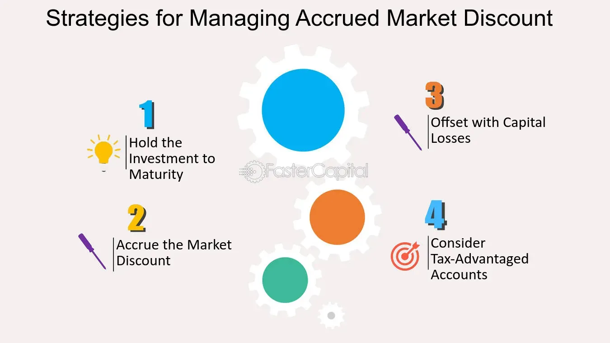

## Table of Contents

## What is an accrued market?

An accrued market is a term used in finance to describe a situation where interest or other earnings have been earned but not yet received or paid out. This often happens with bonds, where the interest that has been earned since the last payment date but not yet paid is called accrued interest. For example, if you buy a bond between interest payment dates, you will have to pay the seller the accrued interest that has built up since the last payment.

In the context of financial markets, the concept of an accrued market is important because it affects the pricing and valuation of securities. When trading bonds or other fixed-income securities, the buyer and seller need to account for the accrued interest to determine a fair price. This ensures that the buyer compensates the seller for the interest earned up to the date of the transaction. Understanding accrued markets helps investors and traders make more informed decisions and manage their investments effectively.

## How does the concept of accrual accounting relate to the accrued market?

Accrual accounting and the accrued market are closely related because they both deal with recognizing income and expenses when they are earned or incurred, not when the money actually changes hands. In accrual accounting, businesses record revenues and expenses as they happen, even if the payment comes later. For example, if a company provides a service in December but doesn't get paid until January, it will still record the revenue in December. This method gives a more accurate picture of a company's financial health over time.

In the accrued market, the same principle applies but specifically to interest and other earnings. When you buy a bond, you might have to pay for the interest that has been earned but not yet paid out since the last interest payment date. This is called accrued interest. Just like in accrual accounting, the accrued market recognizes that this interest has been earned and should be accounted for in the price of the bond, even though the actual payment hasn't happened yet. This helps ensure that transactions are fair and reflect the true value of the securities being traded.

## What are the key components of an accrued market?

The main parts of an accrued market are the interest that has been earned but not yet paid, and the securities like bonds where this happens. When you buy a bond, you might have to pay for the interest that has built up since the last time it was paid out. This is called accrued interest. It's important because it makes sure that the price of the bond is fair for both the buyer and the seller.

Another key part is the timing of when interest payments are made. Bonds usually pay interest at set times, like every six months. But if you buy or sell a bond between these times, you need to figure out how much interest has been earned up to that point. This helps everyone know the true value of the bond and makes trading fair.

## How do accrued markets function in financial reporting?

Accrued markets play a big role in financial reporting because they help show the true value of a company's investments. When a company owns bonds or other securities, it needs to report the interest that has been earned but not yet paid. This is called accrued interest. By including this in their financial statements, companies give a more accurate picture of their financial health. It shows how much money they are expected to receive in the future, even if they haven't gotten it yet.

In financial reporting, the concept of accrued markets is important for both the company and its investors. Investors look at these reports to understand how well the company is doing. If a company reports its accrued interest correctly, investors can see the full value of the company's investments. This helps them make better decisions about whether to buy, sell, or hold onto the company's stocks. Accurate reporting of accrued markets makes the financial statements more reliable and trustworthy.

## What are the benefits of using an accrued market system?

Using an accrued market system helps make sure that the price of bonds and other securities is fair. When you buy a bond, you pay for the interest that has been earned but not yet paid out. This is called accrued interest. By including this in the price, both the buyer and seller get a fair deal. The buyer knows they are paying for the full value of the bond, and the seller gets paid for the interest they earned up to the sale date. This fairness makes trading smoother and more trustworthy.

Accrued markets also help with financial reporting. Companies need to show the interest they have earned but not yet received in their financial statements. This gives a clearer picture of the company's financial health. Investors can see how much money the company is expected to get in the future, which helps them make better decisions about buying or selling the company's stocks. Accurate reporting of accrued markets makes the financial statements more reliable and helps everyone understand the true value of the company's investments.

## What are the potential challenges or limitations of accrued markets?

Accrued markets can be tricky because figuring out the right amount of accrued interest can be hard. When you buy a bond, you need to know exactly how much interest has been earned since the last payment date. This can be complicated, especially if the bond has a lot of different rules or if the interest rate changes. If you get it wrong, the price of the bond might not be fair, and someone could end up losing money.

Another challenge is that accrued markets can make financial reporting more complicated. Companies have to keep track of all the interest they have earned but not yet received. This means they need good systems and people who know what they're doing. If they make a mistake, their financial statements might not be accurate. This can confuse investors and make it harder for them to trust the company's reports.

## How do accrued markets impact financial statements?

Accrued markets affect financial statements by making sure companies show the interest they have earned but not yet received. This is called accrued interest. When a company owns bonds, it needs to add this interest to its financial reports. This helps give a true picture of how much money the company is expected to get in the future. It's important because it shows investors and others how well the company is doing, even if the money hasn't come in yet.

However, dealing with accrued markets can make financial reporting more complicated. Companies need to keep track of all the interest that has been earned but not paid out. This means they need good systems and people who understand how to do it right. If they make a mistake, their financial statements might not be accurate. This can make it hard for investors to trust the company's reports and understand its true financial health.

## Can you explain the process of recognizing revenue in an accrued market?

In an accrued market, recognizing revenue means counting the money you've earned but haven't received yet. For example, if you own a bond, you earn interest over time. Even if you don't get paid until later, you still count that interest as revenue when it's earned. This helps show a true picture of how much money you're making, even if you haven't gotten it yet.

This process is important for keeping financial statements accurate. When a company reports its earnings, it includes the interest from bonds that has been earned but not paid out. This way, everyone can see how much money the company is expected to get in the future. It helps investors understand the company's financial health better, but it can also make financial reporting more complicated because you need to keep track of all that earned but unpaid interest.

## What role do accrued markets play in different industries?

Accrued markets are important in many industries, especially those that deal with bonds and other securities. In the finance industry, banks and investment firms use accrued markets to make sure they are pricing bonds correctly. When they buy or sell bonds, they need to account for the interest that has been earned but not yet paid. This helps them set a fair price for the bond, making sure both the buyer and seller get a good deal. It also helps them report their earnings accurately, showing how much money they expect to receive in the future.

In the insurance industry, accrued markets are used to manage investments. Insurance companies often invest in bonds to grow their money. They need to keep track of the interest these bonds earn over time, even if they haven't received the payments yet. This helps them know how much money they have coming in, which is important for paying out claims and keeping the business running smoothly. By using accrued markets, insurance companies can better plan their finances and make sure they have enough money to cover their obligations.

## How do regulations affect the operation of accrued markets?

Regulations play a big role in how accrued markets work. They make sure that everyone follows the same rules when it comes to figuring out and reporting accrued interest. For example, financial regulators set guidelines on how to calculate the interest that has been earned but not yet paid on bonds. These rules help keep things fair and transparent, so buyers and sellers know they are getting a good deal. If companies don't follow these regulations, they could face penalties or fines, which encourages them to keep their financial reporting accurate.

Different countries might have different rules about accrued markets, which can affect how companies do business. For example, in the United States, the Financial Accounting Standards Board (FASB) sets rules on how to report accrued interest in financial statements. These rules help investors trust the numbers they see. If a company operates in multiple countries, it needs to understand and follow all the different regulations. This can make things more complicated but also helps maintain a level playing field across the global market.

## What advanced strategies can businesses employ to optimize their use of accrued markets?

Businesses can use advanced strategies to make the most out of accrued markets by carefully managing their bond investments. One way to do this is by using a technique called bond laddering. This means buying bonds that mature at different times. By doing this, a business can make sure it gets regular interest payments and can reinvest the money at different times. This helps them take advantage of changing interest rates and reduces the risk of having all their money tied up in one bond. Another strategy is to use financial software to keep track of accrued interest accurately. This helps businesses make sure their financial reports are correct and they can plan their cash flow better.

Another advanced strategy is to use hedging to protect against interest rate changes. Businesses can use financial instruments like interest rate swaps to lock in a certain interest rate. This can help them know exactly how much interest they will earn from their bonds, even if market rates go up or down. By using these strategies, businesses can make their investments in accrued markets more predictable and profitable. This helps them manage their money better and make smarter decisions about where to invest.

## How can technology enhance the management and analysis of accrued markets?

Technology can make managing and analyzing accrued markets a lot easier. Special software can keep track of all the interest that has been earned but not yet paid on bonds. This helps businesses make sure their financial reports are correct and they know exactly how much money they will get in the future. The software can also do the math for figuring out accrued interest, which can be tricky to do by hand. This saves time and reduces the chance of making mistakes.

Another way technology helps is by using data analysis tools to look at trends and patterns in the accrued market. These tools can help businesses see how interest rates are changing and make better decisions about when to buy or sell bonds. By using technology, businesses can plan their investments more carefully and make sure they are getting the best deals. This can lead to more money and better financial health for the company.

## What is Understanding Accrued Market Functioning?

An accrued market primarily relates to the mechanisms within financial markets where interests or discounts accumulate over time until they are paid. In the context of the bond market, an accrued market discount is a crucial concept. It refers to the implicit or explicit discount accumulating on a bond purchased for less than its face value. When bonds are traded at a price below their par value, over time, as they approach maturity, this difference, known as the discount, accrues and contributes to the overall yield to the bondholder.

### Functional Mechanics of Accrued Market Discount

Accrued market discount is crucial for investors seeking to understand their returns from bond investments. When an investor purchases a bond at a discount, they effectively anticipate that the bond's market value will appreciate as it nears its maturity date. This appreciation is due to the reducing gap between the bond's purchase price and its par value. As time progresses, the accrued discount increases the bond's effective yield, a vital metric for investors assessing a bond's profitability.

The mechanics of the accrued market discount can be described mathematically. Suppose an investor purchases a bond with a face value (FV) of $1,000 at a market price (MP) of $950. The market discount (MD) is given as:

$$
MD = FV - MP = 1,000 - 950 = 50
$$

This discount will be realized as the bond approaches maturity, contributing to the bondholder's yield over the holding period. For instance, if the bond matures in 5 years, the annual accrual of the market discount can be calculated linearly or using a more intricate accretion method depending on whether the bond accrues interest in a simple or compound manner.

### Impact of Accrual Practices on Financial Markets

Accrual practices significantly affect financial markets, investor expectations, and returns. They provide a structured method for investors to understand and anticipate future cash flows. Accrued market discounts, by contributing to the bond's yield, impact investor expectations about potential returns and risks. Investors often [factor](/wiki/factor-investing) in these accrued amounts when assessing the overall profitability and attractiveness of bonds.

Moreover, these practices influence market behavior by determining how bond prices adjust over time relative to [interest rate](/wiki/interest-rate-trading-strategies) changes. As investors continually reassess the accrued value of discounts, bond pricing often reflects an embedded market consensus about future interest rates and economic conditions. This dynamic fosters [liquidity](/wiki/liquidity-risk-premium), as bonds with varying accrual structures offer different attractiveness levels to a diverse array of investors.

Accrual practices ensure that both issuers and investors have a transparent understanding of obligations and returns, which fortifies market integrity and efficiency. However, it also introduces complexities, especially for tax considerations, as the accrued discount might be subject to taxation under specific jurisdictions before actual gains are realized. Consequently, understanding accrued market functioning is pivotal for effective portfolio management and strategic investment planning in bond markets.

## References & Further Reading

[1]: Kirilenko, A. A., Kyle, A. S., Samadi, M., & Tuzun, T. (2017). ["The Flash Crash: High-Frequency Trading in an Electronic Market."](https://www.jstor.org/stable/26652722) The Journal of Finance, 72(3), 997–1027.

[2]: Zhao, J., Zhang, R., Zheng, Z., & Gao, P. (2019). ["Ethical Concerns of High-Frequency Trading: A Proposal to Address Its Ambiguities and Complexities."](https://onlinelibrary.wiley.com/doi/10.1002/adfm.202003619) Review of Quantitative Finance and Accounting, 53(2), 309-342.

[3]: Biais, B., & Woolley, P. (2011). ["High-Frequency Trading."](https://papers.ssrn.com/sol3/papers.cfm?abstract_id=1834344) National Bureau of Economic Research Working Paper No. 17121.

[4]: Lopez de Prado, M. (2018). ["Advances in Financial Machine Learning."](https://www.amazon.com/Advances-Financial-Machine-Learning-Marcos/dp/1119482089) Wiley.

[5]: Jansen, S. (2020). ["Machine Learning for Algorithmic Trading: Predictive Models to Extract Signals from Market and Alternative Data for Systematic Trading Strategies with Python."](https://www.amazon.com/Machine-Learning-Algorithmic-Trading-alternative/dp/1839217715) Packt Publishing.

[6]: Chan, E. P. (2008). ["Quantitative Trading: How to Build Your Own Algorithmic Trading Business."](https://github.com/ftvision/quant_trading_echan_book) John Wiley & Sons.

[7]: Aronson, D. R. (2006). ["Evidence-Based Technical Analysis: Applying the Scientific Method and Statistical Inference to Trading Signals."](https://www.amazon.com/Evidence-Based-Technical-Analysis-Scientific-Statistical/dp/0470008741) Wiley Trading Series.