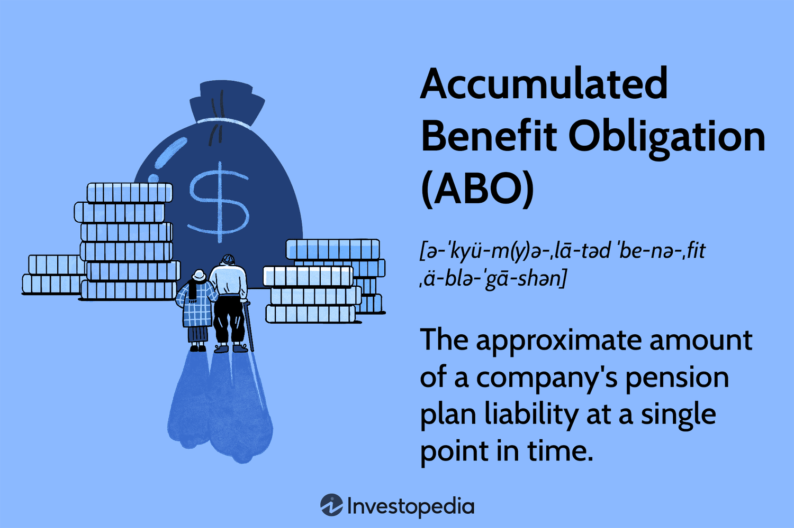

Understanding the intricacies of pension liabilities is crucial for businesses and financial analysts. Pension accounting encompasses a range of measures and methodologies vital for evaluating a company’s financial obligations related to employee retirement benefits. Among these measures, the Accumulated Benefit Obligation (ABO) stands out as a fundamental metric. The ABO represents the present value of pension benefits that employees have earned up to a specific point in time, based on their current salaries. This measure provides insight into a company's existing pension liabilities, without considering future salary increases, reflecting a snapshot of financial commitments that need to be accounted for with precision.

In actuarial accounting, the process of calculating the ABO involves a detailed analysis of various factors such as current salaries, years of service, and assumptions about future conditions. This includes the use of discount rates to determine the present value of anticipated future benefit payments. Financial statements are deeply impacted by the ABO, as it directly influences the reported pension liabilities, affecting both business valuations and investor perception. Moreover, understanding the nuances of ABO and other pension obligations enables companies to better strategize their financial planning and resource allocation.



The integration of modern financial practices, including algorithmic trading, further intersects with pension fund management. These advanced trading strategies can potentially optimize pension fund investments, impacting the overall funding status and financial performance of pension plans. Consequently, accurately calculating and managing the ABO is not only a measure of due diligence but also a lever for ensuring the long-term sustainability of pension funds in a rapidly evolving financial landscape.

## Table of Contents

## What is Accumulated Benefit Obligation (ABO)?

Accumulated Benefit Obligation (ABO) is a crucial metric in pension accounting, representing the present value of pension benefits that employees have accrued based on their current salary levels. This measure provides a snapshot of a company’s existing pension liabilities without considering any potential salary increases that employees might receive in the future. Unlike other pension-related measures, the ABO essentially captures liabilities at a specific point in time, reflecting the amount the company would need to fulfill its obligations if the pension plan were to be terminated immediately.

Mathematically, the ABO can be expressed using present value calculations. The basic formula for determining the present value of a future cash flow is:

$$

PV = \frac{FV}{(1 + r)^n} 
$$

Where:
- $PV$ is the present value,
- $FV$ is the future value of the benefit payment,
- $r$ is the discount rate,
- $n$ is the number of periods until the payment occurs.

For the ABO, each expected benefit payment to an employee is calculated individually based on their current salary and service years. The sum of these present values for all employees in the pension plan constitutes the total ABO for the company.

It's critical for businesses to accurately calculate their ABO, as it offers significant insights into the current pension liabilities that they are obligated to pay. Missteps in these calculations can lead to underfunding, impacting not just the financial health of the pension plan but also the company's balance sheet. As such, the ABO is a focal point for auditors, financial analysts, and regulators who require transparency and consistency in pension reporting.

Due to the static nature of ABO, companies must periodically review and update their calculations to reflect changes such as workforce demographics or changes in the discount rate. This ensures that the ABO remains an accurate representation of the company's obligations at any given time.

## Differences Between ABO and Other Pension Measures

Accumulated Benefit Obligation (ABO), Projected Benefit Obligation (PBO), and Vested Benefit Obligation (VBO) are key measures in pension accounting, each providing distinct insights into a company's pension liabilities. These measures differ primarily in how they consider salary levels and future service contingencies, which can dramatically affect the reported financial obligations.

ABO measures the present value of pension benefits that have accrued based on employees' current salaries. It serves as a static measure that does not [factor](/wiki/factor-investing) in any potential future salary increases. The intent of ABO is to quantify the company's existing obligation, reflecting only the current salary and service to date.

In contrast, PBO takes a more comprehensive view by incorporating assumptions about future salary increases. This makes PBO a dynamic measure, as it anticipates changes in employee salaries over time and effectively projects the future pension liability if the company were to continue operating until the employees' retirement. Mathematically, if $F_t$ represents future salary at time $t$, the PBO can be represented as:

$$
PBO = \sum \left( \frac{F_t \cdot B_t}{(1 + r)^t} \right)
$$

where $B_t$ is the benefit payment at time $t$ and $r$ is the discount rate.

Lastly, the Vested Benefit Obligation (VBO) only considers benefits that employees are entitled to based on their current service, regardless of future service or salary. VBO thus represents the portion of the ABO that employees would receive if they were to leave the company immediately. This measure provides a minimum baseline of the company's irrevocable commitment to its employees under the existing pension terms.

Each of these measures serves a unique purpose. ABO offers a snapshot of current liabilities, VBO delineates guaranteed obligations, and PBO anticipates the long-term future financial position regarding pension payouts. Understanding these distinctions helps businesses and analysts evaluate the comprehensive financial position concerning pension liabilities and aids in making informed financial decisions.

## Examples of ABO Calculations

Calculating the Accumulated Benefit Obligation (ABO) involves assessing the present value of pension benefits that employees have earned up to a specific date, based on their current salaries and years of service. This computation is critical for accurately reflecting existing pension liabilities in financial statements.

### Key Elements of ABO Calculation

The calculation of ABO necessitates consideration of several essential components:

1. **Present Value of Expected Future Benefits**: This involves estimating the pension benefits that employees have earned to date and translating these into present-day terms. The formula for calculating present value (PV) of future benefits is given by:
$$
   PV = \sum \frac{B_t}{(1 + r)^t}

$$

   where $B_t$ is the benefit payment expected at time $t$, $r$ is the discount rate, and $t$ is the time period until payment.

2. **Discount Rate**: The choice of discount rate is pivotal as it impacts the present value computation. The rate typically mirrors the yields on high-quality corporate bonds as of the measurement date.

3. **Employee Service Years**: The calculation assumes continuous service, discounting salaries and benefits to reflect the time-based accrual of entitlements.

### Example Case Study

Consider a simplified scenario where an employee is currently eligible for a pension that will pay $\$10,000$ annually upon retirement. The employee is expected to retire in 10 years, and the current discount rate is $5\%$. The ABO can be calculated as follows:

```python
# Constants
annual_benefit = 10000  # Annual pension payment
discount_rate = 0.05    # Discount rate
years_until_retirement = 10  # Number of years until retirement

# Calculation of present value of future pension payments
abo_value = 0
for t in range(1, years_until_retirement + 1):
    present_value = annual_benefit / ((1 + discount_rate) ** t)
    abo_value += present_value

abo_value
```

In this case, calculating the sum of present values gives a precise quantification of the employee's earned benefits to date. This approach and its derived values are critical for businesses to report accurate pension liabilities under current accounting standards.

### Real-World Assumptions

- **Mortality and Turnover Rates**: While the above example disregards demographic assumptions, real-world scenarios account for mortality and turnover rates. These variables influence the probability of benefit payouts.

- **Salary Levels**: The example assumes a static salary that affects future pension entitlement calculations.

The accuracy of ABO calculations hinges on the assumptions and variables selected. Each influences the reporting of financial liabilities, guiding business management strategies and fund sustainability.

## Factors Influencing ABO

The Accumulated Benefit Obligation (ABO) is influenced by several key factors, each playing a critical role in determining the present value of future pension benefits. Understanding these factors is essential for accurate ABO calculations.

### Discount Rate

The discount rate is a significant factor in ABO calculations. It represents the [interest rate](/wiki/interest-rate-trading-strategies) used to determine the present value of future pension payments. A higher discount rate reduces the present value of future obligations, leading to a lower ABO. Conversely, a lower discount rate increases the present value, resulting in a higher ABO. As companies usually base the discount rate on high-quality corporate bond yields, fluctuations in market conditions can directly affect the discount rate and, consequently, the ABO.

$$
\text{ABO} = \sum \frac{B}{(1+r)^t}
$$

Where:
- $B$ is the expected future benefit payment
- $r$ is the discount rate
- $t$ is the time period until the payment

### Average Age of the Workforce

The average age of the workforce is another critical element, as it affects the time horizon over which benefits will be paid. A younger workforce implies a longer duration until retirement, allowing more time for pension assets to grow and reducing the present value of their future benefits. On the other hand, an older workforce means benefits are due sooner, often increasing the current obligation level.

### Mortality Rates

Mortality rates impact the expected duration of benefit payments. Higher mortality rates suggest a shorter payment period, which may reduce the total benefits to be paid and hence the ABO. Conversely, lower mortality rates imply longer lifespans, leading to potentially increased obligations due to extended payment periods. Actuaries often use demographic data to predict these trends, aligning them with current mortality tables.

### Expected Turnover Rates

Employee turnover rates affect the ABO by altering the anticipated number of employees who will be eligible for benefits. High turnover rates may decrease the ABO, as fewer employees remain to participate in the pension plan until retirement. Conversely, lower turnover rates indicate stable long-term employment, often resulting in higher pension obligations as more employees qualify for benefits.

Each of these factors provides critical input in actuarial models used to calculate ABO, with adjustments and assumptions in these areas significantly impacting the final valuation of pension liabilities. Actuaries must carefully consider current economic conditions and workforce demographics to ensure precise and accurate calculations.

## Impact of Plan Amendments on ABO

Plan amendments can significantly alter the Accumulated Benefit Obligation (ABO) by modifying key elements of a pension plan. Such changes include adjustments to the benefit formula, shifts in retirement age, or alterations to employee contribution policies. These amendments directly affect the present value of future benefits, which is central to the ABO calculation.

One primary way plan amendments influence ABO is through alterations in the benefit formula itself. The benefit formula dictates how retirement payments are calculated based on factors such as salary, years of service, and age. For example, increasing the percentage of salary used in benefit calculations or including bonuses as part of the salary can increase ABO, as these modifications raise the expected benefit payouts. Conversely, reducing these factors will lower ABO, reflecting decreased expected liabilities.

Adjustments to the retirement age profoundly impact ABO calculations. By increasing the retirement age, the time horizon for benefit payments shortens, potentially lowering the ABO since payments are deferred. On the other hand, decreasing the retirement age would accelerate the need for benefits and likely increase the ABO, as the present value of liabilities is calculated over a longer period.

Other factors such as changes to mortality assumptions or turnover rates, although peripheral, can also alter the ABO. These adjustments affect the expected life span over which benefits are paid and the probability of employees staying until retirement, respectively. For instance, adopting new mortality tables indicating longer life expectancies would increase the ABO, as the expected duration for benefit payments extends.

Implementing a plan amendment might necessitate recalculating the ABO using updated parameters. The formula for recalculating ABO generally involves determining the present value of all future expected benefit payments:

$$
\text{ABO} = \sum \frac{\text{Benefit Payment}_t}{(1 + r)^t}
$$

where $\text{Benefit Payment}_t$ represents the expected benefit in year $t$ and $r$ stands for the discount rate.

In practice, pension fund managers must weigh the benefits of plan amendments against the potential increase in pension liabilities reflected through the ABO. For instance, enhancing benefits to retain employees can be advantageous but must be balanced with the potential financial burden on the pension fund. Effective management and strategic planning are essential in mitigating the potential negative impact of plan amendments on the financial health of the pension plan.

## Algorithmic Trading and Pension Fund Management

Algorithmic trading has become an increasingly significant method for managing pension fund investments. Through the use of sophisticated algorithms, pension funds are able to refine their asset allocation strategies, which can significantly affect the funding status of a pension plan. The main advantage of [algorithmic trading](/wiki/algorithmic-trading) is its ability to process vast amounts of data at high speeds, making it possible to identify and capitalize on investment opportunities that may not be apparent to human traders. This can include statistical [arbitrage](/wiki/arbitrage), [trend following](/wiki/trend-following), and risk parity strategies, among others.

The implementation of algorithmic trading strategies involves quantitative analysis, wherein historical data is used to predict future price movements and assess risk factors. This is often facilitated through computer programs that can execute trades faster and more efficiently than human traders. Consequently, pension funds can optimize their portfolios while minimizing human error and reaction times.

One key aspect of algorithmic trading is the dynamic rebalancing of portfolios. Algorithms can continuously analyze market conditions and adjust the allocation of assets in the pension fund to ensure alignment with investment goals. For example, if a particular asset class shows signs of underperformance, the algorithm might redistribute funds to more promising investments. This level of efficiency helps maintain a robust funding status and can reduce the [volatility](/wiki/volatility-trading-strategies) of returns, which indirectly impacts the Accumulated Benefit Obligation (ABO).

Algorithmic trading also allows for improved risk management. By setting predefined rules and parameters, algorithms can automatically execute trades to hedge against potential losses, thereby protecting the fund’s assets. Moreover, algorithms can be programmed to remain compliant with regulatory requirements and investment guidelines, further safeguarding the pension fund’s long-term interests.

The use of [machine learning](/wiki/machine-learning) techniques, such as neural networks, furthers the sophistication of algorithmic trading strategies. These methods can find patterns in data that are not immediately visible and adapt trading strategies based on new information. By utilizing these advanced techniques, pension funds are better positioned to manage the complexities of financial markets.

However, the integration of algorithmic trading into pension fund management is not without challenges. It requires significant investment in technology and expertise to develop and maintain effective algorithms. Additionally, high-frequency trading, a subset of algorithmic trading, can introduce risks associated with market fragmentation and unexpected systemic events.

Despite these challenges, the impact of algorithmic trading on pension fund management is profound. By enabling more precise and data-driven decision-making processes, algorithmic trading holds the potential to enhance the performance and sustainability of pension funds, ensuring that they meet current and future obligations effectively. As such, a strategic approach to incorporating algorithmic trading is essential for pension funds aiming to optimize their investments and manage their liabilities, including ABO, efficiently.

## Regulatory and Reporting Standards for ABO

The regulation and reporting of the Accumulated Benefit Obligation (ABO) are governed by established accounting standards, primarily the guidelines issued by the Financial Accounting Standards Board (FASB) and the International Financial Reporting Standards (IFRS). These standards are crucial in maintaining uniformity and transparency across financial statements, allowing stakeholders to evaluate a company's financial health accurately.

Under the FASB guidelines, particularly the Accounting Standards Codification Topic 715 (ASC 715), entities are required to recognize various components of pension costs, which include service costs, interest costs, and the ABO. The ASC 715 outlines specific methods for calculating these costs, emphasizing the present value of pension obligations based on current salaries. To comply with these guidelines, entities must employ appropriate actuarial assumptions, such as discount rates, reflecting the time value of money, and demographic assumptions like employee turnover and mortality rates.

Similarly, the IFRS, through the International Accounting Standard 19 (IAS 19), outlines requirements for employee benefits reporting. IAS 19 mandates that organizations disclose information regarding the characteristics of defined benefit plans and the associated risks. Unlike FASB, which focuses more on prescriptive methods, IFRS provides principles-based guidelines, granting companies a degree of flexibility in actuarial assumptions, provided they faithfully represent economic realities and align with financial market expectations.

Both FASB and IFRS standards require entities to provide detailed disclosures about the assumptions and methodologies used in their ABO calculations. This includes sensitivity analyses, which illustrate how changes in assumptions like discount rates or mortality tables would affect pension obligations. Such disclosure requirements enhance stakeholder understanding of the potential variability and risks inherent in pension liabilities.

The convergence efforts between FASB and IFRS aim to harmonize global financial reporting, reducing discrepancies and promoting more accessible cross-border financial analysis. Although differences remain, particularly in measurement and recognition criteria, ongoing dialogue ensures that both standards evolve towards comparability without compromising regional financial environments.

In conclusion, adherence to FASB and IFRS guidelines in reporting the ABO ensures that organizations present a transparent and consistent view of their pension obligations. This adherence not only facilitates trust among investors and analysts but also aligns the reported financial position with the true economic burden of pension commitments.

## Conclusion: Importance of Managing ABO

Accurate calculations of the Accumulated Benefit Obligation (ABO) are vital for providing a clear assessment of a company’s pension liabilities, ensuring both short-term financial reporting and long-term sustainability of pension plans. The ABO reflects the current value of future pension benefits that employees have earned to date, based on their current salary levels. This measure offers a snapshot of a company's liabilities, without future salary increases. Precise ABO estimations facilitate transparent financial reporting, which is critical for stakeholders’ trust and regulatory compliance.

As the financial landscape evolves, companies face increasing challenges in managing pension obligations. Traditional methods of managing these are increasingly complemented by modern approaches like algorithmic trading. By employing algorithms, pension fund managers can optimize investment strategies, improving fund performance and potentially impacting the funding status of pension plans. This, in turn, can affect the company's financial health and how it reports its pension liabilities.

Incorporating algorithmic trading into pension fund management allows for dynamic asset allocation and risk management, which can better align investments with changing market conditions and the company’s objectives. However, the integration of such tools requires careful consideration of regulatory standards, including those set by the Financial Accounting Standards Board (FASB) and the International Financial Reporting Standards (IFRS), to ensure compliance and consistency in financial disclosures.

Efficiently managing the ABO through accurate calculations and innovative financial strategies is essential in safeguarding the sustainability of pension plans. This approach not only aids in fulfilling current financial obligations but also secures the future financial health of both the pension plans and the sponsoring companies, ultimately benefiting employees and stakeholders alike.

## References & Further Reading

[1]: Fried, D. & Gopalakrishnan, V. (2020). ["U.S. GAAP and IFRS: A Comparative Analysis of Pension Accounting"](https://pmc.ncbi.nlm.nih.gov/articles/PMC11613503/). Routledge.

[2]: Bodie, Z., Kane, A., & Marcus, A. J. (2021). ["Investments"](https://www.amazon.com/Investments-Zvi-Bodie/dp/1260013839). McGraw-Hill Education.

[3]: Antolin, P. & Stewart, F. (2009). ["Private Pensions and Policy Responses to the Financial and Economic Crisis"](https://www.astrid-online.it/static/upload/protected/OECD/OECD-Pension-2009-1_Antolin_Steward.pdf). OECD.

[4]: Merton, R. C. (1983). ["On the Role of Social Security as a Means for Efficient Risk Bearing in an Economy where Human Capital is not Tradeable."](https://www.semanticscholar.org/paper/On-the-Role-of-Social-Security-as-a-Means-for-in-an-Merton/d89f80624bc80013e43f53eaf25e846ae5a59915) In Financial Aspects of the United States Pension System.

[5]: Sorensen, E. H. & Wolverton, M. (1999). ["Practical Applications of Accounting for Pensions: A Guide for the Finance Officer and Analyst"](https://www.academia.edu/126582346/Ab_Initio_Simulations_of_Water_Metal_Interfaces). Federal Reserve Bank of St. Louis Review.