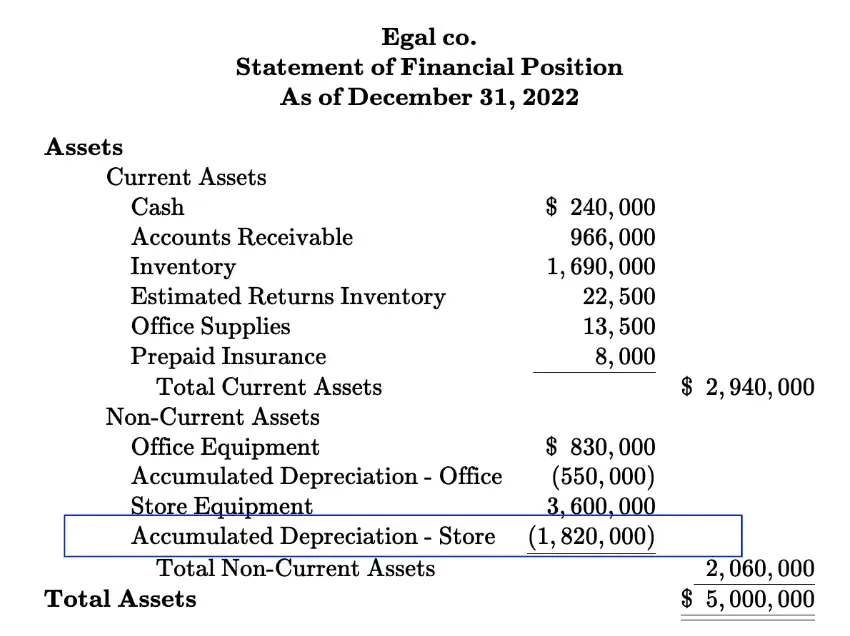

## Table of Contents

## What is accumulated depreciation?

Accumulated depreciation is the total amount of depreciation that has been recorded for an asset up to a certain point in time. When a company buys an asset like a machine or a building, it doesn't expense the entire cost right away. Instead, it spreads the cost over the useful life of the asset. This process is called depreciation, and the total depreciation recorded over time is called accumulated depreciation.

You can find accumulated depreciation on a company's balance sheet. It is listed as a negative number under the asset it relates to, reducing the asset's value. For example, if a company bought a machine for $10,000 and has recorded $4,000 in depreciation, the machine would be shown on the balance sheet as having a book value of $6,000. Accumulated depreciation helps show how much of an asset's value has been used up and gives a clearer picture of the company's financial health.

## How does accumulated depreciation differ from depreciation expense?

Accumulated depreciation and depreciation expense are related but different. Depreciation expense is the amount of an asset's cost that a company charges against its income for a specific period, usually a year. It's like a yearly fee for using the asset. This expense is shown on the income statement and reduces the company's profit for that year.

Accumulated depreciation, on the other hand, is the total of all the depreciation expenses recorded for an asset from the time it was bought until now. It's a running total that keeps growing each year as more depreciation is added. You can find accumulated depreciation on the balance sheet, where it's subtracted from the asset's original cost to show its current book value. So, while depreciation expense is about the cost for one year, accumulated depreciation is about the total cost over time.

## What is the purpose of recording depreciation?

Recording depreciation helps businesses spread out the cost of big things they buy, like machines or buildings, over the time they use them. Instead of taking all the money out of their profits in one go, they can take a little bit each year. This makes their financial reports look more accurate because it matches the cost of the asset with the money it helps them make over its useful life.

It also helps businesses keep track of how much their assets are worth now. As things get older and wear out, they're not worth as much. By recording depreciation, a business can show on its balance sheet that the value of its assets is going down over time. This gives a clearer picture of what the business owns and how much it's really worth.

## How is depreciation expense calculated?

Depreciation expense is calculated using different methods, but the most common ones are the straight-line method and the declining balance method. The straight-line method is the simplest. You take the cost of the asset, subtract its estimated value at the end of its useful life (called salvage value), and then divide that by the number of years you expect to use the asset. For example, if a machine costs $10,000, has a salvage value of $2,000, and a useful life of 4 years, the yearly depreciation expense would be ($10,000 - $2,000) / 4 = $2,000 per year.

The declining balance method, on the other hand, lets you take bigger depreciation expenses in the early years and smaller ones later on. A common type of this method is the double-declining balance method. You start by figuring out the straight-line rate (1 / useful life), then double it. You apply this doubled rate to the asset's book value at the beginning of each year. Using the same machine example, the straight-line rate would be 1/4 or 25%, so the double-declining rate would be 50%. In the first year, you'd take 50% of $10,000, which is $5,000. The next year, you'd take 50% of the remaining $5,000, and so on, until you reach the salvage value.

## What are the different methods of calculating depreciation?

There are several ways to calculate depreciation, but the most common ones are the straight-line method, the declining balance method, and the units of production method. The straight-line method is the simplest. You take the cost of the asset, subtract how much you think it will be worth at the end of its useful life (this is called the salvage value), and then divide that by the number of years you plan to use the asset. For example, if a machine costs $10,000 and you think it will be worth $2,000 after 4 years, you would take ($10,000 - $2,000) / 4 to get a yearly depreciation expense of $2,000.

The declining balance method lets you take bigger depreciation expenses in the early years and smaller ones later on. A common type of this method is the double-declining balance method. You start by figuring out the straight-line rate (1 divided by the useful life), then double it. You apply this doubled rate to the asset's book value at the beginning of each year. Using the same machine example, the straight-line rate would be 1/4 or 25%, so the double-declining rate would be 50%. In the first year, you'd take 50% of $10,000, which is $5,000. The next year, you'd take 50% of the remaining $5,000, and so on, until you reach the salvage value.

The units of production method bases depreciation on how much the asset is used. You figure out how many units the asset can produce over its life, then divide the cost minus the salvage value by that number to get a cost per unit. Each year, you multiply the number of units produced by the cost per unit to get the depreciation expense. For example, if the machine can produce 100,000 units over its life, the cost per unit would be ($10,000 - $2,000) / 100,000 = $0.08 per unit. If you produce 20,000 units in a year, the depreciation expense would be 20,000 * $0.08 = $1,600.

## How is accumulated depreciation reported on the balance sheet?

Accumulated depreciation is shown on the balance sheet as a negative number. It's listed under the asset it relates to, like a machine or a building. This number shows how much of the asset's value has been used up over time. For example, if a company bought a machine for $10,000 and has recorded $4,000 in depreciation, the balance sheet would show the machine's original cost of $10,000 and then subtract the $4,000 in accumulated depreciation. This leaves a book value of $6,000 for the machine.

By showing accumulated depreciation, the balance sheet gives a clearer picture of what the company's assets are really worth now. It helps everyone see how much the assets have worn out and how much value they've lost. This is important for understanding the company's financial health and making good decisions about buying new assets or keeping the old ones.

## What impact does depreciation have on a company's financial statements?

Depreciation affects a company's financial statements in two main ways. First, it shows up on the income statement as a depreciation expense. This expense reduces the company's profit for the year. When a company buys a big thing like a machine or a building, it doesn't take all the money out of its profits right away. Instead, it spreads the cost over the years it uses the thing. This makes the company's profits look more accurate because it matches the cost with the money the thing helps make over time.

Second, depreciation affects the balance sheet. On the balance sheet, you see the original cost of the asset and then a negative number called accumulated depreciation. This number is the total of all the depreciation expenses recorded so far. When you subtract accumulated depreciation from the original cost, you get the book value of the asset. This shows how much the asset is worth now, after it has been used for a while. It helps everyone see how much the company's assets have worn out and how much value they've lost, which is important for understanding the company's financial health.

## How does accumulated depreciation affect the value of an asset?

Accumulated depreciation reduces the value of an asset on the balance sheet. When a company buys something big like a machine or a building, it doesn't show the full price on its financial statements right away. Instead, it spreads the cost over the years it uses the thing. Each year, the company records a depreciation expense, and all these expenses add up to become accumulated depreciation. This total is then subtracted from the original cost of the asset to show its current book value. So, if a machine cost $10,000 and has $4,000 in accumulated depreciation, its book value would be $6,000.

This process helps show how much the asset has worn out and lost value over time. It gives a clearer picture of what the company's assets are really worth now. For example, a new machine might be worth a lot, but as it gets older and used more, it's not worth as much. By recording accumulated depreciation, the company can show this on its balance sheet. This is important for understanding the company's financial health and making good decisions about buying new assets or keeping the old ones.

## What are the tax implications of depreciation?

Depreciation can help businesses save money on taxes. When a company buys a big thing like a machine or a building, it can't take all the money out of its profits right away for tax purposes. Instead, it can spread the cost over the years it uses the thing. This is called depreciation. By doing this, the company can lower its taxable income each year because it gets to subtract the depreciation expense from its profits. This means the company pays less in taxes each year.

There are special tax rules about how to calculate depreciation for tax purposes. These rules can be different from the ones used for financial reporting. For example, the IRS has something called Modified Accelerated Cost Recovery System (MACRS), which lets businesses take bigger depreciation expenses in the early years. This can help them save even more on taxes right away. It's important for businesses to understand these rules so they can use depreciation to their advantage and pay the right amount of taxes.

## How do changes in depreciation methods affect financial reporting?

Changing the way a company calculates depreciation can make a big difference in its financial reports. If a company switches from the straight-line method to the double-declining balance method, it will take bigger depreciation expenses in the early years. This means the company's profits will look smaller at first, but they'll get bigger later on. The balance sheet will also change because the book value of the assets will go down faster at the start. This can make the company look less valuable on paper in the early years, but it can help show how much the assets are really worth as they get older.

These changes can also affect how much the company pays in taxes. If a company uses a method that lets it take bigger depreciation expenses early on, like the double-declining balance method, it can lower its taxable income in those years. This means the company will pay less in taxes right away. But later on, when the depreciation expenses are smaller, the company's taxable income will be higher, and it will pay more in taxes. It's important for companies to think about these effects when they decide to change their depreciation methods, so they can plan their finances and taxes well.

## What are the considerations for revising depreciation estimates?

When a company thinks about changing how it figures out depreciation, it needs to look at a few things. One big thing is how long the asset will be useful. If the company finds out the machine or building will last longer or shorter than they thought, they need to change the depreciation. Another thing to think about is how much the asset will be worth at the end of its life, called the salvage value. If the company thinks the asset will be worth more or less than they first guessed, they need to change the depreciation to match.

These changes can make a big difference in the company's financial reports. If the company decides the asset will last longer, the yearly depreciation expense will be smaller, and the company's profits will look bigger. If they think the asset will be worth more at the end, the yearly depreciation expense will also be smaller. But if they think the asset will last a shorter time or be worth less at the end, the yearly depreciation expense will be bigger, and the company's profits will look smaller. It's important for the company to keep an eye on these things and make changes when they need to, so their financial reports show the right picture of what's going on.

## How do international accounting standards treat accumulated depreciation and depreciation expense?

International accounting standards, like those set by the International Accounting Standards Board (IASB), have rules about how to handle depreciation and accumulated depreciation. Under these rules, depreciation expense is shown on the income statement. It's the amount of an asset's cost that a company charges against its income for a specific period, usually a year. This expense makes the company's profits look smaller for that year. The IASB says companies should use a method that spreads the cost of the asset over its useful life in a way that matches how the asset is used up.

Accumulated depreciation is shown on the balance sheet as a negative number. It's the total of all the depreciation expenses recorded for an asset up to a certain point in time. The IASB says this number should be subtracted from the asset's original cost to show its current book value. This helps everyone see how much the asset has worn out and lost value over time. By following these rules, companies can make sure their financial reports give a clear picture of what their assets are really worth and how their profits are affected by depreciation.

## What is Financial Accounting: The Cornerstone?

Financial accounting is a fundamental component of the financial system, providing a structured approach to documenting and interpreting financial transactions. This process is crucial for ensuring the credibility and transparency of financial statements, enabling stakeholders like investors, creditors, and regulatory bodies to make informed decisions. 

### Transparency and Accuracy in Financial Reporting

At the core of financial accounting is the objective to deliver precise and transparent financial reports. These reports reflect an entity's performance, financial position, and cash flows. They are governed by standardized principles such as Generally Accepted Accounting Principles (GAAP) or International Financial Reporting Standards (IFRS), depending on the jurisdiction. Adherence to these standards ensures that financial information is comparable, reliable, and free from bias, which is essential for maintaining stakeholder trust.

### The Accounting Cycle

The accounting cycle is a series of steps followed throughout the reporting period to record transactions and prepare financial statements. These steps typically include:

1. **Identifying Transactions**: Recognizing financial events that require recording.
2. **Journalizing Transactions**: Recording identified transactions in the journal using double-entry bookkeeping, where each transaction affects at least two accounts to maintain the accounting equation: 
$$
   \text{Assets} = \text{Liabilities} + \text{Equity}

$$
3. **Posting to Ledger**: Transferring journalized entries to specific accounts in the general ledger.
4. **Trial Balance**: Summarizing all ledger balances at a point in time to check arithmetic accuracy and ensure that debits equal credits.
5. **Adjusting Entries**: Recording necessary adjustments for accrued and deferred items.
6. **Financial Statements Preparation**: Compiling the adjusted trial balance to produce financial statements, including the income statement, balance sheet, and cash flow statement.
7. **Closing Entries**: Closing temporary accounts to retain earnings and starting the new accounting period afresh.
8. **Post-Closing Trial Balance**: Final trial balance checks to confirm that the ledger accounts are balanced after closing entries.

### Double-Entry Bookkeeping

Double-entry bookkeeping is a pivotal concept in financial accounting, where every financial transaction impacts at least two accounts, maintaining the system's balance. For instance, a company purchasing inventory for cash will record an increase in inventory while simultaneously decreasing cash. This method provides an inherent check within the accounting system, as the total debits must always equal total credits. 

Understanding these key principles and processes aids in recognizing how costs are allocated across an asset's lifecycle, influencing depreciation, and asset valuations, which are critical for financial analysis and strategic decision-making.

## How can asset management optimize returns?

Asset management is a strategic approach to managing investments with the objective of maximizing returns while minimizing associated risks. This process encompasses the management of both tangible and intangible assets, requiring a profound understanding of asset valuation and the broader economic environment. By effectively balancing these factors, investors can achieve optimal portfolio performance.

In managing financial portfolios, a critical component is precisely valuing assets. Asset valuation involves estimating an asset's present value based on expected future cash flows, market conditions, and inherent risks. Techniques such as discounted cash flow (DCF) analysis, comparable company analysis, and precedent transactions are commonly utilized. Accurately assessing an asset's value is integral to making informed investment decisions and evaluating potential returns.

Strategically, asset management involves assessing the interplay between market dynamics and an asset's performance potential. Economic factors such as interest rates, inflation, and economic growth indicators must be considered as they directly affect asset valuations and future return expectations. Furthermore, the allocation of assets within a portfolio must be consistently optimized against these economic conditions to mitigate potential risks and enhance returns.

Key metrics aid in evaluating and improving the efficiency of asset management strategies. The asset turnover ratio, defined as:

$$
\text{Asset Turnover Ratio} = \frac{\text{Net Sales}}{\text{Average Total Assets}}
$$

is a critical measure used to assess the effectiveness of a company's use of its assets in generating sales revenue. A higher ratio indicates more efficient use of assets.

Another vital metric is the Return on Assets (ROA), which provides insights into the profitability relative to the total assets employed. It is calculated as:

$$
\text{ROA} = \frac{\text{Net Income}}{\text{Average Total Assets}}
$$

ROA signifies how well a company utilizes its assets to produce profit. A higher ROA indicates more effective asset utilization in generating earnings.

The management of intangible assets, such as intellectual property or goodwill, is equally crucial. These assets often do not have a clear market value but can significantly impact a company's financial performance and strategic position. Understanding their role within a portfolio allows investors to enhance strategic decisions and capture value from these non-physical assets.

In conclusion, effective asset management requires a blend of sound asset valuation, constant market analysis, and strategic metric utilization. By employing these strategies, investors can more accurately predict asset performance and optimize portfolio returns. As financial markets become increasingly complex, such rigorous asset management practices are indispensable for sustained financial success.

## What is Depreciation and How is Asset Decline Measured?

Depreciation is a fundamental concept in financial accounting that involves allocating the cost of a tangible asset over its useful life. This systematic allocation reflects the inevitable decline in the value of an asset due to factors such as wear and tear, usage, and technological obsolescence. By accounting for depreciation, businesses can ensure that financial statements reflect a more accurate valuation of their assets, aiding in both financial analysis and strategic decision-making.

There are several methods of depreciation, each suited to different types of assets and business models. The two most commonly used methods are the straight-line and declining balance methods:

1. **Straight-Line Depreciation**: This method spreads the cost of an asset evenly across its useful life. It is calculated by subtracting the asset's salvage value from its original cost and then dividing by the total number of years the asset is expected to be in use. The formula is:
$$
   \text{Annual Depreciation Expense} = \frac{\text{Cost} - \text{Salvage Value}}{\text{Useful Life}}

$$

   This method is favored for its simplicity and consistency, making it suitable for assets that experience a uniform decline in value.

2. **Declining Balance Method**: This accelerated depreciation method applies a constant rate of depreciation to the asset's book value each year, resulting in higher depreciation expenses in the earlier years of the asset’s life. The formula for the declining balance method is:
$$
   \text{Depreciation Expense} = \text{Book Value at Beginning of Year} \times \text{Depreciation Rate}

$$

   The declining balance method, often modified as the double-declining balance method, is beneficial for assets that lose value more quickly in their initial years, such as technology equipment.

Understanding depreciation is crucial for various reasons. It affects the calculation of an asset's book value, providing insights into its current worth on the balance sheet. Accurate depreciation calculations are also essential for tax reporting, as they can influence a company's taxable income and, consequently, its tax liabilities. Additionally, recognizing the periodic depreciation expense aligns cost allocation with revenue generation, ensuring compliance with the matching principle in accounting.

Businesses must carefully select the most appropriate depreciation method for their assets, considering factors such as asset type, expected usage patterns, and the financial impact on their statements. Ultimately, the choice of depreciation method and the accuracy of its implementation can significantly affect financial projections and investment strategies.

## References & Further Reading

#