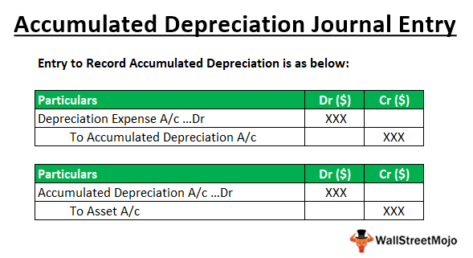

In today's fast-paced financial environment, a comprehensive understanding of financial accounting, asset management, depreciation, and algorithmic (algo) trading is vital for both investors and financial professionals. These foundational concepts play critical roles in shaping effective investment strategies, optimizing asset management, and guiding decision-making processes.

Financial accounting acts as the cornerstone by providing a structured system for recording and reporting financial transactions, which is crucial for transparency and accuracy in stakeholder communications. This systematic approach helps investors and professionals allocate costs accurately across an asset's lifecycle and make informed investment decisions.



Asset management, on the other hand, focuses on maximizing returns and minimizing risks through strategic handling of financial assets. To do so effectively, one must grasp asset valuation and comprehend the broader economic environment.

Depreciation, an essential accounting concept, involves allocating the cost of tangible assets over their useful life, thereby reflecting factors like wear and tear and technological obsolescence. This understanding is pivotal for calculating an asset's book value accurately and meeting tax reporting requirements.

Incorporating technology into finance, algorithmic trading utilizes software to automate trading strategies based on pre-set rules and real-time market data. By integrating financial accounting principles into algo trading, risk assessment and cost management can be significantly enhanced, allowing for optimized trading performance.

This article aims to bridge traditional accounting principles with modern trading techniques, illuminating the interplay between these concepts and their importance in today's financial markets. Through this exploration, readers will gain insights into how these elements collectively contribute to achieving a competitive edge in the dynamic world of finance.

## Table of Contents

## Financial Accounting: The Cornerstone

Financial accounting is a fundamental component of the financial system, providing a structured approach to documenting and interpreting financial transactions. This process is crucial for ensuring the credibility and transparency of financial statements, enabling stakeholders like investors, creditors, and regulatory bodies to make informed decisions. 

### Transparency and Accuracy in Financial Reporting

At the core of financial accounting is the objective to deliver precise and transparent financial reports. These reports reflect an entity's performance, financial position, and cash flows. They are governed by standardized principles such as Generally Accepted Accounting Principles (GAAP) or International Financial Reporting Standards (IFRS), depending on the jurisdiction. Adherence to these standards ensures that financial information is comparable, reliable, and free from bias, which is essential for maintaining stakeholder trust.

### The Accounting Cycle

The accounting cycle is a series of steps followed throughout the reporting period to record transactions and prepare financial statements. These steps typically include:

1. **Identifying Transactions**: Recognizing financial events that require recording.
2. **Journalizing Transactions**: Recording identified transactions in the journal using double-entry bookkeeping, where each transaction affects at least two accounts to maintain the accounting equation: 
$$
   \text{Assets} = \text{Liabilities} + \text{Equity}

$$
3. **Posting to Ledger**: Transferring journalized entries to specific accounts in the general ledger.
4. **Trial Balance**: Summarizing all ledger balances at a point in time to check arithmetic accuracy and ensure that debits equal credits.
5. **Adjusting Entries**: Recording necessary adjustments for accrued and deferred items.
6. **Financial Statements Preparation**: Compiling the adjusted trial balance to produce financial statements, including the income statement, balance sheet, and cash flow statement.
7. **Closing Entries**: Closing temporary accounts to retain earnings and starting the new accounting period afresh.
8. **Post-Closing Trial Balance**: Final trial balance checks to confirm that the ledger accounts are balanced after closing entries.

### Double-Entry Bookkeeping

Double-entry bookkeeping is a pivotal concept in financial accounting, where every financial transaction impacts at least two accounts, maintaining the system's balance. For instance, a company purchasing inventory for cash will record an increase in inventory while simultaneously decreasing cash. This method provides an inherent check within the accounting system, as the total debits must always equal total credits. 

Understanding these key principles and processes aids in recognizing how costs are allocated across an asset's lifecycle, influencing depreciation, and asset valuations, which are critical for financial analysis and strategic decision-making.

## Asset Management: Optimizing Returns

Asset management is a strategic approach to managing investments with the objective of maximizing returns while minimizing associated risks. This process encompasses the management of both tangible and intangible assets, requiring a profound understanding of asset valuation and the broader economic environment. By effectively balancing these factors, investors can achieve optimal portfolio performance.

In managing financial portfolios, a critical component is precisely valuing assets. Asset valuation involves estimating an asset's present value based on expected future cash flows, market conditions, and inherent risks. Techniques such as discounted cash flow (DCF) analysis, comparable company analysis, and precedent transactions are commonly utilized. Accurately assessing an asset's value is integral to making informed investment decisions and evaluating potential returns.

Strategically, asset management involves assessing the interplay between market dynamics and an asset's performance potential. Economic factors such as interest rates, inflation, and economic growth indicators must be considered as they directly affect asset valuations and future return expectations. Furthermore, the allocation of assets within a portfolio must be consistently optimized against these economic conditions to mitigate potential risks and enhance returns.

Key metrics aid in evaluating and improving the efficiency of asset management strategies. The asset turnover ratio, defined as:

$$
\text{Asset Turnover Ratio} = \frac{\text{Net Sales}}{\text{Average Total Assets}}
$$

is a critical measure used to assess the effectiveness of a company's use of its assets in generating sales revenue. A higher ratio indicates more efficient use of assets.

Another vital metric is the Return on Assets (ROA), which provides insights into the profitability relative to the total assets employed. It is calculated as:

$$
\text{ROA} = \frac{\text{Net Income}}{\text{Average Total Assets}}
$$

ROA signifies how well a company utilizes its assets to produce profit. A higher ROA indicates more effective asset utilization in generating earnings.

The management of intangible assets, such as intellectual property or goodwill, is equally crucial. These assets often do not have a clear market value but can significantly impact a company's financial performance and strategic position. Understanding their role within a portfolio allows investors to enhance strategic decisions and capture value from these non-physical assets.

In conclusion, effective asset management requires a blend of sound asset valuation, constant market analysis, and strategic metric utilization. By employing these strategies, investors can more accurately predict asset performance and optimize portfolio returns. As financial markets become increasingly complex, such rigorous asset management practices are indispensable for sustained financial success.

## Depreciation: Measuring Asset Decline

Depreciation is a fundamental concept in financial accounting that involves allocating the cost of a tangible asset over its useful life. This systematic allocation reflects the inevitable decline in the value of an asset due to factors such as wear and tear, usage, and technological obsolescence. By accounting for depreciation, businesses can ensure that financial statements reflect a more accurate valuation of their assets, aiding in both financial analysis and strategic decision-making.

There are several methods of depreciation, each suited to different types of assets and business models. The two most commonly used methods are the straight-line and declining balance methods:

1. **Straight-Line Depreciation**: This method spreads the cost of an asset evenly across its useful life. It is calculated by subtracting the asset's salvage value from its original cost and then dividing by the total number of years the asset is expected to be in use. The formula is:
$$
   \text{Annual Depreciation Expense} = \frac{\text{Cost} - \text{Salvage Value}}{\text{Useful Life}}

$$

   This method is favored for its simplicity and consistency, making it suitable for assets that experience a uniform decline in value.

2. **Declining Balance Method**: This accelerated depreciation method applies a constant rate of depreciation to the asset's book value each year, resulting in higher depreciation expenses in the earlier years of the asset’s life. The formula for the declining balance method is:
$$
   \text{Depreciation Expense} = \text{Book Value at Beginning of Year} \times \text{Depreciation Rate}

$$

   The declining balance method, often modified as the double-declining balance method, is beneficial for assets that lose value more quickly in their initial years, such as technology equipment.

Understanding depreciation is crucial for various reasons. It affects the calculation of an asset's book value, providing insights into its current worth on the balance sheet. Accurate depreciation calculations are also essential for tax reporting, as they can influence a company's taxable income and, consequently, its tax liabilities. Additionally, recognizing the periodic depreciation expense aligns cost allocation with revenue generation, ensuring compliance with the matching principle in accounting.

Businesses must carefully select the most appropriate depreciation method for their assets, considering factors such as asset type, expected usage patterns, and the financial impact on their statements. Ultimately, the choice of depreciation method and the accuracy of its implementation can significantly affect financial projections and investment strategies.

## Algo Trading: Harnessing Technology

Algorithmic trading, commonly referred to as algo trading, utilizes computer algorithms to execute trading strategies based on predefined rules and real-time market data. This automation allows for rapid decision-making and execution, often beyond human capacity, thereby enhancing trading efficiency and precision.

By incorporating financial accounting principles, algo trading can significantly improve risk assessment and cost management. For instance, algorithms can be programmed to utilize financial data such as asset valuation and depreciation metrics. This enables the creation of more refined trading strategies based on the intrinsic value of assets and their projected wear and tear over time. Depreciation metrics, in particular, can be used to adjust the value of tangible assets accurately over their useful lives, thus influencing trading decisions that aim to optimize asset turnover and returns. 

The technological infrastructure that supports [algorithmic trading](/wiki/algorithmic-trading) includes sophisticated data processing capabilities and advanced [machine learning](/wiki/machine-learning) tools. These technologies are vital for analyzing vast amounts of financial data, detecting market trends, and executing trades at optimal times. Machine learning models are especially useful for identifying complex patterns in financial data that human analysts might overlook. They can also adapt to new information and learn from past trades to refine their predictions and improve future trading performance.

Python is a popular programming language for building algorithmic trading systems due to its simplicity and the availability of comprehensive libraries such as NumPy, Pandas, and Scikit-learn. These libraries facilitate data manipulation, statistical analysis, and the implementation of machine learning algorithms. An example of a simple trading strategy using Python might involve leveraging a moving average crossover, where the algorithm buys an asset when a short-term moving average crosses above a long-term moving average and sells when the opposite occurs.

```python
import pandas as pd
import numpy as np

# Calculate moving averages
data['short_mavg'] = data['Close'].rolling(window=40).mean()
data['long_mavg'] = data['Close'].rolling(window=100).mean()

# Calculate trading signals
data['signal'] = 0
data['signal'][40:] = np.where(data['short_mavg'][40:] > data['long_mavg'][40:], 1, 0)
data['positions'] = data['signal'].diff()
```

In this example, `data` is a DataFrame containing the asset's historical closing prices. The strategy identifies buy (`1`) and sell (`0`) signals based on the crossover of moving averages.

Overall, the integration of financial accounting data and advanced technology in algorithmic trading fosters a more informed and strategic approach to trading, offering traders a competitive edge in today's dynamic financial markets.

## Integrating Depreciation into Algo Trading

Integrating depreciation data into algorithmic trading models can enhance financial analysis, leading to better asset valuation and improved decision-making. By accounting for depreciation, traders can achieve a more nuanced understanding of asset performance over time, which is crucial for accurate valuation and portfolio management.

Depreciation data helps in adjusting the book value of assets, reflecting their diminishing utility and technological obsolescence. This adjustment is essential in formulating trading strategies that rely on precise asset valuation. More accurate valuations assist in predicting future price movements and in identifying undervalued or overvalued assets, thereby optimizing trade decisions.

For instance, a trading algorithm might adjust the investment strategy based on the straight-line depreciation model, where an asset's value decreases at a constant rate over its useful life. Incorporating this into a trading model could ensure that assets are not over-represented in a portfolio as they age. Conversely, using a declining balance method, which allocates higher depreciation costs earlier in an asset's life, could lead an algorithm to reduce investment earlier to avoid higher depreciation impacts.

Real-world examples include asset-heavy industries like manufacturing, where machinery depreciates at predictable rates. Algo trading models using this data can adjust portfolios proactively, maintaining optimal asset allocation.

Python provides powerful libraries and tools to integrate depreciation data into algorithmic trading strategies. Libraries such as NumPy and pandas are instrumental in managing and analyzing numerical data, while packages like scikit-learn offer machine learning algorithms that can incorporate depreciation factors into predictive models. A sample Python code snippet for calculating straight-line depreciation and integrating it into a trading decision might look like this:

```python
import numpy as np
import pandas as pd

# Sample data: Initial asset value, salvage value, useful life
initial_value = 10000
salvage_value = 1000
useful_life = 5

# Straight-line depreciation calculation
annual_depreciation = (initial_value - salvage_value) / useful_life
depreciation_schedule = pd.DataFrame({
    "Year": np.arange(1, useful_life + 1),
    "Depreciation": np.full(useful_life, annual_depreciation)
})

# Example integration into a simple trading model
def should_sell(asset_value, depreciation):
    # Example trading logic
    # Sell if depreciated value falls below a threshold
    threshold = 5000
    return asset_value - depreciation < threshold

asset_value = initial_value
for year in depreciation_schedule["Year"]:
    depreciation = depreciation_schedule.loc[depreciation_schedule["Year"] == year, "Depreciation"].values[0]
    decision = "Sell" if should_sell(asset_value, depreciation) else "Hold"
    print(f"Year {year}: {decision}")

    # Update asset value
    asset_value -= depreciation
```

For integration on a larger scale, database management systems and big data technologies can handle vast amounts of financial and asset data, enabling dynamic and real-time adjustments in trading algorithms. Thus, leveraging depreciation data is a strategic move towards more sophisticated and effective algorithmic trading.

## Conclusion

Understanding and integrating financial accounting practices into modern trading strategies can significantly enhance investment outcomes. By merging traditional accounting principles with technology-driven trading methods, investors and financial professionals can achieve more precise asset valuation and risk management. As technology continues to evolve, the intersection of traditional accounting and algorithmic trading offers new opportunities for innovation. This convergence allows for the utilization of cutting-edge techniques such as machine learning and data analytics to improve decision-making processes.

Incorporating financial accounting concepts, such as asset depreciation metrics, into algorithmic trading models can refine trading strategies. For example, understanding depreciation can lead to more accurate assessments of an asset's fair market value, thereby facilitating better trading decisions. This approach may involve using Python libraries like Pandas for data manipulation or Scikit-learn for predictive analytics, enabling more sophisticated algorithm design and implementation. Here is a simple Python example demonstrating how one might begin to incorporate financial data into a trading strategy:

```python
import pandas as pd
import numpy as np

# Example data: asset prices and depreciation rates
data = {'asset_price': [100, 95, 90, 85],
        'depreciation_rate': [0.05, 0.05, 0.05, 0.05]}

df = pd.DataFrame(data)
df['depreciated_value'] = df['asset_price'] * (1 - df['depreciation_rate']).cumprod()

# Trading signal based on depreciated value trend
df['signal'] = np.where(df['depreciated_value'] < 90, 'buy', 'sell')

print(df)
```

This article highlights how financial professionals can leverage these concepts for a competitive advantage in the market. As the financial landscape grows increasingly data-centric, the ability to integrate financial accounting with algorithmic strategies can lead to improved performance and sustainability. Readers are encouraged to continue exploring the fusion of accounting principles with technological advancements in trading, as this fusion represents a pivotal frontier for future financial innovations.

## References & Further Reading

### References & Further Reading

To enhance your understanding of financial accounting, asset management, depreciation, and algorithmic trading, a variety of resources are available. These include foundational texts, advanced articles, and online tutorials that provide both theoretical knowledge and practical applications.

#### Books

1. **Financial Accounting: An Introduction to Concepts, Methods, and Uses** by Roman L. Weil, Katherine Schipper, and Jennifer Francis. This book provides comprehensive coverage of financial accounting concepts and methods.

2. **Principles of Corporate Finance** by Richard A. Brealey, Stewart C. Myers, and Franklin Allen. This text covers financial principles relevant to asset management and valuation strategies.

3. **Algorithmic Trading: Winning Strategies and Their Rationale** by Ernie Chan. This book offers valuable insights into developing and implementing trading algorithms.

4. **Financial Valuation: Applications and Models** by James R. Hitchner. A detailed guide for valuation techniques crucial for asset management and depreciation analysis.

#### Articles and Journals

1. **"The Role of Financial Accounting in Algorithmic Trading"** - This article from the *Journal of Financial Markets* explores how financial accounting principles can be integrated into trading algorithms to enhance performance.

2. **"Asset Management Strategies in a Volatile Market"** in the *Journal of Portfolio Management* provides insights into managing assets effectively during financial uncertainty.

3. **"Evaluating Depreciation Models for Asset Allocation"** published in *The Accounting Review* examines various depreciation methods and their impact on financial statements and decision-making.

#### Online Courses

1. **Coursera - Financial Accounting Fundamentals**: This course provides a solid foundation in accounting principles and practices.

2. **edX - Algorithmic Trading and Quantitative Analysis**: Offers advanced training on developing trading strategies using quantitative methods.

3. **Udemy - Asset Management Masterclass**: A comprehensive guide to understanding and managing both tangible and intangible assets for optimizing returns.

#### Further Resources

- **Python Libraries for Financial Analysis**: Libraries such as `pandas`, `numpy`, and `quantlib` can be instrumental in building and evaluating trading algorithms and financial models.

- **Professional Journals**: Subscriptions to journals like *The Journal of Finance* and *Financial Analysts Journal* provide ongoing research and case studies that enhance practical knowledge in these domains.

By exploring these resources, readers can deepen their understanding of the synergy between financial accounting principles and modern trading techniques, leading to more informed investment decisions and strategies.