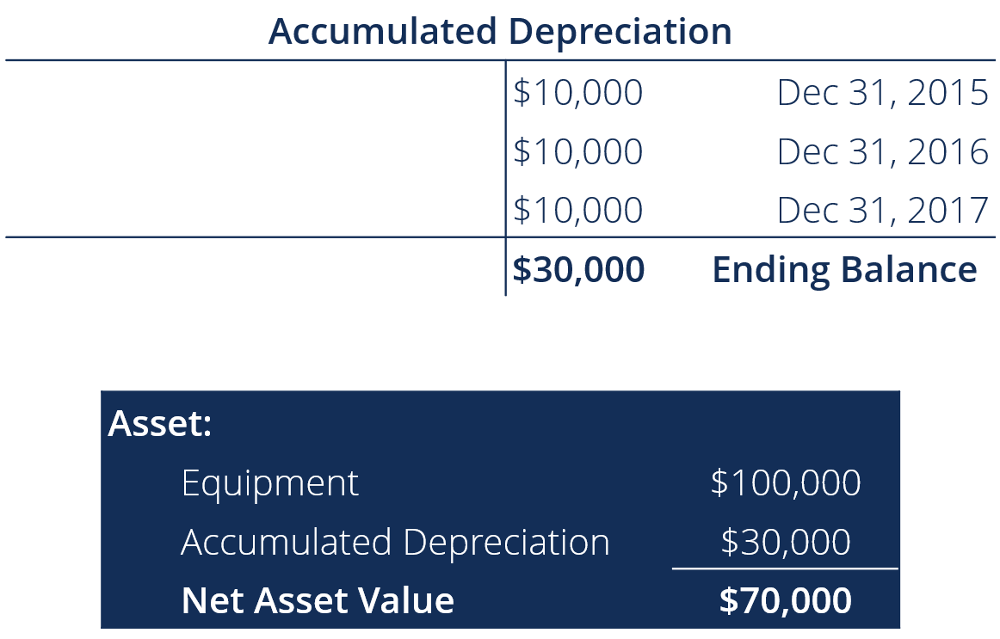

## Table of Contents

## What is accumulated depreciation?

Accumulated depreciation is the total amount of depreciation that has been recorded for an asset up to a certain point in time. When a company buys something expensive like a building or a machine, it doesn't write off the entire cost right away. Instead, it spreads the cost over the useful life of the asset. This process is called depreciation, and the total amount of depreciation taken so far is called accumulated depreciation.

You can find accumulated depreciation on a company's balance sheet. It is listed as a negative number under the asset it relates to, reducing the asset's value. For example, if a company bought a machine for $10,000 and has taken $2,000 in depreciation so far, the machine would be shown on the balance sheet as having a book value of $8,000. This helps show a more accurate picture of what the asset is worth now, after some of its value has been used up.

## How is accumulated depreciation different from depreciation expense?

Accumulated depreciation and depreciation expense are related but different things. Depreciation expense is the amount of an asset's cost that a company writes off each year. It's like a yearly fee for using the asset. This expense is shown on the income statement and reduces the company's profit for that year.

On the other hand, accumulated depreciation is the total of all the depreciation expenses that have been recorded for an asset since it was bought. It's a running total that keeps growing each year as more depreciation is added. You can find accumulated depreciation on the balance sheet, where it reduces the value of the asset it's related to. So, while depreciation expense is about the cost for one year, accumulated depreciation is about the total cost over time.

## What is the purpose of tracking accumulated depreciation?

Tracking accumulated depreciation helps businesses keep their financial records accurate. When a company buys something big like a machine or a building, it doesn't count the whole cost as an expense right away. Instead, it spreads the cost over the years the asset will be used. This way, the company can match the cost of the asset with the income it helps to generate each year. By keeping track of accumulated depreciation, the company can show how much of the asset's value has been used up over time.

This information is important for the balance sheet, which is like a snapshot of what the company owns and owes at a certain time. On the balance sheet, accumulated depreciation is subtracted from the original cost of the asset to show its current book value. This helps everyone, like investors and managers, understand how much the asset is really worth now. It also helps in planning for when the asset might need to be replaced or if it should be sold.

## How do you calculate accumulated depreciation?

To calculate accumulated depreciation, you first need to know the method of depreciation the company uses. The two common methods are straight-line and declining balance. For the straight-line method, you divide the cost of the asset, minus its salvage value, by the number of years it will be used. Each year, you add the same amount of depreciation to the accumulated depreciation. For example, if a machine costs $10,000, has a salvage value of $1,000, and will be used for 9 years, you would depreciate it by $1,000 each year ($10,000 - $1,000 = $9,000 ÷ 9 years = $1,000 per year). So, after 3 years, the accumulated depreciation would be $3,000.

The declining balance method works differently. It starts with a higher depreciation amount that gets smaller each year. You take a percentage of the asset's book value (its cost minus accumulated depreciation so far) each year. A common rate is double the straight-line rate, which is called double-declining balance. For our $10,000 machine, the straight-line rate would be 1/9 or about 11.11%, so the double-declining rate would be 22.22%. In the first year, you'd depreciate $2,222 (22.22% of $10,000), leaving a book value of $7,778. The next year, you'd take 22.22% of $7,778, which is $1,728, and add that to the accumulated depreciation. You keep doing this until the asset's book value reaches its salvage value.

## What are the common methods used to calculate accumulated depreciation?

The most common methods to calculate accumulated depreciation are the straight-line method and the declining balance method. The straight-line method is simple and spreads the cost of the asset evenly over its useful life. You start by taking the cost of the asset and subtracting its salvage value, which is what you think it will be worth at the end of its life. Then, you divide that number by the number of years the asset will be used. Each year, you add the same amount of depreciation to the accumulated depreciation. For example, if a machine costs $10,000, has a salvage value of $1,000, and will be used for 9 years, you would depreciate it by $1,000 each year. After 3 years, the accumulated depreciation would be $3,000.

The declining balance method starts with a higher depreciation amount that gets smaller each year. This method is often used for assets that lose value quickly at first. You take a percentage of the asset's book value, which is its cost minus the accumulated depreciation so far, each year. A common rate is double the straight-line rate, which is called double-declining balance. For our $10,000 machine, the straight-line rate would be 1/9 or about 11.11%, so the double-declining rate would be 22.22%. In the first year, you'd depreciate $2,222 (22.22% of $10,000), leaving a book value of $7,778. The next year, you'd take 22.22% of $7,778, which is $1,728, and add that to the accumulated depreciation. You keep doing this until the asset's book value reaches its salvage value.

## How is accumulated depreciation reported on the balance sheet?

Accumulated depreciation is shown on the balance sheet as a negative number. It's listed under the asset it's related to, like a machine or a building. This helps to show the current value of the asset after some of its cost has been used up over time. For example, if a company bought a machine for $10,000 and has taken $2,000 in depreciation, the machine would be shown on the balance sheet with a value of $8,000. This way, people can see how much the asset is really worth now.

The balance sheet is like a snapshot of what a company owns and owes at a certain time. By including accumulated depreciation, the balance sheet gives a clearer picture of the company's financial health. It shows how much of the assets' costs have been spread out over time and helps everyone, like investors and managers, understand the true value of the company's property and equipment.

## What happens to accumulated depreciation when an asset is sold or disposed of?

When a company sells or gets rid of an asset, it needs to take the accumulated depreciation off its [books](/wiki/algo-trading-books). This is because the asset is no longer part of the company's property. The accumulated depreciation up to that point is used to figure out if the company made a profit or a loss on the sale. If the company sells the asset for more than its book value (which is the original cost minus the accumulated depreciation), it's a profit. If it sells for less, it's a loss.

To do this, the company removes the original cost of the asset from the balance sheet and also removes the accumulated depreciation. The difference between the sale price and the book value is recorded as a gain or loss on the income statement. This helps keep the company's financial records accurate and up to date, showing the real impact of selling or disposing of the asset.

## How does accumulated depreciation affect the net book value of an asset?

Accumulated depreciation directly affects the net book value of an asset. The net book value is what the asset is worth on the company's books after you take away the accumulated depreciation. When a company buys an asset, like a machine or a building, it doesn't count the whole cost as an expense right away. Instead, it spreads the cost over the years the asset will be used. Each year, the company adds up the depreciation and calls it accumulated depreciation. This total is then subtracted from the original cost of the asset to find the net book value.

For example, if a company bought a machine for $10,000 and has taken $2,000 in depreciation so far, the net book value of the machine would be $8,000. This means the machine is now worth $8,000 on the company's balance sheet. As more depreciation is added each year, the net book value keeps going down until it reaches the asset's salvage value, which is what the company thinks the asset will be worth at the end of its useful life. This helps everyone see how much the asset is really worth now, after some of its value has been used up.

## Can accumulated depreciation ever be negative?

No, accumulated depreciation cannot be negative. It's always a positive number because it's the total amount of depreciation that has been taken on an asset over time. When a company buys something like a machine or a building, it doesn't count the whole cost as an expense right away. Instead, it spreads the cost over the years the asset will be used. Each year, the company adds up the depreciation and calls it accumulated depreciation. This total is always a positive number because it's adding up costs, not taking them away.

On the balance sheet, accumulated depreciation is shown as a negative number under the asset it's related to. This is because it's subtracted from the original cost of the asset to show its current value. But the actual amount of accumulated depreciation itself is always positive. It's like keeping track of how much of the asset's value has been used up over time. So, even though it's shown as a negative on the balance sheet, the accumulated depreciation number itself is never negative.

## How does accumulated depreciation impact a company's financial ratios?

Accumulated depreciation affects a company's financial ratios because it changes the value of the company's assets on the balance sheet. When a company calculates ratios like the return on assets (ROA), it uses the net book value of the assets, which is the original cost minus the accumulated depreciation. A higher accumulated depreciation means the net book value of the assets is lower, which can make the ROA look better because the profit is divided by a smaller number. This can make the company seem more efficient at using its assets to make money.

Another ratio that can be affected is the fixed asset turnover ratio, which shows how well a company uses its fixed assets to generate sales. If accumulated depreciation is high, the net book value of the fixed assets is lower, which can make the fixed asset turnover ratio higher. This might make the company look like it's doing a better job at turning its assets into sales. But it's important to remember that while accumulated depreciation can make some ratios look better, it's just a way of spreading out the cost of the assets over time, not a real change in how the company is doing.

## What are the tax implications of accumulated depreciation?

Accumulated depreciation affects a company's taxes because it changes how much the company can write off each year. When a company buys something big like a machine or a building, it can't take the whole cost as an expense right away. Instead, it spreads the cost over the years the asset will be used. This is called depreciation, and the total amount of depreciation taken so far is called accumulated depreciation. Each year, the company can deduct the depreciation expense from its income, which lowers the amount of taxes it has to pay. So, the more depreciation a company takes, the less it pays in taxes.

But there are rules about how much depreciation a company can take for tax purposes. The government has set ways to figure out depreciation, like the Modified Accelerated Cost Recovery System (MACRS), which lets companies take more depreciation in the early years of an asset's life. This can help lower taxes more in the beginning. When a company sells an asset, it has to figure out if it made a profit or a loss. The profit or loss is based on the sale price minus the asset's book value, which is the original cost minus the accumulated depreciation. This can also affect the company's taxes because a profit might mean more taxes, while a loss could mean less.

## How do different accounting standards (e.g., GAAP vs. IFRS) treat accumulated depreciation?

Under Generally Accepted Accounting Principles (GAAP), which is used mainly in the United States, accumulated depreciation is treated as a contra-asset account. This means it's shown on the balance sheet as a negative number under the asset it's related to. GAAP allows companies to use different methods to calculate depreciation, like the straight-line method or the declining balance method. The choice of method can affect how much depreciation is taken each year and how the asset's value is shown on the balance sheet. GAAP also has rules about how to handle depreciation when an asset is sold or disposed of, making sure the company's financial records stay accurate.

International Financial Reporting Standards (IFRS), used in many countries around the world, also treat accumulated depreciation as a contra-asset account. But there are some differences in how IFRS handles depreciation compared to GAAP. For example, IFRS allows companies to revalue their assets, which means they can change the value of the asset on the balance sheet if its market value goes up or down. This can affect how much depreciation is taken and how the asset's value is shown. Also, IFRS has different rules about how to calculate depreciation and what methods can be used, which can lead to different amounts of accumulated depreciation compared to GAAP.

## What is the Understanding of Accounting Asset Value?

Accounting asset value is an essential metric in financial reporting, capturing the overall worth of a company's assets as documented on its balance sheet. This valuation is foundational for understanding the financial position and operational success of a business. Assets are segmented into two primary categories: current and non-current assets. Current assets, like cash, inventory, and accounts receivable, are expected to be liquidated or consumed within a year. In contrast, non-current assets, such as property, plant, equipment, and intangible assets, provide long-term value and are not readily convertible into cash.

The classification of assets into current and non-current categories carries substantial implications for financial ratios and company valuation. For instance, the current ratio, a key indicator of a company's short-term liquidity, is calculated as:

$$
\text{Current Ratio} = \frac{\text{Current Assets}}{\text{Current Liabilities}}
$$

A higher current ratio suggests greater financial health and [liquidity](/wiki/liquidity-risk-premium), enabling the company to meet its obligations. Similarly, the asset turnover ratio, which reflects a company's efficiency in using its assets to generate sales, also relies on accurate valuation. It is computed as:

$$
\text{Asset Turnover Ratio} = \frac{\text{Net Sales}}{\text{Average Total Assets}}
$$

Understanding the methodologies employed for asset valuation is crucial for ensuring financial transparency and informed decision-making. Several valuation methods are prominent, each offering unique insights and applications:

1. **Historical Cost**: This method records assets at their original purchase price minus any depreciation. This approach provides a stable and consistent basis for asset valuation but may not reflect current market values.

2. **Fair Value**: Fair value represents the price at which an asset could be bought or sold in a current transaction between willing parties. It is considered more relevant for reflecting an asset's current worth in dynamic markets, although it may introduce volatility into financial statements.

3. **Net Realizable Value (NRV)**: NRV calculates the estimated selling price of an asset in the ordinary course of business, minus the estimated cost of completion and the estimated costs necessary to make the sale. NRV is particularly useful for valuing inventory and ensuring it is not overstated on the balance sheet.

Selecting an appropriate method for asset valuation necessitates a careful assessment of the asset's nature, the company's industry, and prevailing economic conditions. Each methodology impacts strategic insights for investors, regulators, and stakeholders, offering perspectives on a business's financial health and future prospects. Furthermore, transparency in asset valuation is vital for maintaining investor confidence and regulatory compliance, ultimately influencing the strategic decisions undertaken by the entity.

## What is the role of depreciation in asset valuation?

Depreciation serves as a fundamental accounting mechanism that allocates the cost of a tangible asset across its useful life. This process is vital for aligning the asset's cost with the revenue it helps generate, ensuring accuracy in financial statements and maintaining fairness in reporting. By systematically writing off the value of physical assets like machinery or equipment, depreciation ensures that a company's financial results reflect a realistic picture of its asset utilization over time.

There are several methods for calculating depreciation, each with distinct effects on financial statements:

1. **Straight-Line Depreciation**:
   The simplest method, straight-line depreciation, involves dividing the asset's cost evenly over its useful life. The formula is:
$$
   \text{Annual Depreciation Expense} = \frac{\text{Cost of Asset} - \text{Salvage Value}}{\text{Useful Life}}

$$

   This method provides a consistent depreciation expense each year, facilitating straightforward budgeting and long-term financial planning.

2. **Double Declining Balance**:
   An accelerated depreciation method, double declining balance (DDB), front-loads depreciation expenses earlier in the asset's life. The formula is:
$$
   \text{Depreciation Expense} = 2 \times \frac{\text{Remaining Book Value}}{\text{Useful Life}}

$$

   This method reduces taxable income more significantly in initial years, benefiting companies seeking faster expense recognition for tax purposes.

3. **Units of Production**:
   This method ties depreciation to the asset's usage, ideal for machinery whose wear correlates with output. The formula is:
$$
   \text{Depreciation Expense} = \left(\frac{\text{Cost of Asset} - \text{Salvage Value}}{\text{Total Estimated Units of Production}}\right) \times \text{Units Produced in Period}

$$

   By linking depreciation to actual production levels, this approach offers a more dynamic reflection of an asset's utility and condition.

Depreciation's impact on asset value directly influences financial ratios like return on assets (ROA) and debt-to-equity ratio, crucial for management decisions and investor assessments. For example, higher initial depreciation under DDB can reduce net income and ROA, potentially making a company appear less profitable in early periods despite unchanged cash flows.

Real-world examples highlight depreciation's role in financial modeling. For instance, a manufacturing firm using DDB for its machinery may report lower early profits, deterring short-term focused investors. Conversely, a tech company favoring straight-line depreciation for its data center assets can demonstrate stability, attracting investors prioritizing long-term growth.

Understanding the implications of different depreciation methods allows for strategic financial planning and reporting, ensuring transparency and alignment with business objectives. Accurate depreciation recording not only informs internal management decisions but also influences stakeholder perceptions and regulatory compliance.

## References & Further Reading

1. **Books and Texts on Accounting and Asset Valuation**:
   - "Financial Accounting Theory" by William R. Scott. This book provides comprehensive coverage of different accounting theories and practices, crucial for understanding the underlying principles of asset valuation and depreciation.
   - "Valuation: Measuring and Managing the Value of Companies" by McKinsey & Company Inc. This text offers deep insights into corporate valuation, introducing various models and methods used by professionals.

2. **Academic Papers on Accounting Methods and Practices**:
   - "The Effect of Depreciation on Financial Statements" by J.C. Lassila and D.T. Spiceland, published in the Journal of Accounting and Economics. This paper examines the impact of different depreciation methods on financial reporting and analysis.
   - "Revaluation of Fixed Assets and Its Impact on Financial Ratios" featured in the Journal of Financial Reporting. This work highlights how asset revaluation influences financial ratios, an essential consideration for investors and analysts.

3. **Algorithmic Trading Literature**:
   - "Algorithmic Trading: Winning Strategies and Their Rationale" by Ernest P. Chan. This book explores how algorithmic trading models use financial data, including asset valuations, to make investment decisions.
   - "The Science of Algorithmic Trading and Portfolio Management" by Robert Kissell. This comprehensive guide investigates into strategies, algorithm development, and implementation, crucial for those integrating asset data into trading systems.

4. **Online Resources and Courses**:
   - Coursera’s "Introduction to Financial Accounting" course, which covers essential financial accounting concepts, including asset valuation and depreciation methods.
   - MIT OpenCourseWare offers several courses, such as "Algorithmic Trading and Quantitative Strategies," which provide practical insights into the integration of financial data into trading algorithms.

5. **Professional Journals and Articles**:
   - Articles from the "Journal of Finance" and the "Review of Financial Studies" often explore empirical studies and theoretical advances related to asset valuation and algorithmic trading.
   - "The Accounting Review" publishes relevant research findings that elucidate the nuances of accounting principles and their implications for financial decision-making and strategy formulation. 

These resources provide a foundational understanding and more advanced knowledge for those interested in accounting, asset valuation, and the technical aspects of [algorithmic trading](/wiki/algorithmic-trading).

