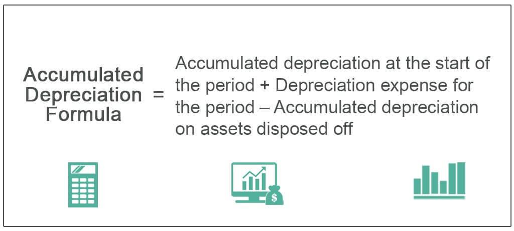

In the modern financial landscape, the convergence of accounting principles and algorithmic trading is reshaping how market participants approach investment strategies. Accounting asset value and depreciation are two pivotal concepts traditionally rooted in financial reporting, influencing not just balance sheets but also the dynamic world of algorithmic trading. The increasing complexity of financial markets and the advances in computational technology have underscored the importance of integrating financial data with trading algorithms, necessitating a robust understanding of these accounting principles.

Accounting asset value reflects the recorded worth of a company's assets as presented in its balance sheet, serving as a fundamental metric in assessing a company's financial position. This valuation informs essential financial decisions, impacting investment strategies and risk assessments by offering insights into asset liquidity and operational capacity. Depreciation, on the other hand, represents the systematic allocation of an asset's cost over its useful lifespan, aligning cost with revenue generation. Together, these concepts not only shape financial statements but also influence strategy development in automated trading environments.



Algorithmic trading, characterized by the use of pre-programmed rules and financial models to execute trades, is heavily reliant on accurate and timely data inputs, including asset valuation and depreciation metrics. The intertwining of these accounting elements with trading algorithms facilitates the creation of more precise and effective strategies, designed to capitalize on market movements with minimized risk exposure.

This article explores the critical intersections of these domains, focusing on accounting asset management, depreciation, and their integration into algorithmic trading. By elucidating how these elements interplay, we aim to offer insights into their impact on modern trading strategies and financial modeling. The convergence of these areas not only represents an opportunity to optimize trading practices but also underscores the necessity for traders and financial professionals to possess a nuanced understanding of both accounting principles and algorithmic techniques. As technology increasingly permeates financial markets, the integration of accurate accounting data into trading systems becomes a crucial factor in achieving a competitive advantage.

## Table of Contents

## Understanding Accounting Asset Value

Accounting asset value is an essential metric in financial reporting, capturing the overall worth of a company's assets as documented on its balance sheet. This valuation is foundational for understanding the financial position and operational success of a business. Assets are segmented into two primary categories: current and non-current assets. Current assets, like cash, inventory, and accounts receivable, are expected to be liquidated or consumed within a year. In contrast, non-current assets, such as property, plant, equipment, and intangible assets, provide long-term value and are not readily convertible into cash.

The classification of assets into current and non-current categories carries substantial implications for financial ratios and company valuation. For instance, the current ratio, a key indicator of a company's short-term liquidity, is calculated as:

$$
\text{Current Ratio} = \frac{\text{Current Assets}}{\text{Current Liabilities}}
$$

A higher current ratio suggests greater financial health and [liquidity](/wiki/liquidity-risk-premium), enabling the company to meet its obligations. Similarly, the asset turnover ratio, which reflects a company's efficiency in using its assets to generate sales, also relies on accurate valuation. It is computed as:

$$
\text{Asset Turnover Ratio} = \frac{\text{Net Sales}}{\text{Average Total Assets}}
$$

Understanding the methodologies employed for asset valuation is crucial for ensuring financial transparency and informed decision-making. Several valuation methods are prominent, each offering unique insights and applications:

1. **Historical Cost**: This method records assets at their original purchase price minus any depreciation. This approach provides a stable and consistent basis for asset valuation but may not reflect current market values.

2. **Fair Value**: Fair value represents the price at which an asset could be bought or sold in a current transaction between willing parties. It is considered more relevant for reflecting an asset's current worth in dynamic markets, although it may introduce volatility into financial statements.

3. **Net Realizable Value (NRV)**: NRV calculates the estimated selling price of an asset in the ordinary course of business, minus the estimated cost of completion and the estimated costs necessary to make the sale. NRV is particularly useful for valuing inventory and ensuring it is not overstated on the balance sheet.

Selecting an appropriate method for asset valuation necessitates a careful assessment of the asset's nature, the company's industry, and prevailing economic conditions. Each methodology impacts strategic insights for investors, regulators, and stakeholders, offering perspectives on a business's financial health and future prospects. Furthermore, transparency in asset valuation is vital for maintaining investor confidence and regulatory compliance, ultimately influencing the strategic decisions undertaken by the entity.

## The Role of Depreciation in Asset Valuation

Depreciation serves as a fundamental accounting mechanism that allocates the cost of a tangible asset across its useful life. This process is vital for aligning the asset's cost with the revenue it helps generate, ensuring accuracy in financial statements and maintaining fairness in reporting. By systematically writing off the value of physical assets like machinery or equipment, depreciation ensures that a company's financial results reflect a realistic picture of its asset utilization over time.

There are several methods for calculating depreciation, each with distinct effects on financial statements:

1. **Straight-Line Depreciation**:
   The simplest method, straight-line depreciation, involves dividing the asset's cost evenly over its useful life. The formula is:
$$
   \text{Annual Depreciation Expense} = \frac{\text{Cost of Asset} - \text{Salvage Value}}{\text{Useful Life}}

$$

   This method provides a consistent depreciation expense each year, facilitating straightforward budgeting and long-term financial planning.

2. **Double Declining Balance**:
   An accelerated depreciation method, double declining balance (DDB), front-loads depreciation expenses earlier in the asset's life. The formula is:
$$
   \text{Depreciation Expense} = 2 \times \frac{\text{Remaining Book Value}}{\text{Useful Life}}

$$

   This method reduces taxable income more significantly in initial years, benefiting companies seeking faster expense recognition for tax purposes.

3. **Units of Production**:
   This method ties depreciation to the asset's usage, ideal for machinery whose wear correlates with output. The formula is:
$$
   \text{Depreciation Expense} = \left(\frac{\text{Cost of Asset} - \text{Salvage Value}}{\text{Total Estimated Units of Production}}\right) \times \text{Units Produced in Period}

$$

   By linking depreciation to actual production levels, this approach offers a more dynamic reflection of an asset's utility and condition.

Depreciation's impact on asset value directly influences financial ratios like return on assets (ROA) and debt-to-equity ratio, crucial for management decisions and investor assessments. For example, higher initial depreciation under DDB can reduce net income and ROA, potentially making a company appear less profitable in early periods despite unchanged cash flows.

Real-world examples highlight depreciation's role in financial modeling. For instance, a manufacturing firm using DDB for its machinery may report lower early profits, deterring short-term focused investors. Conversely, a tech company favoring straight-line depreciation for its data center assets can demonstrate stability, attracting investors prioritizing long-term growth.

Understanding the implications of different depreciation methods allows for strategic financial planning and reporting, ensuring transparency and alignment with business objectives. Accurate depreciation recording not only informs internal management decisions but also influences stakeholder perceptions and regulatory compliance.

## Algorithmic Trading and Asset Valuation

Algorithmic trading, often referred to as algo trading, fundamentally relies on the integration of financial accounting principles, particularly asset valuation and depreciation. In such trading, pre-programmed instructions execute trades at speeds and frequencies beyond the capability of human traders. The core of successful algorithmic strategies hinges on the accuracy of asset valuation data, where any discrepancy or inaccuracy can lead to significant miscalculations and potential financial losses.

The integration of asset valuation into trading algorithms underscores the intersection between traditional accounting practices and modern financial technology. Asset valuation methods—such as historical cost, fair value, and net realizable value—inform the baseline data utilized by trading algorithms. Each method provides a different perspective on an asset's worth, impacting trading decisions and strategies. Historical cost offers a base value recorded on the [books](/wiki/algo-trading-books), while fair value provides a market-based perspective, adapting to fluctuating conditions. Net realizable value, on the other hand, offers the estimated final cash inflow from disposing of the asset, post any potential costs.

Depreciation, as an accounting convention, equally affects asset valuation in [algorithmic trading](/wiki/algorithmic-trading). It accounts for the decline in asset value over time, providing a systematic way to reflect this decrease in financial statements. By incorporating methods such as straight-line or accelerated depreciation (e.g., double declining balance), traders gain insights into asset efficiency and operational capacity. These depreciation calculations are fundamental as they influence the net book value of assets, thereby affecting the initial input valuation used in trading models.

The technological infrastructure required to manage and integrate this financial data into trading algorithms involves sophisticated data processing and management systems. These systems must handle large volumes of data in real time, necessitating robust computer servers and efficient data pipelines. High-frequency trading platforms often employ [machine learning](/wiki/machine-learning) algorithms to adapt their strategies based on continuously updated asset valuation data, ensuring trade decisions are informed by the most current and relevant financial metrics.

An accurate data input foundation is critical. For instance, Python, a preferred programming language in finance, offers libraries such as pandas and numpy, which allow for efficient handling and manipulation of data. These tools can be employed to calibrate trading algorithms, optimizing them for speed and accuracy. Moreover, Python's machine learning libraries, like scikit-learn, facilitate the development of predictive models that can anticipate market movements based on historical asset data.

In summary, algorithmic trading thrives on precise financial data inputs, especially asset valuation and depreciation figures. The interplay between these accounting principles and advanced technological infrastructure supports the seamless integration necessary for efficient and effective trading strategies. This synergy not only enhances trading precision but also minimizes the risk of financial misstep due to erroneous data assumptions.

## Integrating Depreciation into Trading Algorithms

Incorporating asset depreciation data into trading algorithms combines accounting acumen with technological expertise, achieving more precise financial decision-making. One fundamental challenge in this integration is capturing the dynamic nature of depreciation—typically calculated annually—and accurately reflecting it in real-time trading models. Depreciation, by affecting asset value, influences financial ratios critical to trading strategies. Consequently, algorithms must adjust valuation metrics in real-time, accommodating for any fluctuations due to depreciation.

Case studies highlight successful integrations of depreciation into algorithmic trading. For instance, certain quantitative hedge funds have developed strategies that dynamically adjust asset valuations within their models. By considering depreciation, these funds ensure that the intrinsic asset value, adjusted for wear and tear or obsolescence, informs their trading decisions. This adjustment minimizes the risk of overvaluation or undervaluation, thereby enhancing the precision of trading operations.

The technological tools facilitating this integration are pivotal. Python and R libraries such as Pandas and NumPy allow for efficient data manipulation and calculation, including the depreciation of assets. For example, Python's Pandas library can manage time-series data, while NumPy can handle complex mathematical operations:

```python
import pandas as pd
import numpy as np

# Sample asset data with initial values
data = {'Asset': ['Machine A', 'Machine B'],
        'Initial Value': [100000, 50000],
        'Depreciation Rate': [0.1, 0.15]}

df = pd.DataFrame(data)

# Calculating straight-line depreciation over 5 years
years = 5
df['Depreciated Value'] = df.apply(lambda x: x['Initial Value'] * (1 - x['Depreciation Rate']) ** years, axis=1)

print(df)
```

In practical terms, this script calculates the depreciation of assets over a specified period, an essential [factor](/wiki/factor-investing) that algorithms must consider when valuing assets for trading. By integrating depreciation into the algorithm, traders gain deeper insights, reducing errors associated with inaccurate asset valuation.

Moreover, these tools support real-time updates and scenario analysis in trading models, providing the flexibility required to adapt strategies as market conditions evolve. This capability is particularly relevant in times of volatile market activity, where the accurate reflection of asset valuation in trading decisions is crucial.

The success of integrating depreciation into trading algorithms is evidenced by the enhanced accuracy and financial insights it provides. Such integrations not only lead to more reliable algorithmic predictions but also offer a competitive advantage in the fast-paced financial markets. For traders and financial institutions, embracing this fusion of accounting knowledge and technology represents not just innovative potential but an imperative for maintaining and enhancing market competitiveness.

## Conclusion

In the modern financial landscape, where precision and speed are crucial, the convergence of accounting asset value, depreciation, and algorithmic trading is reshaping investment strategies. This intersection underscores the necessity of integrating accurate and detailed financial data into trading models to harness innovative and efficient strategies. As technology progresses, the ability to incorporate precise financial information regarding asset valuation and depreciation into trading algorithms becomes vital, not just for enhanced decision-making but for maintaining competitiveness in increasingly automated markets.

Understanding the financial metrics of asset value and depreciation is paramount for developing effective algorithms. Asset values provide an economic snapshot, influencing investment decisions and informing the programming behind algorithmic models. Depreciation further refines this data by systematically considering the reduction in asset value over time, ensuring that trading decisions reflect the true economic state of the assets involved. An accurate depiction of asset valuation helps in predicting future performance, assessing risks, and identifying opportunities, thereby supporting informed and strategic trading actions.

This convergence between accounting and technology is an opportunity for market participants to gain a competitive edge. Leveraging such integration allows for not only improved accuracy in trading algorithms but also facilitates the exploration of novel strategies that can adapt to market fluctuations and capitalize on new developments. Embracing advanced techniques in financial data management and algorithmic trading not only enhances strategic capabilities but also aligns business operations with modern technological advancements, driving both efficiency and innovation in financial markets. As a result, industry players who adeptly combine these elements will find themselves better positioned to navigate the complexities of modern markets and achieve sustainable growth.

## References & Further Reading

1. **Books and Texts on Accounting and Asset Valuation**:
   - "Financial Accounting Theory" by William R. Scott. This book provides comprehensive coverage of different accounting theories and practices, crucial for understanding the underlying principles of asset valuation and depreciation.
   - "Valuation: Measuring and Managing the Value of Companies" by McKinsey & Company Inc. This text offers deep insights into corporate valuation, introducing various models and methods used by professionals.

2. **Academic Papers on Accounting Methods and Practices**:
   - "The Effect of Depreciation on Financial Statements" by J.C. Lassila and D.T. Spiceland, published in the Journal of Accounting and Economics. This paper examines the impact of different depreciation methods on financial reporting and analysis.
   - "Revaluation of Fixed Assets and Its Impact on Financial Ratios" featured in the Journal of Financial Reporting. This work highlights how asset revaluation influences financial ratios, an essential consideration for investors and analysts.

3. **Algorithmic Trading Literature**:
   - "Algorithmic Trading: Winning Strategies and Their Rationale" by Ernest P. Chan. This book explores how algorithmic trading models use financial data, including asset valuations, to make investment decisions.
   - "The Science of Algorithmic Trading and Portfolio Management" by Robert Kissell. This comprehensive guide investigates into strategies, algorithm development, and implementation, crucial for those integrating asset data into trading systems.

4. **Online Resources and Courses**:
   - Coursera’s "Introduction to Financial Accounting" course, which covers essential financial accounting concepts, including asset valuation and depreciation methods.
   - MIT OpenCourseWare offers several courses, such as "Algorithmic Trading and Quantitative Strategies," which provide practical insights into the integration of financial data into trading algorithms.

5. **Professional Journals and Articles**:
   - Articles from the "Journal of Finance" and the "Review of Financial Studies" often explore empirical studies and theoretical advances related to asset valuation and algorithmic trading.
   - "The Accounting Review" publishes relevant research findings that elucidate the nuances of accounting principles and their implications for financial decision-making and strategy formulation. 

These resources provide a foundational understanding and more advanced knowledge for those interested in accounting, asset valuation, and the technical aspects of algorithmic trading.

