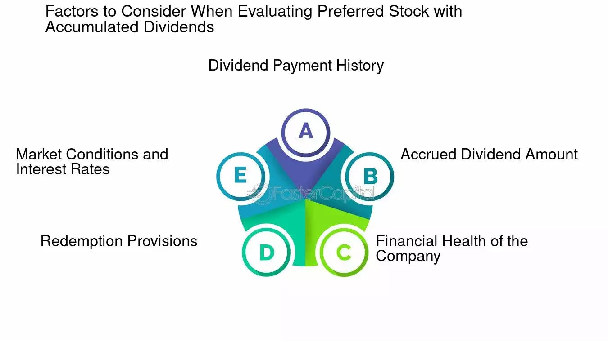

## Table of Contents

## What is an accumulated dividend?

An accumulated dividend is money that a company owes to its shareholders but hasn't paid yet. This happens with certain types of stocks called preferred stocks. When a company can't pay the dividend on time, it adds up or accumulates until the company can pay it.

This situation is common when a company is going through tough financial times. The company promises to pay these accumulated dividends to the preferred shareholders before it pays any dividends to common shareholders. This makes preferred stocks a bit safer for investors, because they know they will get their money back before others, even if it takes some time.

## How does an accumulated dividend differ from a regular dividend?

An accumulated dividend is different from a regular dividend because it's money that a company owes but hasn't paid yet. This usually happens with preferred stocks. When a company can't pay the dividend on time, it adds up until the company can pay it. On the other hand, a regular dividend is money that a company pays out to its shareholders on a regular schedule, like every quarter or every year.

Regular dividends are paid to both common and preferred shareholders, but they don't accumulate if the company misses a payment. If a company skips a regular dividend, common shareholders might not get that money later. But with accumulated dividends, preferred shareholders are promised that they will get their missed payments before any dividends go to common shareholders. This makes accumulated dividends a bit safer for investors who own preferred stocks.

## What types of companies typically offer accumulated dividends?

Companies that offer accumulated dividends are usually ones that have preferred stocks. These are often bigger companies or ones that need a lot of money to grow or do big projects. They might be in industries like utilities, real estate, or finance. These companies use preferred stocks to raise money because it's a way to get funds without giving away too much control, like they would with common stocks.

Sometimes, smaller companies or startups also offer accumulated dividends if they think they can attract investors this way. These companies might be in newer industries like tech or green energy. They use accumulated dividends to show investors that they are committed to paying them back, even if it takes time. This can make their preferred stocks more appealing, especially during tough financial times when regular dividends might be hard to pay.

## Can you explain the mechanism behind how accumulated dividends are calculated?

Accumulated dividends are calculated based on the dividend rate set for the preferred stock. When a company issues preferred stock, it promises to pay a certain amount of money, called the dividend, to the shareholders regularly, like every quarter or year. If the company can't pay this dividend on time, it adds up. The amount that accumulates is simply the dividend rate multiplied by the number of shares the shareholder owns. For example, if the dividend rate is $2 per share per year and a shareholder owns 100 shares, the annual dividend should be $200. If the company misses a payment, that $200 accumulates until it can be paid.

When the company gets back on its feet and can start paying dividends again, it has to pay the accumulated dividends first. This means the company must clear all the missed payments to preferred shareholders before it can pay any dividends to common shareholders. The total amount of accumulated dividends is the sum of all the missed payments. So, if the company missed payments for two years, the accumulated dividends would be $400 for our example shareholder. This system ensures that preferred shareholders are taken care of before common shareholders, making preferred stocks a bit safer investment.

## What are the tax implications of receiving accumulated dividends?

When you receive accumulated dividends, you need to pay taxes on them. The tax rate depends on how long you've owned the stock. If you've held the stock for more than 60 days during the 121-day period that starts 60 days before the ex-dividend date, your dividends might be taxed at a lower rate, called the qualified dividend rate. This rate can be 0%, 15%, or 20%, depending on your income. If you haven't held the stock long enough, the dividends are taxed as ordinary income, which can be higher.

You report accumulated dividends on your tax return just like regular dividends. You'll get a Form 1099-DIV from your broker or the company that shows how much you received in dividends during the year. You'll need to include this amount on your tax return. If you're unsure about how to report your dividends or what tax rate applies to you, it's a good idea to talk to a tax professional who can help you figure it out.

## How do accumulated dividends affect a company's financial statements?

When a company has accumulated dividends, it affects its financial statements in a few ways. On the balance sheet, accumulated dividends show up as a liability. This means the company owes money to its preferred shareholders. The amount of the liability is the total of all the dividends the company missed paying. This makes the company's total liabilities go up, which can make it look less financially healthy to people looking at the balance sheet.

On the income statement, accumulated dividends don't show up directly. But they can affect how the company reports its earnings. If the company decides to pay the accumulated dividends, it has to use money to do that. This can lower the company's net income because it's spending money it might have used for other things. Also, if the company is saving up money to pay these dividends later, it might show lower profits now, which can affect how investors see the company's performance.

## What are the advantages of investing in stocks with accumulated dividends?

Investing in stocks with accumulated dividends can be a good choice if you want a safer investment. These stocks are often preferred stocks, and they promise to pay you money even if the company is having a tough time. If the company misses a dividend payment, it adds up until they can pay it. This means you know you'll get your money eventually, which makes these stocks more secure than regular stocks. It's like having a safety net because the company has to pay you before it pays other shareholders.

Another advantage is that you might get a higher total payout in the end. If the company misses a few payments and then starts doing well again, you could get a big lump sum of all the missed dividends. This can be a nice surprise and a good reward for sticking with the company through tough times. Plus, knowing that you're at the front of the line for dividends can make you feel more confident about your investment, especially if you're looking for steady income over time.

## What are the potential risks associated with accumulated dividends?

One risk of investing in stocks with accumulated dividends is that you might have to wait a long time to get your money. If a company is struggling and can't pay dividends, it might take years before they can catch up and pay you what they owe. During that time, you won't be getting any income from your investment, which can be tough if you were counting on that money.

Another risk is that the company might never be able to pay the accumulated dividends. If the company goes bankrupt, preferred shareholders with accumulated dividends might get some money back, but it's not guaranteed. You could end up losing your investment if the company can't recover. This makes it important to think carefully about the financial health of the company before you invest in their preferred stocks.

## How does the policy on accumulated dividends influence investor decisions?

A company's policy on accumulated dividends can really affect whether investors choose to buy their stock. If a company promises to pay accumulated dividends, it might attract investors who want a safer investment. These investors like knowing that even if the company misses a dividend payment, they will still get their money eventually. This can make the stock more appealing, especially to people who are looking for a steady income from their investments.

On the other hand, the policy can also scare some investors away. If a company has a lot of accumulated dividends, it might mean they are having financial troubles. Investors might worry that the company won't be able to pay back what they owe, especially if the company keeps missing payments. This can make the stock seem riskier, and some investors might decide to put their money somewhere else where they feel it's safer.

## Can accumulated dividends be reinvested, and if so, how?

Yes, accumulated dividends can be reinvested, but it depends on the company's policy and the type of stock you own. If you own preferred stocks with accumulated dividends, you usually can't reinvest those dividends directly. But once the company pays the accumulated dividends, you can use that money to buy more stocks or invest in something else. This means you have to wait until the company catches up on its payments before you can reinvest.

Some companies offer a dividend reinvestment plan (DRIP) for their stocks. With a DRIP, you can automatically use your dividends to buy more shares of the company's stock. But this usually applies to regular dividends, not accumulated dividends. If a company starts paying its accumulated dividends and has a DRIP, you might be able to use the money to buy more shares through the plan. It's a good idea to check with the company or your broker to see what options you have for reinvesting your dividends.

## What historical examples illustrate the impact of accumulated dividends on stock performance?

One historical example that shows how accumulated dividends can affect stock performance is the case of General Motors (GM) during the 2008 financial crisis. GM had issued preferred stocks with accumulated dividends, but when the economy crashed, the company couldn't pay those dividends. The accumulated dividends kept piling up, making investors worried about whether they would ever get their money. This uncertainty led to a drop in the stock's value, as people sold their shares to avoid the risk. Eventually, when GM went bankrupt in 2009, preferred shareholders with accumulated dividends got some money back, but it was much less than what they were owed.

Another example is the utility company, PG&E, which faced financial troubles due to wildfires in California. PG&E had preferred stocks with accumulated dividends, but as the company struggled to pay for the damages caused by the fires, it couldn't keep up with its dividend payments. The accumulated dividends grew, and investors became concerned about the company's ability to pay them back. This led to a decline in the stock's price as people sold their shares. When PG&E filed for bankruptcy in 2019, the situation for preferred shareholders was uncertain, and they had to wait to see if they would receive their accumulated dividends.

## How do regulatory frameworks affect the distribution of accumulated dividends?

Regulatory frameworks can have a big impact on how companies handle accumulated dividends. In the United States, the Securities and Exchange Commission (SEC) and other financial regulators set rules that companies must follow when they issue preferred stocks and promise to pay accumulated dividends. These rules make sure that companies are clear about what they promise to pay and when. If a company can't pay the dividends on time, it has to tell its investors and explain what's going on. This helps keep things fair and transparent, so investors know what to expect.

Sometimes, regulators can also step in if they think a company is in big trouble and might not be able to pay its accumulated dividends. For example, during a bankruptcy, regulators can decide how much money preferred shareholders get back. They might make a plan that says preferred shareholders with accumulated dividends get paid before common shareholders, but after other debts like loans are paid off. This can affect how much money investors get and when they get it. So, knowing the regulatory rules is important for anyone investing in stocks with accumulated dividends.

## References & Further Reading

1. **Key Books and Articles**:
   - **"Algorithmic Trading: Winning Strategies and Their Rationale" by Ernest P. Chan**: This book provides insights into various algorithmic trading strategies, including those involving dividends, while offering practical guidance on designing and testing algorithms. For foundational knowledge, this is an invaluable resource for traders seeking to integrate dividends into their strategies.
   - **"Quantitative Trading: How to Build Your Own Algorithmic Trading Business" by Ernie Chan**: Focusing on quantitative trading, this reference offers insights into building and managing trading algorithms. It discusses dividend-related strategies and presents real-world applications and examples of successful integration.
   - **"The Intelligent Investor" by Benjamin Graham**: Although not specifically about algorithmic trading, this classic work explains the importance of dividends in investment strategies. It provides foundational principles that can be adapted to modern trading systems.

2. **Case Studies and Research Papers**:
   - **Research Article**: "High-Frequency Trading in the Equity Market: A Primer on the Complex Ecosystem" by the Securities and Exchange Commission (SEC). This paper explores the mechanisms of high-frequency trading, highlighting how dividends can be incorporated into these strategies.
   - **Case Study**: "Dividend Strategies in Algorithmic Trading" available through platforms like SSRN (Social Science Research Network). This study analyzes real-world applications and the performance of dividend-focused algorithmic strategies in various market conditions.

3. **Online Resources and Platforms**:
   - **QuantConnect**: This platform offers backtesting tools and data access to test and refine dividend-focused algorithmic strategies. Utilizing historical dividend data, traders can simulate strategies, refine algorithms, and evaluate their performance over time.
   - **Kaggle’s Dataset Repository for Financial Data**: Provides datasets required for modeling dividend payments in algorithmic trading strategies. It offers a collaborative environment to explore various dividend trading strategies through community-shared code and insights.

4. **Technical Documentation and Tools**:
   - **Pandas Library Documentation**: For those integrating dividend data into algorithmic models using Python, the Pandas library offers powerful tools for data manipulation and analysis, essential for handling large datasets and historical dividend data.
   - **Backtrader Documentation**: This open-source Python library facilitates the development of trading strategies, including those involving dividends. The detailed documentation provides step-by-step instructions for implementing backtests and live trades.

These resources collectively provide a comprehensive base for traders aiming to incorporate dividends into [algorithmic trading](/wiki/algorithmic-trading) strategies. By accessing these materials, investors can enhance their understanding and execution of dividend-enhanced algorithmic approaches.

