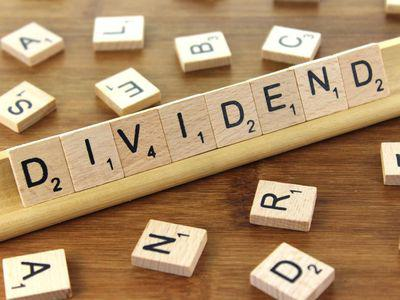

In recent years, the landscape of finance has experienced a profound transformation with the rise of algorithmic trading, which is increasingly influencing dividend investing strategies. Algorithmic trading refers to the use of complex algorithms and automated systems to execute trading strategies with minimal human intervention. This technological advancement brings efficiency, speed, and precision to the trading process, particularly in dividend investing.

Dividends represent a significant component of shareholder return, providing periodic payments, derived from a corporation's profits, to its shareholders. Within this context, accumulated dividends come into play, representing dividends that have not been paid yet due to a company's financial constraints but will accrue until paid. These financial instruments are crucial, impacting corporate balance sheets and investor decision-making.



This article aims to explore how dividend mechanisms, including accumulated dividends, are being integrated into finance and algorithmic trading, delivering insights into how investors can optimize their strategies. Understanding the complex potential of dividends and their integration into algorithmic trading is essential for improving portfolio returns. By leveraging dividends within algorithmic frameworks, investors can develop innovative strategies that capitalize on both the stability and profitability of these financial assets.

Moreover, the strategic incorporation of dividends, especially accumulated dividends, into modern trading systems can significantly enhance the overall returns of an investment portfolio. Through a detailed examination, this article serves as a comprehensive guide, illustrating how dividends can be effectively harnessed to augment algorithmic trading strategies, thereby enabling investors to attain superior financial outcomes.

## Table of Contents

## Understanding Dividends and Accumulated Dividends

Dividends are distributions made by corporations to their shareholders typically derived from the firm's profits. They serve as a mechanism for providing investors with a periodic return on their investment, occurring on a scheduled basis, such as quarterly or annually. The frequency and amount of dividends are determined by the company's board of directors and are subject to the firm's profitability and broader financial strategy.

Accumulated dividends, on the other hand, refer to dividends on cumulative preferred stock that have not been paid to shareholders. These unpaid dividends accumulate, hence the name, especially when a company faces financial challenges that hinder its ability to fulfill such payments on time. In essence, cumulative preferred stock obliges the company to make up for any missed dividend payments before any dividend distribution can be made to common shareholders. This hierarchy provides a safeguard for preferred stock investors, offering a level of security by ensuring that they are compensated first when the company becomes financially capable again.

From an accounting perspective, accumulated dividends are recorded as liabilities on the company's balance sheet. This is because they represent a debt owed to the shareholders, thereby impacting the company's financial statements and influencing its valuation and borrowing capacity. The presence of accumulated dividends may indicate financial distress in a company or strategic maneuvering to conserve cash for reinvestment, depending on the context.

For investors, understanding the implications of accumulated dividends is crucial as they reflect the company's financial health and future payout capabilities. A strategic analysis of these dividends can guide investment decisions, particularly in [algorithmic trading](/wiki/algorithmic-trading) strategies. For instance, vigilant monitoring of a company's capacity to meet its accumulated dividend obligations can help investors anticipate market movements or evaluate the potential risks and returns associated with holding or purchasing cumulative preferred shares.

In summary, dividends and accumulated dividends both play significant roles in the financial ecosystem, offering insights into a company's current performance and future prospects. Investors and algorithmic trading systems that accurately assess and incorporate these facets can enhance their decision-making processes and optimize trading strategies.

## Role of Dividends in Algorithmic Trading

Algorithmic trading involves the use of complex algorithms and computational power to execute trading strategies with precision and efficiency, and dividends play a crucial role in this context. By incorporating dividends into algorithmic trading strategies, investors can enhance portfolio returns by utilizing dividend payouts as an additional income stream. This approach allows for a systematic and analytical enhancement of trading strategies.

One of the popular strategies in this context is the dividend capture strategy. This strategy involves the timing of stock purchases and sales around the ex-dividend date, where a stock is purchased prior to the ex-dividend date and sold shortly thereafter. This allows the investor to capture the declared dividend without being significantly exposed to the stock's price movements. Algorithmic systems are well-suited to automate this process, analyzing historical data and current market conditions to optimize the timing and execution of trades for maximum short-term gains.

Understanding the dividend cycle is paramount in refining these strategies. The key phases include the announcement date, ex-dividend date, and payment date. The announcement date is when a company declares its dividend, providing insights into potential stock price movements. The ex-dividend date is crucial for dividend capture strategies; investors must own the stock before this date to be eligible for the dividend. Finally, the payment date is when the dividend is actually distributed to shareholders. Algorithms can be programmed to consider these dates and perform precise trades, maximizing the efficiency and effectiveness of dividend-based strategies.

Algorithmic trading significantly mitigates the human emotional biases that can impact decision-making in traditional investing. By utilizing a systematic approach backed by computational power, algorithms enable a strategic application of dividends to supplement capital gains. This enhances the overall trading strategy by allowing for well-timed and methodical trades that capitalize on dividend events, ultimately leading to a more optimized and diversified portfolio.

## Potential Benefits and Considerations

Integrating dividends into algorithmic trading can serve as a reliable mechanism to enhance trading returns by introducing an additional income stream alongside potential capital gains. This approach leverages the periodic nature of dividend payments to create a consistent cash flow, which can be particularly advantageous during periods of market downturns or low capital gains. This steady income can act as a cushion, thus increasing the overall stability of an investment portfolio.

However, for algorithmic trading systems that focus on dividend strategies, several factors must be considered to ensure optimal performance and adaptability to shifting market conditions. One of the primary considerations is market [volatility](/wiki/volatility-trading-strategies). Dividends are subject to changes in company policies, influenced by factors such as earnings performance, economic conditions, and strategic decisions made by the company's management. As such, algorithmic trading systems need to dynamically adjust to these variations to maintain efficacy.

Overfitting is a significant risk when developing trading strategies based on historical data, a common practice in algorithmic trading. Overfitting occurs when a model is too closely tailored to past data, potentially leading to a decline in performance when applied to future, unseen data. To mitigate this risk, it is essential to conduct robust [backtesting](/wiki/backtesting) processes. Backtesting involves simulating the trading strategy on historical data to evaluate its performance. A well-tested algorithm will not only fit past data satisfactorily but should also generalize well to future data. Techniques such as walk-forward optimization and Monte Carlo simulations can be employed to enhance the robustness of backtesting procedures.

Moreover, dividends can contribute significantly to portfolio diversification, offering another layer of risk management. In turbulent financial times, dividend-paying stocks tend to be more stable compared to non-dividend-paying counterparts, as these companies often have strong cash flows and stable earnings. Incorporating such securities into an algorithmic trading strategy can help manage risks by spreading exposure across different asset classes or sectors, potentially reducing the overall portfolio volatility.

In summary, while integrating dividends into algorithmic trading offers tangible benefits, such as enhanced returns and diversification, success hinges on accounting for market volatility, potential policy changes, and the risk of overfitting through comprehensive backtesting practices. These considerations are crucial for developing adaptable and robust trading strategies that leverage dividends effectively.

## Case Studies and Real-World Applications

Algorithmic trading firms have increasingly adopted dividend capture strategies, which involve purchasing stocks prior to the ex-dividend date and selling them shortly thereafter. This approach aims to capture the dividend without holding the stock for the long term, thus optimizing returns. Firms successfully implementing such strategies typically maintain robust risk mitigation frameworks to protect against market volatilities. These frameworks often include algorithmic adjustments for market conditions and diversification across sectors, ensuring portfolio resilience.

High-yield dividend stocks are particularly attractive in algorithmic trading due to their potential for substantial income generation. By focusing on stocks with consistent dividend payouts, algorithms can be programmed to identify profitable opportunities while managing exposure to market risks. This strategy permits investors to profit from dividend payouts while allowing quick reallocation of capital post-dividend capture, enhancing [liquidity](/wiki/liquidity-risk-premium) and reducing holding risks.

Backtesting plays a critical role in the successful application of dividend capture strategies. Through historical data analysis, firms refine their algorithms to identify patterns and optimize entry and [exit](/wiki/exit-strategy) points for trades. The Python language, with libraries like pandas and [backtrader](/wiki/backtrader), is commonly used for such simulations. A simplified example of a backtesting script can be demonstrated as follows:

```python
import backtrader as bt
from datetime import datetime

class DividendStrategy(bt.Strategy):
    params = (('dividend_window', 5),)  # Capture within 5 days of ex-dividend date

    def log(self, txt, dt=None):
        """ Logging function for this strategy """
        dt = dt or self.datas[0].datetime.datetime(0)
        print('%s, %s' % (dt.isoformat(), txt))

    def next(self):
        # Implement logic to capture dividend
        if self.datas[0].ex_dividend:
            if not self.position:
                self.order = self.buy()
            elif self.position:
                self.order = self.sell()

# Creating a cerebro entity
cerebro = bt.Cerebro()
cerebro.addstrategy(DividendStrategy)

# Adding data feed
data = bt.feeds.YahooFinanceData(dataname='AAPL',
                                 fromdate=datetime(2020, 1, 1),
                                 todate=datetime(2022, 1, 1))
cerebro.adddata(data)

# Running backtest
cerebro.run()
```

This snippet demonstrates the foundational structure of a dividend capture strategy using the backtrader library. It involves checking whether the stock is in its dividend window and executing trades accordingly. Strategic diversification within these algorithmic frameworks is crucial. By spreading investments across various stocks and sectors, firms balance the need to capture dividends while minimizing risk exposure to any single economic event or market sector downturn.

Real-world applications suggest that the adaptability of trading algorithms is crucial to long-term success. A dynamically updating strategy can respond to changing market conditions, adjusting sector focus and recalibrating risk parameters. Best practices in this field include continuous algorithm testing and updates, aligning strategy parameters with current market trends, and educating stakeholders on potential pitfalls, such as overfitting algorithms to favorable historical data, which might not reproduce similar outcomes under future market conditions.

In conclusion, these practical implementations and case studies underscore the essential nature of dynamic and adaptable strategies in algorithmic trading. By leveraging dividends in a controlled and diversified manner, algorithmic trading firms can enhance their profitability while effectively managing risk.

## Conclusion: Can Dividends Make You Rich in Algo Trading?

Dividends play a crucial role in enhancing the profitability of algorithmic trading, providing an essential layer of income stability and diversification benefits. When incorporated into algorithmic strategies, dividends can offer an additional revenue stream, thus optimizing portfolio performance. While relying exclusively on dividends might not lead to substantial wealth accumulation, they serve as a complementary component within a comprehensive trading strategy, leading to improved overall returns.

For successful integration of dividends in algorithmic trading, it is imperative to develop robust algorithms capable of handling market fluctuations, changes in dividend policies, and real-time data analysis. Algorithms must be designed to assess the timing and impact of dividend payouts accurately, thus ensuring that trading decisions align with the portfolio's objectives.

Investors should consider a holistic approach, blending dividend strategies with broader trading techniques. This approach helps maximize returns while efficiently managing associated risks. For instance, combining dividend capture strategies with [momentum](/wiki/momentum) trading or mean reversion methods can provide a balanced approach that leverages the strengths of each strategy.

Incorporating dividends into algorithmic trading requires a thorough understanding of both the benefits and the potential pitfalls. Investors should pay attention to the risks of overfitting models to historical data and ensure that backtesting methodologies are rigorous and adaptable to future market conditions.

Ultimately, dividends offer significant potential profitability when integrated into a well-rounded algorithmic trading strategy. They can enhance investment returns by providing a steady income stream and improving risk management through diversification. By complementing dividend strategies with other advanced trading techniques, investors can unlock greater potential gains, ensuring a robust and resilient trading strategy in a dynamic financial landscape.

## FAQs

### What are dividends in algorithmic trading?

Dividends in algorithmic trading refer to integrating dividend-based strategies within automated trading systems. These strategies leverage dividend information, such as payment schedules and amounts, to optimize trading decisions. Algorithms can automate processes like dividend capture, which involves purchasing shares before the ex-dividend date and selling them after to benefit from dividend payouts. By including these strategies, algorithmic trading can provide an additional income stream apart from just capital gains, enhancing overall portfolio performance.

### What are some tips for beginners looking to incorporate dividends into their algorithmic strategies?

1. **Understand Dividend Dates**: Know the crucial dates—announcement, ex-dividend, record, and payment dates—and how they affect stock prices.

2. **Start Simple**: Begin with straightforward dividend capture strategies that buy stocks just before the ex-dividend date and sell them afterwards. This allows you to get familiar with the concept without overwhelming complexity.

3. **Use Backtesting**: Employ historical data to backtest strategies, ensuring the approach has the potential for profitability before deploying live trades.

4. **Diversification**: Incorporate stocks from various sectors to manage risk and avoid excessive reliance on dividends from a single source.

5. **Stay Informed**: Keep up with potential changes in dividend policies or market conditions that might impact dividend yields.

6. **Control Costs**: Be mindful of transaction costs and taxes, which can erode gains from dividend strategies if not carefully managed.

### What resources and tools are available for backtesting and analyzing dividend-based trading strategies?

Several tools can aid in backtesting and analyzing dividend strategies:

- **Python and Libraries**: Python is a robust choice for modeling and backtesting. Libraries like Pandas, NumPy, and Matplotlib facilitate data manipulation and visualization. Zipline provides a complete environment for backtesting trading algorithms.

- **QuantConnect**: This platform offers a comprehensive environment supporting multiple languages, including Python, for backtesting and developing trading strategies.

- **Bloomberg Terminal**: While costly, it provides extensive historical data and analytical tools that can be used for simulating and testing dividend-based strategies.

- **TradingView**: Offers charting and backtesting capabilities with a community contributing strategies and ideas related to dividends.

### Can dividends alone create a profitable strategy in algorithmic trading?

While dividends can enhance algorithmic trading strategies by providing income stability and yield, they may not alone constitute a fully profitable strategy. Relying solely on dividends may lead to limited growth potential, especially if the strategy lacks diversification and neglects other market opportunities. Successful strategies often combine dividends with broader trading methods, such as momentum, value investing, or [arbitrage](/wiki/arbitrage), to maximize returns and manage risks. Thus, effective integration of dividend strategies into algorithmic trading frameworks requires careful planning, diversification, and consideration of market dynamics and other financial factors.

## References & Further Reading

1. **Key Books and Articles**:
   - **"Algorithmic Trading: Winning Strategies and Their Rationale" by Ernest P. Chan**: This book provides insights into various algorithmic trading strategies, including those involving dividends, while offering practical guidance on designing and testing algorithms. For foundational knowledge, this is an invaluable resource for traders seeking to integrate dividends into their strategies.
   - **"Quantitative Trading: How to Build Your Own Algorithmic Trading Business" by Ernie Chan**: Focusing on quantitative trading, this reference offers insights into building and managing trading algorithms. It discusses dividend-related strategies and presents real-world applications and examples of successful integration.
   - **"The Intelligent Investor" by Benjamin Graham**: Although not specifically about algorithmic trading, this classic work explains the importance of dividends in investment strategies. It provides foundational principles that can be adapted to modern trading systems.

2. **Case Studies and Research Papers**:
   - **Research Article**: "High-Frequency Trading in the Equity Market: A Primer on the Complex Ecosystem" by the Securities and Exchange Commission (SEC). This paper explores the mechanisms of high-frequency trading, highlighting how dividends can be incorporated into these strategies.
   - **Case Study**: "Dividend Strategies in Algorithmic Trading" available through platforms like SSRN (Social Science Research Network). This study analyzes real-world applications and the performance of dividend-focused algorithmic strategies in various market conditions.

3. **Online Resources and Platforms**:
   - **QuantConnect**: This platform offers backtesting tools and data access to test and refine dividend-focused algorithmic strategies. Utilizing historical dividend data, traders can simulate strategies, refine algorithms, and evaluate their performance over time.
   - **Kaggle’s Dataset Repository for Financial Data**: Provides datasets required for modeling dividend payments in algorithmic trading strategies. It offers a collaborative environment to explore various dividend trading strategies through community-shared code and insights.

4. **Technical Documentation and Tools**:
   - **Pandas Library Documentation**: For those integrating dividend data into algorithmic models using Python, the Pandas library offers powerful tools for data manipulation and analysis, essential for handling large datasets and historical dividend data.
   - **Backtrader Documentation**: This open-source Python library facilitates the development of trading strategies, including those involving dividends. The detailed documentation provides step-by-step instructions for implementing backtests and live trades.

These resources collectively provide a comprehensive base for traders aiming to incorporate dividends into algorithmic trading strategies. By accessing these materials, investors can enhance their understanding and execution of dividend-enhanced algorithmic approaches.

