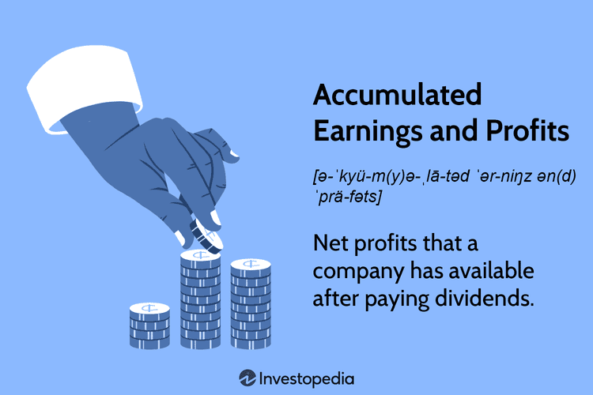

In the increasingly complex world of finance and business, understanding key financial concepts such as accumulated earnings, retained earnings, and profits is crucial. These metrics provide insight into a company's financial health and inform various trading strategies, including algorithmic trading. Accumulated earnings represent a company’s capacity to earn and reinvest over time, serving as a broad measure of operational success. Retained earnings highlight the portion of net profits that are reinvested in the company rather than distributed as dividends, indicating a strategic focus on growth.

Algorithmic trading has transformed trade execution, leveraging financial data to make rapid, informed decisions. This shift emphasizes the importance of accurately assessing financial metrics. Algorithmic trading systems analyze financial statements to identify growth opportunities and mitigate risks. These systems rely significantly on the interpretation of financial metrics, such as accumulated earnings and profits, to refine trading algorithms.



This article examines how accumulated earnings, retained earnings, and profits are intertwined in automated trading strategies. Understanding these financial metrics is essential for assessing a company’s growth potential and stability. Their application in algorithmic trading underscores their critical role in forming robust trading decisions, aligning financial health insights with strategic algorithm development.

## Table of Contents

## Understanding Financial Metrics

Financial metrics such as accumulated earnings, retained earnings, and profits are essential tools for analyzing a firm's performance. These metrics provide insights into a company's financial health, efficiency, and strategic direction.

Accumulated earnings refer to the total net income a company has retained since its inception, after accounting for dividends distributed to shareholders. This metric is indicative of a company's ability to generate profit and reinvest these earnings into the business, showcasing its operational success over time. A higher accumulated earnings figure suggests a firm has consistently performed well and is potentially positioned for long-term growth.

Retained earnings, on the other hand, focus on the portion of net profits that are not distributed as dividends to shareholders but rather reinvested back into the company. The retained earnings for a given period can be calculated using the formula:

$$
\text{Retained Earnings} = \text{Beginning Retained Earnings} + \text{Net Income} - \text{Dividends Paid}
$$

This metric reflects management's decisions regarding reinvestment and indicates the company's growth strategy. A firm with large retained earnings is presumed to be investing in new projects, expanding operations, or repaying debt, all of which are strategies aimed at enhancing future profitability.

Understanding these financial metrics is crucial for stakeholders as they provide valuable information about a company's economic capacity to fund distributions and reinvestments. This understanding aids corporate decision-making by showing how well a company is utilizing its profits to foster growth or maintain financial stability. Similarly, investor assessments rely on these metrics to evaluate a company's performance, potential for growth, and overall financial health. By offering a clear picture of a firm's financial strategy and operational success, accumulated and retained earnings, along with profits, serve as key indicators for evaluating corporate performance and strategic planning.

## Accumulated vs. Retained Earnings

Accumulated earnings and retained earnings, while sometimes conflated, represent distinct yet complementary aspects of a company's financial performance. Accumulated earnings encompass the total profits a company has achieved over its lifetime after deducting any distributed dividends. This metric offers a comprehensive view of a company's financial history, highlighting its long-term profitability and the efficiency of its past reinvestment strategies.

In contrast, retained earnings spotlight the portion of current net profits that a company chooses not to distribute as dividends. Instead, these funds are reinvested back into the company, underscoring management's strategy for growth and expansion. Retained earnings can be indicative of a company’s potential for future development, as these funds are often allocated to activities like research and development, capital expenditures, or other strategic initiatives aimed at enhancing the company's competitive position.

Together, accumulated and retained earnings provide a multifaceted view of a company's financial health and strategic direction. Accumulated earnings can signal a company's ability to generate sustained profits over time, while retained earnings reflect ongoing strategic decisions that can impact future growth. By examining both metrics, investors and analysts can assess how effectively a company manages its resources, which is crucial for determining its capacity for sustainable growth.

For example, when analyzing these metrics, consider the following formula for retained earnings:

$$
\text{Retained Earnings}_{\text{end}} = \text{Retained Earnings}_{\text{beginning}} + \text{Net Income} - \text{Dividends}
$$

This equation illustrates how retained earnings are derived, starting with the previous period's retained earnings, adding net income, and subtracting dividends paid out. The focus on net income minus dividends highlights the strategic choices made by the company regarding reinvestment versus shareholder returns.

By analyzing these financial metrics together, stakeholders can gain a more holistic perspective on a company's financial resilience and its strategic priorities. This approach enables a comprehensive assessment of financial health and informs decisions regarding investments, resource allocation, and future planning.

## Role of Profits in Financial Health

Profits are essential to a company's financial health and strategic direction, serving as a fundamental indicator of its operational efficiency and market positioning. They reflect the net earnings after all expenses have been deducted from total revenue, a crucial metric that informs numerous aspects of a company’s financial management.

A company’s ability to generate and retain profits directly impacts its capacity to reinvest in its core operations, explore new ventures, and fulfill shareholder expectations through dividends. This ability enhances a company’s financial flexibility, allowing it to take advantage of growth opportunities and withstand economic fluctuations. For example, a robust profit margin denotes efficient cost management and revenue generation capabilities, enabling firms to fund capital-intensive projects without relying excessively on external financing.

Understanding the flow and utilization of profits is crucial for both companies and investors. It allows for informed decision-making regarding strategic investments. Companies that effectively manage their profits can optimize resource allocation, prioritizing high-return projects and cutting costs strategically. For instance, by reinvesting profits into research and development, a company can innovate and maintain a competitive advantage in its industry.

Examining profits alongside accumulated and retained earnings provides deeper insight into a company's financial strategies. While accumulated earnings reflect the cumulative profitability over time, retained earnings indicate the portion of profits not distributed as dividends but reinvested in the business. This analysis helps stakeholders assess whether a company is balancing short-term profitability with long-term growth objectives, a critical aspect of sustainable financial management.

Effective profit management ensures long-term sustainability and market competitiveness. Companies that consistently optimize their profit management strategies are better positioned to adapt to market changes, deploy strategic initiatives, and enhance shareholder value. Such firms often demonstrate a balanced approach between profitability, growth, and risk management, paving the way for enduring success and industry leadership.

## Integration in Algorithmic Trading

Algorithmic trading systems utilize financial metrics such as retained earnings and profits to guide their trading strategies. These sophisticated systems employ complex algorithms designed to rapidly analyze financial statements, which allows for the swift identification of opportunities that promise long-term growth while minimizing exposure to short-term risks. The integration of these financial metrics into trading algorithms enhances the depth of [fundamental analysis](/wiki/fundamental-analysis) involved, thereby enriching the investment strategies employed.

A significant advantage of [algorithmic trading](/wiki/algorithmic-trading) lies in its ability to dynamically adjust trading strategies based on real-time financial data. This adaptability improves the efficacy of decision-making processes, allowing for more nuanced trading actions that reflect current market conditions. For instance, an algorithm might recalibrate its strategy in response to unexpected changes in a company's retained earnings or profit margins, optimizing for the best possible trading outcome.

One practical implementation of algorithmic trading is the use of financial ratios to predict a company's performance and subsequently adjust stock portfolios. Ratios such as the price-to-earnings (P/E) ratio or return on equity (ROE) can provide insights into a firm's profitability and market valuation. By incorporating these ratios into algorithmic models, traders can predict potential stock price movements more accurately.

```python
import numpy as np
import pandas as pd
from sklearn.linear_model import LinearRegression

# Example: Simple linear model to predict stock price changes based on P/E ratio
# Sample data illustrating how an algorithm might use financial ratios
data = {
    'P/E_Ratio': [15, 20, 25, 30, 18],
    'Stock_Price_Change(%)': [2.5, 3.1, 2.0, 1.8, 2.7]
}

# Convert the sample data into a DataFrame
df = pd.DataFrame(data)

# Independent and dependent variables
X = df[['P/E_Ratio']]
y = df['Stock_Price_Change(%)']

# Create and fit the model
model = LinearRegression()
model.fit(X, y)

# Coefficient and intercept
print(f"Coefficient: {model.coef_[0]}")
print(f"Intercept: {model.intercept_}")

# Predicting stock price change for a new P/E ratio
new_pe_ratio = [[22]]
predicted_change = model.predict(new_pe_ratio)
print(f"Predicted Stock Price Change(%): {predicted_change[0]}")
```

In the example provided, a simple linear regression model is constructed to estimate stock price changes based on the P/E ratio, showcasing how algorithmic trading can apply statistical methods to integrate financial metrics within its strategies. These models facilitate informed decision-making, allowing traders to dynamically adjust their portfolios in response to calculated predictions, aligning investments with expected market behaviors.

## Practical Applications and Case Studies

Real-world examples such as Apple Inc. and Procter & Gamble (P&G) demonstrate how retained earnings and profits play pivotal roles in shaping company strategies.

Apple Inc. is a prime example of a company leveraging its retained earnings to maintain its position as a leader in innovation and technology. The company reinvests a substantial portion of its profits into research and development (R&D), which is reflected in its financial statements through significant retained earnings. This strategic reinvestment supports Apple's continuous innovation in product development and technological advancement. By prioritizing R&D, Apple ensures sustained growth and market leadership, illustrating how retained earnings can be effectively used to fuel innovation-driven sectors.

In contrast, Procter & Gamble adopts a different financial strategy, focusing on consistent dividend payments to attract and retain income-driven investors. P&G's approach highlights the strategic use of profits to satisfy shareholder expectations while maintaining financial stability. This emphasis on dividends is appealing to investors seeking regular income, thereby supporting the company's strong market position. Through this strategy, P&G demonstrates how effective dividend policies can coexist with sustainable financial health, showcasing an alternative use of profits and retained earnings.

Case studies of these companies reveal how different industries utilize retained earnings and profits strategically. For instance, in technology, reinvesting profits into R&D can lead to sustained competitive advantage and market leadership. Conversely, in consumer goods, prioritizing dividends can enhance investor appeal and stabilize market presence.

Analyzing these strategies provides insights into industry-specific financial practices, offering guidance to investors on assessing resource allocation. These examples underscore the importance of aligning financial strategies with company goals and industry demands, showcasing the diverse applications of retained earnings and profits in business operations. Through such analyses, investors and analysts can better understand how strategic financial management influences a company's long-term success.

## Conclusion

Accumulated earnings, retained earnings, and profits are fundamental aspects of a company's financial management, providing essential insights into its capacity for growth and long-term strategy development. These financial metrics are not only pivotal for evaluating a company's past performance but also serve as critical indicators for future financial health and strategic potential.

Incorporating these metrics into algorithmic trading can significantly enhance decision-making and optimize investment outcomes. By leveraging advanced algorithms that analyze financial statements, trading systems can identify growth opportunities and mitigate risks more effectively. Algorithms can be designed to automatically adjust trading strategies based on real-time data, thus enhancing the efficacy of financial decisions and investments.

For investors and analysts, comprehending these financial metrics is vital for optimizing investment portfolios and crafting durable long-term strategies. A deep understanding of accumulated earnings, retained earnings, and profits enables stakeholders to make informed decisions regarding resource allocation and strategic planning.

As technology progresses, the integration of financial analysis within trading frameworks will gain even greater importance. The continued advancement of technologies such as [artificial intelligence](/wiki/ai-artificial-intelligence) and [machine learning](/wiki/machine-learning) is expected to further refine the capacity to process and analyze vast datasets. Consequently, traders and financial analysts will be better equipped to utilize these metrics to predict market trends and optimize investment strategies.

The strategic use of financial data is poised to continuously drive success in both traditional and algorithmic trading environments. As trading systems become more sophisticated, the ability to seamlessly incorporate financial metrics into algorithmic models will be a key differentiator, enhancing both operational efficiency and investment performance.

## References & Further Reading

[1]: ["Advances in Financial Machine Learning"](https://www.amazon.com/Advances-Financial-Machine-Learning-Marcos/dp/1119482089) by Marcos Lopez de Prado

[2]: ["Evidence-Based Technical Analysis: Applying the Scientific Method and Statistical Inference to Trading Signals"](https://www.amazon.com/Evidence-Based-Technical-Analysis-Scientific-Statistical/dp/0470008741) by David Aronson

[3]: ["Machine Learning for Algorithmic Trading"](https://github.com/stefan-jansen/machine-learning-for-trading) by Stefan Jansen

[4]: ["Quantitative Trading: How to Build Your Own Algorithmic Trading Business"](https://www.amazon.com/Quantitative-Trading-Build-Algorithmic-Business/dp/1119800064) by Ernest P. Chan

[5]: ["Corporate Finance"](https://www.investopedia.com/terms/c/corporatefinance.asp) by Stephen A. Ross, Randolph W. Westerfield, and Jeffrey Jaffe