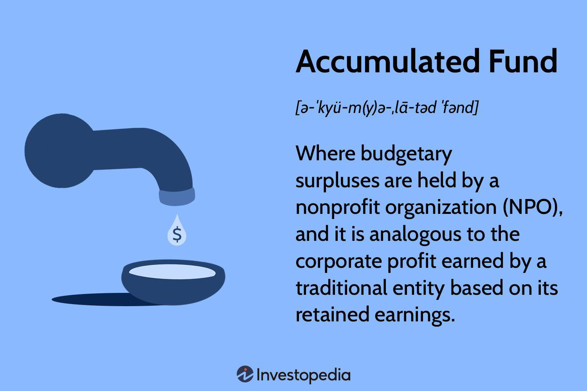

## Table of Contents

## What is an accumulated fund?

An accumulated fund is like a savings account for non-profit organizations, like clubs or charities. Instead of having owners or shareholders, these organizations keep their extra money in an accumulated fund. This fund grows over time as the organization earns more money than it spends. It's used to help the organization keep running and to pay for big projects or unexpected costs.

Think of it as a piggy bank for the organization. When the group makes money from things like membership fees, donations, or fundraising events, and they don't spend all of it, the leftover money goes into the accumulated fund. This way, the organization can save up for the future and make sure it has enough money to do its important work.

## How does an accumulated fund differ from other types of funds?

An accumulated fund is different from other types of funds because it's mainly used by non-profit organizations, like charities or clubs. These groups don't have owners or shareholders, so they don't keep profits for themselves. Instead, any extra money they make goes into the accumulated fund. This fund grows over time and helps the organization save for the future, pay for big projects, or cover unexpected costs. It's like a safety net that makes sure the organization can keep doing its important work.

Other types of funds, like endowment funds or restricted funds, have specific rules about how the money can be used. An endowment fund, for example, is set up to last forever, and only the interest or earnings from the fund can be spent, not the original amount. Restricted funds are given for a specific purpose, like building a new community center, and can only be used for that purpose. Unlike these, an accumulated fund is more flexible. The organization can use the money in the accumulated fund for any of its needs, as long as it helps the group achieve its goals.

## What are the common sources of an accumulated fund?

An accumulated fund grows from the money a non-profit organization makes but doesn't spend. This can come from membership fees that people pay to join the group. It can also come from donations, which are gifts of money from people who want to support the organization's work. Another source is fundraising events, like charity walks or auctions, where people give money to help the cause.

Sometimes, the organization might also earn money from selling things, like [books](/wiki/algo-trading-books) or t-shirts, or from offering services, like classes or workshops. If the group makes more money from these activities than it spends on running them, the extra money goes into the accumulated fund. This helps the organization save up for the future and make sure it can keep doing its important work.

In some cases, the accumulated fund can also grow from interest earned on money that's already in the fund. If the organization keeps its money in a bank account or invests it wisely, the interest or investment returns can add to the accumulated fund. This way, the fund can grow even when the organization isn't actively raising money.

## Can you explain the purpose of an accumulated fund in non-profit organizations?

An accumulated fund is like a savings account for non-profit organizations. It helps them save money for the future and make sure they can keep doing their important work. When a non-profit group makes more money than it spends, the extra money goes into the accumulated fund. This can come from membership fees, donations, fundraising events, or even selling things or offering services. The fund grows over time and acts like a safety net, helping the organization pay for big projects or unexpected costs.

The purpose of an accumulated fund is to make sure the non-profit can keep running smoothly. It gives the group a way to save up for things they might need later, like new equipment or a new building. It also helps them cover any surprise expenses that might come up, like repairs or emergency needs. By having an accumulated fund, the organization can focus on its mission and goals, knowing that it has a financial cushion to fall back on if needed.

## How is an accumulated fund recorded in financial statements?

An accumulated fund is shown on a non-profit organization's financial statements, usually in the balance sheet. The balance sheet is like a snapshot of what the organization owns and owes at a certain time. The accumulated fund is listed under the equity section of the balance sheet. This section shows the money that the organization has saved up over time. It's different from other funds because it's not set aside for a specific purpose, but can be used for any of the organization's needs.

When the organization makes more money than it spends, the extra money goes into the accumulated fund. This is shown in the income statement, which is like a report of the organization's money coming in and going out over a period of time. If the income statement shows a surplus, or extra money, at the end of the year, that surplus is added to the accumulated fund on the balance sheet. This way, the financial statements show how the accumulated fund grows over time and helps the organization keep track of its savings.

## What are the key differences between an accumulated fund and a reserve fund?

An accumulated fund and a reserve fund are both ways for organizations to save money, but they have some key differences. An accumulated fund is mainly used by non-profit organizations, like charities or clubs. It's like a savings account where the organization puts any extra money it makes from things like membership fees, donations, or fundraising events. The money in the accumulated fund can be used for any of the organization's needs, like big projects or unexpected costs. It's a flexible way for the group to save up for the future and make sure it can keep doing its important work.

A reserve fund, on the other hand, is often used by both non-profit and for-profit organizations. It's set aside for specific purposes, like covering unexpected expenses or making sure the organization can keep running if it faces financial difficulties. Unlike an accumulated fund, a reserve fund has strict rules about how the money can be used. It's like an emergency fund that the organization can only tap into when it really needs to. This makes a reserve fund less flexible than an accumulated fund, but it gives the organization a safety net for tough times.

## How do organizations manage and utilize an accumulated fund?

Organizations manage an accumulated fund by keeping track of the money they make and spend. When they make more money than they use, the extra goes into the accumulated fund. They do this by looking at their income and expenses regularly, often every year. They use financial statements, like the income statement and balance sheet, to see how much money is in the fund. This helps them make sure the fund is growing and they can save for the future.

Organizations use the accumulated fund for different things they need. They might use it to pay for big projects, like building a new community center or buying new equipment. They can also use it to cover unexpected costs, like repairs or emergency needs. Because the money in the accumulated fund can be used for any of the organization's needs, it gives them a lot of flexibility. This helps them focus on their mission and goals, knowing they have money saved up to help them along the way.

## What are the tax implications of an accumulated fund for non-profit organizations?

For non-profit organizations, the tax implications of an accumulated fund are generally favorable. Since these organizations are usually exempt from income tax, the money they put into the accumulated fund doesn't get taxed. This means they can save more money over time because they don't have to pay taxes on their earnings. It's like getting a little extra help to grow their savings and do more good work.

However, there are some rules non-profits need to follow. If they start to look too much like a for-profit business, or if they use the money in the accumulated fund for things that aren't related to their mission, they might lose their tax-exempt status. This could mean they have to pay taxes on their income, including the money in the accumulated fund. So, it's important for non-profits to use the accumulated fund wisely and make sure they're following the rules to keep their tax benefits.

## Can you provide examples of how accumulated funds are used in real-world scenarios?

A local community center might use its accumulated fund to build a new playground for kids. They've been saving up money from membership fees and donations for a few years. Now, they have enough in the accumulated fund to pay for the construction. This new playground will help more kids in the community have a safe place to play and learn. The community center can use the accumulated fund for this big project because it helps them achieve their goal of supporting the local families.

A charity that helps homeless people might use its accumulated fund to buy a van. They've been getting money from fundraising events and selling t-shirts with their logo. The extra money goes into the accumulated fund. Now, they can use that money to buy a van to help them reach more people in need. The van will make it easier for the charity to deliver food, clothes, and other supplies to homeless people in different parts of the city. This shows how the accumulated fund can help the charity do more good work.

## What are the best practices for reporting and transparency regarding accumulated funds?

It's important for non-profit organizations to be clear and open about their accumulated funds. They should show how much money is in the fund and where it comes from in their financial statements. This means putting the total amount of the accumulated fund on the balance sheet and explaining any changes to it in the income statement. By doing this, the organization can show everyone that they are using the money wisely and for the right reasons. It also helps build trust with people who give them money, like donors and members, because they can see exactly how their contributions are being used.

Another good practice is to write a yearly report that talks about the accumulated fund. This report should explain what the organization did with the money in the fund during the year and what they plan to do with it in the future. It's a good idea to share this report with everyone who cares about the organization, like donors, members, and the community. By being open and honest about the accumulated fund, the organization can show that they are responsible with their money and focused on their mission. This helps keep everyone's trust and support.

## How can mismanagement of an accumulated fund impact an organization?

Mismanagement of an accumulated fund can hurt a non-profit organization a lot. If the group uses the money in the fund for things that don't help their mission, like buying fancy office furniture instead of helping people, they might lose the trust of their donors and members. People who give money to the organization want to know that it's being used to do good work, not wasted on things that don't matter. If they find out the money is being used the wrong way, they might stop giving, and the organization could lose important support.

Also, if the organization doesn't follow the rules about how to use the accumulated fund, they could get in trouble with the government. Non-profits have to follow certain laws to keep their tax-exempt status, which means they don't have to pay taxes on their money. If they break these rules, they might have to start paying taxes, which would take away money they could be using to help people. This could make it hard for the organization to keep doing its important work and might even force them to close down.

## What advanced strategies can organizations implement to optimize the growth and use of an accumulated fund?

Organizations can use smart investing to make their accumulated fund grow faster. They can put some of the money into safe investments, like bonds or savings accounts, that earn interest over time. This way, the fund can grow even when the organization isn't raising new money. They can also work with financial experts to find the best places to invest the money, making sure it's safe but still growing. By doing this, the organization can have more money to use for big projects or unexpected costs, helping them do more good work.

Another strategy is to plan carefully how to use the accumulated fund. The organization can set clear goals for what they want to achieve with the money, like building a new community center or helping more people in need. They can make a budget that shows how much money they need for each goal and how they will use the accumulated fund to reach them. By planning ahead, the organization can make sure they're using the money in the best way possible, and they can show their donors and members that they're being responsible with their contributions.

## What are the investment strategies and what challenges do they face?

Investment strategies, particularly diversification and risk management, are indispensable tools in fund management. Diversification involves spreading investments across various asset classes to reduce exposure to any single asset's risk. This strategy can be mathematically represented by the formula for portfolio variance, showing how diversification can reduce a portfolio's risk:

$$
\text{Var}(R_p) = \sum_{i=1}^{N} \sum_{j=1}^{N} w_i w_j \text{Cov}(R_i, R_j)
$$

where $\text{Var}(R_p)$ is the portfolio variance, $w_i$ and $w_j$ are the weights of assets $i$ and $j$ in the portfolio, and $\text{Cov}(R_i, R_j)$ is the covariance between the returns of assets $i$ and $j$.

Effective risk management is equally critical. It involves identifying potential risks, such as market [volatility](/wiki/volatility-trading-strategies), and employing strategies to mitigate them. For instance, using options and futures contracts can hedge against adverse price movements.

Market volatility poses significant challenges to investment strategies. Sudden market shifts can result in unexpected losses, even in a diversified portfolio. Investors must constantly monitor market conditions and adjust their strategies accordingly. Algorithmic trading, while offering precision and speed, introduces technological dependencies that can be problematic. System failures or programming errors can lead to significant financial losses. The rise of [machine learning](/wiki/machine-learning) in trading introduces additional complexity, requiring expertise in both finance and technology.

The balance between potential returns and risks is central to formulating successful investment strategies. Investors often rely on the Sharpe ratio to assess this balance:

$$
\text{Sharpe Ratio} = \frac{E(R_p) - R_f}{\sigma_p}
$$

where $E(R_p)$ is the expected portfolio return, $R_f$ is the risk-free rate, and $\sigma_p$ is the portfolio's standard deviation.

In Python, calculating the Sharpe ratio for an investment portfolio could be implemented as follows:

```python
import numpy as np

def sharpe_ratio(returns, risk_free_rate):
    mean_return = np.mean(returns)
    std_dev = np.std(returns)
    return (mean_return - risk_free_rate) / std_dev

# Example usage
portfolio_returns = [0.05, 0.02, 0.03, 0.07]  # Example portfolio returns
risk_free_rate = 0.01  # Example risk-free rate
print(sharpe_ratio(portfolio_returns, risk_free_rate))
```

As investing becomes increasingly complex with technological advancements, maintaining a careful balance between leveraging these innovations and managing inherent risks is crucial. Investors must keep abreast of technological developments and continually refine their strategies to optimize returns and minimize risks.

## References & Further Reading

To further enhance your understanding of mutual funds, [algorithmic trading](/wiki/algorithmic-trading) strategies, and effective fund management practices, several comprehensive resources are recommended. 

A foundational text is *"Modern Portfolio Theory and Investment Analysis"* by Edwin J. Elton, Martin J. Gruber, Stephen J. Brown, and William N. Goetzmann. This book provides an in-depth exploration of portfolio optimization, asset pricing models, and the implications of portfolio diversification. Key concepts such as the efficient frontier, capital asset pricing model (CAPM), and the Sharpe ratio are thoroughly discussed, offering mathematical and theoretical insights into the investment decision-making process.

For a nuanced understanding of algorithmic trading, *"Algorithmic Trading: Winning Strategies and Their Rationale"* by Ernest P. Chan is an essential guide. This book covers the development and implementation of algorithmic strategies, including [momentum](/wiki/momentum)-based trading, statistical [arbitrage](/wiki/arbitrage), and market-making strategies. It provides practical Python code examples, enabling readers to apply the concepts in real-world scenarios. Additionally, concepts such as mean reversion and [trend following](/wiki/trend-following) are explored through mathematical modeling, enhancing the reader's analytical capabilities.

Understanding the dynamics of financial markets can be furthered by *"A Guide to the Project Management Body of Knowledge (PMBOK® Guide)"* which, while not explicitly focused on financial markets, offers valuable insights into risk management, stakeholder engagement, and planning processes that are applicable in managing investment funds. The strategic frameworks and methodologies outlined in this guide can support effective fund management and decision-making.

For those interested in the technological transformation of trading, *"Flash Boys: A Wall Street Revolt"* by Michael Lewis provides a narrative-driven exploration of high-frequency trading and its impact on financial markets. This book offers context to the technological advancements and ethical considerations that accompany algorithmic trading, enhancing the reader's understanding of current market dynamics.

Additionally, numerous research papers and articles published in financial journals provide ongoing developments and case studies in fund management and algorithmic trading. Peer-reviewed journals like the *Journal of Finance* and the *Financial Analysts Journal* often feature cutting-edge research that can further enrich knowledge in these areas. 

These resources collectively offer diverse perspectives and in-depth analysis, equipping investors and finance professionals with the knowledge to navigate and optimize investment strategies effectively in ever-evolving financial markets.

