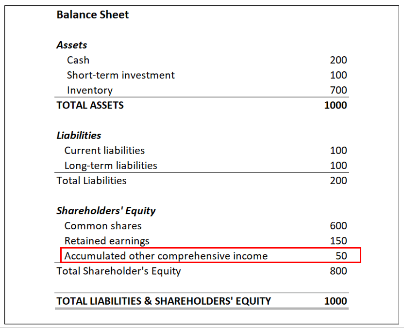

## Table of Contents

## What is accumulated income?

Accumulated income is the total amount of money a person or a business has earned over a period of time. It includes all the money made from different sources like salaries, investments, and business profits. This total is important because it shows how much money has been made before any expenses or taxes are taken out.

People and businesses keep track of their accumulated income to understand their financial health. It helps them see if they are making more money over time or if they need to make changes to increase their earnings. By looking at accumulated income, they can plan for the future, like saving for big purchases or investing in new opportunities.

## How is accumulated income different from regular income?

Accumulated income is all the money you've earned over a long time, like months or years. It's like adding up all your money from different places, such as your job, investments, or a business. Regular income, on the other hand, is the money you get regularly, like your weekly or monthly paycheck. It's what you earn in a shorter time, usually every month or every week.

Think of accumulated income as your total savings account, where you keep adding money over time. Regular income is like the money you put into that account each month. For example, if you get $1000 every month from your job, that's your regular income. But if you've been saving that $1000 for a year, your accumulated income would be $12,000. So, accumulated income helps you see the big picture of your earnings, while regular income shows what you earn in the short term.

## Why is it important to track accumulated income?

Tracking accumulated income is important because it helps you see all the money you've made over time. It's like looking at the total amount in your piggy bank, not just what you put in last week. When you know your accumulated income, you can see if you're getting richer or if you need to find ways to make more money. It's a big picture view that shows you how well you're doing financially.

Also, knowing your accumulated income helps you plan for the future. If you want to buy a house or start a business, you need to know how much money you've saved up. It's like saving up for a big toy; you need to know how much you have before you can buy it. By keeping track of your accumulated income, you can make smart choices about saving, spending, and investing your money.

## Can you provide a simple example of accumulated income?

Imagine you have a lemonade stand. Every day, you make $10 from selling lemonade. That $10 is your regular income for the day. But if you keep track of how much you make over a whole week, that's your accumulated income. If you sell lemonade for 7 days, your accumulated income for the week would be $70.

Now, let's say you want to buy a new bike that costs $200. You need to know how much money you've made over time to see if you can afford it. If you keep selling lemonade for 4 weeks, your accumulated income would be $280. That's enough to buy the bike and have some money left over. By knowing your accumulated income, you can plan to save up for big things you want.

## How does accumulated income affect personal budgeting?

Accumulated income is really important for personal budgeting because it shows you all the money you've made over time. When you know how much money you have saved up, you can make a better plan for how to spend it. For example, if you want to buy a new phone or go on a trip, you need to know if you have enough money saved. By looking at your accumulated income, you can decide if you need to save more or if you can spend some money now.

Also, knowing your accumulated income helps you see if you're doing well with your money. If your accumulated income is going up, it means you're making more money than before. This can make you feel good about your financial choices. But if your accumulated income is not growing, you might need to find ways to earn more money or spend less. By keeping track of your accumulated income, you can make smart choices about your budget and reach your money goals.

## What are the common sources of accumulated income?

Accumulated income comes from many places. The most common source is your job. If you work and get paid every week or month, all that money adds up over time. Another big source is money you make from investments, like stocks or real estate. If you own a piece of a company or a house and it makes money, that adds to your accumulated income. Also, if you have a business, all the profits from that business count towards your accumulated income.

Sometimes, accumulated income can come from other places too. For example, if you get money from the government, like social security or unemployment benefits, that money adds up over time. You might also get money from things like selling stuff you don't need anymore or winning a prize. All these different sources of money come together to make your total accumulated income.

## How is accumulated income reported on financial statements?

Accumulated income is shown on financial statements, like a balance sheet or an income statement. On a balance sheet, it's part of the equity section. This section shows how much money the business has made and kept over time. It's like looking at the total money in your piggy bank. The balance sheet helps people see if the business is doing well by showing how much money it has saved up.

On an income statement, accumulated income is not shown directly. Instead, you see the money the business made in a certain time, like a year. This is called net income. If the business keeps this money instead of spending it, it adds to the accumulated income on the balance sheet. So, the income statement shows the money made recently, and the balance sheet shows all the money saved up over time.

## What are the tax implications of accumulated income?

When you have accumulated income, it can affect how much tax you have to pay. The money you earn from your job, investments, or business is usually taxed when you get it. But if you save that money and it grows over time, you might have to pay taxes on the growth too. For example, if you invest in stocks and they go up in value, you might have to pay capital gains tax when you sell them. The tax rules can be different depending on where you live and what kind of income you have.

It's important to keep track of your accumulated income because it can change how much tax you owe. If you have a lot of money saved up, you might be in a higher tax bracket, which means you pay a higher rate on your income. Also, some types of income, like interest from savings accounts, might be taxed differently than your regular paycheck. By understanding how your accumulated income affects your taxes, you can plan better and maybe find ways to pay less tax.

## How can accumulated income be reinvested to generate more income?

You can use your accumulated income to make more money by putting it back into things that can grow. One way is to invest in stocks or bonds. When you buy stocks, you own a little piece of a company, and if the company does well, the value of your stocks can go up. You can also get money from dividends, which are like little payments companies give to people who own their stocks. Bonds are like loans you give to a company or the government, and they pay you back with interest over time. By using your accumulated income to buy stocks or bonds, you can make more money as they grow in value or pay you interest.

Another way to use your accumulated income is to start or grow a business. If you have a good idea for a business, you can use your saved-up money to buy what you need to get started, like equipment or a place to work. As your business makes money, you can keep some of it to make the business even bigger or better. This can help you make even more money over time. By putting your accumulated income back into things that can grow, like investments or a business, you can keep making more and more money.

## What strategies can be used to maximize accumulated income?

One way to maximize your accumulated income is by saving more of your regular income. Instead of spending all your money, try to put some of it into a savings account or invest it. The more you save, the more your accumulated income will grow over time. You can also look for ways to earn more money, like getting a better job, working extra hours, or starting a side business. By increasing your regular income, you'll have more money to add to your accumulated income.

Another strategy is to invest your accumulated income wisely. You can put your money into things like stocks, bonds, or real estate, which can grow over time and give you more money. It's important to learn about different investments and pick the ones that are right for you. Also, try to keep your expenses low so you can save more of your money. By spending less and investing smartly, you can make your accumulated income grow bigger and bigger.

## How does accumulated income impact long-term financial planning?

Accumulated income is really important for long-term financial planning because it shows you all the money you've saved up over time. When you know how much money you have, you can make better plans for the future. For example, if you want to buy a house or retire early, you need to know if you have enough money saved. By looking at your accumulated income, you can see if you're on track to reach your big goals or if you need to save more.

Also, accumulated income helps you make smart choices about how to use your money. If you see that your accumulated income is growing, it means you're doing well with your money. You can decide to invest some of it to make even more money, or you can use it to pay for big things you want. But if your accumulated income isn't growing, you might need to find ways to earn more or spend less. By keeping track of your accumulated income, you can plan better and make sure you have enough money for the future.

## What are the advanced financial tools used to analyze accumulated income?

One advanced tool to analyze accumulated income is a financial software program. These programs can help you keep track of all your money, including what you've earned over time. They can show you graphs and charts that make it easy to see how your accumulated income is growing. Some programs can even predict how much money you might have in the future if you keep saving and investing the way you are now. This can help you make better plans for things like buying a house or retiring.

Another tool is a financial advisor. A financial advisor is a person who knows a lot about money and can help you understand your accumulated income. They can look at all your money and tell you if you're doing well or if you need to make changes. They can also help you find the best ways to invest your money so it grows even more. By working with a financial advisor, you can get personalized advice that fits your goals and helps you make the most of your accumulated income.

## What is Understanding Accumulated Income?

Accumulated income, commonly referred to as retained earnings, represents a crucial component of a corporation’s financial health. It is the portion of net income that a firm retains rather than distributing it as dividends to shareholders. The importance of accumulated income is multifaceted, impacting a range of strategic, operational, and financial decisions within a corporation.

In terms of accounting, accumulated income is a reflection of a company’s ability to generate earnings and reinvest them productively. On the balance sheet, retained earnings appear under shareholders' equity and are calculated by taking the opening retained earnings balance, adding the net income (or subtracting net loss), and then subtracting any dividends paid out. Mathematically, this can be represented as:

$$
\text{Retained Earnings}_{\text{end}} = \text{Retained Earnings}_{\text{start}} + \text{Net Income} - \text{Dividends}
$$

This formula highlights how accumulated income acts as a bridge between the income statement and the balance sheet, signifying the profit a company decides to reinvest into itself rather than pay out.

From a strategic perspective, accumulated income serves as a critical reserve that provides businesses with the flexibility to allocate funds toward growth opportunities such as capital projects, mergers, or acquisitions without the need to raise additional external capital. It is crucial for capital budgeting decisions—a process wherein businesses evaluate potential major investment or expenditure decisions. Accumulated income can fund projects with as much as or more efficiency than seeking debt financing, given that it minimizes financing costs and avoids interest obligations, thereby preserving the company’s profit margins.

In essence, the strategic use of accumulated income allows businesses to capitalize on investment opportunities that can enhance operational capability, competitiveness, and overall market position. Companies that efficiently manage and utilize their retained earnings often possess a sustained fiscal advantage, enabling them to drive innovation, expand their market reach, and increase shareholder value over time.

## References & Further Reading

[1]: Zuckerman, Gregory. "The Man Who Solved the Market: How Jim Simons Launched the Quant Revolution". Penguin Random House, 2019.

[2]: Patterson, Scott. "The Quants: How a New Breed of Math Whizzes Conquered Wall Street and Nearly Destroyed It." Crown Business, 2010.

[3]: Bergstra, J., Bardenet, R., Bengio, Y., & Kégl, B. (2011). ["Algorithms for Hyper-Parameter Optimization."](https://dl.acm.org/doi/10.5555/2986459.2986743) Advances in Neural Information Processing Systems 24.

[4]: "Advances in Financial Machine Learning" by Marcos Lopez de Prado. Available at [Amazon](https://www.amazon.com/Advances-Financial-Machine-Learning-Marcos/dp/1119482089).

[5]: "Machine Learning for Algorithmic Trading" by Stefan Jansen. Available at [Amazon](https://www.amazon.com/Machine-Learning-Algorithmic-Trading-alternative/dp/1839217715).

[6]: Chan, Ernest P. "Quantitative Trading: How to Build Your Own Algorithmic Trading Business." Available at [Amazon](https://github.com/ftvision/quant_trading_echan_book).

[7]: Aronson, David. "Evidence-Based Technical Analysis: Applying the Scientific Method and Statistical Inference to Trading Signals." Available at [Wiley](https://www.amazon.com/Evidence-Based-Technical-Analysis-Scientific-Statistical/dp/0470008741).