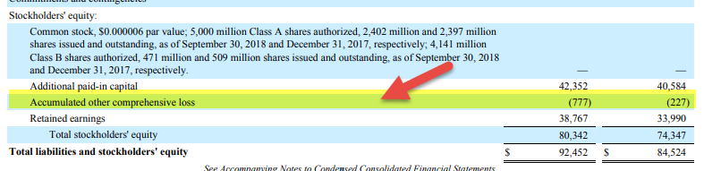

Financial statements are essential tools for businesses and investors, providing a detailed account of a company's financial performance and stability. These documents encompass key components such as the balance sheet, income statement, and cash flow statement, each of which plays a crucial role in depicting the financial health and operational efficiency of a business. Among the various elements highlighted in financial statements, comprehensive income stands out as a significant indicator of a company’s economic performance over a period. Unlike net income, comprehensive income includes all changes in equity from non-owner sources, offering a broader perspective on financial outcomes.

A key element within comprehensive income is Accumulated Other Comprehensive Income (AOCI). AOCI represents components of equity that do not impact net income directly and includes items such as foreign currency adjustments, unrealized gains or losses on certain investments, and pension liabilities. Understanding AOCI and its implications on shareholder equity is critical, as it can signal underlying forces that potentially affect a company's long-term financial health.



Different types of comprehensive income components, including AOCI, illustrate the economic activities that go beyond standard net income calculations. These components often capture the financial impact of market and currency fluctuations, investment revaluations, and other external factors that can substantially influence a firm's financial standing.

Another dimension to consider is algorithmic trading, which utilizes complex algorithms to automate and optimize trading decisions in financial markets. This type of trading relies heavily on accurate and timely financial data, including insights gleaned from financial statements and comprehensive income reports, to make informed trading decisions. By understanding relationships between comprehensive income components and trading strategies, financial experts and algorithmic traders can create more refined models that effectively manage risk and seize market opportunities.

This article aims to clarify and connect these crucial financial concepts—financial statements, AOCI, types of comprehensive income, and algorithmic trading—to provide a comprehensive understanding that enhances financial management and strategic decision-making. Understanding these connections will enable businesses and investors to achieve a more robust financial analysis and formulate more effective business strategies.

## Table of Contents

## Understanding Financial Statements

Financial statements are essential documents that provide a structured representation of a company's financial performance and position. They are primarily composed of four main components: the balance sheet, income statement, cash flow statement, and statement of shareholders' equity. Each component serves distinct purposes and collectively offers a comprehensive overview of a firm's financial health.

The **balance sheet** outlines the company's assets, liabilities, and shareholders' equity at a specific point in time. Assets include current assets, like cash and inventories, and non-current assets, such as property and equipment. Liabilities cover both current liabilities, including accounts payable and short-term debt, and long-term liabilities, like bonds payable. Shareholders’ equity represents the residual interest in the assets of the entity after deducting liabilities, reflecting the net worth of the company.

The **income statement**, also known as the profit and loss statement, evaluates a company's performance over a period, summarizing revenues, expenses, and profits. Here, net income is derived by subtracting total expenses from total revenues, serving as a key indicator of a company's profitability.

The **cash flow statement** shows how changes in the balance sheet accounts and income affect cash and cash equivalents, breaking the analysis down into operating, investing, and financing activities. This statement is crucial for understanding the [liquidity](/wiki/liquidity-risk-premium) and financial flexibility of the business.

The **statement of shareholders' equity** provides insights into the changes in the ownership structure of the company over the reporting period. It includes components like common stock, retained earnings, and accumulated other comprehensive income (AOCI).

The purpose of financial statements extends beyond mere record-keeping. They are vital tools for business operations and decision-making processes, offering insights to investors, creditors, and management. Financial statements aid in assessing the company's economic performance, evaluating management's effectiveness, and making informed predictions about future financial conditions. They are also essential for statutory compliance, ensuring transparency and accountability.

An important concept within these statements is **comprehensive income**, which encompasses all changes in equity during a period, except those resulting from investments by owners and distributions to owners. Comprehensive income includes net income and other comprehensive income (OCI) components like unrealized gains and losses on securities, foreign currency translation adjustments, and pension plan adjustments. This concept has significant importance, as it provides a more holistic view of a company's performance and financial changes that are not fully captured within the confines of net income alone. Consequently, financial analysts and stakeholders gain a deeper understanding of all factors influencing the company's equity, enhancing their strategic decision-making capabilities.

## Accumulated Other Comprehensive Income (AOCI)

Accumulated Other Comprehensive Income (AOCI) represents the portion of total comprehensive income not included in net income. It accounts for revenues, expenses, gains, and losses that are excluded from net income as per Generally Accepted Accounting Principles (GAAP). AOCI is primarily included in the equity section of a company's balance sheet under shareholder equity.

AOCI differs significantly from net income, mainly due to its inclusion of unrealized gains and losses, which do not affect a company’s profit until they are realized. While net income reflects the company's operational profitability over a specific period, AOCI encompasses items that have not yet been settled. For example, fluctuations in market value of investments, foreign currency translations, and changes in pension plan liabilities. These are often due to market conditions or other external factors. Consequently, AOCI provides a more comprehensive view of equity by highlighting potential opportunities or risks that are not yet actualized.

The presence of AOCI on a balance sheet can indicate various underlying movements in a company’s financial health. For instance, substantial unrealized losses within AOCI could signal potential declines in asset value, affecting investor perceptions and future financial performance. Conversely, unrealized gains might suggest upcoming revenue influxes, enhancing future financial strength. Moreover, AOCI entries can serve as a key metric for strategic long-term planning, allowing businesses to gauge future asset or liability adjustments and plan accordingly.

The treatment of AOCI underlines its forward-looking impact on a company's financial landscape. Fluctuations can forecast significant financial changes, necessitating strategic management responses. They play a crucial role in assessing a firm's comprehensive financial status beyond conventional net income metrics. Educational endeavors towards understanding AOCI can therefore contribute significantly to more informed financial decision-making and strategic planning.

## Types of Comprehensive Income

Comprehensive income is an essential part of financial reporting, providing insights into a company's financial performance beyond the traditional net income measure. It encompasses items that do not flow directly through the income statement but affect shareholder equity. The primary components of comprehensive income include foreign currency adjustments, unrealized investment gains or losses, and pension liability adjustments. Understanding these elements is crucial, as they can significantly impact a company's financial health and provide valuable information for stakeholders.

Foreign currency adjustments arise when a company has international operations and needs to consolidate its financial statements into a single reporting currency. Changes in exchange rates can lead to fluctuations in the value of foreign assets and liabilities, which are recorded as adjustments in other comprehensive income. These adjustments are reported separately because they involve unrealized gains or losses due to currency movements rather than actual transactions. When the foreign operations are sold or liquidated, these accumulated adjustments are reclassified to net income, potentially affecting a firm's reported profitability.

Unrealized investment gains or losses pertain to the fluctuations in the market value of available-for-sale investments. Companies hold securities not intended for immediate sale, and changes in their market value are recognized in comprehensive income. This approach ensures that these value changes do not affect net income until the investments are sold. Upon realization, the gains or losses are transferred from accumulated other comprehensive income to net income, impacting the income statement for the period of realization. For example, a significant increase in the market value of a company's equity investments could bolster the equity section of the balance sheet without impacting net income until the investments are sold.

Pension liability adjustments are another significant component of comprehensive income. These adjustments arise from changes in actuarial assumptions or the actual return on plan assets differing from expected returns. When a company sponsors a defined benefit pension plan, it must periodically assess its pension obligations and fund status. Variances between expected and actual returns, along with changes in actuarial assumptions, are captured in other comprehensive income to provide a clearer picture of a firm's pension commitments. They are excluded from net income to avoid short-term [volatility](/wiki/volatility-trading-strategies) in financial results. Over time, as actuarial gains and losses are amortized, these adjustments can impact net income.

Separating these items in comprehensive income prevents temporary volatility from distorting a company's operational performance as reflected in net income. For stakeholders, comprehensive income provides a more comprehensive view of a firm's economic activities and potential risks. In financial reporting, it enhances transparency and ensures that the firm's equity reflects the aggregated effects of these various financial events. For example, a company with substantial foreign currency adjustments may indicate significant exposure to currency risk, impacting future cash flows and strategic decisions.

In conclusion, components of comprehensive income such as foreign currency adjustments, unrealized investment gains/losses, and pension liability adjustments play critical roles in financial reporting. They offer a nuanced view of a company's financial position and impediments to performance, highlighting the importance of separating these items from net income to maintain clarity and accuracy in financial statements.

## Algorithmic Trading and Financial Statements

Algorithmic trading, often referred to as algo trading, is a method of executing trades using automated and pre-programmed trading instructions. These algorithms consider variables such as time, price, and [volume](/wiki/volume-trading-strategy), allowing for optimal execution strategies with minimal human intervention. In modern financial markets, [algorithmic trading](/wiki/algorithmic-trading) accounts for a significant portion of total trading volume. Its relevance stems from its ability to exploit market inefficiencies, enhance liquidity, reduce transaction costs, and execute high-frequency trading strategies that would be impossible for human traders to perform individually due to speed and computational demands.

Financial statements play a crucial role in the development and assessment of trading algorithms. These documents, which include income statements, balance sheets, and statements of cash flows, offer vital data about a company's financial position, performance, and cash flows. Algo trading systems often ingest this data to gauge market sentiment, detect financial trends, and make predictions about future stock prices.

Comprehensive income components within financial statements significantly influence trading strategies and risk assessments. For instance, items such as foreign currency adjustments and unrealized gains or losses on investments may indicate potential volatility in a firm's financials. An algorithmic trading model might incorporate these components by adjusting the predictive models to accommodate shifts in company valuation or expected profitability.

Consider the use of Python to illustrate an example algorithm:

```python
import pandas as pd

# Load financial data
data = pd.read_csv('financial_statements.csv')

# Identify comprehensive income components
comprehensive_income = data['unrealized_gains_losses'] + data['foreign_currency_adjustments']

# Set thresholds for trading strategy
threshold = comprehensive_income.mean()

# Generate trade signals based on comprehensive income components
data['trade_signal'] = comprehensive_income.apply(lambda x: 'Buy' if x > threshold else 'Sell')
```

Such a trading algorithm assesses comprehensive income components to determine buy or sell decisions, revealing how AOCI and other elements could influence market predictions.

In risk assessment, understanding comprehensive income helps identify financial health beyond basic net income metrics. If an unexpected loss from the AOCI category threatens future earnings stability, algorithmic models need adjustment to reflect these risk implications. Algorithms can dynamically respond to these risk indicators by incorporating triggers that recalibrate the risk profile or hedge against unfavorable outcomes.

By integrating comprehensive income data, algorithmic trading systems can enhance their performance by making more informed, data-driven decisions. This capability enables traders to identify trading opportunities linked with comprehensive income trends and manage risks associated with potential adverse movements in financial markets.

## The Intersection of Comprehensive Income, AOCI, and Algo Trading

Accumulated Other Comprehensive Income (AOCI) holds substantial relevance for algorithmic trading, given its ability to reveal potential opportunities or risks through its components, such as foreign currency adjustments, unrealized investment gains or losses, and pension liability adjustments. A trading algorithm cognizant of these AOCI elements can respond to market signals more astutely, potentially enhancing trading decisions and risk management.

**AOCI and Trading Signals:**

AOCI provides insights beyond immediate earnings, offering a more comprehensive understanding of a company’s financial situation. For instance, significant fluctuations in foreign currency translation adjustments within AOCI may suggest exposure to currency risk, warranting a closer evaluation by traders. Such information can be pivotal in creating hedging strategies or predicting the market behavior of multinational corporations.

Changes in AOCI accounts related to unrealized gains or losses on investments also act as bellwethers. A significant increase in unrealized gains could signal a potential future realignment of net income when these gains are eventually realized, affecting stock valuation and investor sentiment.

**Integrating Comprehensive Income in Algorithmic Models:**

Algorithmic trading systems can be designed to incorporate AOCI and comprehensive income data to fine-tune trading strategies. For example, an algorithm could be configured to assess the volatility index of AOCI components and adjust trading positions accordingly. Here is a simple Python pseudocode snippet that outlines how an algorithm might incorporate comprehensive income data:

```python
def adjust_trading_position(aoci_data):
    risk_weight = calculate_risk_weight(aoci_data)
    position_size = base_position * (1 - risk_weight)

    if aoci_data['foreign_currency_adjustments'] > threshold:
        position_size *= 0.9  # Increase protective measures

    if aoci_data['unrealized_gains'] > threshold:
        position_size *= 1.1  # Capitalize on potential future profits

    execute_trade(position_size)

def calculate_risk_weight(aoci_data):
    # Simple calculation for demonstration purposes
    return (aoci_data['volatility_index'] / 100)

# Example usage
aoci_example = {'foreign_currency_adjustments': 120000,
                'unrealized_gains': 250000,
                'volatility_index': 15}
adjust_trading_position(aoci_example)
```

**Hypothetical Scenarios:**

Consider a multinational corporation experiencing drastic shifts in currency translation adjustments within its AOCI. An algorithm designed to capitalize on currency volatility would flag this as a potential risk, prompting a review of currency hedging tactics. Conversely, should an uptick in unrealized gains from investment securities be detected, a trading system might decide to increase exposure to these assets in anticipation of future gains being realized, boosting net income.

Moreover, pension liability adjustments can also provide critical insights. A sudden increase in unrecognized pension losses within AOCI may suggest longer-term financial challenges, leading an algorithm to reduce investment exposure to such an entity or short its stock.

In summary, integrating comprehensive income and AOCI components into algorithmic trading models augments the trader’s ability to preempt potential market movements based on a deeper financial analysis. This integration showcases the power of comprehensive income data in refining trading strategies and managing financial risks effectively.

## Conclusion

The interconnected nature of financial statements, accumulated other comprehensive income (AOCI), comprehensive income types, and algorithmic trading underscores the importance of a holistic approach to financial analysis. Financial statements serve as the backbone of financial reporting, providing critical insights into a company's financial health and operational efficiency. Within these statements, AOCI emerges as a key component of shareholders' equity, capturing elements like unrealized gains and losses, foreign currency adjustments, and pension liability changes. This nuanced separation of comprehensive income from net income ensures that stakeholders have a clearer picture of a company's financial position and potential future performance.

Comprehensive income, including its various types, plays a crucial role in financial strategy and decision-making by highlighting areas that may not immediately impact net income but can significantly affect a company’s equity. This broader perspective allows businesses to anticipate risks and opportunities, facilitating more informed strategic choices.

Algorithmic trading leverages the data from financial statements to refine trading strategies, optimize risk management, and identify potential market inefficiencies. By integrating comprehensive income components into trading algorithms, traders can develop more sophisticated models that better capture the underlying financial realities of the entities they invest in.

For thoughtful financial management, understanding these interconnections is vital. Analysts and strategists who grasp the nuances of financial statements, AOCI, and comprehensive income can craft superior models and strategies to navigate complex market environments. As the landscape of financial markets evolves with advancements in algorithmic trading, mastering these concepts will empower practitioners to optimize financial performances and seize market opportunities more effectively. Readers are encouraged to explore each concept further, allowing them to fully leverage their potential in real-world financial practice.

## References & Further Reading

[1]: Bergstra, J., Bardenet, R., Bengio, Y., & Kégl, B. (2011). ["Algorithms for Hyper-Parameter Optimization."](https://dl.acm.org/doi/10.5555/2986459.2986743) Advances in Neural Information Processing Systems 24.

[2]: ["Advances in Financial Machine Learning"](https://www.amazon.com/Advances-Financial-Machine-Learning-Marcos/dp/1119482089) by Marcos Lopez de Prado

[3]: ["Evidence-Based Technical Analysis: Applying the Scientific Method and Statistical Inference to Trading Signals"](https://www.amazon.com/Evidence-Based-Technical-Analysis-Scientific-Statistical/dp/0470008741) by David Aronson

[4]: ["Machine Learning for Algorithmic Trading"](https://github.com/stefan-jansen/machine-learning-for-trading) by Stefan Jansen

[5]: ["Quantitative Trading: How to Build Your Own Algorithmic Trading Business"](https://www.amazon.com/Quantitative-Trading-Build-Algorithmic-Business/dp/1119800064) by Ernest P. Chan