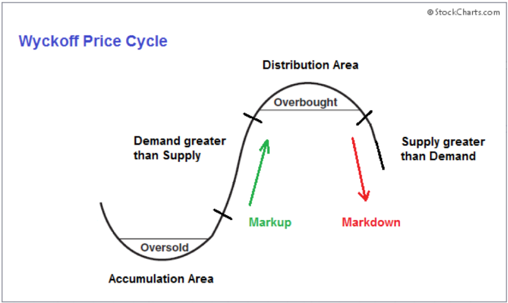

The stock market offers numerous opportunities for both seasoned and novice investors, each aiming to maximize returns and achieve financial success. An effective investment strategy is pivotal for navigating the market's complexities, ensuring that investors can capitalize on opportunities while mitigating risks. Two popular approaches among investors are accumulating shares and leveraging algorithmic trading. Accumulating shares involves the consistent purchase of stock over time, enabling investors to benefit from long-term growth and the power of compounding. In contrast, algorithmic trading employs sophisticated computer programs to execute trades at speeds beyond human capability, based on predefined criteria or market signals.

This article will explore different dimensions of stock market investment strategies, including the advantages and challenges associated with accumulating shares and algorithmic trading. By assessing these strategies' fundamental concepts, we aim to provide insights into their potential effectiveness and how they can be integrated for optimal returns. Through a balanced exploration, investors can better understand these strategies and how they fit into a broad investment portfolio.



## Table of Contents

## Understanding Investment Strategies

Investment strategies in the stock market vary significantly, allowing investors to adopt approaches that align with their financial goals and risk tolerance. These strategies range from aggressive to conservative, each with distinctive attributes concerning risk assessment and potential returns.

Risk assessment is fundamental to any investment strategy, as it helps investors understand the potential for both gain and loss associated with their investments. Risk is typically quantified in terms of volatility, commonly measured by the standard deviation of returns, and the potential for loss or gain over a specific time frame. The balance between risk and return is often expressed through the risk-reward ratio, guiding investors in evaluating their investment choices.

A diversified investment strategy minimizes risk by spreading investments across various asset classes, sectors, or geographies. This approach mitigates the impact of any single asset's poor performance on the overall portfolio. Diversification can be mathematically summarized by the formula for portfolio variance:

$$
\sigma^2_p = \sum (w_i^2 \cdot \sigma_i^2) + \sum \sum (w_i \cdot w_j \cdot \text{Cov}(i, j))
$$

where $w_i$ is the weight of each asset in the portfolio, $\sigma_i^2$ is the variance of each asset, and $\text{Cov}(i, j)$ is the covariance between assets $i$ and $j$.

The buy-and-hold strategy involves purchasing stocks and holding them over an extended period, often irrespective of market fluctuations. This strategy is based on the belief that, despite short-term market [volatility](/wiki/volatility-trading-strategies), stock markets historically tend to rise over the long term. By avoiding frequent trading, investors can minimize transactional costs and benefit from compounding returns.

Active trading, on the other hand, seeks to capitalize on short-term price movements. This approach involves frequent buying and selling of stocks to extract profits from fluctuations in stock prices. Active traders often use technical analysis, which involves chart patterns and trading signals, to make informed trades.

Accumulating shares, a subset of the buy-and-hold strategy, involves systematic purchasing of stocks over time. This approach allows investors to amass shares gradually, often benefiting from dollar-cost averaging—a method that reduces the impact of market volatility by buying fixed dollar amounts of an investment regularly, regardless of its share price.

Algorithmic trading, or algo trading, applies computer algorithms to execute trades based on predetermined criteria. These strategies can take advantage of mathematical models and statistical analyses to identify trading opportunities more quickly and efficiently than traditional methods. Algorithmic trading fits within active trading strategies, focusing on speed and the ability to handle complex calculations to assess market trends.

Understanding how accumulating shares and [algorithmic trading](/wiki/algorithmic-trading) fit into these broader investment strategies is crucial. Accumulating shares often appeals to those preferring a conservative, long-term growth approach. In contrast, algorithmic trading is suited for those seeking aggressive, short-term gains by leveraging technology for rapid decision-making and execution. Each strategy has its place and can complement others when building a diversified investment portfolio.

## Accumulating Shares: A Strategic Approach

Accumulating shares is a fundamental investment strategy that involves systematically purchasing stocks over a period of time, irrespective of market fluctuations. This approach is often employed by long-term investors who seek to benefit from the compounding effect and the potential appreciation of stock value over time.

One of the main advantages of accumulating shares is its simplicity. By investing a fixed amount regularly, investors can often purchase more shares when prices are low and fewer shares when prices are high, effectively dollar-cost averaging their investments. This method can reduce the impact of market volatility on the overall investment portfolio. For instance, if an investor allocates a fixed budget monthly to buy shares of a particular stock, they naturally acquire more shares when the market dips, potentially positioning themselves for gains as the market recovers.

Another key benefit of accumulating shares is the potential for long-term growth. Stocks historically have the potential to appreciate in value, although they [carry](/wiki/carry-trading) inherent risks. By maintaining a steady investment schedule, investors can harness the power of compounding returns. This compounding is further amplified when dividends received from these stocks are reinvested to purchase additional shares. Reinvestment of dividends can significantly impact the total return of an investment portfolio over time.

The tax implications of reinvesting dividends may vary based on the investor's jurisdiction. In many cases, dividends are taxable in the year they are received. However, reinvesting dividends doesn't usually create any additional tax liability when the reinvestment occurs. In countries like the United States, qualified dividends might be taxed at a lower rate compared to ordinary income, making them an efficient form of investment income.

To illustrate the impact of dividend reinvestment, consider a hypothetical investment in a stock with an annual dividend yield of 3%. If an investor holds 100 shares valued at $50 each, their initial investment is $5,000. By reinvesting dividends, the number of shares will increase over time, assuming the stock maintains its price and yield:

```python
initial_investment = 5000
annual_dividend_yield = 0.03
stock_price = 50
shares_held = initial_investment / stock_price

# Simulate reinvestment over 10 years
for year in range(1, 11):
    dividends = shares_held * stock_price * annual_dividend_yield
    additional_shares = dividends / stock_price
    shares_held += additional_shares
    print(f"Year {year}: Shares Held = {shares_held:.2f}")
```

In summary, accumulating shares is a straightforward investment strategy that offers the benefits of simplicity and potential for substantial long-term growth. Through regular contributions and reinvestment of dividends, investors can effectively compound their wealth while navigating the inherent risks of stock market fluctuations.

## Algorithmic Trading: The Modern Method

Algorithmic trading, commonly referred to as algo trading, employs sophisticated computer algorithms to automatically execute trades in financial markets. These algorithms are designed to identify and capitalize on emerging trading opportunities by analyzing vast amounts of market data and executing orders based on pre-defined criteria much quicker than a human trader could.

One primary advantage of algorithmic trading is its capability to process data with remarkable speed and precision, thus identifying optimal entry and [exit](/wiki/exit-strategy) points for trades more efficiently than manual trading methods. This automation eliminates human emotions from trading decisions, reducing errors attributable to psychological biases.

Several algo trading strategies have been developed to leverage different market conditions:

1. **Trend Following**: This strategy involves algorithms that detect and exploit sustained market moves in a particular direction. The algorithm typically uses indicators such as moving averages to gauge trends and execute trades in the trend's direction. The simplicity of trend following lies in the belief that prices will continue moving in the trend direction more often than reversing.

2. **Mean Reversion**: Mean reversion strategies operate on the assumption that asset prices will revert to their historical averages over time. Algorithms identify overbought or oversold conditions by analyzing price deviations from their average values, prompting trades that benefit from eventual price correction. Indicators like the Relative Strength Index (RSI) and Bollinger Bands are often used in these strategies.

3. **Arbitrage**: Arguably one of the most popular algo trading strategies, arbitrage takes advantage of price discrepancies in different markets or instruments. By automatically executing simultaneous buy and sell orders, algorithms lock in a risk-free profit before the price difference is corrected. High-frequency trading often leverages arbitrage opportunities due to its ability to react swiftly to market changes.

Algorithmic trading not only enhances trading speed and efficiency but also allows traders to engage in multiple markets concurrently without the distraction of emotional biases. However, successful implementation requires a robust technological infrastructure and ongoing strategy refinement to adapt to evolving market conditions.

## Benefits and Challenges of Algo Trading

Algorithmic trading, often known as algo trading, leverages computer programs to perform trading decisions at speeds and frequencies impossible for humans. This approach has garnered attention for its ability to enhance the trading process in various ways.

One of the primary benefits of algorithmic trading is its speed. Algorithms can process vast amounts of market data across multiple platforms within milliseconds. This rapid data analysis enables them to identify optimal trading opportunities ahead of traditional methods, which rely on human intervention. The speed advantage allows traders to capitalize on slight price discrepancies and execute large [volume](/wiki/volume-trading-strategy) trades efficiently.

In addition to speed, algo trading provides significant accessibility to multiple markets. Through sophisticated algorithms, traders can engage in simultaneous trading activities across different global markets. This broad market reach opens up diverse opportunities for profit and helps in risk distribution.

Precision and reduced emotional bias are also significant advantages of algorithmic trading. Since the programs follow pre-set rules, they execute trades with high precision, reducing the potential for human error. Moreover, the automated nature of this strategy eliminates emotional decision-making, a common challenge for human traders that often leads to suboptimal outcomes.

Despite these benefits, algo trading is not without challenges. The initial setup of an algorithmic trading system can be substantial, requiring advanced technical skills and significant financial investment. Ensuring that these systems remain effective involves ongoing monitoring and refinement, as they require constant adjustments to align with ever-changing market conditions.

Furthermore, potential pitfalls such as overfitting and market volatility present challenges that traders must address. Overfitting occurs when an algorithm is too closely tailored to historical data, potentially leading to subpar performance in real-time trading. Market volatility can also affect algorithmic performance, as sudden and unpredictable market movements might lead the algorithms to execute trades that result in losses.

In conclusion, while algorithmic trading offers substantial advantages, including speed, precision, and broad market accessibility, it also demands careful consideration of its initial and ongoing setup. Traders need to be vigilant about algorithm maintenance and understand the risks associated with market volatility and overfitting to effectively harness the potential of this trading strategy.

## Integrating Strategies for Optimal Returns

Integrating accumulating shares with algorithmic trading presents a strategic blend that can effectively diversify risk and maximize returns for investors. This integrated approach capitalizes on both the stability of long-term investments and the agility of short-term market adjustments.

Accumulating shares is traditionally viewed as a long-term strategy. By consistently purchasing stocks over time, investors potentially benefit from compounding returns and stock dividends. This method suits those seeking gradual growth with minimized focus on daily market fluctuations. It also provides tax advantages, especially when dividends are reinvested, allowing the power of compound interest to enhance the growth of the investment.

Conversely, algorithmic trading introduces a dimension of speed and precision that complements the long-term horizon of share accumulation. Algorithms, free from emotional bias, can swiftly execute trades based on market data analysis, taking advantage of short-term market inefficiencies. This capability allows investors to generate income from short-term price swings, which can be used to further fund the accumulation of shares.

By integrating these two strategies, investors create a balanced portfolio approach. Algorithmic trading caters to immediate opportunities for profit that can be volatile and unpredictable. At the same time, the systematic acquisition of shares ensures that investors are building a stable asset base over time, capable of weathering market downturns. This hybrid strategy not only leverages the strengths of both short-term and long-term investments but also provides flexibility to adapt to evolving market conditions.

Consider the scenario: an investor uses algorithmic trading to capture gains from market volatility. The profits derived from these short-term trades can then be reinvested into accumulating more shares, maintaining a steady growth trajectory. This reinvestment cycle promotes capital growth while the risk is managed through diversification across different investment strategies.

In summary, the integration of accumulating shares with algorithmic trading creates an adaptable and resilient investment framework. It provides investors with the means to seize immediate market opportunities while securing the foundation of their financial portfolio through long-term share accumulation. This balanced approach diminishes the weaknesses inherent in each individual strategy and enhances the potential for optimized returns.

## Key Takeaways

Investment strategies in the stock market offer a wide range of options, each tailored to different financial objectives and risk tolerances. Two prominent strategies that stand out are accumulating shares and algorithmic trading, each with its own distinct advantages and potential risks. 

Accumulating shares is a strategy prized for its straightforward nature and potential for long-term growth. By consistently purchasing stocks over time, investors can benefit from compounding as they accumulate more shares. This method typically appeals to those looking for simplicity and a less hands-on approach to investing. The reinvestment of dividends—a common practice in this strategy—not only enhances stock accumulation but can also provide tax advantages, such as the potential for deferred tax liabilities, depending on the investor's jurisdiction.

On the other hand, algorithmic trading represents a modern, data-driven approach that leverages advanced technologies to identify and execute trading opportunities at an impressive speed. This strategy minimizes emotional biases through automation and can efficiently manage numerous trades across various markets in real-time. However, it necessitates a substantial initial setup in terms of technology and expertise. It also requires diligent monitoring to prevent common pitfalls like overfitting or adverse impacts from market volatility.

A comprehensive investment strategy might wisely incorporate elements from both of these approaches. By blending the steady accumulation of shares with the dynamic precision of algorithmic trading, investors can balance risk while optimizing returns. This integration allows for harnessing the benefits of both long-term growth and short-term gains, crafting a robust and adaptable investment portfolio.

## Conclusion

Developing a comprehensive understanding of various investment strategies is crucial for success in the stock market. As investors navigate through the complexities of financial markets, recognizing the value and limitations of each strategy can significantly influence their portfolio's performance.

Accumulating shares is one of the most straightforward strategies available to investors. This approach involves steadily increasing one's holdings in a particular stock over time. It is often praised for its simplicity and potential to yield substantial long-term gains. By regularly purchasing shares, investors can take advantage of compounding returns, where the dividends earned are reinvested to purchase more shares, thus fostering exponential portfolio growth. This method not only benefits from the power of compounding but also tends to mitigate the emotional volatility associated with attempting to time the market.

On the other hand, algorithmic trading provides a modern, technologically advanced methodology for investors. By utilizing computer programs to execute trades based on pre-set criteria, algo trading offers precision and speed far beyond human capabilities. The principal advantage of this strategy lies in its ability to swiftly analyze vast quantities of data and react to market conditions without the influence of human emotions. This results in higher efficiency and the capability to exploit short-term market opportunities effectively.

The combination of accumulating shares and algorithmic trading can provide robust investment returns while mitigating risks. By integrating these two strategies, investors can achieve a balanced approach, where long-term goals are allied with the agility to capitalize on short-term market movements. This diversified methodology helps in managing risk more effectively by hedging against the volatility inherent in stock markets.

In conclusion, mastering both traditional and advanced investment strategies enhances an investor's capacity to build a resilient and profitable portfolio. Accumulating shares and employing algorithmic trading each have unique strengths, and their combined application can significantly strengthen an investor's market position. This hybrid strategy is particularly beneficial for those seeking both stability and growth in their financial ventures.

## References & Further Reading

[1]: Bergstra, J., Bardenet, R., Bengio, Y., & Kégl, B. (2011). ["Algorithms for Hyper-Parameter Optimization."](https://dl.acm.org/doi/10.5555/2986459.2986743) Advances in Neural Information Processing Systems 24.

[2]: ["Advances in Financial Machine Learning"](https://www.amazon.com/Advances-Financial-Machine-Learning-Marcos/dp/1119482089) by Marcos Lopez de Prado

[3]: ["Evidence-Based Technical Analysis: Applying the Scientific Method and Statistical Inference to Trading Signals"](https://www.amazon.com/Evidence-Based-Technical-Analysis-Scientific-Statistical/dp/0470008741) by David Aronson

[4]: ["Machine Learning for Algorithmic Trading"](https://github.com/stefan-jansen/machine-learning-for-trading) by Stefan Jansen

[5]: ["Quantitative Trading: How to Build Your Own Algorithmic Trading Business"](https://www.amazon.com/Quantitative-Trading-Build-Algorithmic-Business/dp/1119800064) by Ernest P. Chan