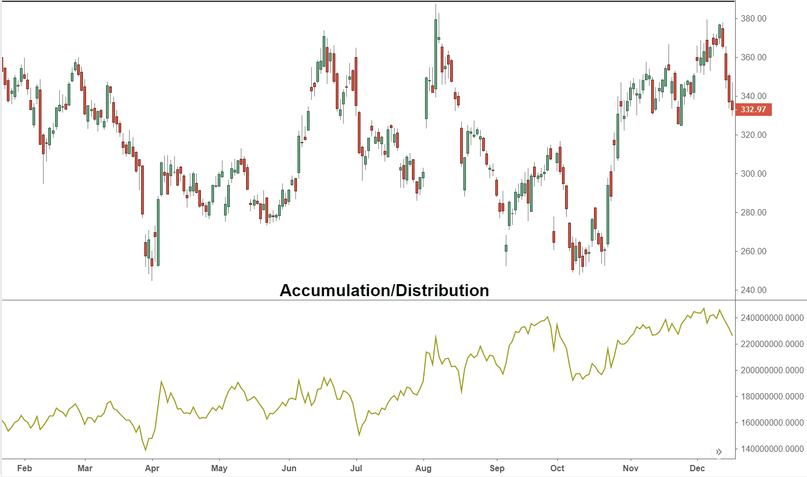

In the world of stock trading, technical analysis is a vital tool for making informed decisions. By examining past market data, particularly price and volume, traders can identify patterns and forecast potential future movements. Among the key components of technical analysis is the concept of the accumulation area, which is particularly significant for understanding market dynamics.

An accumulation area on a price chart reflects a period where the asset's price remains stable despite substantial trading volume. This stability often indicates that institutional investors are amassing large quantities of a stock, preparing for a prospective price surge. Recognizing these zones offers traders a strategic advantage, enabling them to enter positions in anticipation of upward movements.



Understanding accumulation areas can significantly enhance trading strategies. When combined with algorithmic trading, which employs computer programs to execute trades based on predefined criteria, traders can execute swift and precise trades. Algorithmic trading techniques can be adapted to detect changes in accumulation zones promptly, boosting the efficiency and profitability of trades.

This article will explore the fundamental elements of accumulation areas and investigate how they can be integrated with technical analysis and algorithmic trading to optimize trading strategies. By leveraging these insights, traders can make more informed decisions and better navigate the complexities of the stock market.

## Table of Contents

## Understanding the Accumulation Area

The accumulation area is an essential concept within technical analysis, often represented on a stock's price chart by a period where the price moves within a narrow range despite substantial trading volume. This phase generally indicates that institutional investors are purchasing large quantities of a stock, setting the stage for a potential future price increase. The significance of identifying accumulation areas cannot be overstated, as they can provide traders with opportunities to enter the market at a strategic point before a significant upward price movement occurs.

During an accumulation phase, the market often experiences relatively stable price fluctuations. This stability can be attributed to the equilibrium between buying and selling pressures, where the demand generated by institutional investors offsets the selling activities of other market participants. The concept of accumulation stems from Wyckoff's market cycle theory, where each phase reflects different market activities such as accumulation, markup, distribution, and markdown.

To effectively identify accumulation areas, traders often rely on specific chart patterns and technical indicators. Common patterns associated with accumulation include the "basing pattern", where the stock price moves sideways, and the "rounded bottom", which is characterized by a gradual transition from a downtrend to an uptrend. Additionally, technical indicators such as the Accumulation/Distribution (A/D) line and Volume Price Trend (VPT) can provide insights into whether a stock is in an accumulation phase. These indicators leverage the relationship between price and [volume](/wiki/volume-trading-strategy) to assess the strength of buying or selling pressure.

Understanding and recognizing accumulation areas is crucial for traders who aim to purchase stocks before a significant price increase occurs. By entering the market during an accumulation phase, traders can position themselves advantageously, allowing them to benefit from the subsequent price surge once the accumulation phase transitions into a markup phase. This strategic entry point can potentially lead to enhanced profitability, especially when combined with a comprehensive analysis of broader market conditions and trends.

## Technical Analysis in Stock Trading

Technical analysis is a methodology that allows traders to evaluate assets and make informed trading decisions by studying past market data, primarily price and volume. This technique assumes that all known information is reflected in the price and that prices move in trends over time. By analyzing historical patterns, traders can forecast future price movements and identify potential trading opportunities.

One fundamental aspect of technical analysis is understanding the accumulation and distribution phases, which appear on charts as periods of price stabilization or [volatility](/wiki/volatility-trading-strategies). The accumulation phase indicates that major investors are purchasing extensively, creating a price floor, whereas the distribution phase suggests extensive selling, which could lead to a price decline. Recognizing these phases helps traders anticipate market movements more effectively.

In technical analysis, various tools and indicators are employed to discern patterns and trends, assisting traders in decision-making processes. One such indicator is the Accumulation/Distribution (A/D) line, which merges price and volume data to evaluate whether a stock is being accumulated or distributed. The A/D line calculates a running total, adding or subtracting a fraction of the daily volume determined by the relationship between the closing price and the range for the period.

The formula for the A/D line is:

$$
\text{A/D Line} = \sum \left( \frac{(C - L) - (H - C)}{H - L} \times V \right)
$$

where:
- $C$ is the close price,
- $H$ is the high price,
- $L$ is the low price,
- $V$ is the volume.

To track accumulation activities effectively, traders look for divergences between the price movement and the A/D line. If the price of an asset is trending upwards but the A/D line is declining, it may signal the underlying weakness, implying a potential reversal. Conversely, if the price is falling but the A/D line is rising, it may suggest accumulation and a forthcoming upward move.

Technical analysis is enhanced by utilizing software that provides real-time data and supports the integration of complex indicators like the A/D line. The advancement of technology facilitates precise and swift analyses, allowing traders to respond promptly to market developments. By leveraging these tools, traders can not only follow trends but also anticipate shifts in market sentiment, aligning their strategies accordingly.

## Accumulation/Distribution Indicator (A/D)

The Accumulation/Distribution Indicator (A/D) is an essential tool in technical analysis, aimed at highlighting whether a stock is under accumulation or distribution. This indicator integrates price and volume, providing insights into market trends and potential reversals.

The A/D indicator is calculated by considering the relationship between a stock's closing price and its trading range, in conjunction with its volume. The formula for the A/D line is as follows:

$$

A/D = \sum_{i=1}^{n} \left( \frac{{(C_i - L_i) - (H_i - C_i)}}{{H_i - L_i}} \times V_i \right)
$$

Where:
- $C_i$ is the closing price of the period.
- $L_i$ is the low price of the period.
- $H_i$ is the high price of the period.
- $V_i$ is the volume of the period.

This formula computes a running total, or cumulative line, illustrating the flow of money into or out of a security. An upward sloping A/D line indicates that there is more accumulation than distribution, suggesting potential bullish trends. Conversely, a downward sloping A/D line signifies that distribution is outpacing accumulation, indicating bearish tendencies.

Understanding divergences between price movement and volume flow is crucial for effectively utilizing the A/D indicator. A divergence occurs when the price of a stock moves in a direction opposite to the A/D line. For instance, if the stock price is rising while the A/D line is falling, it may signal a bearish reversal is on the horizon, as the increase in price might not be supported by the underlying volume. On the other hand, if a stock’s price is decreasing while the A/D line is rising, it could imply a bullish reversal, indicating accumulation despite the price decline.

Overall, the A/D indicator serves as a vital analytical tool for investors and traders, providing valuable insights into market dynamics that pure price analysis might overlook.

## Algorithmic Trading and Accumulation Areas

Algorithmic trading utilizes sophisticated computer algorithms to execute trades automatically based on predefined strategies and criteria. These algorithms are designed to analyze vast amounts of market data in real-time, identify trading opportunities, and execute trades at optimal times. One significant advantage of [algorithmic trading](/wiki/algorithmic-trading) is its ability to efficiently recognize and capitalize on accumulation areas in the market—periods when a stock's price remains stable despite increasing buying volumes, suggesting institutional investors are quietly acquiring shares in anticipation of future price gains.

Incorporating algorithms that can accurately detect these accumulation zones enhances trading efficiency and profitability. For example, algorithms can be programmed to monitor price and volume patterns continuously. By employing technical indicators like the Accumulation/Distribution (A/D) indicator, moving averages, or even [machine learning](/wiki/machine-learning) models, these algorithms identify signs of accumulation.

An algorithm designed to detect accumulation areas might begin by analyzing historical price data to establish baseline parameters for what constitutes stable price movement and high trading volume for a particular stock. A moving average formula, such as:

$$
MA = \frac{1}{n} \sum_{i=0}^{n-1} P_{i}
$$

could be used to smooth out price data and highlight periods of stability, where $P_{i}$ is the price at time $i$ and $n$ is the period.

Once these parameters are set, the algorithm can monitor live data streams, using these thresholds to detect deviations that might indicate an accumulation zone. Python, a popular programming language for algorithmic trading, can be employed to develop such an algorithm. Consider a simple example using the Pandas library to implement a moving average strategy:

```python
import pandas as pd

def moving_average(data, window_size):
    return data.rolling(window=window_size).mean()

data = pd.Series([...]  # assume this is your time series of stock prices

ma = moving_average(data, window_size=20)

# Detect areas where price is stable around the moving average with increased volume.
```

The algorithm can place trades when the conditions for an accumulation area are met, automatically executing buy orders to capitalize on the expected upward price movement. Additionally, the algorithm can be configured to adjust its trading strategy as market conditions change, allowing for adaptive responses to new information.

While the primary goal is to enter the market at advantageous points, algorithmic trading systems must also be equipped with robust risk management protocols to safeguard against potential market fluctuations and unexpected economic events. This balance helps enhance performance while mitigating exposure to risk, making algorithmic trading in accumulation areas a powerful tool for modern traders.

## Advantages and Disadvantages

Identifying accumulation areas through technical analysis offers traders the opportunity to recognize strategic entry points. These areas often signal the accumulation of stocks by large-scale institutional investors before an anticipated price escalation. By entering the market during these phases, traders have the potential to maximize profits, as they can purchase stocks at lower prices before a significant uptick. This advantage is particularly pronounced when technical indicators such as the Accumulation/Distribution (A/D) line signal a divergence from conventional price trends, suggesting that an accumulation is underway despite the absence of immediate price movement.

Nevertheless, relying solely on accumulation areas through technical analysis carries inherent risks. External economic factors, including macroeconomic events, geopolitical developments, and unexpected market news, can significantly alter stock behaviors, rendering traditional accumulation patterns less predictable. For instance, a sudden [interest rate](/wiki/interest-rate-trading-strategies) change or an unexpected earnings report can prompt rapid market shifts, disrupting the accumulation phase and leading to an unforeseen price correction or volatility spike.

Balancing algorithmic and discretionary trading approaches can help in mitigating these risks. Algorithmic trading, with its ability to process large data sets and execute trades at high speed, allows traders to respond swiftly to changes detected in accumulation areas. Algorithms can be programmed to identify specific patterns or indicators related to accumulation areas, enabling automated response to market conditions. On the other hand, discretionary trading provides the qualitative assessment required to interpret broader market contexts that algorithms might overlook. Traders can use their intuition and experience to make judgment calls when unpredictable market events occur, offering a layer of adaptability that complements algorithmic precision.

For example, traders could use a Python script to automate the detection of potential accumulation zones:

```python
import pandas as pd
import talib as ta

# Load the stock data
data = pd.read_csv('stock_data.csv')

# Calculate the Accumulation/Distribution Line
data['A/D Line'] = ta.AD(data['High'], data['Low'], data['Close'], data['Volume'])

# Identify the accumulation area where the A/D Line is trending upwards
accumulation_zone = data[(data['A/D Line'].diff() > 0) & (data['Close'] < data['Close'].shift(-1))]

print("Potential Accumulation Zone:")
print(accumulation_zone)
```

Overall, while the identification of accumulation areas can result in strategic trading advantages, it requires a nuanced approach that considers both technological and human judgment to navigate the complexities of ever-changing market dynamics.

## Conclusion

Accumulation areas represent a crucial aspect of technical analysis, providing pivotal insights into the trading behaviors of institutional investors. These zones reveal patterns of large-scale purchasing activity that often precede significant price movements. By recognizing these patterns, traders can strategically position themselves to anticipate and capitalize on future price surges.

The integration of technical analysis with algorithmic trading offers a powerful approach to enhancing trading strategies. With algorithmic trading, traders can automate the identification and execution of trades based on predefined criteria, such as the presence of accumulation areas. This seamless blend of human insight and computational precision enables quicker responses to market dynamics, often before manual traders can react.

Moreover, staying informed about the broader market conditions is vital. As economic indicators, geopolitical developments, and unexpected market events can significantly impact price trends, traders must leverage advanced computational tools and statistical models to process vast amounts of data. Such tools are essential for identifying subtle changes in market sentiment that might affect the validity of an accumulation area as a reliable indicator of forthcoming price action.

In conclusion, by combining the strategic framework of technical analysis with the efficiency of algorithmic trading, traders are better equipped to make informed and timely trading decisions. This approach not only enhances the predictive power of traders but also mitigates risks by providing a comprehensive view of the market environment. Leveraging these advanced methodologies positions traders to achieve a sustainable competitive advantage in the stock market.

## References & Further Reading

[1]: ["Technical Analysis of the Financial Markets: A Comprehensive Guide to Trading Methods and Applications"](https://www.amazon.com/Technical-Analysis-Financial-Markets-Comprehensive/dp/0735200661) by John J. Murphy

[2]: Pring, M. J. (1991). ["Technical Analysis Explained: The Successful Investor's Guide to Spotting Investment Trends and Turning Points"](https://archive.org/details/technicalanalysi00prin)

[3]: Wyckoff, R. D. (1984). ["Stock Market Technique Number One"](https://www.amazon.com/Market-Technique-Fraser-Publishing-Library/dp/0870340700)

[4]: Aronson, D. R. (2006). ["Evidence-Based Technical Analysis: Applying the Scientific Method and Statistical Inference to Trading Signals"](https://www.amazon.com/Evidence-Based-Technical-Analysis-Scientific-Statistical/dp/0470008741) 

[5]: Schwager, J. D. (1989). ["Market Wizards: Interviews with Top Traders"](https://www.amazon.com/Market-Wizards-Jack-D-Schwager/dp/0887306101)

[6]: Chan, E. P. (2008). ["Quantitative Trading: How to Build Your Own Algorithmic Trading Business"](https://github.com/ftvision/quant_trading_echan_book)