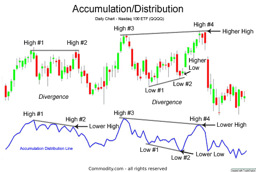

## Table of Contents

## What is the accumulation area in technical analysis?

The accumulation area in technical analysis is a price range where investors and traders believe a stock or asset is undervalued and start buying it. This buying pressure can happen after a period of falling prices, and it often signals that the price might start to go up soon. The accumulation area is important because it shows where smart money, or experienced investors, are starting to buy the asset, thinking it's a good time to get in before the price rises.

When you look at a chart, the accumulation area might look like a flat or slightly rising price range where the asset stays for a while. This area can be identified by looking at the volume of trades and the price action. If the volume starts to increase while the price stays in this range, it could mean more people are buying, which supports the idea of accumulation. Recognizing this area can help traders decide when to buy, as it might be a good entry point before the price starts to increase.

## How can you identify an accumulation area on a price chart?

To identify an accumulation area on a price chart, you need to look for a specific pattern where the price of an asset stays within a certain range for a while. This range usually comes after the price has been going down. You'll see that the price doesn't go up or down much, and it kind of stays flat or moves a little bit up and down. This is the accumulation area, where smart investors think the price is low enough to start buying.

Another thing to watch is the trading [volume](/wiki/volume-trading-strategy). When the price is in the accumulation area, you might see the volume start to go up. This means more people are buying the asset, even though the price isn't moving much yet. If you see higher volume in this flat price range, it's a good sign that the accumulation area is real, and the price might start to go up soon.

## What are the key characteristics of an accumulation area?

An accumulation area is a spot on a price chart where the price of an asset stays in a tight range after it has been going down. This range doesn't move up or down a lot, and it shows that some investors think the price is low enough to start buying. They believe the asset is undervalued and a good buy at this price, so they start to accumulate, or buy, more of it.

You can spot an accumulation area by looking at the trading volume too. When the price is in this range, you might see that more people are trading the asset, even though the price isn't changing much. This increase in volume means that more investors are buying, which supports the idea that the price might start to go up soon. So, a flat price range with higher volume is a key sign of an accumulation area.

## Why is the accumulation area important for traders and investors?

The accumulation area is important for traders and investors because it shows them a good time to buy an asset. When the price of an asset stays in a flat range after going down, it means some smart investors think the price is low enough to start buying. They believe the asset is undervalued and a good deal at this price. By recognizing the accumulation area, traders and investors can get in early before the price starts to go up.

Another reason the accumulation area is important is that it can help traders and investors make better decisions. When they see the price staying in a tight range and the trading volume going up, it's a sign that more people are buying the asset. This increase in volume supports the idea that the price might start to rise soon. By paying attention to these signs, traders and investors can time their buys better and possibly make more money when the price goes up.

## How does volume play a role in confirming an accumulation area?

Volume is really important when you're trying to figure out if a price range is an accumulation area. When the price of an asset stays flat after going down, and you see more people trading it, that's a big clue. The higher volume means more investors are buying the asset, even though the price isn't moving much yet. This shows that people think the price is a good deal and they want to buy before it goes up.

Seeing higher volume in a flat price range helps confirm that it's an accumulation area. It tells you that the buying is real and not just a few people trading. When more and more people start buying, it's a strong sign that the price might start to go up soon. So, volume is like a checkmark that says, "Yes, this is where smart investors are starting to buy."

## What are the common time frames for observing accumulation areas?

Accumulation areas can be seen on different time frames, like short-term, medium-term, and long-term charts. Short-term charts might show accumulation areas over a few days or weeks. These are good for traders who want to make quick trades and take advantage of small price moves. Medium-term charts, which look at a few weeks to a few months, can show accumulation areas that last longer. These are useful for investors who want to hold onto an asset for a bit longer but still want to get in early before a big price move.

Long-term charts, which can cover months or even years, are great for spotting big accumulation areas. These areas can show where big investors, like institutions, are buying up a lot of an asset over a long time. They believe the asset is a good buy at these prices and are willing to wait for the price to go up. By looking at different time frames, traders and investors can find the right accumulation area that fits their trading or investing style.

## Can accumulation areas be found in all types of financial markets?

Yes, accumulation areas can be found in all types of financial markets, like stocks, [forex](/wiki/forex-system), commodities, and cryptocurrencies. These areas show up when the price of an asset stays in a flat range after going down, and smart investors start buying because they think the price is low enough. No matter what market you're looking at, the idea is the same: people see a good deal and start buying, hoping the price will go up later.

The way you spot an accumulation area is also the same across different markets. You look for a time when the price doesn't move much up or down, and you see more people trading the asset. This increase in trading volume means more investors are buying, which is a sign that the price might start to go up soon. So, whether you're trading stocks, forex, or something else, watching for these signs can help you find good times to buy.

## How do accumulation areas differ from distribution areas?

Accumulation areas and distribution areas are two different things you see on price charts. An accumulation area is when the price of an asset stays in a flat range after it has been going down. This is when smart investors think the price is low enough to start buying. They believe the asset is a good deal at this price, so they start to buy more of it. You can spot an accumulation area by looking at the trading volume too. If the volume goes up while the price stays flat, it means more people are buying, and the price might start to go up soon.

On the other hand, a distribution area is when the price stays in a flat range after it has been going up. This is when investors who bought the asset at a lower price start to sell it because they think the price is high enough. They want to take their profits before the price goes down. Just like with accumulation areas, you can spot a distribution area by looking at the trading volume. If the volume goes up while the price stays flat, it means more people are selling, and the price might start to go down soon. So, accumulation areas are about buying at low prices, and distribution areas are about selling at high prices.

## What are some common trading strategies used around accumulation areas?

When traders see an accumulation area, they often use a strategy called "buying the dip." This means they buy the asset when the price is in the flat range after it has gone down. They think the price is low and a good deal, so they want to buy before it starts to go up. Traders look for signs like higher trading volume in the flat range to make sure it's really an accumulation area. Once they buy, they might hold onto the asset until the price starts to rise, then sell it for a profit.

Another common strategy is to use technical indicators to confirm the accumulation area. Traders might use tools like the Relative Strength Index (RSI) or Moving Averages to see if the price is likely to go up soon. For example, if the RSI shows the asset is oversold, it might be a good time to buy. Traders also watch for the price to break out of the flat range. When the price starts to move up and out of the accumulation area, it's a signal to buy. This [breakout](/wiki/breakout-trading) can mean the price is ready to go higher, so traders want to get in early to make the most money.

## How can technical indicators enhance the identification of accumulation areas?

Technical indicators can help traders spot accumulation areas more clearly. For example, the Relative Strength Index (RSI) can show if an asset is oversold, which means the price might be low enough for smart investors to start buying. If the RSI is below 30, it's a sign that the asset might be in an accumulation area. Another useful indicator is the Moving Average Convergence Divergence (MACD). When the MACD line crosses above the signal line while the price is in a flat range, it can mean that the price is about to start going up, confirming the accumulation area.

Volume indicators are also important. The On-Balance Volume (OBV) can show if more people are buying the asset while the price stays flat. If the OBV starts to go up, it's a good sign that the accumulation area is real and the price might rise soon. By using these technical indicators, traders can feel more confident about when to buy. They help confirm that the price is in an accumulation area and that it's a good time to get in before the price starts to go up.

## What are the potential pitfalls or false signals when identifying accumulation areas?

One big problem when trying to find accumulation areas is that sometimes the price can stay flat for other reasons, not because smart investors are buying. This can trick traders into thinking it's a good time to buy when it's not. For example, the price might stay flat because there's not much interest in the asset, or because big investors are just waiting to see what happens next. If traders buy based on this false signal, they might end up losing money if the price doesn't go up like they thought it would.

Another pitfall is that even if the price is in an accumulation area, it might take a long time for the price to start going up. Traders who buy too early might get impatient and sell before the price rises, missing out on potential profits. Also, sometimes the price can break out of the flat range and go down instead of up. This can happen if the market changes or if there's bad news about the asset. So, it's important for traders to be patient and use other tools to make sure they're not being fooled by a false signal.

## How do advanced traders use accumulation areas in conjunction with other technical analysis tools?

Advanced traders use accumulation areas along with other technical analysis tools to make better trading decisions. They look at the price staying flat after going down and see if the trading volume is going up. This tells them that smart investors might be buying the asset because they think it's a good deal. But they don't just rely on this. They also use tools like the Relative Strength Index (RSI) to see if the asset is oversold, which means the price might be low enough to buy. If the RSI is below 30, it's a sign that the asset could be in an accumulation area.

To make sure they're not fooled by false signals, advanced traders also use other indicators like the Moving Average Convergence Divergence (MACD). If the MACD line crosses above the signal line while the price is flat, it can mean the price is about to go up. They also look at volume indicators like the On-Balance Volume (OBV). If the OBV starts to go up, it's another sign that the accumulation area is real. By combining these tools, advanced traders can feel more confident about when to buy and can avoid getting tricked by the market.

## What is Technical Analysis in Stock Trading?

Technical analysis is a methodology that allows traders to evaluate assets and make informed trading decisions by studying past market data, primarily price and volume. This technique assumes that all known information is reflected in the price and that prices move in trends over time. By analyzing historical patterns, traders can forecast future price movements and identify potential trading opportunities.

One fundamental aspect of technical analysis is understanding the accumulation and distribution phases, which appear on charts as periods of price stabilization or [volatility](/wiki/volatility-trading-strategies). The accumulation phase indicates that major investors are purchasing extensively, creating a price floor, whereas the distribution phase suggests extensive selling, which could lead to a price decline. Recognizing these phases helps traders anticipate market movements more effectively.

In technical analysis, various tools and indicators are employed to discern patterns and trends, assisting traders in decision-making processes. One such indicator is the Accumulation/Distribution (A/D) line, which merges price and volume data to evaluate whether a stock is being accumulated or distributed. The A/D line calculates a running total, adding or subtracting a fraction of the daily volume determined by the relationship between the closing price and the range for the period.

The formula for the A/D line is:

$$
\text{A/D Line} = \sum \left( \frac{(C - L) - (H - C)}{H - L} \times V \right)
$$

where:
- $C$ is the close price,
- $H$ is the high price,
- $L$ is the low price,
- $V$ is the volume.

To track accumulation activities effectively, traders look for divergences between the price movement and the A/D line. If the price of an asset is trending upwards but the A/D line is declining, it may signal the underlying weakness, implying a potential reversal. Conversely, if the price is falling but the A/D line is rising, it may suggest accumulation and a forthcoming upward move.

Technical analysis is enhanced by utilizing software that provides real-time data and supports the integration of complex indicators like the A/D line. The advancement of technology facilitates precise and swift analyses, allowing traders to respond promptly to market developments. By leveraging these tools, traders can not only follow trends but also anticipate shifts in market sentiment, aligning their strategies accordingly.

## What is the Accumulation/Distribution Indicator (A/D)?

The Accumulation/Distribution Indicator (A/D) is an essential tool in technical analysis, aimed at highlighting whether a stock is under accumulation or distribution. This indicator integrates price and volume, providing insights into market trends and potential reversals.

The A/D indicator is calculated by considering the relationship between a stock's closing price and its trading range, in conjunction with its volume. The formula for the A/D line is as follows:

$$

A/D = \sum_{i=1}^{n} \left( \frac{{(C_i - L_i) - (H_i - C_i)}}{{H_i - L_i}} \times V_i \right)
$$

Where:
- $C_i$ is the closing price of the period.
- $L_i$ is the low price of the period.
- $H_i$ is the high price of the period.
- $V_i$ is the volume of the period.

This formula computes a running total, or cumulative line, illustrating the flow of money into or out of a security. An upward sloping A/D line indicates that there is more accumulation than distribution, suggesting potential bullish trends. Conversely, a downward sloping A/D line signifies that distribution is outpacing accumulation, indicating bearish tendencies.

Understanding divergences between price movement and volume flow is crucial for effectively utilizing the A/D indicator. A divergence occurs when the price of a stock moves in a direction opposite to the A/D line. For instance, if the stock price is rising while the A/D line is falling, it may signal a bearish reversal is on the horizon, as the increase in price might not be supported by the underlying volume. On the other hand, if a stock’s price is decreasing while the A/D line is rising, it could imply a bullish reversal, indicating accumulation despite the price decline.

Overall, the A/D indicator serves as a vital analytical tool for investors and traders, providing valuable insights into market dynamics that pure price analysis might overlook.

## What is Algorithmic Trading and how does it relate to Accumulation Areas?

Algorithmic trading utilizes sophisticated computer algorithms to execute trades automatically based on predefined strategies and criteria. These algorithms are designed to analyze vast amounts of market data in real-time, identify trading opportunities, and execute trades at optimal times. One significant advantage of [algorithmic trading](/wiki/algorithmic-trading) is its ability to efficiently recognize and capitalize on accumulation areas in the market—periods when a stock's price remains stable despite increasing buying volumes, suggesting institutional investors are quietly acquiring shares in anticipation of future price gains.

Incorporating algorithms that can accurately detect these accumulation zones enhances trading efficiency and profitability. For example, algorithms can be programmed to monitor price and volume patterns continuously. By employing technical indicators like the Accumulation/Distribution (A/D) indicator, moving averages, or even [machine learning](/wiki/machine-learning) models, these algorithms identify signs of accumulation.

An algorithm designed to detect accumulation areas might begin by analyzing historical price data to establish baseline parameters for what constitutes stable price movement and high trading volume for a particular stock. A moving average formula, such as:

$$
MA = \frac{1}{n} \sum_{i=0}^{n-1} P_{i}
$$

could be used to smooth out price data and highlight periods of stability, where $P_{i}$ is the price at time $i$ and $n$ is the period.

Once these parameters are set, the algorithm can monitor live data streams, using these thresholds to detect deviations that might indicate an accumulation zone. Python, a popular programming language for algorithmic trading, can be employed to develop such an algorithm. Consider a simple example using the Pandas library to implement a moving average strategy:

```python
import pandas as pd

def moving_average(data, window_size):
    return data.rolling(window=window_size).mean()

data = pd.Series([...]  # assume this is your time series of stock prices

ma = moving_average(data, window_size=20)

# Detect areas where price is stable around the moving average with increased volume.
```

The algorithm can place trades when the conditions for an accumulation area are met, automatically executing buy orders to capitalize on the expected upward price movement. Additionally, the algorithm can be configured to adjust its trading strategy as market conditions change, allowing for adaptive responses to new information.

While the primary goal is to enter the market at advantageous points, algorithmic trading systems must also be equipped with robust risk management protocols to safeguard against potential market fluctuations and unexpected economic events. This balance helps enhance performance while mitigating exposure to risk, making algorithmic trading in accumulation areas a powerful tool for modern traders.

## References & Further Reading

[1]: ["Technical Analysis of the Financial Markets: A Comprehensive Guide to Trading Methods and Applications"](https://www.amazon.com/Technical-Analysis-Financial-Markets-Comprehensive/dp/0735200661) by John J. Murphy

[2]: Pring, M. J. (1991). ["Technical Analysis Explained: The Successful Investor's Guide to Spotting Investment Trends and Turning Points"](https://archive.org/details/technicalanalysi00prin)

[3]: Wyckoff, R. D. (1984). ["Stock Market Technique Number One"](https://www.amazon.com/Market-Technique-Fraser-Publishing-Library/dp/0870340700)

[4]: Aronson, D. R. (2006). ["Evidence-Based Technical Analysis: Applying the Scientific Method and Statistical Inference to Trading Signals"](https://www.amazon.com/Evidence-Based-Technical-Analysis-Scientific-Statistical/dp/0470008741) 

[5]: Schwager, J. D. (1989). ["Market Wizards: Interviews with Top Traders"](https://www.amazon.com/Market-Wizards-Jack-D-Schwager/dp/0887306101)

[6]: Chan, E. P. (2008). ["Quantitative Trading: How to Build Your Own Algorithmic Trading Business"](https://github.com/ftvision/quant_trading_echan_book)