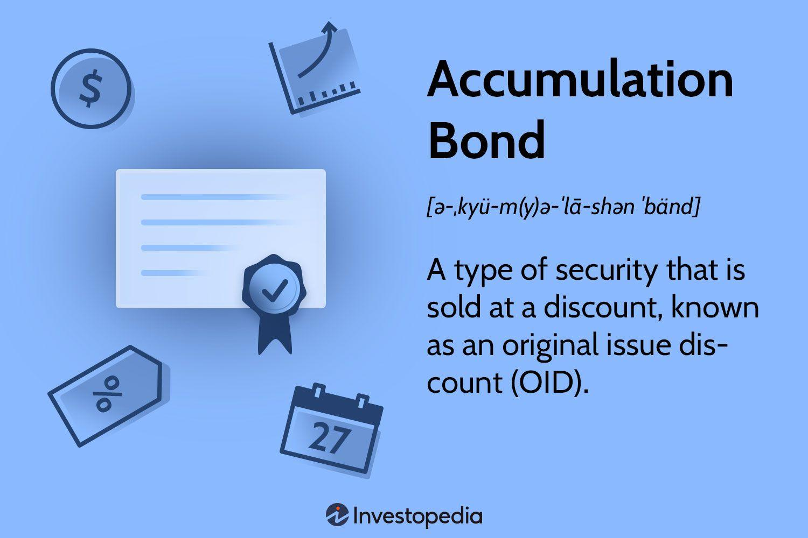

Bonds have long been a staple in the world of investing, offering a relatively safe and predictable way to grow wealth. These fixed-income instruments provide investors with regular interest payments and the return of principal at maturity, thereby reducing risk compared to equity investments. Among the various types of bonds, the accumulation bond stands out as a unique option for investors. Also known as zero-coupon bonds, accumulation bonds are purchased at a discount compared to their face value and do not distribute periodic interest payments. Instead, they accumulate value internally until they mature, providing the entire interest and principal in one lump sum at the end. This structure appeals to investors with a long-term horizon seeking substantial returns through the power of compounding.

In this article, we explore the pros and cons of accumulation bonds, provide examples, and explain how they fit into the world of algorithmic trading. We will analyze how these bonds can offer higher interest yields than their traditional counterparts, while also discussing their inherent sensitivities to market dynamics such as interest rate fluctuations. Furthermore, we consider how taxes on accrued but unpaid interest can impact net returns.

The advent of algorithmic trading has added a new dimension to investing in bonds, including accumulation bonds. Advanced software systems can integrate these financial instruments into diversified portfolios, enabling high-speed, accurate trading with reduced human error. While algo-trading has its own set of challenges, such as high initial costs and technological dependency, incorporating accumulation bonds can provide a stabilizing component amid more volatile assets. This guide aims to provide a comprehensive look at accumulation bonds and their role in modern financial strategies, offering insights that can help investors make informed decisions based on their personal goals and market conditions.

## Table of Contents

## What is an Accumulation Bond?

Accumulation bonds, commonly referred to as zero-coupon bonds, represent a unique category of fixed-income securities. Unlike standard bonds, which disburse periodic interest payments, accumulation bonds are sold at a significant discount relative to their face value and do not pay out any interest until they reach maturity. This distinctive attribute means that the interest earned over the bond's lifespan is effectively 'accumulated' and paid out in a lump sum at maturity.

The mathematical basis of accumulation bonds involves the concept of compound interest, albeit realized at a single maturity date. Suppose an accumulation bond is purchased at a present value denoted by $P$, with a face value $F$, and a maturity period of $n$ years. The implicit interest rate $r$ can be expressed through the formula:

$$

F = P \times (1 + r)^n 
$$

Rearranging this formula allows for the calculation of the effective [interest rate](/wiki/interest-rate-trading-strategies):

$$

r = \left( \frac{F}{P} \right)^{\frac{1}{n}} - 1 
$$

The safety aspect often associated with accumulation bonds stems from their predictable payoff structure and the absence of interest payment variability. Because they are sold at a discount and only repay at maturity, their valuation is more straightforward compared to bonds with regular coupon payments. Investors seeking to meet future financial obligations, such as college tuition or retirement, often find these bonds attractive due to their definite growth over a fixed term, provided they are held to maturity.

One key consideration with accumulation bonds is their sensitivity to interest rate changes. As fixed-income instruments, they are subject to fluctuating market rates which can affect the bond's present value inversely. However, since no funds are received periodically, this risk does not directly impact the cash flow until the bond matures.

In conclusion, accumulation bonds are best suited for investors with a clear timeline for financial goals and who can afford to lock in their investment for a set duration to capitalize on the accumulated returns. Their role in a diversified investment strategy, while safe, depends heavily on the investor’s specific risk tolerance and financial objectives.

## Pros of Accumulation Bonds

Accumulation bonds, often identified as zero-coupon bonds, offer several advantages that can make them an attractive investment option, particularly for those focused on long-term financial security.

One notable advantage of accumulation bonds is their potential for higher interest yields compared to traditional bonds. These bonds are sold at a discount and do not pay periodic interest. Instead, they accumulate value over time through compounding, which can lead to substantial returns upon maturity. The formula for the future value $FV$ of an accumulation bond can be represented as:

$$
FV = PV \times (1 + r)^n
$$

where $PV$ is the present value or initial investment, $r$ is the annual interest rate, and $n$ is the number of years until maturity. This formula highlights how the bond's value grows exponentially, providing potentially higher returns compared to bonds that pay regular interest.

Another advantage is the predictability and reliability of the payout at maturity. Since accumulation bonds do not disburse funds until they mature, investors can count on receiving a specified amount at the end of the bond's term. This makes accumulation bonds a conservative choice for individuals seeking to secure long-term savings without the concern of fluctuating interest payouts over the bond’s life.

Furthermore, the ability to provide substantial returns if held until maturity aligns well with long-term financial planning. Investors who keep these bonds until the maturity date not only benefit from their compounding effect but also avoid the potential downsides such as price [volatility](/wiki/volatility-trading-strategies) involved with selling the bond on the secondary market before maturity. This characteristic supports a stable investment strategy aimed at achieving significant growth over time, making accumulation bonds a favorable option within a diversified investment portfolio.

## Cons of Accumulation Bonds

Accumulation bonds, while offering unique benefits, also present certain disadvantages that investors must consider. One major drawback is their sensitivity to interest rate fluctuations. When interest rates rise, the price of existing bonds typically falls since new bonds are issued with higher yields, making them more attractive. This inverse relationship implies that accumulation bonds can lose value on secondary markets before maturity, potentially leading to losses if an investor decides or is forced to sell early.

Another considerable concern with accumulation bonds is the taxation of phantom income. Although these bonds don't distribute interest periodically, the accrued interest is effectively treated as income for tax purposes each year. This means investors are obligated to report and pay taxes on income they haven't actually received, potentially resulting in cash flow challenges, particularly for those who hold significant amounts in zero-coupon bonds. This taxation without actual income generation can be illustrated through the following formula for annual phantom interest income:

$$
\text{Annual Phantom Interest} = \text{Maturity Value} \times \left(1 - \left(\frac{\text{Purchase Price}}{\text{Maturity Value}}\right)^{\frac{1}{\text{Years to Maturity}}}\right)
$$

This formula calculates the annual interest that is accrued and subject to taxation, even though it isn't paid out until maturity.

Lastly, accumulation bonds offer less [liquidity](/wiki/liquidity-risk-premium) compared to some other bond types. Because they do not provide regular interest income and trade less frequently on secondary markets, selling these bonds before maturity can be more challenging. Their value is maximized when held until the end of their term, creating a potential mismatch for investors looking for shorter-term investment opportunities. This lessened liquidity means that investors must carefully manage their portfolios to ensure they do not need to liquidate these bonds prematurely, which could result in financial losses.

## Example of an Accumulation Bond

Consider a hypothetical scenario in which a company, The Widget Group, decides to issue an accumulation bond as a means of financing the construction of a new factory and the refurbishment of its office headquarters. The total project requires a funding amount of $743,000. Instead of receiving this amount directly, the company issues a zero-coupon bond with a maturity value of $1 million to cover the expenses over a 15-year period.

### Financial Structure

Unlike traditional bonds, where investors receive periodic interest payments, the accumulation bond offers no such intermediate payouts. Instead, it is sold at a discounted rate — in this instance, less than the $1 million maturity value. Investors purchase the bond for its current discounted price, and The Widget Group benefits from receiving a substantial amount upfront without the burden of regular interest disbursements.

### Mathematical Illustration

The bond's intrinsic value is calculated using the formula:

$$
\text{Present Value (PV)} = \frac{\text{Future Value (FV)}}{(1 + r)^n}
$$

Where:
- $\text{FV}$ is the bond's maturity value, which is $1,000,000.
- $r$ is the annual yield rate.
- $n$ is the number of years until maturity, which is 15.

For illustrative purposes, let's assume the bond is sold with a discount rate that implies an annual yield rate, $r$. Solving for $r$, the bondholder's effective yield over the 15 years reflects the difference between the purchase price and the eventual payout of $1 million upon maturation.

### Benefits to Investors

For investors, such bonds offer a significant opportunity for capital appreciation if held until maturity. The absence of interim interest payments means that the bond's value accumulates over its life, providing a predictable and often higher real return upon maturity compared to comparable investment vehicles.

This scenario exemplifies the functioning of accumulation bonds in financing corporate activities while aligning with investor interests in capital growth, highlighting the strategic use of financial instruments to meet specific budgeting and funding requirements without the immediate fiscal pressure of interest payouts.

## Algorithmic Trading and Accumulation Bonds

Algorithmic trading, commonly referred to as algo-trading, employs advanced computational algorithms to execute trading strategies efficiently and at substantial speed. These algorithms can process large volumes of data and execute trades substantially faster than human traders. Algo-trading systems are designed to minimize human error and remove emotional decision-making, allowing trades to be executed based on predefined criteria without hesitation.

One of the primary advantages of algo-trading is its high accuracy and speed. By automating the trading process, it ensures that trades are executed at the optimal time, following the predefined strategy with precision. This capability is particularly beneficial for handling large [volume](/wiki/volume-trading-strategy) trades where small differences in timing can result in significant financial impact. Furthermore, algo-trading systems can operate continuously across multiple markets and time zones, providing a consistent trading approach around the clock.

However, the implementation of algo-trading systems does entail certain drawbacks. The initial setup costs can be substantial, involving the acquisition of technology and software, as well as ongoing maintenance and upgrading expenses. Additionally, these systems are heavily reliant on technology, and any malfunctions or outdated algorithms can lead to significant trading errors or losses. Consequently, continuous updates and improvements are necessary to maintain their competitive edge in the market.

Within the context of algo-trading, accumulation bonds can serve as a stable component in diversified portfolios. Accumulation bonds, which are typically zero-coupon bonds issued at a discount, provide a predictable return at maturity. This feature makes them less volatile compared to other financial instruments, offering a balance against more volatile assets included in an [algorithmic trading](/wiki/algorithmic-trading) strategy. By integrating accumulation bonds, traders can benefit from their long-term, stable returns, smoothing out the fluctuations associated with more dynamic market segments.

The incorporation of accumulation bonds within an algorithmic trading system can be strategically beneficial, particularly in scenarios where market conditions fluctuate widely. The stability of these bonds can help offset risks, thus providing a level of security within otherwise volatile portfolios. As the trading landscape continues to evolve, the role of accumulation bonds in algorithmic trading is poised to remain significant, offering a reliable component to bolster the resilience of investment strategies.

## Conclusion

Accumulation bonds are recognized as a relatively secure and potentially profitable choice within the bond market. By nature, they ensure a definitive return at maturity, making them an attractive option for those with a long-term investment horizon. However, these bonds are not without their challenges, particularly given their vulnerability to fluctuating interest rates. As interest rates rise, the current value of accumulation bonds can decline, potentially affecting their perceived profitability until maturity is reached.

When employed within algorithmic trading strategies, accumulation bonds can provide a predictable element to an otherwise volatile mix of assets. Their consistent and reliable nature supports the broader strategy of diversification, allowing the algorithm to hedge against riskier, more dynamic financial instruments. This stability is crucial, as algorithmic trading thrives on precision and consistency, devoid of human emotional bias or error.

Investors are encouraged to judiciously assess the potential benefits and downsides of accumulation bonds, tailoring their use to align with personal financial goals and broader investment strategies. Factors such as personal risk tolerance, investment timelines, and the current economic environment should be considered. By doing so, investors can determine the extent to which accumulation bonds should be integrated into their portfolios, ensuring a well-calculated approach to wealth growth and management.

## References & Further Reading

[1]: Fabozzi, F. J. (2000). ["Bond Markets, Analysis, and Strategies."](https://books.google.com/books/about/Bond_Markets_Analysis_and_Strategies_ten.html?id=bQpNEAAAQBAJ) Upper Saddle River, NJ: Prentice Hall.

[2]: ["Bond Math: The Theory Behind the Formulas"](https://www.wiley.com/en-us/Bond+Math%3A+The+Theory+Behind+the+Formulas-p-9781118268001) by Donald J. Smith. John Wiley & Sons, Inc.

[3]: Hull, J. C. (2018). ["Options, Futures, and Other Derivatives."](https://www.semanticscholar.org/paper/Options%2C-Futures%2C-and-Other-Derivatives-Hull/89bdee500c8623864fc9eb7a471546aa713acc44) Pearson Education.

[4]: ["Automation of Trading System: A Complete Guide to Trading Algorithm"](https://www.quantifiedstrategies.com/automated-trading-systems/) by Imran Ahmad.

[5]: ["Quantitative Financial Economics: Stocks, Bonds and Foreign Exchange"](https://www.amazon.com/Quantitative-Financial-Economics-Foreign-Exchange/dp/0470091711) by Keith Cuthbertson and Dirk Nitzsche.