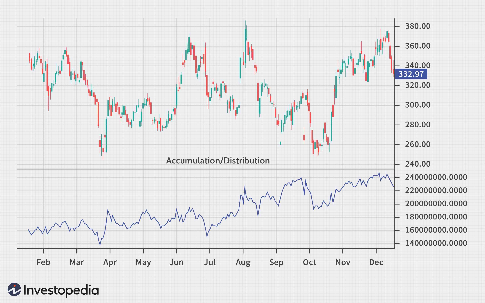

The world of algorithmic trading is vast and ever-expanding, with technical analysis indicators playing a crucial role in traders' strategies. Technical indicators help traders make informed decisions by analyzing past market data to predict future price movements. Among these indicators, the Accumulation/Distribution (A/D) Indicator stands out as a powerful tool that helps traders assess supply and demand dynamics. This indicator provides insights into the flow of money into or out of a security by considering both price and volume data. It gives traders an ability to evaluate whether an asset is experiencing accumulation, where buying pressure is dominant, or distribution, where selling pressure prevails.

In this context, understanding the function and application of the A/D Indicator becomes essential. This article explains the concept of the A/D Indicator, explores its role within technical analysis, and describes how it can be integrated into automated trading systems. The indicator measures market sentiment and aids in predicting potential price reversals, providing traders with crucial information to assess trend strength and validate trading signals. 



Ultimately, this guide aims to equip you with the knowledge to leverage the A/D Indicator for enhanced trading outcomes. By understanding how the indicator helps in gauging market sentiment and identifying possible reversals, traders can improve their strategy's precision and effectiveness in navigating the complexities of the financial markets.

## Table of Contents

## What is the Accumulation/Distribution (A/D) Indicator?

The Accumulation/Distribution (A/D) Indicator is a sophisticated analytical tool used in technical analysis to evaluate the relative flow of money into and out of an asset. It intricately combines both price and volume information to discern whether an asset is being accumulated (bought) or distributed (sold), providing vital clues about market dynamics.

One of the primary functions of the A/D Indicator is to highlight the strength of a prevailing trend by identifying divergences or convergences between asset prices and volume flows. Divergence occurs when the price of an asset and the A/D Indicator move in opposite directions, potentially signaling a change in the trend. For instance, if prices are rising but the A/D line is falling, it may suggest weakening buying pressure and the possibility of an impending reversal.

To grasp the supply and demand dynamics, the A/D Indicator examines the closing price's position within a given trading period's range. This is calculated by determining where the closing price falls within the period's high-low range, which is then multiplied by the trading volume for that period. This provides a quantifiable measure of the asset's accumulation or distribution:

$$
\text{MFM} = \frac{(\text{Close} - \text{Low}) - (\text{High} - \text{Close})}{\text{High} - \text{Low}}
$$

The Money Flow Multiplier (MFM) thus captures the extent of buying or selling pressure, as influenced by where the price closes. The MFM is then multiplied by the trading [volume](/wiki/volume-trading-strategy) to compute the Money Flow Volume. This value is added to the previous A/D value to yield the current A/D level. This cumulative approach enables traders to perceive ongoing trends and potential reversals based on the observed flow of money. 

The A/D Indicator's ability to confirm existing trends or signal prospective reversals makes it an invaluable tool for traders. By incorporating both price and volume data, it offers a nuanced view of market sentiment that purely price-based indicators might miss. Consequently, it aids traders in making more informed decisions by providing insights into underlying market conditions that are not immediately apparent through price data alone.

## Understanding the A/D Indicator Formula

The Accumulation/Distribution (A/D) Indicator is a technical analysis tool that combines price and volume data to provide insights into the flow of money in and out of a security. The core of its calculation is the Money Flow Multiplier (MFM), which assesses the position of a stock's closing price relative to its high and low prices within a given period. The formula for the Money Flow Multiplier is as follows:

$$
\text{MFM} = \frac{(\text{Close} - \text{Low}) - (\text{High} - \text{Close})}{\text{High} - \text{Low}}
$$

This formula essentially quantifies how the closing price is positioned within the day's price range. A positive MFM value indicates a close near the high of the period, suggesting buying pressure, while a negative value hints at closing near the low, indicating selling pressure.

To calculate the Money Flow Volume (MFV), the MFM is then multiplied by the trading volume for the same period:

$$
\text{MFV} = \text{MFM} \times \text{Volume}
$$

Finally, the A/D Indicator is a cumulative metric. It builds upon the previous period's A/D value by adding the current period's Money Flow Volume. This can be represented as:

$$
\text{A/D\ Indicator} = \text{Previous A/D} + \text{Current MFV}
$$

This continual addition allows the A/D line to reflect whether money is flowing into or out of the security, thereby providing traders with a visualization of market demand dynamics. When the A/D line ascends, it often aligns with periods of accumulation as investors purchase shares. Conversely, a descending A/D line typically signals distribution phases, where selling activity predominates. This flow of money, represented by the A/D line, aids traders in identifying potential trend continuations or reversals, thereby enriching their decision-making process in trading strategies.

## Using the A/D Indicator for Technical Analysis

The Accumulation/Distribution (A/D) Indicator is an essential component in technical analysis, offering traders the ability to evaluate market sentiment effectively and confirm price trends. This volume-based tool helps in identifying the underlying supply and demand dynamics of an asset.

A rising A/D line, observed alongside an upward price trend, typically signals robust buying pressure, which affirms the strength and sustainability of the existing trend. This alignment between the A/D line and the price movement indicates that the current upward trend is supported by sufficient volume, suggesting a reduced likelihood of immediate reversal.

Conversely, when the A/D line trends downward during a rising price movement, it may indicate weakening buying pressure. This divergence suggests that the price increase is not fully supported by trading volume, potentially signaling forthcoming price corrections or a reversal. It is crucial for traders to recognize this pattern as it may provide early warnings of diminishing trend strength.

Divergences between the A/D line and the asset's price movement play a significant role in predicting possible trend reversals. For instance, if the A/D line is declining while the asset price continues to rise, this discrepancy might indicate that the bullish trend lacks volume support, hinting at a possible reversal. Conversely, if the price is falling but the A/D line is rising, it could suggest that accumulation is taking place, potentially foreshadowing a bullish reversal.

Overall, the A/D Indicator can be a powerful tool when used in conjunction with other technical indicators and analysis methods. It is particularly useful for identifying discrepancies in price and volume, providing traders with the insights needed to make informed decisions about potential trend continuations or reversals.

## A/D Indicator in Algorithmic Trading

The Accumulation/Distribution (A/D) Indicator serves as an influential tool in [algorithmic trading](/wiki/algorithmic-trading) by offering quantitative insights that enhance decision-making processes. Leveraging price and volume data, the A/D Indicator aids algorithms in identifying trend confirmation or reversal signals essential for optimizing trading strategies. When incorporated into an algorithmic framework, the A/D Indicator allows systems to programmatically trigger trades based on predefined conditions related to divergences or alignments between the A/D line and asset prices.

To implement the A/D Indicator within algorithmic systems, traders typically utilize a sequence of logical conditions that assess the indicator's readings in relation to the asset's price movement. For instance, when the A/D line diverges from the price trend—such as an upward price trend paired with a declining A/D line—it might signal a potential reversal, prompting the algorithm to initiate a corresponding trade order. On the contrary, convergence between a rising A/D line and an ascending price might confirm a trend, reinforcing the algorithm's current trading posture.

Moreover, the flexibility of the A/D Indicator enables algorithms to adapt dynamically to changing market environments, thereby maintaining operational consistency and accuracy. For instance, a simple Python script leveraging the popular `pandas` and `numpy` libraries might execute trades based on the A/D line's behavior:

```python
import numpy as np
import pandas as pd

def calculate_ad_indicator(data):
    mfm = ((data['Close'] - data['Low']) - (data['High'] - data['Close'])) / (data['High'] - data['Low'])
    mfv = mfm * data['Volume']
    ad = mfv.cumsum()
    return ad

def trading_signal(ad, price):
    if ad.diff().iloc[-1] > 0 and price.diff().iloc[-1] > 0:
        return "Confirm Uptrend"
    elif ad.diff().iloc[-1] < 0 and price.diff().iloc[-1] < 0:
        return "Confirm Downtrend"
    elif ad.iloc[-1] > ad.iloc[-2] and price.iloc[-1] < price.iloc[-2]:
        return "Potential Reversal UP"
    elif ad.iloc[-1] < ad.iloc[-2] and price.iloc[-1] > price.iloc[-2]:
        return "Potential Reversal DOWN"
    else:
        return "Hold"

# Example usage
data = pd.DataFrame({'Close': [100, 102, 101, 103], 'High': [104, 105, 103, 106], 'Low': [99, 100, 100, 101], 'Volume': [1500, 1600, 1400, 1700]})
ad_line = calculate_ad_indicator(data)
signal = trading_signal(ad_line, data['Close'])
print(signal)
```

This example demonstrates a basic evaluation of the A/D Indicator and the resulting decision logic that an algorithm may employ. These logical constructs enable automated systems to adjust their execution strategies based on real-time data, ensuring that algorithmic trades align closely with prevailing market conditions. In essence, the integration of the A/D Indicator into algorithmic trading not only enhances the precision of trades but also streamlines the adaptability of trading algorithms to various market scenarios.

## A/D Indicator vs. On-Balance Volume (OBV)

Both the Accumulation/Distribution (A/D) Indicator and On-Balance Volume (OBV) are integral to technical analysis, each providing insights into market trends through volume-based methodologies. Despite their shared focus on volume, their calculation techniques and implications diverge, offering traders distinct perspectives.

The On-Balance Volume (OBV) indicator was developed by Joseph Granville and operates under the principle that volume precedes price movement. The calculation of OBV is relatively straightforward: if the closing price of a given day is higher than the previous closing price, the day's volume is added to the cumulative OBV; conversely, if the closing price is lower, the day's volume is subtracted. Mathematically, it can be expressed as:

$$

\text{OBV}_{\text{today}} = 
\begin{cases} 
\text{OBV}_{\text{yesterday}} + \text{Volume}, & \text{if Close}_{\text{today}} > \text{Close}_{\text{yesterday}} \\
\text{OBV}_{\text{yesterday}} - \text{Volume}, & \text{if Close}_{\text{today}} < \text{Close}_{\text{yesterday}} \\
\text{OBV}_{\text{yesterday}}, & \text{if Close}_{\text{today}} = \text{Close}_{\text{yesterday}} 
\end{cases}
$$

This simple approach makes OBV a popular choice for detecting the [momentum](/wiki/momentum) of an asset, based on the belief that significant shifts in volume might indicate forthcoming price changes.

In contrast, the Accumulation/Distribution (A/D) Indicator, developed by Marc Chaikin, employs a more intricate formula that integrates both price changes within a trading period and volume. The A/D Indicator uses the Money Flow Multiplier (MFM), calculated as follows:

$$

\text{MFM} = \frac{(\text{Close} - \text{Low}) - (\text{High} - \text{Close})}{\text{High} - \text{Low}} 
$$

The Money Flow Volume is then determined by multiplying the MFM by the period's volume. The cumulative A/D value is updated by adding the Money Flow Volume to the previous A/D value:

$$

\text{A/D}_{\text{today}} = \text{A/D}_{\text{yesterday}} + \text{MFM} \times \text{Volume}
$$

This methodology allows the A/D Indicator to capture nuances in market behavior that OBV might overlook, such as where the price settled within its range, offering potentially different interpretations of buying and selling pressures. As a result, the A/D Indicator can provide more granular insights into trend strength and the underlying supply-demand dynamics, which may be pivotal for traders seeking to confirm trends or spot potential reversals.

Both indicators hold unique value within technical analysis, and their differences in methodology mean they can be used complementarily, helping traders develop more robust insights into market conditions.

## Limitations of the A/D Indicator

The Accumulation/Distribution (A/D) Indicator, while useful, has its limitations that traders must be aware of. One significant constraint is its inability to account for price changes between periods. This gap in analysis can occasionally lead to misleading signals, especially during periods of [volatility](/wiki/volatility-trading-strategies). For example, a sudden gap down in price followed by a recovery within the same trading period may cause the A/D line to rise, reflecting accumulation inaccurately. This situation arises because the indicator primarily focuses on where the price closes relative to the period's range rather than the overall price movement between periods.

Divergences between the A/D line and actual price movement also present a challenge. While divergences can signal potential trend reversals, they are not guaranteed to provide immediate reversal signals. Divergences can persist over extended periods, making it difficult to rely solely on the A/D Indicator for timing trades. This persistence necessitates cautious interpretation and suggests that traders should corroborate such signals with other technical analysis tools to improve decision-making accuracy.

By understanding these restrictions, traders can better navigate the intricacies of market dynamics and avoid potential pitfalls associated with over-reliance on the A/D Indicator alone. Balancing the use of this indicator with additional analysis can enhance its effectiveness within trading strategies.

## Conclusion

The Accumulation/Distribution (A/D) Indicator is an essential component within a trader's technical analysis toolkit, offering valuable insights into market behavior and the strength of trends. By analyzing the flow of volume and its relation to price movements, the A/D Indicator provides traders with the ability to more accurately discern the underlying supply and demand dynamics within a security. This insight is particularly advantageous when seeking to understand whether a trend is likely to continue or if a reversal is imminent.

Integrating the A/D Indicator into algorithmic trading systems can enhance trend confirmation and risk management. By automating decisions based on the indicator, algorithms can efficiently adapt to complex market conditions, executing trades in response to confirmed signals such as divergences or trend alignments. This mechanization not only increases execution speed but also consistency, allowing for better management of trading positions.

However, like any technical analysis tool, the A/D Indicator should not be relied upon in isolation. Its signals can be enriched and confirmed when used alongside other indicators. Employing a multi-indicator strategy helps to mitigate the risk of false signals and provides a more robust framework for executing trades. By combining the A/D Indicator with tools that account for different market factors, such as momentum oscillators or moving averages, traders can achieve a more comprehensive market analysis.

Ultimately, a comprehensive understanding and strategic application of the A/D Indicator can be instrumental in navigating the complexities of financial markets. By leveraging its insights, traders stand to make informed decisions that align with market trends and conditions, improving their ability to adapt and succeed in dynamic trading environments.

## References & Further Reading

[1]: Chaikin, M. (1982). ["The Chaikin Oscillator"](https://chartschool.stockcharts.com/table-of-contents/technical-indicators-and-overlays/technical-indicators/chaikin-oscillator). Chaikin's Technical Analysis and Stock Market Profits.

[2]: Granville, J.E. (1963). ["Granville's New Key to Stock Market Profits"](https://books.google.com/books/about/Granville_s_New_Key_to_Stock_Market_Prof.html?id=21ukDwAAQBAJ). Prentice Hall.

[3]: Achelis, S. B. (2001). ["Technical Analysis from A to Z, 2nd edition"](https://archive.org/details/technicalanalysi00ache). McGraw-Hill.

[4]: Murphy, J. J. (1999). ["Technical Analysis of the Financial Markets: A Comprehensive Guide to Trading Methods and Applications"](https://archive.org/details/technicalanalysi0000murp). New York Institute of Finance. 

[5]: Pring, M. J. (2002). ["Technical Analysis Explained: The Successful Investor's Guide to Spotting Investment Trends and Turning Points"](https://www.amazon.com/Technical-Analysis-Explained-Fifth-Successful/dp/0071825177). McGraw Hill.

[6]: Appel, G., & Hitschler, F. (2005). ["Technical Analysis: Power Tools for Active Investors"](https://books.google.com/books/about/Technical_Analysis.html?id=RFYIAAAACAAJ). Financial Times Prentice Hall.