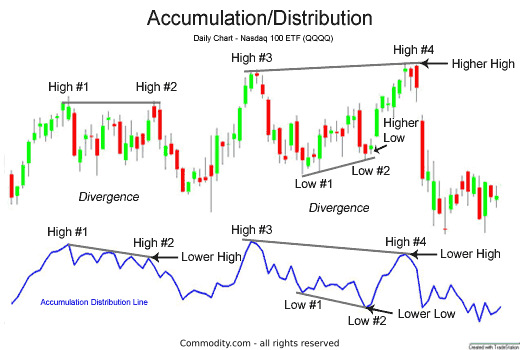

## Table of Contents

## What is the Accumulation/Distribution Indicator?

The Accumulation/Distribution Indicator is a technical analysis tool used to gauge the flow of money into and out of a security. It helps investors understand whether a stock is being accumulated, meaning more people are buying it, or distributed, meaning more people are selling it. The indicator takes into account both the closing price of a stock and its trading volume to determine this flow. If the stock closes near the high of its daily range with high volume, it suggests accumulation, while closing near the low with high volume suggests distribution.

This indicator is useful because it can signal potential changes in a stock's price trend before they become apparent through price movements alone. For example, if the Accumulation/Distribution line is rising while the stock price is falling, it might indicate that the stock is being accumulated and could soon see a price increase. Conversely, if the line is falling while the stock price is rising, it might suggest that the stock is being distributed and could soon see a price decrease. By watching this indicator, investors can make more informed decisions about when to buy or sell a stock.

## How is the Accumulation/Distribution Indicator calculated?

The Accumulation/Distribution Indicator is calculated by looking at where the stock's closing price is within its daily trading range and then multiplying that by the day's trading volume. First, you find the difference between the day's high and low prices to get the trading range. Then, you figure out where the closing price sits within that range. If the close is near the high, it means the stock is being accumulated, and if it's near the low, it's being distributed. You use a formula to turn this into a number called the Money Flow Multiplier. The formula is: (Close - Low - (High - Close)) / (High - Low). This number will be between -1 and 1.

Next, you multiply the Money Flow Multiplier by the day's trading volume to get the Money Flow Volume. This tells you how much money is flowing into or out of the stock on that day. You add up the Money Flow Volume over time to get the Accumulation/Distribution Line. If the line is going up, it means more money is coming into the stock than going out, suggesting accumulation. If the line is going down, it means more money is leaving the stock than coming in, suggesting distribution. By watching this line, you can see if the stock is being bought or sold more over time.

## What does the Accumulation/Distribution Indicator measure?

The Accumulation/Distribution Indicator measures whether more people are buying or selling a stock. It does this by looking at where the stock's price ends up each day and how much of the stock is traded. If the stock's price at the end of the day is close to the highest price it reached that day, and a lot of the stock was traded, the indicator suggests that the stock is being accumulated, or bought up by investors. On the other hand, if the stock's price at the end of the day is close to the lowest price it reached that day, and a lot of the stock was traded, the indicator suggests that the stock is being distributed, or sold off by investors.

This indicator is helpful because it can show what might happen to the stock's price in the future. If the indicator is going up even when the stock's price is going down, it might mean that the stock will start to go up soon because more people are buying it than selling it. If the indicator is going down even when the stock's price is going up, it might mean that the stock will start to go down soon because more people are selling it than buying it. By watching this indicator, investors can make better decisions about when to buy or sell a stock.

## How can beginners use the Accumulation/Distribution Indicator to identify buying and selling pressure?

Beginners can use the Accumulation/Distribution Indicator to see if more people are buying or selling a stock. The indicator looks at where the stock's price ends each day and how much of the stock is traded. If the price at the end of the day is close to the highest price of the day and a lot of the stock is traded, the indicator goes up. This means more people are buying the stock, and there's buying pressure. If the price at the end of the day is close to the lowest price of the day and a lot of the stock is traded, the indicator goes down. This means more people are selling the stock, and there's selling pressure.

By watching the Accumulation/Distribution Indicator, beginners can get a sense of what might happen to the stock's price next. If the indicator is going up while the stock's price is going down, it might mean the stock will start to go up soon because more people are buying it than selling it. If the indicator is going down while the stock's price is going up, it might mean the stock will start to go down soon because more people are selling it than buying it. This can help beginners decide when it might be a good time to buy or sell a stock.

## What are the key signals provided by the Accumulation/Distribution Indicator?

The Accumulation/Distribution Indicator gives important signals about whether more people are buying or selling a stock. If the indicator is going up, it means the stock is being accumulated. This happens when the stock's price at the end of the day is close to the highest price of the day and a lot of the stock is being traded. This is a sign of buying pressure, suggesting that more people want to buy the stock than sell it. When you see this, it could mean the stock's price might go up soon.

On the other hand, if the indicator is going down, it means the stock is being distributed. This happens when the stock's price at the end of the day is close to the lowest price of the day and a lot of the stock is being traded. This is a sign of selling pressure, suggesting that more people want to sell the stock than buy it. When you see this, it could mean the stock's price might go down soon. By watching these signals, you can get a better idea of when to buy or sell a stock.

## How does the Accumulation/Distribution Indicator differ from volume-based indicators?

The Accumulation/Distribution Indicator and volume-based indicators both use trading volume to understand what's happening with a stock, but they do it in different ways. Volume-based indicators just look at how many shares of a stock are traded each day. If a lot of shares are traded, it means the stock is popular and a lot of people are interested in it. But volume-based indicators don't tell you if people are buying or selling the stock, just that a lot of trading is happening.

The Accumulation/Distribution Indicator goes a step further. It not only looks at the volume but also at where the stock's price ends up each day. If the stock's price at the end of the day is close to the highest price of the day and a lot of shares are traded, the indicator goes up. This means more people are buying the stock than selling it. If the stock's price at the end of the day is close to the lowest price of the day and a lot of shares are traded, the indicator goes down. This means more people are selling the stock than buying it. So, the Accumulation/Distribution Indicator gives you a better idea of whether the stock is being bought or sold, not just how much trading is happening.

## Can the Accumulation/Distribution Indicator be used in conjunction with other technical indicators?

Yes, the Accumulation/Distribution Indicator can be used with other technical indicators to get a fuller picture of what's happening with a stock. For example, you might use it with the Relative Strength Index (RSI) to see if a stock is overbought or oversold. If the Accumulation/Distribution Indicator is going up and the RSI is also high, it might mean the stock is being bought a lot and could be overbought. This could be a sign to sell the stock before its price goes down.

Another way to use the Accumulation/Distribution Indicator is with moving averages. If the indicator is going up and the stock's price is above its moving average, it might mean the stock is in a strong uptrend and could keep going up. But if the indicator is going down and the stock's price is below its moving average, it might mean the stock is in a downtrend and could keep going down. By using the Accumulation/Distribution Indicator with other indicators, you can make better decisions about when to buy or sell a stock.

## What are common mistakes to avoid when using the Accumulation/Distribution Indicator?

One common mistake when using the Accumulation/Distribution Indicator is relying on it too much by itself. The indicator is helpful, but it doesn't tell the whole story. It's important to use it with other indicators like moving averages or the RSI to get a better idea of what's happening with a stock. If you only look at the Accumulation/Distribution Indicator, you might miss important signs that the stock's price could go up or down.

Another mistake is not paying attention to the bigger picture. The Accumulation/Distribution Indicator can show short-term buying and selling pressure, but it doesn't always show what's happening over a longer time. If you see the indicator going up, but the stock's price has been going down for a long time, it might not be a good time to buy the stock. Always look at the stock's price trend over a longer period to make sure your decision is based on more than just the indicator.

## How can intermediate traders use divergence with the Accumulation/Distribution Indicator to predict price movements?

Intermediate traders can use divergence with the Accumulation/Distribution Indicator to spot when a stock's price might change direction. Divergence happens when the indicator and the stock's price move in opposite ways. If the stock's price is going down but the Accumulation/Distribution Indicator is going up, it's called bullish divergence. This means more people are buying the stock even though its price is falling, which could mean the price will start to go up soon. On the other hand, if the stock's price is going up but the Accumulation/Distribution Indicator is going down, it's called bearish divergence. This means more people are selling the stock even though its price is rising, which could mean the price will start to go down soon.

By watching for these divergences, intermediate traders can make better guesses about when to buy or sell a stock. For example, if they see a bullish divergence, they might decide to buy the stock because they think its price will go up soon. If they see a bearish divergence, they might decide to sell the stock because they think its price will go down soon. Using divergence with the Accumulation/Distribution Indicator helps traders see what might happen next with a stock's price, making their trading decisions more informed.

## What are advanced strategies for using the Accumulation/Distribution Indicator in different market conditions?

In a bull market, where stock prices are generally going up, advanced traders can use the Accumulation/Distribution Indicator to find stocks that are being bought a lot even if their price isn't going up as fast as others. If the indicator is going up strongly while the stock's price is moving up slowly, it could mean the stock is being accumulated and might soon catch up with the market's upward trend. Traders might decide to buy these stocks because they think the price will go up more quickly soon. They can also watch for bullish divergence, where the stock's price is going down but the indicator is going up, as this could signal a good time to buy before the price starts to rise again.

In a bear market, where stock prices are generally going down, the Accumulation/Distribution Indicator can help traders find stocks that are being sold a lot even if their price isn't going down as fast as others. If the indicator is going down strongly while the stock's price is moving down slowly, it could mean the stock is being distributed and might soon follow the market's downward trend. Traders might decide to sell these stocks because they think the price will go down more quickly soon. They can also watch for bearish divergence, where the stock's price is going up but the indicator is going down, as this could signal a good time to sell before the price starts to fall again. By using the Accumulation/Distribution Indicator in these ways, traders can make better decisions in different market conditions.

## How can the Accumulation/Distribution Indicator be integrated into algorithmic trading systems?

The Accumulation/Distribution Indicator can be used in [algorithmic trading](/wiki/algorithmic-trading) systems to help decide when to buy or sell a stock. An algorithm can be set up to look at the indicator's values over time. If the indicator is going up, it means more people are buying the stock, so the algorithm might decide to buy the stock too. If the indicator is going down, it means more people are selling the stock, so the algorithm might decide to sell the stock. The algorithm can also be set up to look for divergence, where the indicator and the stock's price are moving in opposite directions. If it sees the stock's price going down but the indicator going up, the algorithm might decide to buy because it thinks the price will go up soon. If it sees the stock's price going up but the indicator going down, the algorithm might decide to sell because it thinks the price will go down soon.

In addition to using the indicator's values directly, the algorithm can use the Accumulation/Distribution Indicator with other indicators to make better trading decisions. For example, it can use the indicator along with the Relative Strength Index (RSI) to see if a stock is overbought or oversold. If the Accumulation/Distribution Indicator is going up and the RSI is high, the algorithm might decide to sell because the stock might be overbought and its price could go down soon. If the Accumulation/Distribution Indicator is going down and the RSI is low, the algorithm might decide to buy because the stock might be oversold and its price could go up soon. By combining the Accumulation/Distribution Indicator with other indicators, the algorithm can make more informed decisions about when to buy or sell a stock.

## What are the limitations and criticisms of the Accumulation/Distribution Indicator from an expert perspective?

From an expert perspective, one limitation of the Accumulation/Distribution Indicator is that it can give false signals. Sometimes, the indicator might show that a stock is being accumulated when it's actually not. This can happen because the indicator only looks at where the stock's price ends up each day and how much of the stock is traded. It doesn't take into account other important things like news about the company or the overall market's direction. So, traders might buy a stock thinking it's being accumulated, but then the stock's price goes down because of other factors the indicator didn't consider.

Another criticism is that the Accumulation/Distribution Indicator can be slow to react to changes in the market. It takes into account the stock's price and volume over time, so it might not show that a stock is being bought or sold a lot until after the trend has already started. This means that by the time the indicator shows a change, the stock's price might have already moved a lot. Traders who rely too much on the indicator might miss out on good chances to buy or sell a stock because they're waiting for the indicator to confirm what's already happening in the market.

## What is the Accumulation/Distribution (A/D) Indicator?

The Accumulation/Distribution (A/D) Indicator is a sophisticated analytical tool used in technical analysis to evaluate the relative flow of money into and out of an asset. It intricately combines both price and volume information to discern whether an asset is being accumulated (bought) or distributed (sold), providing vital clues about market dynamics.

One of the primary functions of the A/D Indicator is to highlight the strength of a prevailing trend by identifying divergences or convergences between asset prices and volume flows. Divergence occurs when the price of an asset and the A/D Indicator move in opposite directions, potentially signaling a change in the trend. For instance, if prices are rising but the A/D line is falling, it may suggest weakening buying pressure and the possibility of an impending reversal.

To grasp the supply and demand dynamics, the A/D Indicator examines the closing price's position within a given trading period's range. This is calculated by determining where the closing price falls within the period's high-low range, which is then multiplied by the trading volume for that period. This provides a quantifiable measure of the asset's accumulation or distribution:

$$
\text{MFM} = \frac{(\text{Close} - \text{Low}) - (\text{High} - \text{Close})}{\text{High} - \text{Low}}
$$

The Money Flow Multiplier (MFM) thus captures the extent of buying or selling pressure, as influenced by where the price closes. The MFM is then multiplied by the trading [volume](/wiki/volume-trading-strategy) to compute the Money Flow Volume. This value is added to the previous A/D value to yield the current A/D level. This cumulative approach enables traders to perceive ongoing trends and potential reversals based on the observed flow of money. 

The A/D Indicator's ability to confirm existing trends or signal prospective reversals makes it an invaluable tool for traders. By incorporating both price and volume data, it offers a nuanced view of market sentiment that purely price-based indicators might miss. Consequently, it aids traders in making more informed decisions by providing insights into underlying market conditions that are not immediately apparent through price data alone.

## What is the formula for the A/D Indicator and how can it be understood?

The Accumulation/Distribution (A/D) Indicator is a technical analysis tool that combines price and volume data to provide insights into the flow of money in and out of a security. The core of its calculation is the Money Flow Multiplier (MFM), which assesses the position of a stock's closing price relative to its high and low prices within a given period. The formula for the Money Flow Multiplier is as follows:

$$
\text{MFM} = \frac{(\text{Close} - \text{Low}) - (\text{High} - \text{Close})}{\text{High} - \text{Low}}
$$

This formula essentially quantifies how the closing price is positioned within the day's price range. A positive MFM value indicates a close near the high of the period, suggesting buying pressure, while a negative value hints at closing near the low, indicating selling pressure.

To calculate the Money Flow Volume (MFV), the MFM is then multiplied by the trading volume for the same period:

$$
\text{MFV} = \text{MFM} \times \text{Volume}
$$

Finally, the A/D Indicator is a cumulative metric. It builds upon the previous period's A/D value by adding the current period's Money Flow Volume. This can be represented as:

$$
\text{A/D\ Indicator} = \text{Previous A/D} + \text{Current MFV}
$$

This continual addition allows the A/D line to reflect whether money is flowing into or out of the security, thereby providing traders with a visualization of market demand dynamics. When the A/D line ascends, it often aligns with periods of accumulation as investors purchase shares. Conversely, a descending A/D line typically signals distribution phases, where selling activity predominates. This flow of money, represented by the A/D line, aids traders in identifying potential trend continuations or reversals, thereby enriching their decision-making process in trading strategies.

## What are the differences between the A/D Indicator and On-Balance Volume (OBV)?

Both the Accumulation/Distribution (A/D) Indicator and On-Balance Volume (OBV) are integral to technical analysis, each providing insights into market trends through volume-based methodologies. Despite their shared focus on volume, their calculation techniques and implications diverge, offering traders distinct perspectives.

The On-Balance Volume (OBV) indicator was developed by Joseph Granville and operates under the principle that volume precedes price movement. The calculation of OBV is relatively straightforward: if the closing price of a given day is higher than the previous closing price, the day's volume is added to the cumulative OBV; conversely, if the closing price is lower, the day's volume is subtracted. Mathematically, it can be expressed as:

$$

\text{OBV}_{\text{today}} = 
\begin{cases} 
\text{OBV}_{\text{yesterday}} + \text{Volume}, & \text{if Close}_{\text{today}} > \text{Close}_{\text{yesterday}} \\
\text{OBV}_{\text{yesterday}} - \text{Volume}, & \text{if Close}_{\text{today}} < \text{Close}_{\text{yesterday}} \\
\text{OBV}_{\text{yesterday}}, & \text{if Close}_{\text{today}} = \text{Close}_{\text{yesterday}} 
\end{cases}
$$

This simple approach makes OBV a popular choice for detecting the [momentum](/wiki/momentum) of an asset, based on the belief that significant shifts in volume might indicate forthcoming price changes.

In contrast, the Accumulation/Distribution (A/D) Indicator, developed by Marc Chaikin, employs a more intricate formula that integrates both price changes within a trading period and volume. The A/D Indicator uses the Money Flow Multiplier (MFM), calculated as follows:

$$

\text{MFM} = \frac{(\text{Close} - \text{Low}) - (\text{High} - \text{Close})}{\text{High} - \text{Low}} 
$$

The Money Flow Volume is then determined by multiplying the MFM by the period's volume. The cumulative A/D value is updated by adding the Money Flow Volume to the previous A/D value:

$$

\text{A/D}_{\text{today}} = \text{A/D}_{\text{yesterday}} + \text{MFM} \times \text{Volume}
$$

This methodology allows the A/D Indicator to capture nuances in market behavior that OBV might overlook, such as where the price settled within its range, offering potentially different interpretations of buying and selling pressures. As a result, the A/D Indicator can provide more granular insights into trend strength and the underlying supply-demand dynamics, which may be pivotal for traders seeking to confirm trends or spot potential reversals.

Both indicators hold unique value within technical analysis, and their differences in methodology mean they can be used complementarily, helping traders develop more robust insights into market conditions.

## References & Further Reading

[1]: Chaikin, M. (1982). ["The Chaikin Oscillator"](https://chartschool.stockcharts.com/table-of-contents/technical-indicators-and-overlays/technical-indicators/chaikin-oscillator). Chaikin's Technical Analysis and Stock Market Profits.

[2]: Granville, J.E. (1963). ["Granville's New Key to Stock Market Profits"](https://books.google.com/books/about/Granville_s_New_Key_to_Stock_Market_Prof.html?id=21ukDwAAQBAJ). Prentice Hall.

[3]: Achelis, S. B. (2001). ["Technical Analysis from A to Z, 2nd edition"](https://archive.org/details/technicalanalysi00ache). McGraw-Hill.

[4]: Murphy, J. J. (1999). ["Technical Analysis of the Financial Markets: A Comprehensive Guide to Trading Methods and Applications"](https://archive.org/details/technicalanalysi0000murp). New York Institute of Finance. 

[5]: Pring, M. J. (2002). ["Technical Analysis Explained: The Successful Investor's Guide to Spotting Investment Trends and Turning Points"](https://www.amazon.com/Technical-Analysis-Explained-Fifth-Successful/dp/0071825177). McGraw Hill.

[6]: Appel, G., & Hitschler, F. (2005). ["Technical Analysis: Power Tools for Active Investors"](https://books.google.com/books/about/Technical_Analysis.html?id=RFYIAAAACAAJ). Financial Times Prentice Hall.