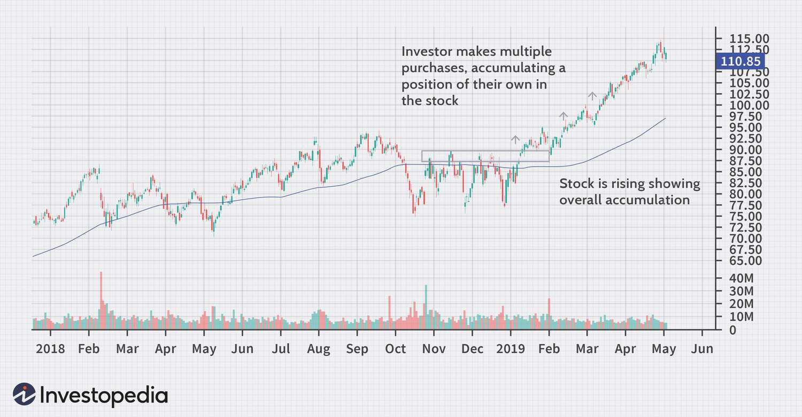

In today's dynamic financial environment, competitiveness and innovation are driven by accumulation finance, financial strategy, and algorithmic trading. These components have become vital for investors, whether they are just starting or have years of experience. Accumulation finance is the process of gradually increasing one's asset holdings, which serves as a cornerstone for building sustainable wealth. This approach not only helps in managing costs and risks but also positions investors to take advantage of market fluctuations.

Financial strategy, on the other hand, involves creating plans that guide investors in selecting and managing their investments to meet specific objectives. These strategies become even more potent when integrated with technology, particularly algorithmic trading. Algorithmic trading, with its ability to execute trades based on pre-set rules, brings a layer of precision and efficiency to accumulation strategies. By automating the trading process, investors can execute trades with speed and accuracy, analyzing vast datasets to pinpoint the best market opportunities.



This article examines how these elements intersect, providing both novice and seasoned investors with the knowledge to make informed decisions. By tapping into accumulation techniques and leveraging financial strategies through technology, investors can optimize their portfolios and improve returns. As the financial markets become increasingly complex, the integration of accumulation finance, strategic planning, and algorithmic solutions offers a powerful toolkit for navigating investments successfully.

## Table of Contents

## Understanding Accumulation in Finance

Accumulation in finance refers to the systematic approach of increasing asset holdings through multiple transactions. This strategy is crucial for investors and traders striving to build portfolio value over time, taking advantage of market fluctuations to acquire assets incrementally. By doing so, it helps in cost averaging and risk mitigation.

The practice of accumulation enables investors to enhance their portfolios through a phased purchase mechanism, wherein assets are bought over a series of transactions rather than a single purchase. This method helps in averaging out the acquisition cost across various price points, thereby reducing the overall investment risk. Consider the scenario where an investor buys a stock at three different prices: $100, $105, and $95 over a period. The average cost of the stock would be calculated as:

$$
\text{Average Cost} = \frac{100 + 105 + 95}{3} = 100
$$

Such a strategy ensures that the investor does not fully expose their capital to market [volatility](/wiki/volatility-trading-strategies) at a single point in time, allowing them to benefit from lower prices during market dips.

In financial markets, accumulation phases are often indicative of impending trends, characterized by heightened buying activities. This behavior typically precedes an upward movement in asset prices as more investors start recognizing the value and begin purchasing, thereby driving demand. The accumulation phase is marked by relatively stable prices where major market players like institutional investors acquire large volumes without affecting the market price significantly. These actions are often followed by a [breakout](/wiki/breakout-trading) when public interest peaks, leading to a price surge.

Accumulation not only supports long-term growth targets but also offers a buffer against short-term market unpredictability, making it a preferred strategy for both individual and institutional investors aiming to maximize returns while effectively managing risk.

## Financial Strategy: The Role of Accumulation

Accumulation serves as a fundamental financial strategy, allowing investors to methodically build wealth by gradually increasing their holdings in selected assets. This strategy aligns with a long-term investment perspective, where the aim is to mitigate risks associated with market volatility and capitalize on potential growth opportunities.

Investors employ accumulation strategies especially during market lows, as prices of assets tend to be more favorable. By combining accumulation with [fundamental analysis](/wiki/fundamental-analysis), investors can ascertain the intrinsic value of an asset, ensuring that they are investing in fundamentally sound securities. Fundamental analysis involves evaluating financial statements, market conditions, and economic factors to determine an asset’s true value. This combination allows investors to make informed decisions, selectively increasing their asset positions when the market is undervalued.

Incorporating accumulation strategies into personal finance plans not only facilitates the growth of investment portfolios but also contributes significantly to retirement savings. For example, investing consistently in a diversified set of assets over an extended period can result in a substantial retirement nest egg, thanks to the power of compounding. The mathematical principle of compounding, represented by the formula $A = P(1 + r/n)^{nt}$, where $A$ is the amount of money accumulated after n years, including interest, $P$ is the principal amount, $r$ is the annual [interest rate](/wiki/interest-rate-trading-strategies), $n$ is the number of times that interest is compounded per year, and $t$ is the time in years, highlights how accruing returns over time can significantly enhance financial growth.

Moreover, accumulation strategies can be automated using various financial tools, facilitating systematic investment approaches such as dollar-cost averaging. This technique involves investing a fixed amount of money at regular intervals, regardless of the asset's price, thus averaging the purchasing cost over time. Such strategies are particularly effective in volatile markets, reducing the impact of sharp price fluctuations.

Overall, accumulation as a financial strategy plays a crucial role in wealth-building by leveraging both strategic market entry during undervaluation phases and the disciplined application of fundamental analysis and investment planning.

## Algorithmic Trading and Accumulation Strategies

Algorithmic trading utilizes computer programs to execute trades based on pre-set criteria, allowing for the efficient implementation of accumulation strategies. One of the primary advantages of [algorithmic trading](/wiki/algorithmic-trading) in this context is its capacity to analyze vast amounts of data swiftly and accurately. This capability is crucial for identifying accumulation phases in financial markets.

Algorithms can detect accumulation phases by analyzing key technical indicators. The Accumulation/Distribution Indicator, for example, measures the cumulative flow of money into and out of an asset, providing insights into underlying buying or selling pressures. By assessing the difference between the closing and opening prices, and factoring in the trading [volume](/wiki/volume-trading-strategy), this indicator can signal whether an asset is being accumulated or distributed.

In addition to the Accumulation/Distribution Indicator, trading volumes and price patterns also play a vital role in identifying accumulation phases. High trading volumes, combined with stable or gradually increasing prices, often suggest that an asset is being accumulated. Algorithms can seamlessly integrate such data points with price patterns, like ascending triangles or cup and handle formations, to ascertain the likelihood of accumulation.

The use of algorithms in trading also reduces human error, ensuring trades are executed promptly and in accordance with the predefined strategy. This automated approach eliminates delays associated with manual trading, enabling traders to capitalize on opportunities as they arise. Furthermore, algorithms facilitate the continuous monitoring of market conditions, adjusting strategies dynamically in response to changing indicators.

A simple Python example for detecting accumulation could utilize a library like NumPy or pandas to analyze historical stock data:

```python
import pandas as pd

# Sample code to simulate detection of accumulation phase using moving averages
def detect_accumulation(data):
    data['Short_MA'] = data['Close'].rolling(window=10).mean()
    data['Long_MA'] = data['Close'].rolling(window=50).mean()
    accumulation = data[(data['Short_MA'] > data['Long_MA']) & (data['Volume'] > data['Volume'].rolling(window=10).mean())]

    return accumulation

# Load historical stock data
data = pd.read_csv('historical_stock_data.csv')
accumulation_phases = detect_accumulation(data)
```

This code demonstrates how to use simple moving averages to identify potential accumulation phases. By comparing short-term and long-term moving averages alongside trading volume, the algorithm can flag periods that might indicate accumulation.

In conclusion, algorithmic trading enhances the execution of accumulation strategies by analyzing technical indicators, reducing error, ensuring timely execution, and efficiently monitoring market dynamics. This enables investors to optimize their trading strategies, better manage risk, and potentially increase returns in complex market environments.

## Technical Indicators for Identifying Accumulation Phases

Various technical indicators serve as valuable tools for identifying accumulation phases in financial markets, which can be pivotal in making informed trading decisions. Among these, moving averages, the Relative Strength Index (RSI), and On-Balance Volume (OBV) are particularly significant.

**Moving Averages:** 

Moving averages smooth out price data by creating a constantly updated average price, which helps in identifying trends and potential reversals. Traders often use simple moving averages (SMA) or exponential moving averages (EMA) to determine accumulation phases. A common strategy involves analyzing the crossover between short-term and long-term moving averages. For example, if a short-term moving average crosses above a long-term moving average, it may indicate the beginning of an accumulation period.

**Relative Strength Index (RSI):** 

The RSI is a [momentum](/wiki/momentum) oscillator that measures the speed and change of price movements on a scale from 0 to 100. An RSI reading below 30 is typically considered oversold, which might signify an accumulation phase, as it suggests that the asset is potentially undervalued. Conversely, a reading above 70 indicates an overbought condition. By identifying these zones, traders can potentially recognize early stages of accumulation when prices are low.

**On-Balance Volume (OBV):** 

OBV is a technical trading momentum indicator that uses volume flow to predict changes in stock price. It provides insights into the strength of buying or selling pressure by adding volume on up days and subtracting it on down days. A rising OBV during a flat or declining market might indicate accumulation, as it suggests that the buying pressure is outweighing the selling pressure, potentially foreshadowing price increases as accumulation continues.

Understanding these tools can enable traders to detect accumulation phases effectively, potentially leading to advantageous trading positions both in manual trading and algorithmic strategies. By integrating these indicators, traders can gain an edge in recognizing when an asset is being accumulated, anticipating subsequent upward movements in price. 

For those interested in automating trading strategies, Python can be used to programmatically analyze these indicators. Here is a simple example using Python to calculate a moving average crossover:

```python
import pandas as pd
import numpy as np

# Assume df is a DataFrame with 'Close' prices of a stock
short_window = 40
long_window = 100

# Calculate the short and long moving averages
df['Short_MA'] = df['Close'].rolling(window=short_window, min_periods=1).mean()
df['Long_MA'] = df['Close'].rolling(window=long_window, min_periods=1).mean()

# Create signals
df['Signal'] = 0
df['Signal'][short_window:] = np.where(df['Short_MA'][short_window:] 
                                       > df['Long_MA'][short_window:], 1, 0)

# Calculate the positions
df['Position'] = df['Signal'].diff()

# Output the DataFrame to see positions for potential accumulation phase
print(df.tail())
```

This code snippet calculates short and long-term moving averages and identifies the crossover points which can signal an accumulation phase. Using these indicators effectively requires an understanding of both market conditions and the nuances of the indicators themselves.

## Case Study: Real-World Applications of Accumulation Finance

Examining real-world applications of accumulation finance offers valuable insights into its effectiveness as a strategy, particularly during market downturns. A prominent example is the accumulation phase observed with tech giants such as Amazon during economic downturns. Historically, Amazon's stock has experienced periods where its value was suppressed due to broader market conditions or company-specific challenges. During these times, astute investors recognized the intrinsic value and long-term potential of the company, gradually increasing their holdings in anticipation of a market recovery.

Successful investors and fund managers effectively leverage accumulation strategies, capitalizing on market corrections to acquire assets at favorable prices. This approach allows them to accumulate larger positions in undervalued assets, positioning themselves for substantial gains when the market rebounds. For instance, data analysis can reveal periods when institutional investors steadily increase their stakes in anticipation of future growth. The ability to identify and act on these opportunities through accumulation phases underscores the strategic advantage of this method.

The case of Amazon illustrates that strategic buying during these accumulation phases can lead to significant returns. For example, investors who purchased Amazon shares during downturn periods, such as the dot-com bubble burst in the early 2000s or the global financial crisis in 2008, realized substantial gains as the company's stock price soared in subsequent years. The ability to hold and expand positions in fundamentally strong companies during price dips is a testament to the potential rewards of accumulation strategies.

In addition to individual stock cases, accumulation strategies are also evident in broader market trends. During economic contractions, savvy investors often focus on exchange-traded funds (ETFs) or other diversified instruments, applying accumulation principles to enhance portfolio performance. By strategically increasing exposure to various assets, these investors effectively reduce risk, ensuring they are well-positioned for potential market upswings.

In conclusion, real-world applications, particularly those involving major technology firms like Amazon, demonstrate the potency of accumulation finance. Investors who adeptly apply these strategies can optimize their portfolios, achieving impressive returns despite initial market adversities. Understanding the dynamics of accumulation phases, combined with precise timing and robust analysis, is crucial for maximizing investment outcomes.

## Conclusion

The integration of accumulation strategies in finance and algorithmic trading offers significant potential to improve investment outcomes for both individual and institutional investors. By leveraging advanced technologies and comprehensive market analysis tools, traders can refine their approaches to manage risks effectively, whilst maximizing potential returns. Algorithmic trading allows for the precise execution of accumulation strategies, reducing susceptibility to human error and ensuring trades are carried out based on informed criteria.

Understanding the nuances of accumulation finance and embedding it into broader financial strategies is essential for navigating the complex financial landscape. The application of algorithmic trading ensures that traders can systematically identify and seize opportunities presented by accumulation phases, leading to optimized portfolio performance. This strategic alignment empowers investors to capitalize on market fluctuations, maintain a disciplined investment approach, and align asset holdings with long-term financial goals.

Continual advancements in financial technology and increasing data accessibility further enhance the efficacy of these strategies. Tools that analyze trading volumes, technical indicators, and price patterns enable investors to spot emerging trends promptly. Therefore, mastering accumulation finance and seamlessly integrating it with algorithmic trading is pivotal for those looking to thrive in today’s dynamic markets.

## References & Further Reading

[1]: Bergstra, J., Bardenet, R., Bengio, Y., & Kégl, B. (2011). ["Algorithms for Hyper-Parameter Optimization."](https://dl.acm.org/doi/10.5555/2986459.2986743) Advances in Neural Information Processing Systems 24.

[2]: ["Advances in Financial Machine Learning"](https://www.amazon.com/Advances-Financial-Machine-Learning-Marcos/dp/1119482089) by Marcos Lopez de Prado

[3]: ["Evidence-Based Technical Analysis: Applying the Scientific Method and Statistical Inference to Trading Signals"](https://www.amazon.com/Evidence-Based-Technical-Analysis-Scientific-Statistical/dp/0470008741) by David Aronson

[4]: ["Machine Learning for Algorithmic Trading"](https://github.com/stefan-jansen/machine-learning-for-trading) by Stefan Jansen

[5]: ["Quantitative Trading: How to Build Your Own Algorithmic Trading Business"](https://github.com/LucindaYa/quant-resources/blob/master/Quantitative%20Trading%20How%20to%20Build%20Your%20Own%20Algorithmic%20Trading%20Business.pdf) by Ernest P. Chan