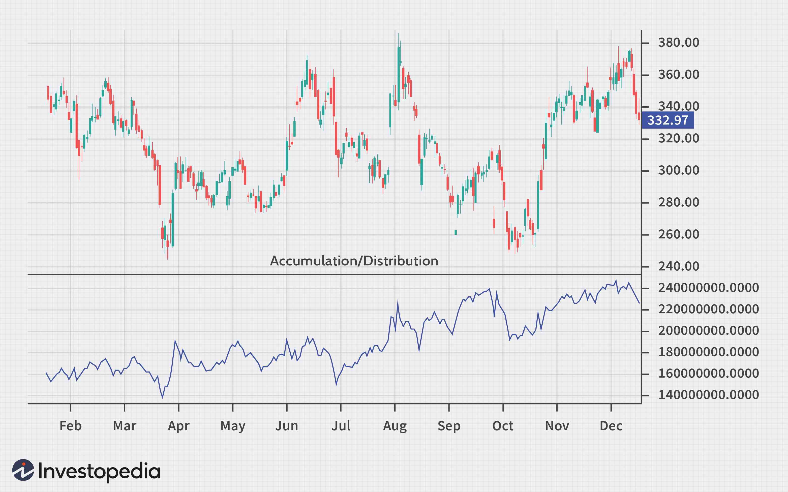

In the evolving world of financial management, both traditional and modern methods play crucial roles in shaping the investment landscape. Traditional investment strategies, characterized by a systematic evaluation of asset classes and risk assessment, continue to provide a solid foundation for pursuing financial goals. These strategies often emphasize diversification, balancing between stocks, bonds, and other securities to manage risk while striving for returns.

Simultaneously, the concept of the accumulation period in financial planning has gained prominence. This phase, essential for building a robust retirement fund, involves regular contributions to investment portfolios over time. The power of compounding plays a critical role, as reinvested income and capital growth exponentially enhance the value of the portfolio. Strategic planning during this period is essential to ensure financial security in later life stages.



The rising importance of algorithmic trading further supplements these traditional methods by employing technology to facilitate more efficient and precise transaction execution. Algorithmic trading relies on automated systems driven by complex algorithms that analyze market data rapidly to determine optimal trading opportunities. As technology evolves, these systems can offer significant advantages in terms of speed and accuracy, potentially outperforming manual trading strategies.

Examining the interplay between traditional investment strategies, the accumulation period, and algorithmic trading reveals insights into optimizing financial planning and enhancing investment outcomes. By integrating these components thoughtfully, investors can better navigate the complexities of modern markets, achieving financial objectives more effectively and efficiently.

## Table of Contents

## Understanding Investment Strategies

Investment strategies are foundational to successful financial management, aimed at selecting appropriate asset classes to meet specific financial goals. These strategies are diverse, ranging from conservative approaches focusing on bonds and cash reserves to more aggressive tactics that involve equities and commodities.

Conservative investment strategies focus on preserving capital. These strategies often include investments in bonds or money market instruments, considered low risk, providing stable, albeit lower, returns. Such approaches are generally favored by individuals with low risk tolerance or those nearing or in retirement, seeking to protect their initial capital with minimal risk exposure.

In contrast, aggressive investment strategies aim for higher returns by taking on greater risks, typically through investments in equities and commodities. Equities often form the core of aggressive strategies due to their potential for significant appreciation over time. Commodities, while volatile, can offer lucrative opportunities, particularly in markets with supply and demand fluctuations. These strategies suit investors with higher risk tolerance and longer time horizons, prepared to withstand greater market [volatility](/wiki/volatility-trading-strategies).

Each investment strategy is influenced by several key factors: 

1. **Risk Tolerance:** An investor's risk tolerance dictates the level of risk they are willing to accept. It is a personal measure, influenced by individual financial situations, investment goals, and psychological comfort with market fluctuations. 

2. **Time Horizon:** The time available to achieve financial goals significantly impacts strategy selection. Longer time horizons often afford the opportunity for more aggressive strategies, as temporary market declines can be weathered before the assets need to be liquidated. 

3. **Financial Objectives:** Clear financial goals, such as retirement savings, purchasing a home, or funding education, directly guide the choice of investment strategy. Distinct objectives will require different asset allocation and risk profiles.

Choosing the right investment strategy necessitates a personalized approach, tailored to the individual's unique circumstances and aspirations. The intricate balance of risk, reward, and time requires ongoing assessment to ensure that investment portfolios remain aligned with evolving financial goals and market landscapes. Adjustments may be needed over time to accommodate changing risk tolerance or time horizons, underscoring the dynamic nature of effective investment strategy development.

## The Importance of the Accumulation Period

The accumulation period is a critical phase in financial management, emphasizing the growth of savings and investments to establish a substantial retirement fund. During this period, individuals actively contribute to their investment portfolios, fostering the growth of capital over time through the power of compound interest. Compound interest, a fundamental principle in finance, allows for exponential growth as the returns on investments generate their own earnings. Mathematically, compound interest is expressed as:

$$
A = P \left(1 + \frac{r}{n}\right)^{nt}
$$

Where:
- $A$ is the future value of the investment,
- $P$ is the principal investment amount,
- $r$ is the annual interest rate (decimal),
- $n$ is the number of times interest is compounded per year,
- $t$ is the number of years the money is invested for.

Regular contributions during the accumulation period significantly enhance the compounding process, as each new investment benefits from the accumulated earnings. 

A well-planned accumulation period is crucial for ensuring financial security in retirement, as it allows individuals to build a robust financial cushion to support their future lifestyle. Strategic planning requires setting clear savings goals, understanding expected retirement expenses, and assessing risk tolerance to choose suitable investment vehicles. The selection of investment options, ranging from fixed-income securities to equities, should align with the investor’s financial objectives and time horizon. 

Research and historical data suggest that a diversified investment strategy, maintained consistently throughout the accumulation phase, can mitigate risks and maximize returns. Ultimately, the success of the accumulation period hinges on disciplined savings and investment practices, proactive financial planning, and the adaptability of investment strategies to align with life changes and economic fluctuations. Through these measures, investors can lay a strong foundation for their long-term financial well-being.

## Financial Planning during the Accumulation Period

Effective financial planning during the accumulation period is essential for building a substantial retirement fund. This process begins by setting clear financial goals, which serve as the foundation of any investment strategy. Goals should be specific, measurable, achievable, relevant, and time-bound (SMART). For instance, one might aim to accumulate a certain amount by retirement age or ensure a specific standard of living throughout retirement.

Understanding cash flow needs is another vital aspect of financial planning. This involves analyzing current and expected future expenses to determine how much money needs to be set aside for investments. A thorough understanding of cash flow allows investors to allocate their resources efficiently, ensuring they meet their immediate needs while contributing to long-term growth. Budgeting tools and software can be instrumental in tracking expenses and cash flow.

Selecting suitable investment options is crucial. The choice of investments should align with the individual's financial objectives, risk tolerance, and investment horizon. For example, younger investors with a longer investment horizon might opt for more aggressive strategies, such as equities, while those nearing retirement may seek the stability of bonds or other fixed-income securities.

Regularly reviewing and adjusting the financial plan is necessary to ensure it remains aligned with changing personal circumstances and market conditions. Market fluctuations, life events, or shifts in financial goals can all necessitate plan adjustments. Investors should assess their portfolios periodically and rebalance them as needed to maintain the desired asset allocation and risk level.

Financial advisors can offer valuable insights and guidance throughout the accumulation period. Advisors provide expertise in creating personalized strategies that account for individual investment goals, risk preferences, and financial circumstances. They can also assist in navigating complex financial products and offer advice on tax-efficient strategies. 

Tools like retirement calculators are beneficial in crafting robust financial strategies. These calculators can help estimate the future value of investments and the amount needed to save to achieve retirement goals. For example, a simple future value calculation can be performed using the formula:

$$
FV = PV \times (1 + r)^n
$$

where $FV$ is the future value of the investment, $PV$ is the present value or initial investment amount, $r$ is the annual interest rate, and $n$ is the number of years the money is invested.

Incorporating these tools and professional advice can significantly enhance the effectiveness of financial planning during the accumulation period. By doing so, investors can position themselves to secure a stable and comfortable retirement.

## Exploring Algorithmic Trading

Algorithmic trading refers to the use of automated systems for executing trades based on predefined criteria. This approach is driven by advanced technology and sophisticated data analysis, which collectively enable traders to capitalize on market opportunities with increased precision and speed. Unlike manual trading methods, which rely heavily on human intervention and are prone to delays, [algorithmic trading](/wiki/algorithmic-trading) executes orders rapidly, significantly reducing the reaction time to market changes.

The core of algorithmic trading systems is built on algorithms—sets of rules that can vary in complexity. These algorithms determine when to buy or sell assets based on parameters such as price, timing, or [volume](/wiki/volume-trading-strategy). For example, a simple algorithm might be structured to purchase a stock when its price falls below a specified threshold and sell it when the price rises above another threshold.

The efficiency of algorithmic trading arises from its ability to process vast amounts of market data quickly and execute trades accordingly. This form of trading often incorporates methodologies such as statistical [arbitrage](/wiki/arbitrage), [trend following](/wiki/trend-following), and mean reversion. The utilization of [machine learning](/wiki/machine-learning) techniques and [artificial intelligence](/wiki/ai-artificial-intelligence) has further enhanced the adaptability and predictive power of these systems, enabling them to continually refine their decision-making processes based on incoming data.

Algorithmic trading also facilitates high-frequency trading ([HFT](/wiki/high-frequency-trading-strategies)), characterized by a high turnover and short holding periods. HFT strategies generally involve placing a large number of orders at ultra-fast speeds, seeking to profit from small price discrepancies. Python is frequently used in developing and [backtesting](/wiki/backtesting) algorithmic trading strategies due to its extensive libraries such as Pandas and NumPy for data analysis, and [backtrader](/wiki/backtrader) for strategy development and testing.

Here is a simple Python example of a mean reversion strategy using Pandas:

```python
import pandas as pd
import numpy as np

def mean_reversion_strategy(prices, window=20, threshold=1.5):
    rolling_mean = prices.rolling(window=window).mean()
    rolling_std = prices.rolling(window=window).std()
    z_score = (prices - rolling_mean) / rolling_std

    buy_signal = z_score < -threshold
    sell_signal = z_score > threshold

    return buy_signal, sell_signal

# Sample usage
prices = pd.Series([100, 102, 101, 103, 107, 106, 105, 109, 111, 110])
buy_signal, sell_signal = mean_reversion_strategy(prices)

print("Buy Signals:\n", buy_signal)
print("Sell Signals:\n", sell_signal)
```

Investors increasingly integrate algorithmic trading within portfolios, leveraging its capabilities for more effective market engagement. The system also allows traders to handle issues of scale with ease by processing large trades through smaller, sequentially timed orders, minimizing market impact and improving execution quality. As technology continues evolving, algorithmic trading is expected to enhance efficiencies further and extend its reach across diverse financial markets.

## Integrating Algo Trading into Investment Strategies

Combining algorithmic trading with traditional investment strategies offers investors a nuanced means of balancing risk and reward, making it a pivotal tool in modern financial management. Algorithmic trading, or algo trading, utilizes computer algorithms to execute trades based on a predefined set of rules. This technology facilitates swift trade execution and can help manage routine tasks, leaving investors to concentrate on larger strategic decisions and the overarching management of their portfolios.

One of the primary advantages of integrating algo trading is the efficiency with which trades are executed. Algorithms can process large volumes of data and execute orders at speeds unmatchable by human traders, thereby exploiting market opportunities as they arise. This capability is particularly beneficial in volatile markets where rapid changes can affect trade outcomes significantly. Additionally, algorithmic trading systems can be programmed to minimize human emotional interference, which frequently impacts investment performance adversely.

Investors looking to incorporate algorithmic strategies need to understand the specific algorithms they plan to use. Algorithms can range from simple strategies based on moving averages to more complex ones using machine learning and artificial intelligence to analyze market data for predicting price movements. For example, a simple moving average crossover strategy could be expressed in Python as follows:

```python
import pandas as pd

# Assuming 'data' is a pandas DataFrame with a column 'Close' representing the closing price of a stock
data['SMA50'] = data['Close'].rolling(window=50).mean()
data['SMA200'] = data['Close'].rolling(window=200).mean()

# Generate buy/sell signals
data['Signal'] = 0
data.loc[data['SMA50'] > data['SMA200'], 'Signal'] = 1  # Buy signal
data.loc[data['SMA50'] < data['SMA200'], 'Signal'] = -1  # Sell signal

# Next steps would involve backtesting this strategy on historical data
```

Such strategies should be backtested against historical data to validate their effectiveness before implementation in live markets. Regular monitoring and performance evaluation after deployment are crucial to ensure that the algorithms remain aligned with the desired investment objectives and are responsive to changing market dynamics.

Despite the benefits, the integration of algo trading also presents challenges. Market conditions may shift, necessitating revisions to the algorithmic strategy, and technological glitches or misconfigurations could lead to unintended trades or losses. Furthermore, regulatory environments affecting algorithmic trading are evolving, requiring investors to stay informed and compliant with any new rules or amendments.

In conclusion, incorporating algorithmic trading into traditional investment strategies necessitates a thorough understanding of both the technology and market conditions. By leveraging the speed and precision of algorithms for routine tasks, while strategically managing broader investment decisions, investors can enhance their financial strategies and potentially increase their returns. Regular monitoring and due diligence can maximize the benefits while mitigating associated risks.

## Challenges and Considerations

Algorithmic trading, despite its advantages, presents several challenges that investors need to consider. One of the primary concerns is technological risk, which stems from the reliance on sophisticated software and hardware systems. The failure of these systems can lead to significant financial losses due to incorrect order execution or missed trading opportunities. It is crucial for investors to ensure robust technological infrastructure, incorporating redundancy and fail-safes to minimize downtime and errors. Regular system audits and upgrades can help in maintaining the reliability and efficiency of the trading algorithms.

Market volatility is another [factor](/wiki/factor-investing) that can adversely affect algorithmic trading. High-frequency trading algorithms, for example, can exacerbate market fluctuations, leading to increased instability. During periods of extreme volatility, these algorithms might execute a large number of trades in a very short timeframe, potentially leading to flash crashes. To mitigate such risks, investors should implement risk management strategies such as circuit breakers and staggered execution timings. These measures can prevent automated trades from overwhelming the market, reducing the impact of sudden price swings.

Regulatory considerations are also a significant challenge in algorithmic trading. The rapidly evolving landscape of financial regulations requires constant vigilance. Investors must stay informed about new rules and compliance requirements to avoid legal issues. Regulatory bodies, such as the U.S. Securities and Exchange Commission (SEC) and the European Securities and Markets Authority (ESMA), frequently update their guidelines to address the complexities introduced by algorithmic trading. Compliance with these regulations is crucial to avoid penalties and ensure ethical trading practices.

Moreover, due diligence in selecting and maintaining algorithms is vital. This involves regular performance reviews to assess the algorithms’ effectiveness and their alignment with investment objectives. Investors must evaluate metrics such as the Sharpe ratio, alpha, and beta to measure the risk-adjusted return and other performance aspects of their algorithms. Python, for instance, offers robust libraries like `pandas` and `numpy` for performing such analyses. Below is an example of how Python can be used to calculate the Sharpe ratio:

```python
import numpy as np
import pandas as pd

# Sample data: daily returns of an investment
daily_returns = pd.Series([0.001, 0.002, -0.001, 0.003, 0.002, -0.002])

# Risk-free rate assumption (e.g., 0.01 for 1%)
risk_free_rate = 0.01

# Calculate the mean and standard deviation of daily returns
mean_return = daily_returns.mean()
std_dev_return = daily_returns.std()

# Calculate the Sharpe ratio
sharpe_ratio = (mean_return - risk_free_rate) / std_dev_return
print(f'Sharpe Ratio: {sharpe_ratio:.2f}')
```

Finally, regular performance evaluation coupled with continuous algorithm improvement is crucial for optimal strategy effectiveness. This involves backtesting algorithms on historical data to predict future performance and adapting strategies in response to market changes. By addressing these challenges through informed and proactive measures, investors can leverage algorithmic trading to enhance their overall investment success.

## Conclusion

Investment strategies during the accumulation period serve as the bedrock for establishing long-term financial success. These strategies, characterized by their focus on systematic growth and capital appreciation, ensure that individuals build a robust retirement fund through disciplined saving and investing. On the other hand, algorithmic trading represents a modern approach that enhances traditional investment methods by leveraging technology to execute trades with unprecedented speed and precision. This fusion of innovative algorithmic techniques into conventional strategies allows investors to capitalize on market fluctuations more effectively.

Integrating traditional investment practices with algorithmic trading requires a thoughtful and strategic approach. It involves balancing the reliability and historical performance of traditional asset allocation with the cutting-edge advantages that algorithms present. For instance, while traditional analysis might focus on fundamental and technical aspects over a longer term, algorithms can process vast datasets in real-time to identify short-term opportunities and execute trades swiftly. This integration can significantly amplify portfolio performance by managing risks and capturing more nuanced market movements.

Incorporating algorithmic insights continually into financial strategies allows investors to enhance returns and work towards financial goals with greater efficiency. By employing algorithms for routine trading tasks, investors can focus more on strategic decision-making and portfolio oversight. This not only optimizes time management but also minimizes human errors associated with emotional and cognitive biases in trading decisions. Moreover, regular monitoring and adjustment of the algorithms used ensure alignment with investors' evolving goals and market conditions.

The adaptability required in modern investment landscapes underscores the importance of an informed and dynamic approach to financial planning. By strategically merging traditional and algorithmic strategies, investors are better equipped to navigate complexities, optimize portfolio performance, and secure their financial futures effectively.

## References & Further Reading

[1]: Bergstra, J., Bardenet, R., Bengio, Y., & Kégl, B. (2011). ["Algorithms for Hyper-Parameter Optimization."](https://dl.acm.org/doi/10.5555/2986459.2986743) Advances in Neural Information Processing Systems 24.

[2]: ["Advances in Financial Machine Learning"](https://www.amazon.com/Advances-Financial-Machine-Learning-Marcos/dp/1119482089) by Marcos Lopez de Prado

[3]: ["Evidence-Based Technical Analysis: Applying the Scientific Method and Statistical Inference to Trading Signals"](https://www.amazon.com/Evidence-Based-Technical-Analysis-Scientific-Statistical/dp/0470008741) by David Aronson

[4]: ["Machine Learning for Algorithmic Trading"](https://github.com/stefan-jansen/machine-learning-for-trading) by Stefan Jansen

[5]: ["Quantitative Trading: How to Build Your Own Algorithmic Trading Business"](https://www.amazon.com/Quantitative-Trading-Build-Algorithmic-Business/dp/1119800064) by Ernest P. Chan