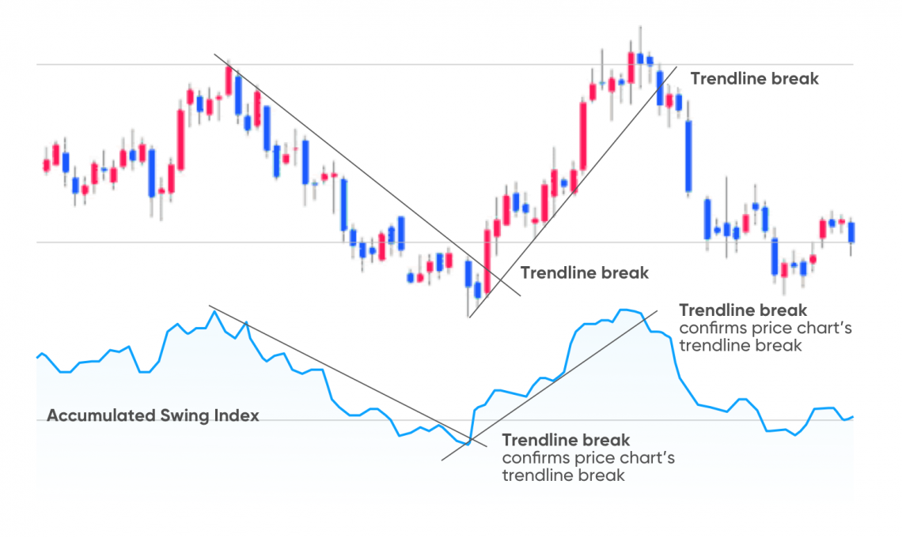

## Table of Contents

## What is the Accumulative Swing Index (ASI)?

The Accumulative Swing Index (ASI) is a technical analysis tool used by traders to measure the strength of price movements in a stock or other financial instrument. It was developed by J. Welles Wilder, who is also known for creating other popular indicators like the Relative Strength Index (RSI). The ASI works by comparing the current price of an asset to its previous price, taking into account the highest and lowest prices reached during the period. This comparison helps traders understand whether the price movement is strong or weak, which can be useful for making trading decisions.

The ASI is calculated using a formula that considers the opening, closing, high, and low prices of each trading period. The result is a cumulative value that can be plotted on a chart, showing how the strength of price movements accumulates over time. Traders often use the ASI in combination with other indicators to confirm trends and potential reversals. For example, if the ASI is rising while the price of the asset is also going up, it might suggest a strong bullish trend. Conversely, if the ASI is falling while the price is rising, it could indicate a weakening trend and a possible upcoming reversal.

## Who developed the Accumulative Swing Index and when?

The Accumulative Swing Index, or ASI, was developed by J. Welles Wilder. He is a famous person in the world of trading because he created many tools that help traders understand the stock market better. Wilder came up with the ASI in the late 1970s. This was around the same time he developed other well-known indicators like the Relative Strength Index (RSI).

The ASI is a tool that helps traders see how strong the price movements of a stock or other financial instrument are. It looks at the price of the asset over time and uses a special formula to figure out if the price changes are strong or weak. Traders use the ASI along with other tools to make better decisions about when to buy or sell.

## What is the basic formula used to calculate the ASI?

The Accumulative Swing Index, or ASI, is calculated using a formula that looks at the price changes of a stock or other financial instrument over time. The basic idea is to compare the current price to the previous price, and also consider the highest and lowest prices during the period. The formula uses these prices to figure out how strong the price movement is. It involves several steps, starting with calculating something called the "Swing Index" for each period.

To find the Swing Index, you use the opening, closing, high, and low prices of the current and previous periods. The formula for the Swing Index is quite detailed, but it basically measures the difference between the closing price and the previous closing price, adjusted by the high and low prices. Once you have the Swing Index for a period, you add it to the previous ASI value to get the new ASI. This way, the ASI keeps adding up the strength of price movements over time, giving traders a cumulative picture of how strong the price changes are.

## How does the ASI differ from other momentum indicators?

The Accumulative Swing Index (ASI) is different from other [momentum](/wiki/momentum) indicators because it focuses on the strength of price movements over time. Unlike other indicators that might just look at the current price or a short period, the ASI adds up the strength of price changes from one period to the next. This means it gives traders a longer-term view of how strong the price movement is. For example, while the Relative Strength Index (RSI) might tell you if a stock is overbought or oversold based on recent price changes, the ASI helps you see if those price changes are getting stronger or weaker over many periods.

Another way the ASI differs is in how it calculates its values. It uses the opening, closing, high, and low prices of each trading period to find something called the "Swing Index." This index measures how much the price has moved from one period to the next, considering the extremes of the price range. Other momentum indicators like the Moving Average Convergence Divergence (MACD) or the Stochastic Oscillator might use simpler calculations based on moving averages or the closing price alone. By using more detailed price data, the ASI can give a more nuanced view of market momentum, helping traders understand not just if the price is moving, but how strong that movement is.

## What are the key components needed to calculate the ASI?

To calculate the Accumulative Swing Index (ASI), you need to know the opening, closing, high, and low prices of the current and previous trading periods. These four prices are the key components that help figure out how strong the price movement is. The ASI starts by calculating something called the "Swing Index" for each period. The Swing Index looks at the difference between the closing price and the previous closing price, and it also considers the highest and lowest prices during the period. This helps measure the strength of the price change from one period to the next.

Once you have the Swing Index for a period, you add it to the ASI value from the previous period to get the new ASI. This way, the ASI keeps adding up the strength of price movements over time, giving you a cumulative picture of how strong the price changes are. By using all these price points, the ASI can give a more detailed view of market momentum compared to other indicators that might only use the closing price or simpler calculations. This makes the ASI a useful tool for traders who want to understand not just if the price is moving, but how strong that movement is over time.

## Can you explain the significance of the 'Swing Index' in the ASI calculation?

The 'Swing Index' is really important when you're figuring out the Accumulative Swing Index, or ASI. It's like the building block that helps you see how strong the price movement is from one trading period to the next. The Swing Index looks at the difference between the closing price of the current period and the closing price of the last period. But it doesn't stop there; it also takes into account the highest and lowest prices during the current period. This gives you a better idea of how much the price has moved and how strong that movement is.

Once you have the Swing Index for a period, you add it to the ASI value from the previous period. This way, the ASI keeps adding up the strength of price movements over time. It's like keeping a running total of how strong the price changes are. By using the Swing Index in this way, the ASI can show you not just if the price is going up or down, but also if those price changes are getting stronger or weaker over many periods. This makes the ASI a helpful tool for traders who want to understand the momentum of the market in a more detailed way.

## How is the ASI used to identify trends in the market?

Traders use the Accumulative Swing Index, or ASI, to spot trends in the market by looking at how the strength of price movements changes over time. The ASI adds up the strength of price changes from one period to the next, giving a cumulative picture of how strong the price movement is. If the ASI is going up, it means the price movements are getting stronger, which can suggest a strong trend. For example, if the price of a stock is going up and the ASI is also going up, it might mean there's a strong bullish trend happening.

On the other hand, if the ASI is going down while the price is still going up, it could mean the trend is getting weaker and might reverse soon. This helps traders decide when to buy or sell. By watching the ASI along with the price, traders can get a better idea of whether a trend is likely to continue or if it's time to be cautious. The ASI is often used with other tools to confirm what the market is doing, making it a helpful part of a trader's toolkit.

## What are common signals generated by the ASI that traders look for?

Traders look for certain signals from the Accumulative Swing Index, or ASI, to help them make decisions about buying or selling. One common signal is when the ASI starts to move in the opposite direction of the price. For example, if the price of a stock is going up but the ASI is going down, it might mean the upward trend is losing strength and could reverse soon. This can be a warning for traders to be careful or maybe even sell before the price drops.

Another signal traders watch for is when the ASI breaks through certain levels. If the ASI moves above a high level or below a low level, it can show that the trend is getting stronger. For instance, if the ASI breaks above a previous high while the price is also going up, it might mean the bullish trend is getting stronger, and it could be a good time to buy. Traders often use these signals along with other tools to make sure their decisions are based on a good understanding of the market.

## How can the ASI be combined with other technical indicators for better analysis?

Traders often use the Accumulative Swing Index, or ASI, along with other tools to get a better picture of the market. One popular way to do this is by using the ASI with the Relative Strength Index, or RSI. The RSI helps traders see if a stock is overbought or oversold, which means it might be time to sell or buy. If the ASI shows a strong trend and the RSI confirms that the stock isn't overbought or oversold, it can give traders more confidence in their decisions. For example, if the ASI is going up and the RSI is not in the overbought zone, it might be a good time to buy because the trend is strong and the stock isn't too expensive yet.

Another common combination is using the ASI with moving averages. Moving averages help smooth out price data to see the overall direction of the trend. If the ASI is rising and the price is above a moving average, it can confirm a strong bullish trend. On the other hand, if the ASI is falling and the price is below a moving average, it might signal a strong bearish trend. By looking at these indicators together, traders can get a clearer idea of whether a trend is likely to continue or if it's time to be cautious. This way, they can make more informed choices about when to enter or [exit](/wiki/exit-strategy) the market.

## What are the limitations or potential pitfalls of using the ASI?

One of the main limitations of using the Accumulative Swing Index, or ASI, is that it can sometimes give false signals. This happens because the ASI looks at the strength of price movements over time, but it doesn't always predict what will happen next. For example, the ASI might show a strong upward trend, but the price could suddenly drop because of news or other events that the ASI doesn't account for. Traders need to be careful and use other tools along with the ASI to make sure they're not misled by these false signals.

Another potential pitfall is that the ASI can be hard to use for people who are new to trading. The formula for calculating the ASI is quite detailed, using the opening, closing, high, and low prices of each trading period. This can be confusing for beginners who might not understand how to interpret the results. Also, because the ASI keeps adding up the strength of price movements, it can sometimes make small changes look bigger than they really are. This means traders need to have a good understanding of the market and use the ASI with other indicators to get the best results.

## How does the ASI perform in different market conditions, such as bull and bear markets?

In a bull market, the ASI can be really helpful for traders. When the market is going up and prices are rising, the ASI can show if the upward trend is strong or if it's starting to weaken. If the ASI keeps going up along with the prices, it means the bullish trend is strong and might keep going. But if the ASI starts to go down even though prices are still going up, it could mean the trend is losing strength and might reverse soon. This helps traders decide when to buy or sell, making sure they don't miss out on the upward movement or get caught when the market turns.

In a bear market, where prices are falling, the ASI can also be useful. If the ASI is going down along with the prices, it shows that the bearish trend is strong and might continue. This can help traders know when to sell or short sell to make the most of the downward trend. But if the ASI starts to go up while prices are still falling, it might mean the bearish trend is getting weaker and could reverse soon. By watching the ASI, traders can get a better idea of when the market might start to turn around and make more informed decisions about when to enter or exit the market.

## Are there any advanced techniques or modifications to the traditional ASI that experts use?

Experts sometimes use advanced techniques or modifications to the traditional ASI to get even better insights into the market. One common modification is to use different time periods for calculating the ASI. Instead of using the standard daily periods, traders might look at hourly or weekly data to see shorter or longer-term trends. This can help them catch quick changes in the market or understand bigger trends that develop over time. Another technique is to apply smoothing methods, like moving averages, to the ASI itself. This can help reduce the noise in the data and make it easier to spot the overall direction of the trend.

Another advanced technique involves combining the ASI with other technical indicators in more complex ways. For example, some traders use the ASI with the Average Directional Index (ADX) to measure both the strength and the direction of a trend. If the ASI shows a strong movement and the ADX confirms that the trend is strong, it can give traders more confidence in their decisions. Additionally, some experts might adjust the parameters of the ASI formula to better fit the specific market or asset they are trading. By tweaking the formula, they can make the ASI more sensitive to price changes or more focused on longer-term trends, depending on what they need.

## How is the ASI calculated?

The Accumulative Swing Index (ASI) is derived from the Swing Index (SI), combining daily price movements to form a comprehensive measure of market trends. The SI itself is calculated through a specific mathematical formula that encompasses several price elements including the high, low, open, and close prices. Here's a closer look at the core elements involved in computing the SI, which ultimately contributes to forming the ASI.

### Swing Index Calculation

The Swing Index is formulated using the following mathematical expression:

$$
\text{SI} = \frac{50 \times (C_t - C_{t-1} + 0.5 \times (C_t - O_t) + 0.25 \times (C_{t-1} - O_{t-1}))}{R}\]

Where:
- $C_t$ is the current period's closing price.
- $C_{t-1}$ is the previous period's closing price.
- $O_t$ is the current period's opening price.
- $O_{t-1}$ is the previous period's opening price.
- $R$ is the maximum of the absolute values of $(H_t - C_{t-1}), (L_t - C_{t-1}), (H_t - L_t)$.
- $H_t$ is the current period's high price.
- $L_t$ is the current period's low price.

### Accumulative Swing Index

After the Swing Index is calculated, it is accumulated over time to form the ASI, providing a broader trend assessment by summing up the daily SI values, as follows:

$$
\text{ASI}_t = \text{ASI}_{t-1} + \text{SI}_t
$$

The ASI offers a more in-depth and ongoing view of price movements by aggregating the shifts indicated by the Swing Index. This accumulation helps traders discern prolonged market trends, smoothing out the inconsistencies that might occur on a daily basis.

For practitioners in technical trading, understanding these calculations is crucial. Correctly interpreting price changes and incorporating them into the calculation ensures a reliable depiction of market trends, leading to better-informed trading decisions.

## References & Further Reading

[1]: Wilder, J. W. (1978). ["New Concepts in Technical Trading Systems"](https://archive.org/details/newconceptsintec00wild). Trend Research.

[2]: Pring, M. (2002). ["Technical Analysis Explained: The Successful Investor's Guide to Spotting Investment Trends and Turning Points"](https://archive.org/details/technicalanalysi00prin). McGraw-Hill Education.

[3]: Aronson, D. R. (2007). ["Evidence-Based Technical Analysis: Applying the Scientific Method and Statistical Inference to Trading Signals"](https://onlinelibrary.wiley.com/doi/book/10.1002/9781118268315). Wiley.

[4]: Lopez de Prado, M. (2018). ["Advances in Financial Machine Learning"](https://www.amazon.com/Advances-Financial-Machine-Learning-Marcos/dp/1119482089). Wiley.

[5]: Chan, E. P. (2009). ["Quantitative Trading: How to Build Your Own Algorithmic Trading Business"](https://github.com/ftvision/quant_trading_echan_book). Wiley.