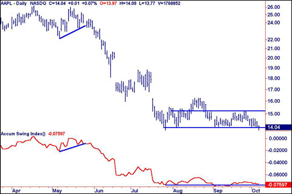

Technical analysis is a method used to evaluate and forecast the future price movements of financial instruments by analyzing past market data, primarily price and volume. This method is essential in trading as it provides a systematic approach to understanding market behavior, enabling traders to make informed decisions. By interpreting chart patterns and technical indicators, traders can identify potential entry and exit points, enhance their trading strategies, and manage risks effectively.

The McClellan Oscillator and the Accumulative Swing Index (ASI) are two of the many tools employed in technical analysis to aid in these decisions. The McClellan Oscillator, developed by Sherman and Marian McClellan, is designed to capture market breadth and momentum by measuring the difference between the number of advancing and declining stocks, offsetting the impact of extremely bullish or bearish days. Its calculations utilize exponential moving averages to smoothen this data, making it easier to identify market trends and momentum shifts. This composite indicator is vital for traders who wish to gauge the overall market mood and potential reversals.



The Accumulative Swing Index, introduced by J. Welles Wilder, is another pivotal indicator that emphasizes long-term trend analysis. It is derived from the Swing Index, which calculates price movements' numerical index. ASI aggregates these values, providing insights into potential breakouts and trend continuations. This makes it a powerful tool for traders focused on maintaining positions aligned with prevailing trends.

Algorithmic trading, which involves using computer algorithms to execute trades at optimal conditions, has seen a substantial rise over the years. Its integration with technical indicators like the McClellan Oscillator and ASI allows traders to automate the identification of trading opportunities based on predefined criteria. This automation not only increases the efficiency and speed of executing trades but also minimizes human error, enabling a more consistent application of trading strategies.

In summary, technical analysis remains a cornerstone of trading practice, offering traders a structured way to interpret market signals. The McClellan Oscillator and ASI are critical components of this analytical arsenal, providing insights into market sentiment and trends. When combined with algorithmic trading, these indicators form a powerful synergy, facilitating more precise and timely trading actions.

## Table of Contents

## Understanding the McClellan Oscillator

The McClellan Oscillator is a technical analysis tool designed to evaluate market breadth and momentum, offering traders insights into the underlying dynamics of financial markets. Developed by Sherman and Marian McClellan in 1969, the oscillator is constructed to emphasize the direction and strength of market movements by analyzing the difference between the advancing and declining stocks within an index.

The McClellan Oscillator measures market breadth by comparing the number of advancing stocks to declining ones, providing a more comprehensive view of market sentiment. It functions as a [momentum](/wiki/momentum) indicator by gauging the acceleration and deceleration of this breadth, allowing traders to anticipate potential shifts in market trends. The oscillator's efficacy lies in its ability to highlight divergences between market indices and broader market behavior, thus serving as an early warning system for potential market reversals.

The calculation of the McClellan Oscillator involves the use of exponential moving averages (EMAs) to smoothen data and enhance the responsiveness of the indicator. Specifically, it operates by subtracting a longer-term EMA from a shorter-term EMA of the daily difference between advancing and declining issues. The technical formula can be expressed as:

$$
\text{Oscillator} = \text{EMA}_{19}(\text{Advances} - \text{Declines}) - \text{EMA}_{39}(\text{Advances} - \text{Declines})
$$

Here, $\text{EMA}_{19}$ represents the 19-day EMA of the net differences between advances and declines, while $\text{EMA}_{39}$ signifies the 39-day EMA of the same data. These periods can be adjusted to fit different trading strategies, but the classic usage epitomizes the balance between responsiveness and consistency in analyzing price movements.

The McClellan Oscillator centers around a zero line, where movements above zero suggest growing momentum and an increasingly bullish trend, whereas movements below zero indicate waning momentum and a bearish outlook. Traders often interpret extreme values as signals of overbought or oversold conditions, potentially forecasting corrective moves.

Through its historical context and precise calculation methodology, the McClellan Oscillator remains an instrumental tool for traders seeking to comprehend and predict market movements, especially when integrated with other indicators and trading strategies.

## Applications of the McClellan Oscillator in Trading

The McClellan Oscillator is an invaluable tool for traders seeking to understand market trends through the analysis of market breadth. By quantifying the net advances and declines in the stock market, this oscillator aids in discerning the underlying strength or weakness of market movements. To effectively use the McClellan Oscillator in trading, one must grasp how it functions as an indicator of momentum and trend direction.

### Identifying Market Trends

The McClellan Oscillator helps in identifying market trends by illustrating whether more stocks are advancing or declining, indicating bullish or bearish momentum. The oscillator is calculated by taking the difference between two exponential moving averages (EMAs) of advancing minus declining issues, typically using short-term (usually 19 days) and long-term (usually 39 days) periods. 

$$
\text{McClellan Oscillator} = EMA_{19}(\text{Adv - Dec}) - EMA_{39}(\text{Adv - Dec})
$$

When the McClellan Oscillator is above zero, it suggests that the short-term average is greater than the long-term average, implying an upward trend. Conversely, values below zero suggest a downward trend.

### Generating Buy and Sell Signals

Traders generate buy and sell signals using the crossover method with the McClellan Oscillator. A crossover occurs when the oscillator moves across the zero line, acting as a signal for potential trading action. 

- **Buy Signal:** When the McClellan Oscillator crosses above zero, it indicates increasing bullish momentum, suggesting a potential buy opportunity.
- **Sell Signal:** When the oscillator crosses below zero, it signals increasing bearish momentum, which could warrant a sell action.

These signals provide traders with actionable insights into the potential continuation or reversal of current trends.

### Market Sentiment Analysis

The McClellan Oscillator also serves as a tool for market sentiment analysis, aiding traders in understanding collective investor behaviors. When the oscillator exhibits high positive values, it indicates strong bullish sentiment, whereas high negative values reveal strong bearish sentiment. 

By interpreting these sentiments, traders gain insights into the market's emotional state, which can be much more immediate than fundamental indicators. For example, consistently high positive readings may warn of overbought conditions, prompting a reassessment of long positions, while prolonged negative readings may indicate oversold conditions, inviting potential buying opportunities.

In summary, the McClellan Oscillator offers traders a robust mechanism for evaluating market trends and investor sentiment, providing critical buy and sell signals that align with market movements. Its ability to gauge underlying market strength makes it an essential component in the technical analysis toolkit.

## The Accumulative Swing Index (ASI)

The Accumulative Swing Index (ASI) is a technical analysis tool developed by J. Welles Wilder Jr., who introduced it in his 1978 book, "New Concepts in Technical Trading Systems." This indicator aims to provide a comprehensive measure of market sentiment, combining price changes with directional movements to deduce market trends.

### Calculation of the ASI

The ASI is constructed around Wilder's Swing Index, which measures daily price movements on a scale from -100 to +100. To compute the ASI, one starts by calculating the Swing Index (SI) for a given period, typically daily. The Swing Index is computed as follows:

$$

SI = 50 \times \frac{{(C_t - C_{t-1}) + \frac{1}{2} \times (C_t - O_t) + \frac{1}{4} \times (C_{t-1} - O_{t-1})}}{{TR}} \times \frac{K}{R} 
$$

Where:
- $C_t$ and $C_{t-1}$ are the current and previous closing prices, respectively.
- $O_t$ and $O_{t-1}$ are the current and previous opening prices, respectively.
- $TR$ is the true range.
- $R$ represents the maximum of $| H_t - C_{t-1} |$, $| L_t - C_{t-1} |$, and $| H_t - L_t |$, where $H_t$ and $L_t$ are the current high and low prices.
- $K$ is an arbitrary constant determined by the maximum possible value of $| H_t - L_t |$.

The ASI itself is a cumulative metric, summing the daily Swing Indices:

$$
ASI_t = ASI_{t-1} + SI_t
$$

This accumulation over time allows traders to identify long-term trends, smoothing out the daily [volatility](/wiki/volatility-trading-strategies) noticed in individual Swing Index calculations.

### Role in Determining Long-term Trends

The ASI is designed to highlight significant trends and reversal points by visually plotting the cumulative line against price movements. Traders consider the ASI particularly useful in catching breakouts and following directional movements. When the ASI moves above or below predefined horizontal lines, it indicates potential zones of resistance or support, signaling a potential market trend change.

### Comparison with Other Trend Indicators

The ASI shares similarities with other trend-following indicators like Moving Average Convergence Divergence (MACD) and the Average Directional Index (ADX), each using unique calculations to assess trends. Unlike MACD, which relies on moving averages to determine momentum, or ADX, which assesses trend strength without direction, the ASI provides a direct accumulation of directional price movement. 

While the ASI focuses on a comprehensive angle to track market sentiment, its main advantage is its ability to capture both volatility and directional changes in a single metric, often used in conjunction with other indicators for enhanced accuracy. This multiplayer approach allows the ASI to offer context for interpretation and warrants cross-referencing with other technical tools to confirm long-term market trends.

## Trading Strategies Using ASI and McClellan Oscillator

Combining the Accumulative Swing Index (ASI) with the McClellan Oscillator can yield robust trading strategies by allowing traders to confirm trends and make precise market entry and [exit](/wiki/exit-strategy) decisions. These indicators, when used together, provide a comprehensive view of both momentum and market breadth, enhancing the decision-making process.

### Examples of Trend Confirmation and Market Entry/Exit Strategies

To effectively utilize these indicators, it's essential to understand how they can complement each other. The McClellan Oscillator, which measures market breadth using exponential moving averages, can be used to detect shifts in momentum. For example, when the oscillator crosses above its zero line, it may indicate a potential uptrend, while crossing below suggests a downtrend. On the other hand, the ASI provides insights into long-term trends by analyzing price movements over time.

A practical strategy might involve using the McClellan Oscillator to identify a change in market momentum, followed by the ASI to confirm the emerging trend's strength. For instance, if the McClellan Oscillator indicates a bullish trend (crossing above zero) and ASI values are also trending upwards, it can signal a strong buy opportunity. Conversely, a bearish crossing in the oscillator coupled with a declining ASI might be a cue to sell.

```python
def calculate_mcclellan_oscillator(advancers, decliners, ema_short_period=19, ema_long_period=39):
    net_advances = advancers - decliners
    ema_short = net_advances.ewm(span=ema_short_period, adjust=False).mean()
    ema_long = net_advances.ewm(span=ema_long_period, adjust=False).mean()
    return ema_short - ema_long

def calculate_asi(prices, high, low, close, open, limit_move=3.5):
    # Placeholder for ASI calculation method
    pass

# Example usage within a trading strategy
advancers = ... # Array or Series of advancing stocks count
decliners = ... # Array or Series of declining stocks count
prices, high, low, close, open = ... # Price data

mcclellan_osc = calculate_mcclellan_oscillator(advancers, decliners)
asi = calculate_asi(prices, high, low, close, open)
```

### Potential Advantages in Algorithmic Trading

Incorporating ASI and the McClellan Oscillator into [algorithmic trading](/wiki/algorithmic-trading) systems can significantly enhance trading efficiency and accuracy. Algorithms can be programmed to monitor these indicators continuously, enabling rapid responses to market conditions. Additionally, automated systems mitigate emotional biases, allowing for consistent application of trading strategies.

For instance, an algorithm could be designed to trigger buy or sell orders based on specific thresholds in both indicators, thus automating both market entry and exit strategies while ensuring that the necessary criteria for trend confirmation are met. This approach not only accelerates trading operations but also allows for [backtesting](/wiki/backtesting) historical data to refine the strategies further.

In summary, the synergistic application of the Accumulative Swing Index and the McClellan Oscillator in trading strategies can provide traders with a deeper understanding of market dynamics and foster more informed trading decisions. When integrated into algorithmic trading systems, these indicators can facilitate swift, reliable, and emotion-free trading, enhancing the potential for financial success.

## Algorithmic Trading and Technical Indicators

Algorithmic trading, often referred to as automated or black-box trading, has become a cornerstone in financial markets. It involves the use of computer programs to execute trading strategies that can automatically place orders based on pre-defined criteria. This method of trading has gained popularity for its ability to analyze vast amounts of data, swiftly execute trades, and reduce human error.

Technical indicators play a crucial role in algorithmic trading by supplying actionable insights into market dynamics. The McClellan Oscillator and the Accumulative Swing Index (ASI) are among such indicators that traders embed within algorithmic frameworks to enhance decision-making processes.

### Implementation of ASI and McClellan Oscillator in Trading Algorithms

The integration of the McClellan Oscillator and ASI into trading algorithms involves transforming mathematical formulas into code that can be efficiently processed by computers. For instance, the McClellan Oscillator, a market breadth indicator, is calculated using the difference between two exponential moving averages (EMAs) of advancing and declining issues. Here's a simplified Python code snippet for calculating the McClellan Oscillator:

```python
def calculate_ema(data, period):
    ema = [sum(data[:period]) / period]
    multiplier = 2 / (period + 1)
    for price in data[period:]:
        ema.append((price - ema[-1]) * multiplier + ema[-1])
    return ema

advancing_issues = [45, 50, 55, 60]
declining_issues = [20, 25, 30, 35]
ema_short = calculate_ema(data=advancing_issues, period=19)
ema_long = calculate_ema(data=declining_issues, period=39)
mcclellan_oscillator = [short - long for short, long in zip(ema_short, ema_long)]
```

Similarly, the ASI, which helps in determining long-term trends by considering open, high, low, and closing prices, can be implemented through algorithms to flag potential buying or selling points.

### Benefits of Automated Analysis and Decision-Making in Trading

The primary advantage of using algorithmic trading with technical indicators is the increase in efficiency and speed. Algorithms are capable of scanning multiple markets and securities simultaneously, delivering insights and executing trades faster than any human trader could. This speed is crucial in capitalizing on short-lived market opportunities.

Furthermore, algorithms can process large datasets to identify trading patterns and generate predictive models, minimizing the emotional biases which often cloud human judgment. Automated trading systems can operate 24/7, ensuring that opportunities are not missed even outside traditional trading hours.

In conclusion, the marriage of algorithmic trading with technical indicators like the McClellan Oscillator and ASI empowers traders by providing a systematic approach to market analysis. These technologies combine to create a trading environment where decisions are driven by data, enhancing both the efficiency and effectiveness of financial market operations.

## Challenges and Limitations

When utilizing the McClellan Oscillator and the Accumulative Swing Index (ASI) in trading, it's essential to be mindful of the challenges and limitations inherent in these technical indicators. One primary concern is the generation of false signals. The McClellan Oscillator, which relies on market breadth data, can occasionally produce misleading buy or sell signals, particularly during periods of market volatility or low [liquidity](/wiki/liquidity-risk-premium). Similarly, the ASI, which calculates trends from price swings, may misinterpret short-term fluctuations in price as long-term trends, leading to erroneous conclusions about market direction.

To mitigate these risks, traders often use auxiliary tools and datasets to confirm signals provided by these indicators. For example, corroborating the findings of the McClellan Oscillator with other momentum indicators, such as the Relative Strength Index (RSI) or Moving Average Convergence Divergence (MACD), can provide a more comprehensive view of market conditions. Moreover, leveraging [volume](/wiki/volume-trading-strategy) data can help verify trends suggested by the ASI, as high-volume trades tend to support genuine market movements.

Managing risks in the context of algorithmic trading requires a robust framework. Algorithms executing trades based on these indicators need backtesting against historical data to ensure efficacy across various market conditions. Additionally, implementing stop-loss orders and other risk management techniques can help limit potential losses from false signals. Algorithms should include mechanisms for dynamic adjustment to market conditions, reducing reliance on a single indicator by incorporating a multi-faceted approach to analysis.

In summary, while the McClellan Oscillator and ASI can significantly enhance trading strategies, they are not without their pitfalls. By integrating additional confirmation tools and implementing sound risk management practices, traders can effectively navigate the complexities of the market and optimize the use of these indicators.

## Conclusion

The McClellan Oscillator and the Accumulative Swing Index (ASI) stand as significant tools in the arsenal of technical analysis, offering traders a structured approach to understanding and navigating market dynamics. The McClellan Oscillator, by providing insights into market breadth and momentum, and the ASI, by highlighting long-term trends, can collectively enhance one's ability to make informed trading decisions. These indicators excel in simplifying complex market data into actionable insights, thereby increasing the accuracy of trend prediction and the timeliness of entry and exit signals. 

Leveraging technical analysis through these indicators allows traders to align their strategies with prevailing market conditions. The McClellan Oscillator helps capture shifts in sentiment, identifying when markets are overbought or oversold, thus aiding in anticipating reversals. In contrast, the ASI offers a long-term view that can confirm trends and help in identifying potential breakouts or breakdowns. Together, these tools can form the backbone of a comprehensive strategy that adapts to different market environments, enhancing one's ability to manage risks and optimize returns.

To achieve financial success in trading, it is essential to integrate these technical indicators within a broader strategic framework. Traders should combine the insights from the McClellan Oscillator and ASI with other analytical tools and [fundamental analysis](/wiki/fundamental-analysis) to ensure well-rounded decision-making processes. Such integration not only helps mitigate false signals but also fosters a more robust understanding of market movements. Encouraging a disciplined approach to trading, supported by continuous learning and adaptation, can significantly improve outcomes. By adopting comprehensive strategies that blend technical prowess with market acumen, traders can better position themselves to capitalize on opportunities and achieve sustainable financial success.

## References & Further Reading

[1]: McClellan, T., & McClellan, S. (2003). ["An Overview of the McClellan Oscillator and McClellan Summation Index."](https://www.mcoscillator.com/download/special/McClellan_MTAaward.pdf) McClellan Financial Publications.

[2]: Wilder, J. W. (1978). ["New Concepts in Technical Trading Systems."](https://archive.org/details/newconceptsintec00wild) Trend Research.

[3]: Aronson, D. R. (2007). ["Evidence-Based Technical Analysis: Applying the Scientific Method and Statistical Inference to Trading Signals."](https://onlinelibrary.wiley.com/doi/book/10.1002/9781118268315) Wiley.

[4]: Chan, E. (2009). ["Quantitative Trading: How to Build Your Own Algorithmic Trading Business."](https://github.com/ftvision/quant_trading_echan_book) Wiley.

[5]: Elder, A. (1993). ["Trading for a Living: Psychology, Trading Tactics, Money Management."](https://www.amazon.com/Trading-Living-Psychology-Tactics-Management/dp/0471592242) Wiley.

[6]: Lopez de Prado, M. (2018). ["Advances in Financial Machine Learning."](https://www.amazon.com/Advances-Financial-Machine-Learning-Marcos/dp/1119482089) Wiley.

