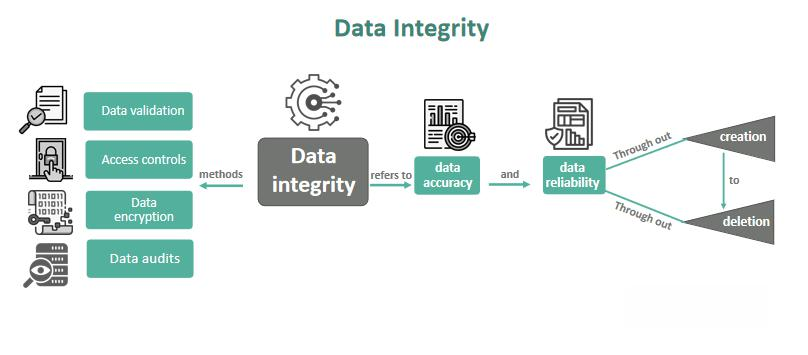

The financial markets are increasingly influenced by technology-driven strategies, with algorithmic trading standing prominently at the forefront of this evolution. Algorithmic trading, often referred to as algo trading, employs pre-programmed algorithms to execute trades based on various factors such as price, timing, and quantity. This technologically sophisticated method allows traders to execute orders with speed and precision that human traders simply cannot match.

Accuracy in algo trading is a critical component for ensuring the profitability and effectiveness of trading strategies. At its core, accuracy refers to the precision with which trading algorithms execute trades in alignment with predetermined strategies. This involves multiple elements, including correct signal generation, timely trade execution, and the accuracy of backtesting results. Without a high degree of accuracy, algorithms risk placing erroneous orders, which can lead to unwanted positions and financial losses.



As the trading environment is characterized by rapid changes and fleeting opportunities, the significance of accuracy cannot be overstated. A reliable algo trading system must be capable of adapting to various market conditions and executing trades with minimal latency. This article explores the concept of accuracy in algorithmic trading, its significance for market participants, challenges faced in achieving it, and strategies to enhance it within algorithmic systems. Through this exploration, the aim is to underline why precision is not merely a technicality but a foundational aspect of crafting successful algorithmic trading strategies.

## Table of Contents

## Understanding Accuracy in Algorithmic Trading

Accuracy in [algorithmic trading](/wiki/algorithmic-trading) is defined by the precision with which trading algorithms execute trades according to their predefined strategies. This precision is critical for ensuring that the executed trades align closely with the intended strategy outcomes, thereby reducing the potential for errors and optimizing financial returns.

Key elements of accuracy in algorithmic trading include the correct generation of trading signals, the execution of trades at the appropriate time, and the reliability of [backtesting](/wiki/backtesting) results. Correct signal generation involves the algorithm's ability to interpret market data and identify profitable trading opportunities accurately. This requires the algorithm to process significant volumes of data efficiently and make decisions based on complex analyses, such as technical indicators and statistical models.

Timely trade execution is another fundamental component of accuracy. Even if an algorithm generates correct trading signals, delays in executing these orders can lead to missed opportunities or expose the algorithm to undesirable market conditions. Precision in execution helps ensure that trades occur at optimal prices and within the anticipated timeframe.

In addition, the accuracy of backtesting results plays a significant role. Backtesting involves running trading algorithms on historical data to evaluate how they would have performed in past market conditions. The reliability of these results is crucial since they form the basis for deploying algorithms in live environments. Inaccurate backtesting can lead to over-optimistic expectations and suboptimal decision-making when actual trading begins.

Math and computational tools often assist in enhancing accuracy. For example, the implementation of moving averages to smooth price data can reduce noise and facilitate clearer signal generation:

```python
def moving_average(prices, window_size):
    return [sum(prices[i:i+window_size]) / window_size for i in range(len(prices) - window_size + 1)]
```

This Python code snippet calculates the moving average for a given list of prices, helping traders identify trends and generate accurate signals.

Assessing accuracy also requires evaluating the algorithm's performance under various market conditions. Here, the algorithm's ability to adapt and function efficiently in different trading environments is tested. Diverse factors like [volatility](/wiki/volatility-trading-strategies), [liquidity](/wiki/liquidity-risk-premium), and market news can impact performance, necessitating robust models that can mitigate these influences.

In summary, accuracy in algorithmic trading is about aligning the execution of trades with strategic objectives by ensuring precise signal generation, timely execution, and reliable backtesting. This precision is essential for minimizing errors and maximizing the effectiveness of trading algorithms across varying market conditions.

## Importance of Accuracy for Algorithmic Traders

Accuracy is a fundamental aspect of algorithmic trading, crucially affecting both profitability and risk management. In an industry characterized by rapid price shifts and volatile market conditions, algorithms must execute trades with remarkable precision and speed to capitalize on transient market opportunities. Accurate algorithms ensure trades are executed at the optimal moment, with minimal latency, thereby maximizing potential returns. 

The ramifications of inaccuracies in algorithmic trading can be substantial. Misplaced trades or erroneous order executions can lead to significant financial losses. Moreover, repeated inaccuracies may compromise the credibility and trust in automated trading systems, presenting a challenge for traders who rely heavily on these systems for executing trading activities. This erosion of trust can lead to reduced adoption of algorithmic strategies, potentially hampering an organization’s competitive edge in the fast-paced financial markets.

Accuracy also plays a crucial role in maintaining competitiveness. In algorithmic trading, milliseconds can make a difference. Algorithms capable of executing trades swiftly and precisely can capture advantageous positions before the opportunity vanishes, a capability that is indispensable in today’s high-frequency trading environment. This precision not only enhances profitability but also aids in mitigating risk by ensuring that strategies align closely with intended market actions.

Therefore, prioritizing accuracy in algorithmic trading is not just about avoiding losses but about leveraging technological tools and advanced strategies to stay ahead in an ever-evolving financial landscape. By doing so, traders can enhance their decision-making processes, improve the reliability of their systems, and achieve superior financial outcomes.

## Challenges to Achieving Accuracy

Achieving accuracy in algorithmic trading is fraught with challenges that stem from various technical and market-driven factors. One of the most significant obstacles is technological limitations, particularly related to latency and connectivity. Latency issues arise when there is a delay in the time taken for data to be transmitted from one point to another. In high-frequency trading environments, where decisions are made in microseconds, even minimal latency can significantly impact trading outcomes. For example, a latency of a few milliseconds can mean the difference between capitalizing on a profitable opportunity or missing it entirely.

Data quality issues also present a formidable barrier to accuracy. Algorithmic trading relies heavily on data-driven decisions, necessitating high-quality and clean data. Poor data quality, which might include incorrect, outdated, or incomplete data sets, can lead to erroneous trading decisions. This can manifest in the form of incorrect signal generation or miscalculated risk assessments, ultimately leading to financial losses.

Market volatility poses another challenge to the accuracy of algorithmic trading systems. Volatile markets can cause significant price swings within a very short period, making it difficult for algorithms to maintain their profitability. Moreover, market volatility can be exacerbated by rare and unpredictable events, often referred to as "black swan" events. These events are characterized by their extreme rarity and severe impact, rendering algorithms, unprepared for such scenarios, ineffective.

Outdated algorithms also contribute to decreased accuracy. The financial markets are dynamic, with conditions changing due to economic developments, regulatory changes, and technological advancements. Algorithms that are not routinely updated or adaptive to these changes may fail to perform accurately in new market environments. This can lead to suboptimal trading decisions, as the algorithm might operate under the assumption that outdated market conditions are still prevalent.

To address these challenges, maintaining a robust technological infrastructure that minimizes latency, ensuring the integrity and quality of data inputs, and continuously updating algorithms to adapt to a changing market landscape are crucial steps for traders aiming to improve the accuracy of their algorithmic trading systems.

## Improving Accuracy in Algorithmic Trading

Enhancing the accuracy of algorithmic trading systems is crucial for optimizing trading performance and profitability. High-quality, real-time data feeds are fundamental for making precise decisions. The effectiveness of algorithms is heavily reliant on the consistency and accuracy of the data they process. Real-time data ensures that trading decisions are based on the most up-to-date information, minimizing the risk of executing trades based on outdated or inaccurate data.

Robust backtesting is another vital component of enhancing algorithm accuracy. By applying trading algorithms to diverse historical data sets, traders can assess how their strategies might perform under different market conditions. Backtesting involves simulating trades over a past data set and analyzing the results to identify strengths and weaknesses. This process can help refine algorithm performance by adjusting parameters or strategies based on historical outcomes. Python, for instance, offers tools such as the `Backtrader` library that allows for detailed backtesting analysis.

To maintain high accuracy, implementing real-time monitoring and adjustment tools is essential. These tools enable traders to promptly modify algorithms in response to dynamic market conditions. For example, a sudden increase in volatility might require real-time adjustments to risk management parameters to prevent potential losses. Monitoring tools can continuously track algorithm performance and market conditions, alerting traders to any significant discrepancies or opportunities.

Advanced technologies such as [machine learning](/wiki/machine-learning) offer substantial potential to enhance algorithm adaptability and precision. Machine learning can process vast amounts of data and recognize patterns that may not be apparent through traditional analysis. By learning from past trades and market fluctuations, machine learning models can dynamically adjust algorithms, improving their accuracy and responsiveness to changing market conditions. For instance, models such as neural networks or [reinforcement learning](/wiki/reinforcement-learning) can be trained to optimize trading strategies based on a wealth of historical and real-time data.

In summary, improving accuracy in algorithmic trading requires a multifaceted approach involving high-quality data, rigorous backtesting, real-time monitoring, and the application of advanced technologies. By integrating these elements, traders can ensure their algorithms are not only precise but also capable of adapting to the ever-evolving landscape of financial markets.

## Conclusion

Accuracy in algo trading is a core component of successful trading strategies. As financial markets develop with increasing speed, the ability to adapt and maintain precision in algorithmic operations becomes indispensable. The necessity for traders to continuously evaluate and refine their algorithms is paramount, requiring a blend of the latest technology and insightful data analysis.

With precise algorithms, traders can better manage risks and improve performance. In the fast-paced environment of today's markets, even minor inaccuracies can lead to significant financial repercussions. Therefore, prioritizing accuracy not only safeguards against potential losses, but also enhances the ability to capitalize on fleeting opportunities.

Implementing advanced technologies such as machine learning and real-time monitoring systems can provide the adaptability required to respond to market volatility. These technologies empower traders to adjust their strategies dynamically, ensuring their algorithms remain relevant and effective in ever-changing conditions. 

Ultimately, by focusing on accuracy, traders align their strategies with their financial goals, improving their potential for success and fostering a more robust risk management framework. This strategic emphasis on precision positions traders to leverage market opportunities effectively, maximizing profitability while minimizing risks.

## References & Further Reading

[1]: Bergstra, J., Bardenet, R., Bengio, Y., & Kégl, B. (2011). ["Algorithms for Hyper-Parameter Optimization."](https://papers.nips.cc/paper/4443-algorithms-for-hyper-parameter-optimization) Advances in Neural Information Processing Systems 24.

[2]: ["Advances in Financial Machine Learning"](https://www.amazon.com/Advances-Financial-Machine-Learning-Marcos/dp/1119482089) by Marcos Lopez de Prado

[3]: ["Evidence-Based Technical Analysis: Applying the Scientific Method and Statistical Inference to Trading Signals"](https://www.amazon.com/Evidence-Based-Technical-Analysis-Scientific-Statistical/dp/0470008741) by David Aronson

[4]: ["Machine Learning for Algorithmic Trading"](https://github.com/stefan-jansen/machine-learning-for-trading) by Stefan Jansen

[5]: ["Quantitative Trading: How to Build Your Own Algorithmic Trading Business"](https://books.google.com/books/about/Quantitative_Trading.html?id=j70yEAAAQBAJ) by Ernest P. Chan