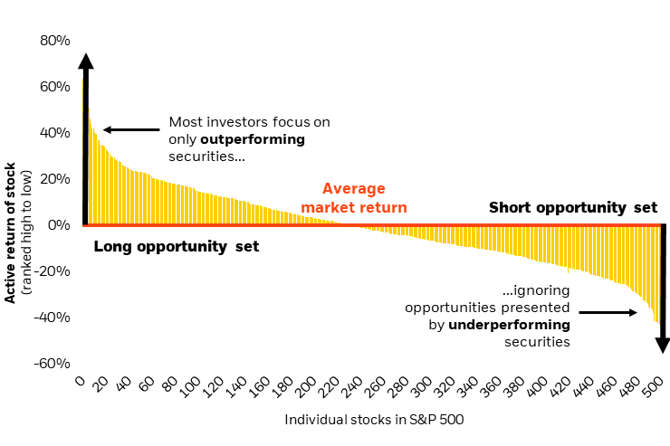

## Table of Contents

## What are market-neutral funds?

Market-neutral funds are a type of investment fund that aims to earn returns without being affected by the overall movements of the stock market. They do this by taking long positions in stocks they believe will go up and short positions in stocks they think will go down. The goal is to balance out the gains and losses so that the fund's performance is not tied to whether the market goes up or down.

These funds often use a strategy called "pair trading," where they find two similar companies and bet that one will outperform the other. For example, if they think Company A will do better than Company B, they will buy shares of Company A and sell shares of Company B short. By doing this, they hope to make money from the difference in performance between the two companies, regardless of what the overall market does. This approach can help reduce risk, but it also requires careful analysis and can be complex to manage.

## How do market-neutral funds work?

Market-neutral funds work by balancing their investments so that they can make money no matter if the stock market goes up or down. They do this by buying some stocks (taking long positions) and selling other stocks short (taking short positions). The idea is that the gains from the stocks they buy will be offset by the losses from the stocks they sell short, so the overall performance of the fund isn't affected by the market's ups and downs.

These funds often use a strategy called [pair trading](/wiki/pair-trading). This means they find two companies that are similar and bet that one will do better than the other. For example, if they think Company A will do better than Company B, they will buy shares of Company A and sell shares of Company B short. By doing this, they hope to make money from the difference in performance between the two companies, not from the overall market movement. This can help reduce risk, but it needs careful analysis and can be tricky to manage.

## What are the benefits of investing in market-neutral funds?

Investing in market-neutral funds can help you avoid the ups and downs of the stock market. These funds aim to make money no matter if the market goes up or down. They do this by balancing their investments, so the gains from some stocks cancel out the losses from others. This means your investment might be safer because it's not tied to what the whole market is doing.

Another benefit is that market-neutral funds can help spread out your risk. They use a strategy called pair trading, where they bet on one company doing better than another. This way, they can still make money even if the market is not doing well. It's like having a safety net for your investments, which can be really helpful if you want to keep your money safe but still want to grow it a little bit.

## Can you explain the concept of 'market neutrality' in simple terms?

Market neutrality means that an investment tries to make money without being affected by whether the stock market goes up or down. It's like trying to stay steady while the market moves around. To do this, investors will buy some stocks and sell others short, so the gains and losses balance out. This way, the overall performance of their investment isn't tied to the ups and downs of the market.

Think of it like this: if you're on a seesaw and you want to stay in the middle no matter what, you would need to balance your weight carefully. Market-neutral funds do something similar. They find pairs of companies that are similar and bet that one will do better than the other. By doing this, they hope to make money from the difference between the two companies, not from the overall market movement. It's a way to keep your investment steady and safe.

## What are the typical strategies used by market-neutral funds?

Market-neutral funds use different strategies to make money without being affected by the ups and downs of the stock market. One common strategy is called pair trading. This is where the fund finds two similar companies and bets that one will do better than the other. For example, if they think Company A will do better than Company B, they will buy shares of Company A and sell shares of Company B short. By doing this, they hope to make money from the difference in performance between the two companies, not from the overall market movement.

Another strategy used by market-neutral funds is called statistical [arbitrage](/wiki/arbitrage). This involves using computer programs to find small differences in stock prices that can be used to make quick profits. The fund might buy and sell many stocks at the same time, trying to take advantage of these small price differences. This approach can be complex and requires a lot of data analysis, but it can help the fund make money without being tied to the overall market.

Some market-neutral funds also use a strategy called [factor](/wiki/factor-investing) neutrality. This means they try to balance their investments so that they are not affected by certain factors that can move the market, like interest rates or economic growth. They do this by making sure their long and short positions are balanced across different sectors and types of companies. This way, they can focus on making money from the specific stocks they choose, rather than being affected by big market changes.

## How do market-neutral funds manage risk?

Market-neutral funds manage risk by balancing their investments so that they can make money no matter if the stock market goes up or down. They do this by buying some stocks and selling others short. The idea is that the gains from the stocks they buy will be offset by the losses from the stocks they sell short. This way, the overall performance of the fund isn't affected by the market's ups and downs. It's like trying to stay steady on a seesaw by balancing your weight carefully.

Another way market-neutral funds manage risk is by using strategies like pair trading. They find two similar companies and bet that one will do better than the other. For example, if they think Company A will do better than Company B, they will buy shares of Company A and sell shares of Company B short. By doing this, they hope to make money from the difference in performance between the two companies, not from the overall market movement. This helps spread out the risk because they are not betting on the whole market going up or down.

Market-neutral funds also use [statistical arbitrage](/wiki/statistical-arbitrage) and factor neutrality to manage risk. Statistical arbitrage involves using computer programs to find small differences in stock prices that can be used to make quick profits. Factor neutrality means they try to balance their investments so they are not affected by big market changes, like interest rates or economic growth. By using these strategies, market-neutral funds can focus on making money from the specific stocks they choose, while keeping their overall risk low.

## What are the historical performance trends of market-neutral funds?

Market-neutral funds have had mixed performance over the years. They aim to make money no matter if the stock market goes up or down. This means they can sometimes do better than the market when it's going down, but they might not do as well when the market is going up a lot. Over long periods, like 10 or 20 years, market-neutral funds have generally given steady but smaller returns compared to the stock market. They are not usually as risky, but they also don't grow your money as fast.

In some years, market-neutral funds have done very well. For example, during times when the stock market was very unstable, like during the financial crisis in 2008, these funds could protect investors' money better than many other types of investments. But in other years, when the stock market was doing great, market-neutral funds might not keep up. This is because they are designed to be safe and steady, not to chase big gains. So, while they can help keep your money safe, they might not make you rich quickly.

## How do fees and expenses impact the returns of market-neutral funds?

Fees and expenses can have a big impact on the returns of market-neutral funds. These funds often charge higher fees than regular stock funds because they need to do a lot of work to keep their investments balanced. This means they might charge more for management and other costs. When you pay these fees, it takes away from the money you could be making from the fund. So, if the fund makes a 5% return but you pay 2% in fees, your actual return is only 3%.

It's important to think about these fees when you're looking at market-neutral funds. Even though these funds can help keep your money safe, the high fees can eat into your profits. If the fees are too high, it might be hard for the fund to make enough money to cover them and still give you a good return. That's why it's a good idea to look at the fees carefully before you decide to invest in a market-neutral fund.

## What are the tax implications of investing in market-neutral funds?

When you invest in market-neutral funds, you need to think about taxes. These funds often buy and sell stocks a lot, which can lead to more taxes. If the fund makes money from stocks it holds for less than a year, that's called a short-term capital gain. Short-term gains are taxed at a higher rate, just like your regular income. If the fund holds stocks for more than a year and then sells them for a profit, that's a long-term capital gain, which is taxed at a lower rate. So, because market-neutral funds trade a lot, you might end up paying more in taxes than with other types of funds.

Another thing to consider is that market-neutral funds often use a strategy called short selling. When they do this, they can create something called "phantom income." This is money the fund makes from short selling, even if it doesn't actually receive the cash right away. You might have to pay taxes on this phantom income, which can be tricky because you're paying taxes on money you haven't actually gotten yet. It's a good idea to talk to a tax advisor to understand how these funds might affect your taxes and plan accordingly.

## How do market-neutral funds compare to traditional investment funds?

Market-neutral funds and traditional investment funds work differently and have different goals. Market-neutral funds try to make money no matter if the stock market goes up or down. They do this by balancing their investments, so the gains from some stocks cancel out the losses from others. This means they are not as affected by the ups and downs of the market. Traditional investment funds, like mutual funds or index funds, usually focus on buying stocks they think will go up in value. Their performance is tied to the market, so if the market goes up, they can make more money, but if it goes down, they can lose money too.

Another big difference is how they handle risk. Market-neutral funds aim to reduce risk by using strategies like pair trading, where they bet on one company doing better than another. This can help keep your money safer, but it also means the returns might be smaller. Traditional funds can be riskier because they are more affected by the market, but they also have the potential to make more money when the market is doing well. When you're thinking about which type of fund to invest in, it's important to consider how much risk you're willing to take and what kind of returns you're looking for.

## What are the key considerations for selecting a market-neutral fund?

When choosing a market-neutral fund, it's important to look at the fund's performance history. You want to see how well it has done over time, especially during different market conditions. Some funds might do well when the market is going down but not as well when it's going up. So, looking at past performance can give you an idea of how the fund might do in the future. Also, consider the fund's strategy. Some market-neutral funds use pair trading, while others might use statistical arbitrage or factor neutrality. Understanding the strategy can help you see if it matches your investment goals.

Another key thing to think about is the fees and expenses of the fund. Market-neutral funds often have higher fees because they need to do a lot of work to keep their investments balanced. These fees can eat into your returns, so it's important to check how much the fund charges. You should also think about the tax implications. Market-neutral funds can create more taxable events because they trade a lot, which might lead to higher taxes. Talking to a tax advisor can help you understand how these funds might affect your taxes. By considering these factors, you can pick a market-neutral fund that fits your needs and helps you reach your financial goals.

## How can advanced investors leverage market-neutral funds in a diversified portfolio?

Advanced investors can use market-neutral funds to make their investment portfolio more balanced and less risky. These funds try to make money no matter if the stock market goes up or down. By adding market-neutral funds to their portfolio, investors can protect their money during times when the market is not doing well. This can help them avoid big losses and keep their investments steady. Market-neutral funds can also help investors spread out their risk because they focus on the difference between specific stocks, not on the whole market.

For example, an advanced investor might have a portfolio with stocks, bonds, and other types of investments. By adding a market-neutral fund, they can balance out the risk from their other investments. If their stocks go down, the market-neutral fund might still make money, which can help cushion the blow. This way, the investor can keep growing their money without taking on too much risk. It's like having a safety net that helps them stay steady no matter what the market does.

## References & Further Reading

[1]: Asness, Clifford S., Krail, Robert J., & Liew, John M. (2001). ["Do Hedge Funds Hedge?"](https://papers.ssrn.com/sol3/papers.cfm?abstract_id=252810) The Journal of Portfolio Management, 28(1), 6-19.

[2]: Gatev, Evan, Goetzmann, William N., & Rouwenhorst, K. Geert (2006). ["Pairs Trading: Performance of a Relative-Value Arbitrage Rule."](https://papers.ssrn.com/sol3/papers.cfm?abstract_id=141615) The Review of Financial Studies, 19(3), 797-827.

[3]: ["Quantitative Equity Portfolio Management: An Active Approach to Portfolio Construction and Management"](https://www.amazon.com/Quantitative-Equity-Portfolio-Management-Construction/dp/0071459391) by Ludwig B. Chincarini and Daehwan Kim.

[4]: Lopez de Prado, Marcos (2018). ["Advances in Financial Machine Learning."](https://www.amazon.com/Advances-Financial-Machine-Learning-Marcos/dp/1119482089) Wiley.

[5]: Chan, Ernest P. (2008). ["Quantitative Trading: How to Build Your Own Algorithmic Trading Business."](https://github.com/ftvision/quant_trading_echan_book) Wiley Trading.

[6]: ["Algorithmic Trading and DMA: An Introduction to Direct Access Trading Strategies"](https://www.amazon.com/Algorithmic-Trading-DMA-introduction-strategies/dp/0956399207) by Barry Johnson.