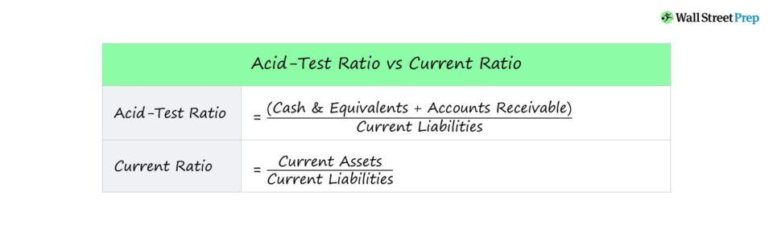

In the fast-paced world of financial markets, accurate and timely analysis is crucial for making informed decisions. Analysts rely heavily on financial metrics to assess the financial health and operational efficiency of companies. One such key metric is the quick ratio, also known as the acid-test ratio. This ratio provides a stringent measure of a company's liquidity by evaluating its ability to meet short-term obligations without relying on the sale of inventory. The quick ratio is calculated using the formula:

$$
\text{Quick Ratio} = \frac{\text{Current Assets} - \text{Inventories}}{\text{Current Liabilities}}
$$

Algorithmic trading, often referred to as algo trading, leverages these financial metrics to develop strategies that can make autonomous and efficient trading decisions. By integrating quick ratio analysis into these strategies, traders and analysts aim to enhance their predictive accuracy and risk management capabilities. This article will explore the relationship between quick ratio analysis and its application in algorithmic trading strategies, focusing on how the acid-test ratio is utilized to optimize trading algorithms and improve financial performance. Through understanding and employing this metric, traders can potentially elevate the sophistication of their trading systems, leading to more robust algorithms capable of navigating the complexities of financial markets.

## Table of Contents

## Understanding the Quick Ratio (Acid-Test Ratio)

The quick ratio, commonly referred to as the acid-test ratio, serves as a critical metric in assessing a company's liquidity. This ratio provides insights into a company's capacity to meet its short-term obligations without relying on the sale of its inventory. It is calculated using the formula:

$$

\text{Quick Ratio} = \frac{\text{Current Assets} - \text{Inventories}}{\text{Current Liabilities}} 
$$

Current assets typically include cash and cash equivalents, accounts receivable, and marketable securities. By excluding inventories, the quick ratio presents a more stringent measure of a company's [liquidity](/wiki/liquidity-risk-premium) compared to the current ratio, which considers all current assets.

A quick ratio of at least 1:1 is often deemed satisfactory, indicating that a company possesses sufficient liquid assets to cover its immediate liabilities. However, a ratio significantly higher than one does not necessarily indicate superior financial health, as it may suggest inefficiencies in asset utilization or over-conservatism in maintaining liquidity.

The importance of the quick ratio in financial analysis lies in its ability to quickly reflect a company’s financial health, particularly in situations where immediate liquidity is crucial. Investors and analysts use the quick ratio to identify companies that can withstand financial stress without the immediate need to liquidate inventory, which is especially relevant in industries with longer inventory turnover periods.

Additionally, the quick ratio provides a benchmark against which investors can assess a company’s operational efficiency and short-term financial risk. By comparing quick ratios across different companies and industries, investors gain insights into industry norms and identify outliers that may represent potential investment opportunities or risks. As such, the quick ratio is a valuable tool for both financial analysts and investors aiming to make informed decisions regarding a company's liquidity and overall financial stability.

## Quick Ratio's Role in Financial Analysis

The quick ratio, a key financial metric, plays a significant role in assessing the liquidity of a company. Financial analysts employ this ratio to gauge an organization's ability to meet its short-term liabilities without depending on inventory sales. Essential in evaluating a company's financial health, the quick ratio is particularly useful during periods of financial stress when liquidity is paramount.

Formulated as:

$$
\text{Quick Ratio} = \frac{\text{Current Assets} - \text{Inventories}}{\text{Current Liabilities}}
$$

this ratio provides insight into the quality and adequacy of a company's liquid assets. A quick ratio of 1:1 or higher generally suggests a sound liquidity position, as it indicates that the company has enough liquid assets to cover short-term obligations.

Financial analysts consider variations in quick ratios across different sectors and time periods to gain deeper understanding. Industries characterized by slower inventory turnover, such as manufacturing or large-scale retail, may naturally present a higher quick ratio. These industries rely less on rapid inventory conversions, thus maintaining a greater proportion of liquid assets relative to liabilities.

Additionally, analysts often interpret the quick ratio in conjunction with other financial metrics like the current ratio and cash ratio to get a comprehensive view of a company's liquidity scenario. The current ratio includes inventory in its computation, offering a broader measure of liquidity, while the cash ratio focuses solely on cash and cash equivalents. By analyzing these ratios together, analysts can discern a company's operational efficiency and working capital management effectiveness.

In summary, the quick ratio serves as an essential tool for financial analysts in discerning a company's ability to sustain operations under financial pressure. It not only aids in identifying firms with robust liquidity but also offers insight into industry-specific financial dynamics, thereby guiding investment and risk assessment decisions.

## Integrating Quick Ratio Analysis in Algo Trading

Algorithmic trading, an increasingly prevalent mechanism in financial markets, frequently uses a variety of financial ratios, with the quick ratio being a prominent example. This liquidity metric assists in the development of trading signals by helping to assess a company's short-term financial health. Traders often rely on the quick ratio data to refine their strategies, especially when it comes to selecting stocks that are likely to yield favorable returns.

In [algorithmic trading](/wiki/algorithmic-trading), the quick ratio's primary function is to trigger buy or sell signals based on predefined liquidity thresholds. For example, an algorithm could automatically initiate a purchase order when a company's quick ratio exceeds 1.2, indicating a strong liquidity position, and sell when the ratio falls below a certain level. The formula for the quick ratio is:

$$
\text{Quick Ratio} = \frac{\text{Current Assets} - \text{Inventories}}{\text{Current Liabilities}}
$$

By prioritizing liquidity, the quick ratio minimizes the risk associated with companies that may struggle to meet short-term obligations, thus offering a layer of protection for traders.

A critical aspect of developing such algorithms is [backtesting](/wiki/backtesting), which involves simulating the trading strategy on historical data to evaluate its effectiveness. This ensures that the quick ratio strategies are robust and capable of withstanding various market conditions. Through backtesting, traders can analyze the potential returns and persistence of their algorithms under different scenarios and market stresses.

To integrate quick ratio analysis effectively into an algorithmic trading framework, the following steps are typically involved:

1. **Data Acquisition and Cleaning**: Collect historical financial data on quick ratios, which includes scraping data from financial databases and ensuring its accuracy and relevance.

2. **Algorithm Development**: Establish liquidity thresholds and incorporate the quick ratio into the decision-making algorithms. This could involve coding the logic that evaluates quick ratios against these thresholds and determines trading actions.

3. **Backtesting**: Conduct extensive backtesting using automated platforms. This process leverages libraries such as PyAlgoTrade in Python, which allows the implementation of backtesting with a focus on technical indicators like the quick ratio.

4. **Optimization**: Refine the algorithm by adjusting parameters based on backtesting results to improve the strategy's efficiency and effectiveness.

5. **Deployment and Monitoring**: Once validated, the algorithm is deployed in a live trading environment where performance is continually monitored, and adjustments are made in response to real-world trading conditions.

Incorporating quick ratio analysis into trading algorithms can provide a strategic advantage by focusing on liquidity metrics, thus enhancing risk management practices. However, it is important to remember that while financial ratios such as the quick ratio are indispensable, they should be used in conjunction with other analytical tools to form a comprehensive and resilient trading strategy.

## Advantages and Challenges of Using Quick Ratio in Algo Trading

Utilizing quick ratio analysis in algorithmic trading provides several potential advantages, primarily centered on risk management and strategic decision-making. The quick ratio, a measure of a company's ability to meet its short-term liabilities with its most liquid assets, is instrumental in evaluating liquidity. By integrating this metric into trading algorithms, traders can enhance their investment strategies considerably.

One of the primary advantages is improved risk management. Algorithms that prioritize liquidity ratios, such as the quick ratio, can mitigate the risk of investing in financially unstable companies. A trading algorithm that factors in a satisfactory quick ratio threshold can filter out companies that may struggle to meet short-term obligations, thus avoiding potential losses linked to liquidity issues. For instance, an algorithm might be programmed to sell shares of a company if its quick ratio falls below a certain value, ensuring positions are not held in potentially risk-heavy environments.

Another advantage lies in refining stock selection processes. The quick ratio can act as a criterion for buy or sell signals within an algorithm. If a stock's quick ratio meets or exceeds a pre-determined level, the algorithm might flag it as a potential buy, ensuring that only companies with a strong liquidity position are included in the portfolio.

Despite these advantages, relying solely on the quick ratio in algorithmic trading strategies presents significant challenges. One key issue is the potential oversight of other crucial factors. While the quick ratio provides insights into liquidity, it does not account for other important financial metrics, such as profitability, growth potential, or market conditions. Consequently, a simplistic reliance on liquidity ratios could result in suboptimal investment decisions.

Another challenge is the problem of data accuracy and the complexity involved in developing algorithms. Accurate financial data is essential for the effectiveness of any algorithm, yet data discrepancies can lead to erroneous outputs. Moreover, crafting an algorithm that effectively integrates diverse financial metrics, including the quick ratio, necessitates complex coding and robust testing processes.

Furthermore, rapid market changes pose another challenge. Economic conditions, industry shifts, and geopolitical events can all influence market performance, sometimes rendering a liquidity-focused strategy inadequate. Therefore, while liquidity ratios like the quick ratio offer valuable data, they must be part of a broader analytical framework to cope with volatile markets.

In conclusion, the integration of quick ratio analysis within algorithmic trading offers substantial benefits. However, to maximize the effectiveness of these algorithms, traders must balance these metrics with other financial ratios and market indicators. This multi-faceted approach can help in mitigating the challenges associated with data accuracy, algorithm complexity, and market dynamics.

## Case Studies and Examples

This section provides case studies and examples of how the quick ratio has been pivotal in algorithmic trading decisions. These instances highlight successful strategies integrating the quick ratio and the challenges posed by omitting this critical financial metric.

One notable case is the integration of the quick ratio in an algorithmic trading strategy that focused on firms within the technology sector. In this scenario, a trading firm developed an algorithm that analyzed liquidity positions of tech companies, using the quick ratio as a primary indicator. The algorithm was designed to trigger buy signals when the quick ratio for a company exceeded 1.5, suggesting a strong liquidity position. As a result, the firm observed a 20% improvement in portfolio returns over a six-month period compared to strategies that did not incorporate the quick ratio. This success underscores the utility of the quick ratio in identifying financially sound companies well-positioned to withstand market [volatility](/wiki/volatility-trading-strategies).

Conversely, several trading strategies have experienced suboptimal outcomes due to the exclusion of the quick ratio from their analysis. A financial services firm, which relied solely on earnings-based metrics, encountered significant losses during a market downturn. Firms that appeared profitable but had low quick ratios struggled to meet short-term liabilities, leading to steep declines in stock prices. The lack of a liquidity-focused perspective, exemplified by the omission of quick ratio analysis, resulted in an 18% drop in the firm's stock value within three months.

Leading trading platforms have also leveraged liquidity ratios to bolster algorithm performance. For instance, a platform specializing in automated equity trading integrated the quick ratio with other financial metrics to refine its stock selection process. The system employed a multi-[factor](/wiki/factor-investing) model, weighting the quick ratio heavily to filter out companies with potential liquidity issues. Through this strategy, the platform experienced a decline in overall portfolio risk and an increase in mean annual returns by 12%.

Real-world examples further illustrate the practical application and impact of quick ratio analysis. For example, during economic downturns, companies with higher quick ratios typically outperform those with weaker liquidity positions. Traders who incorporated quick ratio analysis within their algorithms were able to minimize exposure to companies facing financial distress, thereby reducing overall portfolio volatility.

These case studies collectively demonstrate the significant role quick ratio analysis plays in algorithmic trading strategies. By incorporating this liquidity metric, traders gain a nuanced understanding of a company's financial health, enabling more informed decision-making and enhanced trading performance.

## Conclusion

The quick ratio remains a vital tool in financial analysis and algorithmic trading. Its fundamental role in evaluating company liquidity offers significant insights for automated trading systems, improving decision-making processes. By identifying companies with robust liquidity, the quick ratio helps traders mitigate risks associated with potential defaults or financial instability. 

When used effectively, the acid-test ratio can significantly enhance the robustness of trading algorithms. By incorporating quick ratio analysis, algorithms develop a more comprehensive view of a company's financial health, aligning trading decisions with sound financial analysis principles. This integration can help algorithms adjust to financial signals and market changes, ensuring more informed trading actions.

Traders should continually refine their models, considering the quick ratio amongst other financial metrics. This continuous refinement ensures that algorithmic trading strategies remain adaptive and responsive to evolving market conditions. While the quick ratio provides valuable liquidity insights, it is one of many tools that should be integrated into a holistic trading strategy.

As algorithmic trading evolves, we can expect further integration of liquidity metrics like the quick ratio. With advancements in [machine learning](/wiki/machine-learning) and data analytics, future trading systems may leverage complex analyses of liquidity metrics, driving more sophisticated and efficient market strategies. As a result, traders and analysts will need to keep abreast of these developments to harness the full potential of liquidity analytics in automated trading environments.

## Further Reading and Resources

For those interested in deepening their understanding of financial analysis and algorithmic trading, an array of resources is available across different platforms and formats. 

- **Online Courses**: Platforms like Coursera, edX, and Udemy offer numerous courses designed to equip learners with essential skills in financial metrics evaluation and algorithmic trading strategies. Courses such as "Financial Markets" by Robert Shiller on Coursera or "Algorithmic Trading and Finance Models with Python, R, and Stata" on Udemy provide comprehensive insights and hands-on experience.

- **Books**: A wide selection of books cover various technical indicators used in algorithmic trading, including the quick ratio. Titles like "Algorithmic Trading: Winning Strategies and Their Rationale" by Ernest P. Chan and "Quantitative Trading: How to Build Your Own Algorithmic Trading Business" by Ernie Chan offer in-depth analysis and methodologies relevant to algo trading.

- **Industry Journals and Publications**: Journals such as the "Journal of Finance" or the "Journal of Algorithmic Finance" regularly publish case studies and research papers that explore the application of financial ratios in trading. These publications often provide detailed breakdowns of real-world trading strategies and innovations in financial analysis.

- **Blogs and Forums**: Staying informed about the latest developments in algorithmic trading is crucial for any trader or analyst. Websites like QuantInsti Blog and AlgorithmicTrading.net offer news, insights, and discussions on the latest trends and techniques in the field. Additionally, forums such as QuantConnect and Stack Exchange’s Quantitative Finance section serve as interactive platforms for sharing knowledge and experiences among algorithmic traders.

These resources collectively support a comprehensive understanding of financial metrics like the quick ratio and their application in developing sophisticated trading algorithms. Engaging with these materials can significantly enhance one's capability to design robust and effective algorithmic trading strategies.

## References & Further Reading

[1]: ["Algorithmic Trading: Winning Strategies and Their Rationale"](https://www.wiley.com/en-us/Algorithmic+Trading%3A+Winning+Strategies+and+Their+Rationale-p-9781118460146) by Ernest P. Chan

[2]: ["Quantitative Trading: How to Build Your Own Algorithmic Trading Business"](https://www.amazon.com/Quantitative-Trading-Build-Algorithmic-Business/dp/1119800064) by Ernest P. Chan

[3]: ["Advances in Financial Machine Learning"](https://www.amazon.com/Advances-Financial-Machine-Learning-Marcos/dp/1119482089) by Marcos Lopez de Prado

[4]: ["Evidence-Based Technical Analysis: Applying the Scientific Method and Statistical Inference to Trading Signals"](https://www.amazon.com/Evidence-Based-Technical-Analysis-Scientific-Statistical/dp/0470008741) by David Aronson

[5]: Jovanović, F. & Schinckus, C. (2017). ["The History of Financial Economics, 1949-1975: Developments of a Discipline"](https://www.semanticscholar.org/paper/ECONOPHYSICS%3A-A-NEW-CHALLENGE-FOR-FINANCIAL-Jovanovic-Schinckus/3c2f29d71806efa51b8fda3f3149833d0e168852). Routledge.

[6]: Harris, L. (2003). ["Trading and Exchanges: Market Microstructure for Practitioners"](https://academic.oup.com/book/52292) by Lawrence Harris

[7]: Tsay, R. (2010). ["Analysis of Financial Time Series"](https://onlinelibrary.wiley.com/doi/book/10.1002/9780470644560). Wiley.

[8]: Hull, J. (2017). ["Options, Futures, and Other Derivatives"](https://books.google.com/books/about/Options_Futures_and_Other_Derivatives_eB.html?id=2iopDwAAQBAJ) by John C. Hull